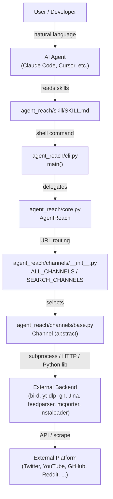
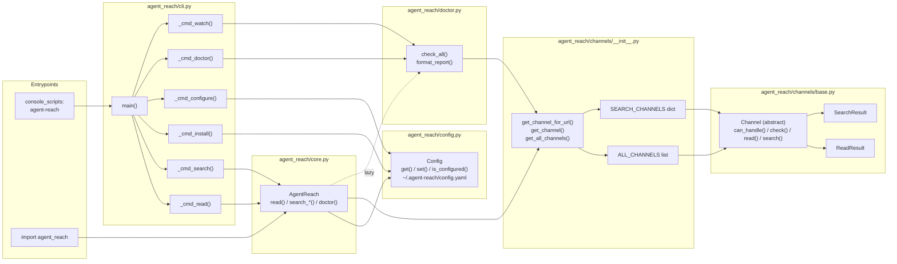

# Overview

<details>
<summary>Relevant source files</summary>

The following files were used as context for generating this wiki page:

- [README.md](README.md)
- [agent_reach/__init__.py](agent_reach/__init__.py)
- [docs/README_en.md](docs/README_en.md)
- [llms.txt](llms.txt)
- [pyproject.toml](pyproject.toml)
- [tests/test_cli.py](tests/test_cli.py)

</details>


This page covers what Agent Reach is, the problem it solves, its core design philosophy, and the top-level structure of the codebase. For installation steps, see [Getting Started](#1.2). For the internal module architecture, see [Architecture](#1.1).

---

## What Is Agent Reach?

Agent Reach is a Python CLI package (`agent-reach`) that gives AI agents (Claude Code, Cursor, OpenClaw, Windsurf, etc.) structured access to internet content across a set of platforms. It exposes a single, consistent shell interface that agents can call without any per-platform API keys or paid subscriptions [pyproject.toml:1-17]().

The core problem it addresses: each platform on the internet has different access barriers — paid APIs, IP-based blocking, login walls, anti-scraping measures. Without Agent Reach, an agent operator must find the right tool for each platform, install it, configure it, and handle errors [README.md:19-37](). Agent Reach pre-selects, wires, and manages those tools so that a single command like `agent-reach read <url>` or `agent-reach search-twitter "query"` works regardless of the underlying platform [docs/README_en.md:19-34]().

The package is explicitly described as **scaffolding, not a framework**: it makes tool selection and configuration decisions on behalf of the operator, but every backend is swappable by changing a single channel file [README.md:155-163]().

Sources: [README.md:19-37](), [docs/README_en.md:19-34](), [README.md:155-163](), [pyproject.toml:1-17]()

---

## Design Philosophy

| Principle | Implementation |
|-----------|---------------|
| **Zero mandatory API fees** | Every default backend is free: Jina Reader, `bird` CLI, `yt-dlp`, `feedparser`, `gh` CLI, `instaloader`, Exa via `mcporter` [README.md:53-61]() |
| **Pluggable channels** | Each platform is an independent Python file in `agent_reach/channels/` implementing the `Channel` abstract base class [README.md:165-184]() |
| **Swappable backends** | The channel file is the only thing that changes if a better backend emerges [README.md:165-168]() |
| **AI agent first** | The primary consumer is an AI agent reading `SKILL.md` and issuing shell commands, not a human running CLI commands [README.md:151-153]() |
| **Credential locality** | Cookies and tokens are stored only in `~/.agent-reach/config.yaml` with `0o600` permissions [README.md:88-91]() |
| **Tiered setup** | Channels are classified by setup complexity (zero-config, needs credentials, needs MCP service) [docs/README_en.md:81-81]() |

Sources: [README.md:53-61](), [README.md:165-184](), [README.md:151-153](), [README.md:88-91](), [docs/README_en.md:81-81]()

---

## Supported Platforms

Agent Reach supports a wide range of global and Chinese-specific platforms, categorized by their setup requirements.

| Platform | Backend | Tier | Read | Search |
|----------|---------|------|------|--------|
| Any web URL | Jina Reader (`r.jina.ai`) | 0 — zero config | ✅ | — |
| YouTube | `yt-dlp` | 0 — zero config | ✅ | ✅ |
| RSS / Atom | `feedparser` | 0 — zero config | ✅ | — |
| GitHub | `gh` CLI | 0 — zero config (public) | ✅ | ✅ |
| WeChat Articles | `wechat-article-for-ai` | 0 — zero config | ✅ | ✅ |
| Weibo | `mcp-server-weibo` | 0 — zero config | ✅ | ✅ |
| V2EX | Public JSON API | 0 — zero config | ✅ | ✅ |
| Xueqiu (雪球) | Public JSON API | 0 — zero config | ✅ | ✅ |
| Twitter / X | `bird` CLI | 0/1 — cookies unlock search | ✅ | ✅ |
| Bilibili | `yt-dlp` | 0/1 — proxy for servers | ✅ | ✅ |
| Reddit | Reddit JSON API | 1 — proxy for servers | ✅ | ✅ |
| Exa (web search) | `mcporter` → `exa-mcp` | 1 — auto-configured | — | ✅ |
| XiaoHongShu | `mcporter` → `xiaohongshu-mcp` | 2 — Docker + cookies | ✅ | ✅ |
| Douyin | `mcporter` → `douyin-mcp-server` | 2 — MCP setup | ✅ | — |
| LinkedIn | `mcporter` → `linkedin-scraper-mcp` | 2 — MCP setup | ✅ | ✅ |
| Boss直聘 | `mcporter` → `mcp-bosszp` | 2 — MCP + QR login | ✅ | ✅ |
| Xiaoyuzhou | Groq Whisper | 2 — Free API Key | ✅ | — |

Sources: [README.md:65-85](), [docs/README_en.md:60-81]()

---

## System Components

**Top-level flow from user to platform:**



Sources: [README.md:129-136](), [README.md:155-184](), [agent_reach/cli.py:53-53](), [agent_reach/core.py:7-7]()

---

**Core Python package modules and their responsibilities:**



Sources: [pyproject.toml:52-53](), [agent_reach/__init__.py:7-9](), [agent_reach/cli.py:7-8](), [agent_reach/core.py:7-7](), [tests/test_cli.py:7-32]()

---

## Channel Tier Classification

Channels are classified into three tiers based on what is required before they function:

| Tier | Label | What's Required | Examples |
|------|-------|----------------|---------|
| 0 | Zero config | Nothing beyond `pip install agent-reach` | `web.py`, `youtube.py`, `rss.py`, `github.py` (public) |
| 1 | Needs credential or proxy | Browser cookies or a residential proxy | `twitter.py` (search), `reddit.py`, `bilibili.py` (server) |
| 2 | Needs MCP service or full setup | Docker, `mcporter`, QR code login, etc. | `xiaohongshu.py`, `wechat.py`, `douyin.py`, `linkedin.py` |

The `agent-reach doctor` command reports each channel's status (`ok` / `warn` / `off`) based on its tier and current configuration [README.md:61-61](). See [Diagnostics and Monitoring](#2.5) for details.

Sources: [README.md:67-85](), [docs/README_en.md:62-81](), [tests/test_cli.py:26-32]()

---

## What's in the Repository

```
agent_reach/
├── cli.py              # CLI entrypoint, argument parsing, subcommand dispatch
├── core.py             # AgentReach class — primary programmatic API
├── config.py           # Config class — reads/writes ~/.agent-reach/config.yaml
├── doctor.py           # check_all(), format_report() — channel health checks
├── channels/
│   ├── __init__.py     # ALL_CHANNELS list, SEARCH_CHANNELS dict, routing functions
│   ├── base.py         # Channel ABC, ReadResult, SearchResult dataclasses
│   ├── web.py          # WebChannel — Jina Reader backend
│   ├── twitter.py      # TwitterChannel — bird CLI backend
│   ├── youtube.py      # YouTubeChannel — yt-dlp backend
│   ├── bilibili.py     # BilibiliChannel — yt-dlp backend
│   ├── github.py       # GitHubChannel — gh CLI backend
│   ├── reddit.py       # RedditChannel — Reddit JSON API
│   ├── rss.py          # RSSChannel — feedparser backend
│   ├── exa_search.py   # ExaSearchChannel — mcporter + exa-mcp
│   ├── xiaohongshu.py  # XiaoHongShuChannel — mcporter + xiaohongshu-mcp
│   ├── wechat.py       # WeChatChannel — wechat-article-for-ai + miku_ai
│   ├── weibo.py        # WeiboChannel — mcp-server-weibo
│   └── ...             # Other platform channels (Douyin, V2EX, Xueqiu, etc.)
├── skill/
│   └── SKILL.md        # Installed into AI agent skills directory
└── guides/             # Documentation assets
```

Sources: [README.md:170-184](), [docs/README_en.md:64-79](), [pyproject.toml:67-70]()

---

## Related Pages

| Topic | Page |
|-------|------|
| End-to-end architecture, channel routing, `ReadResult`/`SearchResult` | [Architecture](#1.1) |
| Install, `agent-reach install`, `agent-reach doctor` | [Getting Started](#1.2) |
| All CLI subcommands and flags | [CLI Reference](#2) |
| Channel abstract base class and per-channel docs | [Channels](#3) |
| `Config` class, `config.yaml`, credential management | [Configuration](#4) |
| `SKILL.md` and agent integration model | [AI Agent Integration](#5) |
