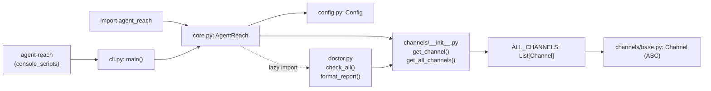
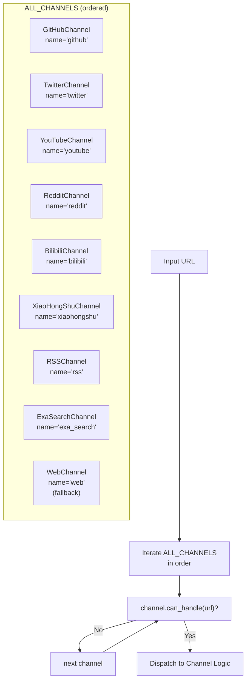
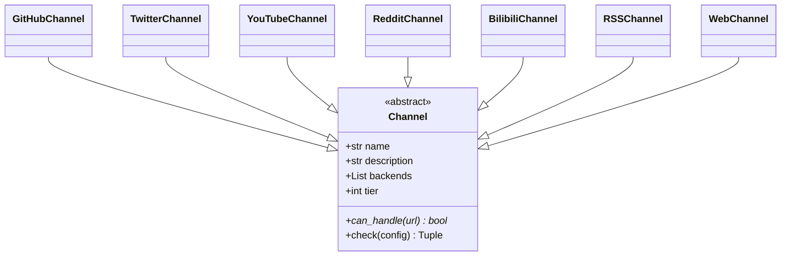

# Architecture

Relevant source files

The following files were used as context for generating this wiki page:

- [agent_reach/channels/__init__.py](agent_reach/channels/__init__.py)
- [agent_reach/channels/base.py](agent_reach/channels/base.py)
- [agent_reach/channels/bilibili.py](agent_reach/channels/bilibili.py)
- [agent_reach/channels/reddit.py](agent_reach/channels/reddit.py)
- [agent_reach/channels/rss.py](agent_reach/channels/rss.py)
- [agent_reach/channels/v2ex.py](agent_reach/channels/v2ex.py)
- [agent_reach/channels/web.py](agent_reach/channels/web.py)
- [agent_reach/core.py](agent_reach/core.py)

This page describes Agent Reach's internal architecture: how the `AgentReach` class, channel registry, URL dispatch, tier classification, and result types fit together as a system. For installation and first-use, see [Getting Started](#1.2). For per-channel details, see [Channels](#3).

---

## Overview

Agent Reach is a thin routing layer. Its job is to accept a URL or search query, dispatch it to the correct platform-specific channel, and return a normalized result. No channel knows about any other channel. The core has no platform logic of its own.

**Key design properties:**

- Each platform is one Python file (`agent_reach/channels/*.py`) implementing a shared abstract interface.
- URL dispatch is done by iterating an ordered list (`ALL_CHANNELS`) until a `can_handle()` match is found.
- The backend tool used by any channel can be changed without touching any other part of the system.

---

## Package Structure

**Diagram: Module Dependencies**

Sources: [agent_reach/core.py:31-43](), [agent_reach/channels/__init__.py:29-66](), [agent_reach/channels/base.py:1-37]()

---

## The `AgentReach` Class

`AgentReach` in [agent_reach/core.py:23-43]() is the primary health-check and configuration entry point. It holds a `Config` instance and provides methods to audit the system's readiness.

| Method | Delegates to | Notes |
|---|---|---|
| `__init__(config)` | `Config()` | Initializes configuration [agent_reach/core.py:31-32]() |
| `doctor()` | `check_all(self.config)` | Returns `Dict[str, dict]` of channel statuses [agent_reach/core.py:34-37]() |
| `doctor_report()` | `format_report(...)` | Human-readable string for the agent [agent_reach/core.py:39-42]() |

For reading and searching, Agent Reach encourages agents to use the upstream tools directly as defined in the system's `SKILL.md` [agent_reach/core.py:27-28]().

Sources: [agent_reach/core.py:23-43]()

---

## Channel Registry

**Diagram: ALL_CHANNELS dispatch (class names to channel names)**

The registry is defined in [agent_reach/channels/__init__.py:29-46](). The list is ordered: **first match wins**. `WebChannel` is last because its `can_handle()` returns `True` for any URL, making it the universal fallback [agent_reach/channels/web.py:13-14]().

### Registry Access Functions

| Function | Purpose |
|---|---|
| `get_channel(name)` | Looks up a channel by its `name` attribute [agent_reach/channels/__init__.py:49-54]() |
| `get_all_channels()` | Returns the full `ALL_CHANNELS` list [agent_reach/channels/__init__.py:57-59]() |

Sources: [agent_reach/channels/__init__.py:29-66]()

---

## The `Channel` Abstract Base Class

Every channel inherits from `Channel` in [agent_reach/channels/base.py:18-37](). The class defines the contract for platform detection and health auditing.

**Diagram: Channel ABC and its implementors**

### Required methods

- `can_handle(url) → bool` — returns `True` if this channel owns this URL pattern. Must be implemented [agent_reach/channels/base.py:27-29]().

### Default behavior

- `check(config) → (status, message)` — returns the status of the upstream tool. Defaults to checking `self.backends` [agent_reach/channels/base.py:31-36]().

### Class-level attributes

| Attribute | Type | Purpose |
|---|---|---|
| `name` | `str` | Unique identifier (e.g., `"youtube"`) [agent_reach/channels/base.py:21]() |
| `description` | `str` | Human-readable platform description [agent_reach/channels/base.py:22]() |
| `backends` | `List[str]` | Names of external tools used (e.g., `["yt-dlp"]`) [agent_reach/channels/base.py:23]() |
| `tier` | `int` | Setup complexity (0=zero-config, 1=needs key, 2=needs setup) [agent_reach/channels/base.py:24]() |

Sources: [agent_reach/channels/base.py:18-37]()

---

## Tier Classification

The `tier` integer on each `Channel` subclass categorizes how much setup is required [agent_reach/channels/base.py:24]().

| Tier | Meaning | Example channels |
|---|---|---|
| `0` | Zero-config — works after `pip install` | `WebChannel` [agent_reach/channels/web.py:11](), `RSSChannel` [agent_reach/channels/rss.py:11](), `V2EXChannel` [agent_reach/channels/v2ex.py:24]() |
| `1` | Needs a free key or minor setup | `RedditChannel` [agent_reach/channels/reddit.py:27](), `BilibiliChannel` [agent_reach/channels/bilibili.py:44]() |
| `2` | Needs accounts, cookies, or Docker | `XiaoHongShuChannel`, `LinkedInChannel` |

Sources: [agent_reach/channels/base.py:24](), [agent_reach/channels/reddit.py:27](), [agent_reach/channels/bilibili.py:44]()

---

## Standardized Output

While Agent Reach facilitates direct calls to backends, its internal `doctor` system standardizes health reports.

**`check()` Statuses** ([agent_reach/channels/base.py:34]()):

| Status | Meaning |
|---|---|
| `ok` | Backend tool is installed and reachable |
| `warn` | Tool is installed but needs configuration (e.g., cookies/proxy) |
| `off` | Tool is missing or dependencies are not met |
| `error` | Unexpected failure during check |

For example, the `RedditChannel` returns `warn` if the JSON API is unreachable and no proxy is configured [agent_reach/channels/reddit.py:41-45]().

Sources: [agent_reach/channels/base.py:31-36](), [agent_reach/channels/reddit.py:34-45]()

---

## URL Routing Logic

When a URL is processed, the system iterates through `ALL_CHANNELS` in [agent_reach/channels/__init__.py]().

1. **GitHub**: Matches `github.com` [agent_reach/channels/github.py]().
2. **Reddit**: Matches `reddit.com` or `redd.it` [agent_reach/channels/reddit.py:29-32]().
3. **Bilibili**: Matches `bilibili.com` or `b23.tv` [agent_reach/channels/bilibili.py:46-49]().
4. **RSS**: Matches patterns like `/feed`, `.xml`, or `atom` [agent_reach/channels/rss.py:13-14]().
5. **Web (Fallback)**: Returns `True` for everything else [agent_reach/channels/web.py:13-14]().

Sources: [agent_reach/channels/__init__.py:29-46](), [agent_reach/channels/web.py:13-14](), [agent_reach/channels/reddit.py:29-32]()

---

## Configuration Integration

`AgentReach.__init__` accepts an optional `Config` instance; if none is provided, it creates one [agent_reach/core.py:31-32](). This configuration is passed to the `check()` method of each channel to verify if specific keys (like `bilibili_proxy` or `reddit_proxy`) are present [agent_reach/channels/bilibili.py:55](), [agent_reach/channels/reddit.py:35]().

Sources: [agent_reach/core.py:31-32](), [agent_reach/channels/bilibili.py:51-80](), [agent_reach/channels/reddit.py:34-45]()
