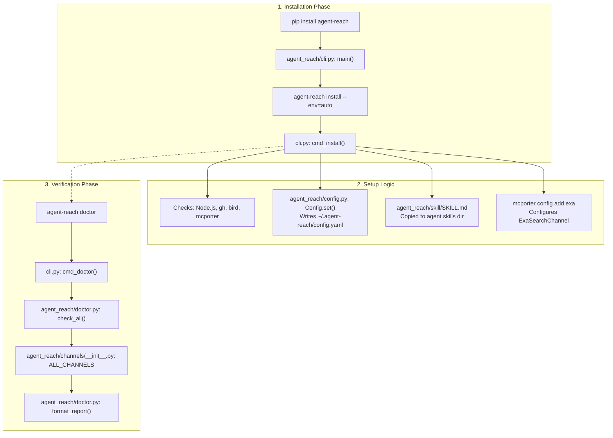
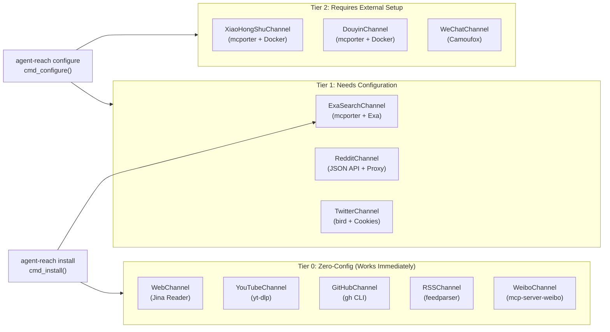

# Getting Started

<details>
<summary>Relevant source files</summary>

The following files were used as context for generating this wiki page:

- [README.md](README.md)
- [docs/install.md](docs/install.md)

</details>


This page covers the three-step process to get Agent Reach installed and operational: installing the Python package, running the automated setup command, and verifying channel status with the built-in diagnostic tool.

For a conceptual overview of what Agent Reach is and why it exists, see [Overview](). For full CLI reference including all flags, see [CLI Reference](). For configuring individual credentials (cookies, proxies, tokens), see [Configuration]().

---

## Prerequisites

| Requirement | Minimum | Notes |
|---|---|---|
| Python | 3.10+ | Required by `pyproject.toml` |
| pip / pipx | Recent version | `pipx` is recommended for CLI isolation |
| Internet access | Required | Several backends make outbound HTTP calls |

Some channels install additional system dependencies automatically during `agent-reach install`. These include Node.js (for `bird`), the `gh` CLI, `mcporter`, and `instaloader`. If you prefer not to have these installed automatically, use `--safe` mode.

Sources: [pyproject.toml:21-21](), [docs/install.md:53-69]()

---

## Step 1: Install the Package

The recommended way to install Agent Reach is via `pipx` to ensure the CLI and its dependencies are isolated from your global Python environment.

```bash
# Recommended: pipx
pipx install https://github.com/Panniantong/agent-reach/archive/main.zip

# Alternative: Standard pip (inside a venv)
python3 -m venv ~/.agent-reach-venv
source ~/.agent-reach-venv/bin/activate
pip install https://github.com/Panniantong/agent-reach/archive/main.zip
```

This installs the `agent_reach` Python package and registers the `agent-reach` console script entrypoint, which maps to the `main()` function in `agent_reach/cli.py`.

Sources: [docs/install.md:53-64](), [pyproject.toml:35-36]()

---

## Step 2: Run Automated Setup

Once the package is installed, you must run the installation command to set up the necessary system-level dependencies and configuration files.

```bash
agent-reach install --env=auto
```

This command is handled by `cmd_install()` in [agent_reach/cli.py](). The `--env=auto` flag causes the installer to detect the environment (local machine vs. server) and apply the appropriate installation strategy.

**What `agent-reach install --env=auto` does:**

| Action | Details |
|---|---|
| **Detects environment** | Checks whether running locally or on a server to adjust proxy/dependency logic. |
| **Installs system deps** | Automatically installs Node.js, `gh` CLI, `bird` (via npm), and `mcporter`. |
| **Configures Exa search** | Sets up the `mcporter` connection to `mcp.exa.ai` for semantic search. |
| **Registers SKILL.md** | Copies `agent_reach/skill/SKILL.md` into the agent's skills directory (e.g., `~/.openclaw/skills/`). |
| **Tests channels** | Performs an initial health check on all registered channels. |

**Installation mode variants:**

| Command | Behavior |
|---|---|
| `agent-reach install --env=auto` | Full automatic setup (requires internet and standard permissions). |
| `agent-reach install --env=auto --safe` | **Safe Mode**: Checks and reports missing dependencies but does not install system packages. |
| `agent-reach install --env=auto --dry-run` | **Dry Run**: Previews all actions (file writes, installs) without making changes. |

Sources: [agent_reach/cli.py:151-203](), [docs/install.md:49-89](), [README.md:126-136]()

---

## Step 3: Verify with Doctor

After installation, verify the status of all integrations using the `doctor` command.

```bash
agent-reach doctor
```

This command is handled by `cmd_doctor()` in [agent_reach/cli.py](), which invokes `check_all()` and `format_report()` from [agent_reach/doctor.py](). It iterates over every channel in `ALL_CHANNELS` to determine operational status.

**Example output:**

```text
👁️  Agent Reach Status
========================================

✅ Ready to use:
  ✅ GitHub repos and code — public repos readable and searchable
  ✅ Twitter/X tweets — readable. Cookie unlocks search and posting
  ✅ YouTube video subtitles — yt-dlp
  ⚠️  Bilibili video info — server IPs may be blocked, configure proxy
  ✅ RSS/Atom feeds — feedparser
  ✅ Web pages (any URL) — Jina Reader API

🔍 Search (configure to unlock):
  ⬜ Web semantic search — configure Exa MCP

🔧 Configurable:
  ⬜ Reddit posts and comments — search via Exa (free). Reading needs proxy
  ⬜ XiaoHongShu notes — needs cookie. Export from browser

Status: 6/9 channels available
```

**Status indicators:**

| Symbol | Meaning |
|---|---|
| ✅ | **OK**: Channel is operational and all dependencies are found. |
| ⚠️ | **Warning**: Channel works partially (e.g., Bilibili might need a proxy on servers). |
| ⬜ / ❌ | **Off/Error**: Channel is unconfigured or a required dependency/cookie is missing. |

Sources: [agent_reach/cli.py:302-308](), [agent_reach/doctor.py:13-72](), [README.md:61-61]()

---

## Setup Flow Diagram

**Diagram: Installation steps mapped to code entities**



Sources: [agent_reach/cli.py:151-203](), [agent_reach/doctor.py:13-72](), [docs/install.md:49-96]()

---

## Channel Availability After Install

After running `agent-reach install --env=auto`, channels are categorized into three tiers based on their configuration requirements.

**Diagram: Channel tiers and their backend dependencies**



| Tier | Channels | What's needed |
|---|---|---|
| **0 — Zero-config** | `Web`, `YouTube`, `GitHub`, `RSS`, `Weibo`, `V2EX` | Nothing — works immediately after installation. |
| **1 — Needs config** | `Exa`, `Reddit`, `Twitter`, `Bilibili` | `agent-reach configure` for cookies, proxies, or API keys. |
| **2 — External setup** | `XiaoHongShu`, `Douyin`, `LinkedIn`, `BossZhipin` | Requires Docker for MCP servers or specific browser login steps. |

Sources: [README.md:65-85](), [agent_reach/channels/__init__.py:12-42](), [docs/install.md:105-189]()

---

## Quick Reference: What to Run

```bash
# 1. Install the package
pip install https://github.com/Panniantong/agent-reach/archive/main.zip

# 2. Auto-setup (installs deps, registers skill, configures Exa)
agent-reach install --env=auto

# 3. Check which channels are working
agent-reach doctor

# 4. (Optional) Test reading a URL
agent-reach read https://github.com/Panniantong/agent-reach

# 5. (Optional) Test search
agent-reach search "LLM framework comparison"
```

---

## Next Steps

After the initial setup, you can:

- **Unlock additional channels**: Follow the prompts from `agent-reach doctor` to configure cookies or proxies. See [4.1 Cookie Export Guide]() and [4.2 Proxy Configuration]().
- **Configure MCP services**: Needed for XiaoHongShu, Weibo, and Douyin. See [4.3 mcporter Setup]().
- **Integrate with AI agents**: Ensure your agent has access to the registered `SKILL.md`. See [5. AI Agent Integration]().

Sources: [docs/install.md:97-155](), [README.md:140-153]()
