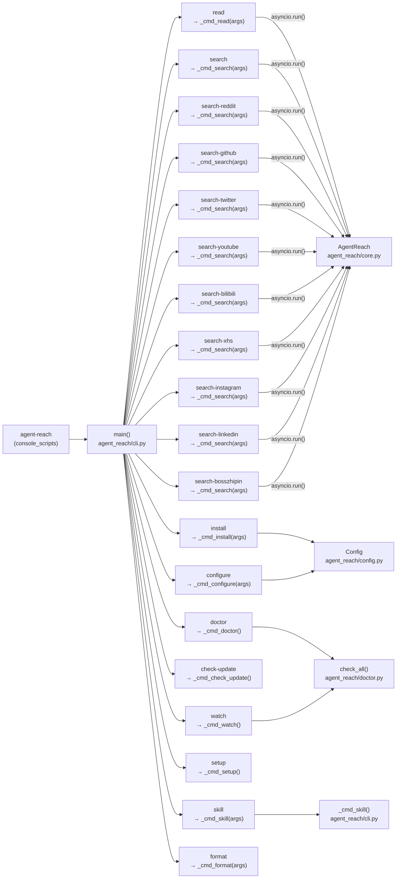
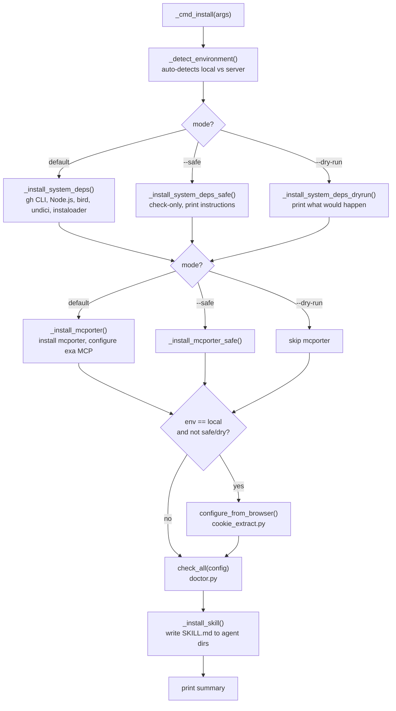
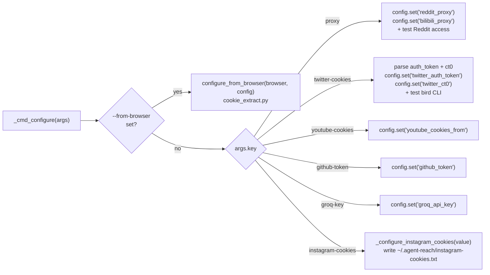

# CLI Reference

<details>
<summary>Relevant source files</summary>

The following files were used as context for generating this wiki page:

- [agent_reach/cli.py](agent_reach/cli.py)

</details>


This page documents the `agent-reach` command-line interface: the `main()` entrypoint in `agent_reach/cli.py`, how subcommands are parsed and dispatched, global flags, and the complete set of subcommands with their arguments.

For details on what each channel does when called by these commands, see [Channels](#3). For the configuration file and credential storage, see [Configuration](#4). For a guided first-run walkthrough, see [Getting Started](#1.2).

---

## Entrypoint

The package registers a single console script called `agent-reach`, which maps to `agent_reach.cli:main` as declared in `pyproject.toml`. The `main()` function [agent_reach/cli.py:47-146]() builds an `argparse.ArgumentParser` with one subparser per command, parses `sys.argv`, then dispatches to a `_cmd_*` handler function.

On Windows, `main()` also patches `sys.stdout` and `sys.stderr` to UTF-8 before anything else [agent_reach/cli.py:21-36](), so emoji and CJK characters do not crash on narrow system encodings.

Loguru logging is suppressed by default; passing `-v` / `--verbose` re-enables it at `INFO` level via `_configure_logging()` [agent_reach/cli.py:39-45]().

---

## Command Dispatch

**Diagram: `main()` → handler function dispatch**



Sources: [agent_reach/cli.py:47-146]()

---

## Global Flags

These flags apply to the top-level `agent-reach` parser and must be placed before the subcommand name.

| Flag | Type | Default | Description |
|------|------|---------|-------------|
| `-v`, `--verbose` | bool flag | off | Enable loguru INFO logs on stderr |
| `--version` | action | — | Print `Agent Reach vX.Y.Z` and exit |

Sources: [agent_reach/cli.py:54-55]()

---

## Command Summary

| Command | Handler | Description |
|---------|---------|-------------|
| `read <url>` | `_cmd_read()` | Read content from any URL |
| `search <query>` | `_cmd_search()` | Web search via Exa |
| `search-twitter <query>` | `_cmd_search()` | Search Twitter/X |
| `search-reddit <query>` | `_cmd_search()` | Search Reddit |
| `search-github <query>` | `_cmd_search()` | Search GitHub |
| `search-youtube <query>` | `_cmd_search()` | Search YouTube |
| `search-bilibili <query>` | `_cmd_search()` | Search Bilibili |
| `search-xhs <query>` | `_cmd_search()` | Search XiaoHongShu |
| `search-instagram <query>` | `_cmd_search()` | Search Instagram |
| `search-linkedin <query>` | `_cmd_search()` | Search LinkedIn |
| `search-bosszhipin <query>` | `_cmd_search()` | Search Boss直聘 |
| `install` | `_cmd_install()` | One-shot installer with dependency detection |
| `configure` | `_cmd_configure()` | Set config values or auto-extract from browser |
| `setup` | `_cmd_setup()` | Interactive configuration wizard |
| `doctor` | `_cmd_doctor()` | Check platform availability and health |
| `skill` | `_cmd_skill()` | Install or uninstall SKILL.md for AI agents |
| `format` | `_cmd_format()` | Clean and format platform API output (e.g., XHS) |
| `watch` | `_cmd_watch()` | Quick health + update check for scheduled tasks |
| `check-update` | `_cmd_check_update()` | Check for new versions and changes |
| `uninstall` | `_cmd_uninstall()` | Remove config, tokens, and skill files |
| `version` | inline | Show version |

Sources: [agent_reach/cli.py:58-113]()

---

## `read`

```
agent-reach read <url> [--json]
```

Dispatches to `_cmd_read(args)` [agent_reach/cli.py:904-927](), which calls `AgentReach.read(url)`. The correct channel is selected by `get_channel_for_url()` based on the URL. Output defaults to a human-readable multiline format with title, URL, author, and body; `--json` switches to a `json.dumps` of the raw result dict.

| Argument | Required | Description |
|----------|----------|-------------|
| `url` | yes | Any URL; channel selection is automatic |
| `--json` | no | Output as a JSON object instead of formatted text |

On error, `_cmd_read()` recognizes 400 Bad Request (bad URL), connection errors, and timeouts, printing a specific message for each before calling `sys.exit(1)`.

Sources: [agent_reach/cli.py:51-54](), [agent_reach/cli.py:904-927]()

---

## Search Commands

All `search-*` subcommands funnel through a single `_cmd_search(args)` handler [agent_reach/cli.py:930-996](), which branches on `args.command`. Each calls the matching method on `AgentReach` (e.g., `search_reddit()`, `search_twitter()`).

The common flag across all search commands:

| Flag | Default | Description |
|------|---------|-------------|
| `-n`, `--num` | varies | Maximum number of results to return |

Platform-specific flags:

| Command | Extra Flag | Description |
|---------|------------|-------------|
| `search-reddit` | `--sub <subreddit>` | Restrict results to one subreddit |
| `search-github` | `--lang <language>` | Filter by programming language |

Default `-n` values by command:

| Command | Default `-n` |
|---------|-------------|
| `search` | 5 |
| `search-twitter` | 10 |
| `search-reddit` | 10 |
| `search-github` | 5 |
| `search-youtube` | 5 |
| `search-bilibili` | 5 |
| `search-xhs` | 10 |
| `search-instagram` | 10 |
| `search-linkedin` | 10 |
| `search-bosszhipin` | 10 |

Output format: numbered list of title, URL, snippet, and (for GitHub) star/fork/language metadata.

Sources: [agent_reach/cli.py:56-105](), [agent_reach/cli.py:930-996]()

---

## `install`

```
agent-reach install [--env {local,server,auto}] [--proxy URL] [--safe] [--dry-run]
```

**Diagram: `_cmd_install()` execution flow**



| Flag | Default | Description |
|------|---------|-------------|
| `--env` | `auto` | `local`, `server`, or `auto` (calls `_detect_environment()`) |
| `--proxy` | `""` | Set `reddit_proxy` and `bilibili_proxy` in `Config` |
| `--safe` | off | Skip all auto-installs; print manual instructions instead |
| `--dry-run` | off | Print what would be done; make no changes |

`_detect_environment()` [agent_reach/cli.py:595-633]() scores environment signals (SSH session, Docker, no DISPLAY, cloud VM markers) and returns `"server"` if score ≥ 2, else `"local"`.

`_install_skill()` [agent_reach/cli.py:302-340]() writes `SKILL.md` from the bundled package data to any existing agent skill directories (`~/.openclaw/skills`, `~/.claude/skills`, `~/.agents/skills`), falling back to creating `~/.openclaw/skills/agent-reach`.

Sources: [agent_reach/cli.py:151-300](), [agent_reach/cli.py:302-340](), [agent_reach/cli.py:343-577](), [agent_reach/cli.py:595-633]()

---

## `configure`

```
agent-reach configure <key> <value>
agent-reach configure --from-browser {chrome,firefox,edge,brave,opera}
```

Handled by `_cmd_configure(args)` [agent_reach/cli.py:636-769]().

**Diagram: `_cmd_configure()` key dispatch**



**Configurable keys:**

| Key | Config field(s) set | Notes |
|-----|---------------------|-------|
| `proxy` | `reddit_proxy`, `bilibili_proxy` | Auto-tests Reddit after setting |
| `twitter-cookies` | `twitter_auth_token`, `twitter_ct0` | Accepts `"auth_token=X; ct0=Y"` or two bare tokens; auto-tests bird CLI |
| `youtube-cookies` | `youtube_cookies_from` | Browser name passed to yt-dlp |
| `github-token` | `github_token` | Personal access token |
| `groq-key` | `groq_api_key` | Groq Whisper transcription key |
| `xhs-cookies` | `xhs_cookies` | Cookies for XiaoHongShu |

Instagram cookies are written to a dedicated file [agent_reach/cli.py:790-813]() at `~/.agent-reach/instagram-cookies.txt` with mode `0o600`, separate from the main YAML config.

Sources: [agent_reach/cli.py:73-83](), [agent_reach/cli.py:636-813]()

---

## `setup`

```
agent-reach setup
```

Handled by `_cmd_setup()` [agent_reach/cli.py:816-901](). An interactive prompt-based wizard that walks through the same keys as `configure` — Exa API key, GitHub token, Reddit proxy, and Groq key — but presents them with descriptions and skips keys that are already set. Primarily for human users who prefer a guided experience; AI agents should use `configure` directly.

Sources: [agent_reach/cli.py:816-901]()

---

## `doctor`

```
agent-reach doctor
```

Handled by `_cmd_doctor()` [agent_reach/cli.py:771-776](). Calls `check_all(config)` from `agent_reach.doctor`, then passes the result dict to `format_report()` and prints. Each channel is shown with an ok / warn / off status indicator and a short message.

For detailed documentation of health check logic, see [Diagnostics and Monitoring](#2.5).

Sources: [agent_reach/cli.py:771-776]()

---

## `watch`

```
agent-reach watch
```

Handled by `_cmd_watch()` [agent_reach/cli.py:1055-1119](). Designed for cron jobs. Runs `check_all()` and also queries the GitHub Releases API for the latest version. If all channels are healthy and the version is current, prints a single "全部正常" line and exits. Otherwise prints a full report of issues and any available update.

Sources: [agent_reach/cli.py:1055-1119]()

---

## `check-update`

```
agent-reach check-update
```

Handled by `_cmd_check_update()` [agent_reach/cli.py:998-1052](). Queries `https://api.github.com/repos/Panniantong/Agent-Reach/releases/latest`. If a newer `tag_name` is found, prints release notes (first 20 lines) and the upgrade command. If no releases exist yet, falls back to showing the latest commit SHA, date, and message.

Sources: [agent_reach/cli.py:998-1052]()

---

## Output Format Notes

- All `read` output goes to `stdout`. Errors go to `stderr` with `sys.exit(1)`.
- All `search-*` output goes to `stdout` as a numbered list. The `--json` flag is only available on `read`.
- `doctor`, `watch`, and `check-update` write directly to `stdout`.
- `install` and `configure` print step-by-step status lines prefixed with emoji indicators (`✅`, `⬜`, `⚠️`, `❌`, `📥`).

Sources: [agent_reach/cli.py:904-996]()
