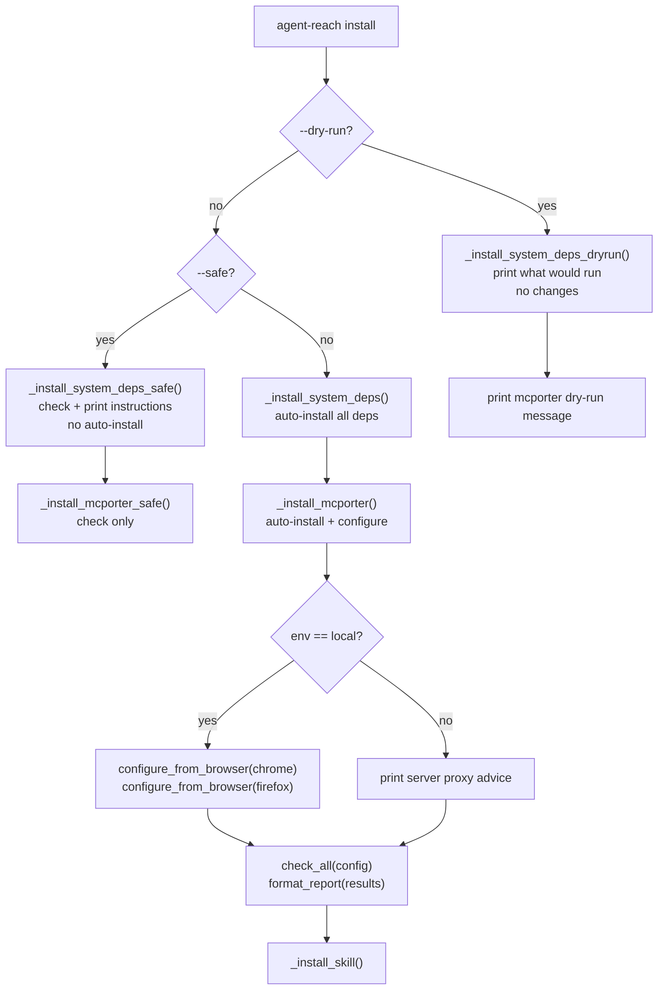
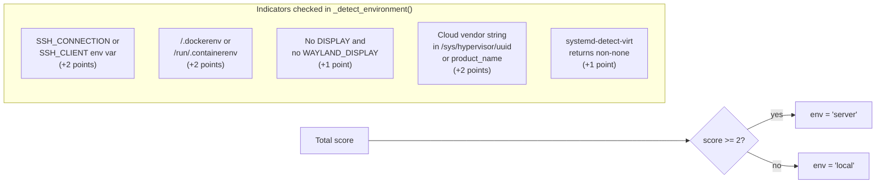
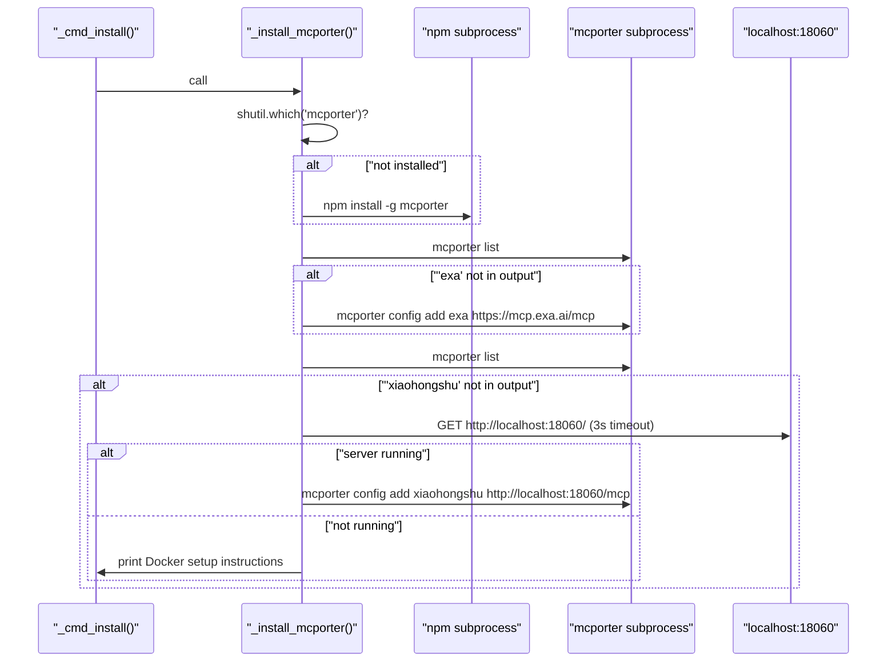
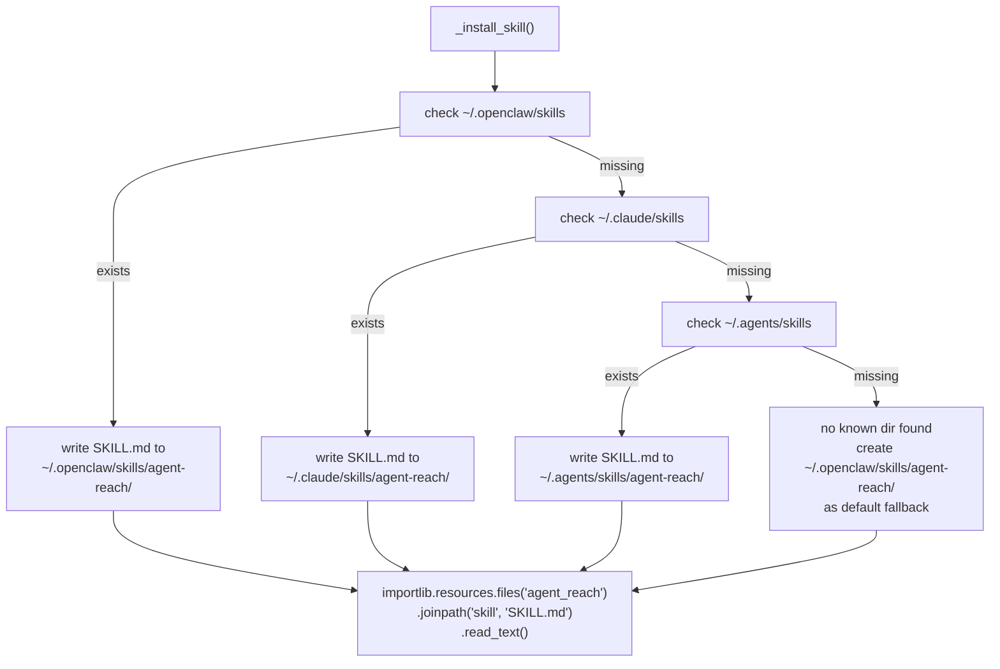

# Installation Command

<details>
<summary>Relevant source files</summary>

The following files were used as context for generating this wiki page:

- [agent_reach/cli.py](agent_reach/cli.py)
- [docs/install.md](docs/install.md)

</details>


This page documents the `agent-reach install` subcommand: its flags, what system dependencies it detects and installs, how it decides between operating modes, and how it registers `SKILL.md` into AI agent skill directories.

For the overall CLI structure and all available subcommands, see [CLI Reference](2). For configuring credentials after installation, see [Configure Command](2.4). For understanding channel health after installation, see [Diagnostics and Monitoring](2.5).

---

## Overview

The `install` command is a one-shot, deterministic installer that bootstraps all system-level dependencies required by Agent Reach's channel backends. It is defined in `agent_reach/cli.py` and invoked as:

```bash
agent-reach install [--env=local|server|auto] [--safe] [--dry-run] [--proxy URL]
```

The flags control the operating mode and environment context:

| Flag | Behavior |
|---|---|
| `--env=auto` (default) | Auto-detects whether the machine is a local computer or a server [agent_reach/cli.py:63-64]() |
| `--env=local` | Forces local-computer mode (attempts browser cookie import) [agent_reach/cli.py:63-64]() |
| `--env=server` | Forces server mode (skips cookie import, prints proxy advice) [agent_reach/cli.py:63-64]() |
| `--safe` | Checks what is installed; prints instructions for what is missing; makes no changes [agent_reach/cli.py:67-68]() |
| `--dry-run` | Prints what *would* be done; makes no changes whatsoever [agent_reach/cli.py:69-70]() |
| `--proxy URL` | Immediately writes a proxy value to `reddit_proxy` and `bilibili_proxy` in config [agent_reach/cli.py:187-194]() |

Sources: [agent_reach/cli.py:61-70](), [agent_reach/cli.py:187-194]()

---

## Operating Modes

The installation logic follows a clear decision tree based on the provided flags.

**Operating Mode Decision Logic**



Sources: [agent_reach/cli.py:151-299]()

---

## Environment Auto-Detection

When `--env=auto` is passed (the default), `_detect_environment()` inspects several OS-level signals to differentiate between a local workstation and a remote server/container.

**`_detect_environment()` Scoring Logic**



Sources: [agent_reach/cli.py:595-633]()

---

## System Dependencies

`_install_system_deps()` checks and installs tools in sequence. Each tool is verified with `shutil.which()` before any installation is attempted.

**Dependency Installation Map**

| Tool | Binary check | Install method | Purpose |
|---|---|---|---|
| `gh` CLI | `shutil.which("gh")` | APT (Linux) / Homebrew (macOS) | GitHub channel backend [agent_reach/cli.py:346-372]() |
| Node.js | `shutil.which("node")` | NodeSource curl script + `apt-get install nodejs` | Required by mcporter and bird [agent_reach/cli.py:374-406]() |
| `bird` CLI | `shutil.which("bird")` | `npm install -g @steipete/bird` | Twitter channel backend [agent_reach/cli.py:408-422]() |
| `undici` | `npm list -g undici` | `npm install -g undici` | Proxy support for Node.js `fetch()` [agent_reach/cli.py:424-439]() |
| `instaloader` | `shutil.which("instaloader")` | `pip install instaloader` | Instagram channel backend [agent_reach/cli.py:441-454]() |

Sources: [agent_reach/cli.py:343-454]()

### Safe Mode Implementation

`_install_system_deps_safe()` iterates the same dependency list but never runs any install command. It prints the manual install hint for each missing tool, such as `npm install -g @steipete/bird` for the bird CLI.

Sources: [agent_reach/cli.py:457-485]()

### Dry-Run Mode Implementation

`_install_system_deps_dryrun()` performs `shutil.which()` checks and prints either `✅ already installed, skip` or `📥 would install via: <method>` for each tool. No subprocess calls are made.

Sources: [agent_reach/cli.py:488-506]()

---

## mcporter Setup

After system dependencies, `_install_mcporter()` installs and configures `mcporter`, the MCP bridge used by Exa search and XiaoHongShu channels.

**`_install_mcporter()` Sequence**



Sources: [agent_reach/cli.py:509-576]()

The Exa MCP endpoint (`https://mcp.exa.ai/mcp`) is always configured if not already present [agent_reach/cli.py:541-544](). The XiaoHongShu MCP (`http://localhost:18060/mcp`) is only registered if a Docker container is detected responding at that address [agent_reach/cli.py:556-568]().

---

## Browser Cookie Auto-Import

On `env=local` (provided it is not safe or dry-run mode), the installer attempts to pull cookies from the local browser via `configure_from_browser()`.

```python
# Implementation detail in _cmd_install
if env == "local" and not safe_mode and not dry_run:
    from agent_reach.cookie_extract import configure_from_browser
    configure_from_browser("chrome", config)
    configure_from_browser("firefox", config)
```

Only successes are printed. If neither browser yields any cookies, a message is shown suggesting manual configuration via `agent-reach configure`.

Sources: [agent_reach/cli.py:237-268]()

---

## SKILL.md Registration

The final step of installation is `_install_skill()`, which writes the `SKILL.md` file into recognized AI agent skill directories.

**`_install_skill()` Directory Probe Order**



The skill file content is read using `importlib.resources` from the package data [agent_reach/cli.py:305-307](). Multiple matching directories are all updated if they exist [agent_reach/cli.py:311-332]().

Sources: [agent_reach/cli.py:302-340]()

---

## Full Install Sequence Summary

| Step | `--dry-run` | `--safe` | Default |
|---|---|---|---|
| System deps | Prints `[dry-run] would install` | Prints install hints | Installs via subprocess |
| mcporter | Prints `[dry-run] would install` | Prints manual hint | Installs + configures |
| Cookies | Prints `[dry-run] would try` | Prints manual hint | Auto-extracts from Chrome/FF |
| Channel check | Skipped | Runs `check_all()` | Runs `check_all()` |
| `SKILL.md` | Skipped | Runs `_install_skill()` | Runs `_install_skill()` |

Sources: [agent_reach/cli.py:179-299]()
