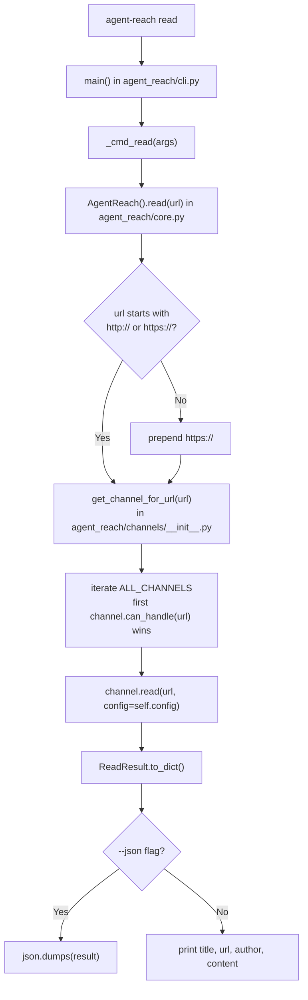
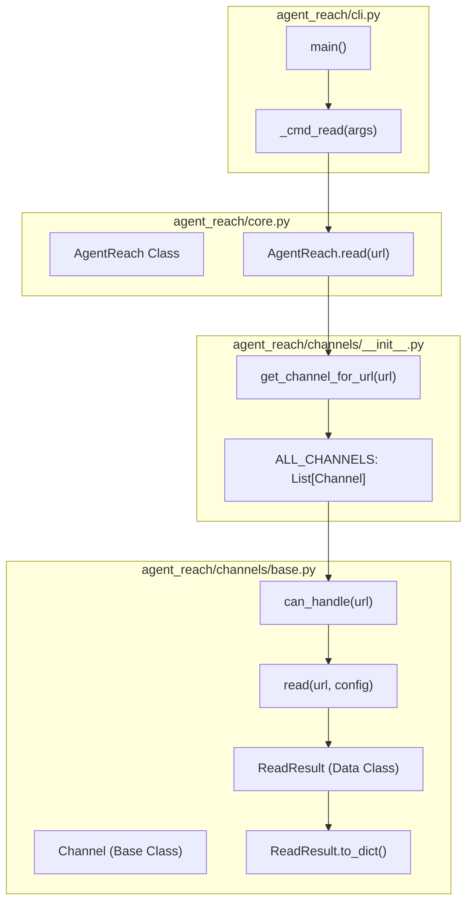

# Reading Content

<details>
<summary>Relevant source files</summary>

The following files were used as context for generating this wiki page:

- [agent_reach/channels/__init__.py](agent_reach/channels/__init__.py)
- [agent_reach/channels/v2ex.py](agent_reach/channels/v2ex.py)
- [agent_reach/cli.py](agent_reach/cli.py)

</details>


This page documents the `agent-reach read <url>` command: its flags, output formats, URL normalization behavior, and the internal channel dispatch mechanism that determines which backend handles each URL. For documentation on search commands, see **2.3 Search Commands**. For details on individual channel backends, see **3. Channels**.

---

## Command Syntax

```bash
agent-reach read <url> [--json]
```

| Flag | Description |
|------|-------------|
| `url` | Any URL to read. Scheme (`https://`) is optional. |
| `--json` | Emit a JSON object instead of the default human-readable output. |
| `-v` / `--verbose` | Show internal log output from channel backends. |

Sources: [agent_reach/cli.py:50-56](), [agent_reach/cli.py:118-122]()

---

## Internal Execution Flow

When `agent-reach read` is invoked, the CLI parses the arguments and delegates the network operations to the `AgentReach` core class. The core class performs URL normalization and iterates through the `ALL_CHANNELS` registry to find a suitable handler.

**Dispatch diagram: `agent-reach read` internals**



Sources: [agent_reach/cli.py:120-147](), [agent_reach/core.py:31-46](), [agent_reach/channels/__init__.py:29-46]()

---

## URL Normalization

Before channel dispatch, `AgentReach.read()` ensures the input is a valid absolute URL. It prepends `https://` to any URL that does not already start with `http://` or `https://`. This allows agents to provide bare domains like `v2ex.com/t/123456`.

Sources: [agent_reach/core.py:41-42]()

---

## Channel Dispatch

The `get_channel_for_url(url)` function (aliased in `core.py` from `channels/__init__.py`) iterates through the `ALL_CHANNELS` list in a specific priority order. The first channel whose `can_handle(url)` returns `True` is selected. `WebChannel` is positioned at the end of the list as a catch-all fallback using Jina Reader.

**Channel registry order (ALL_CHANNELS)**

```mermaid
flowchart LR
    URL["Input URL"] --> G["GitHubChannel"]
    G -- "no match" --> T["TwitterChannel"]
    T -- "no match" --> Y["YouTubeChannel"]
    Y -- "no match" --> R["RedditChannel"]
    R -- "no match" --> Bi["BilibiliChannel"]
    Bi -- "no match" --> X["XiaoHongShuChannel"]
    X -- "no match" --> Dy["DouyinChannel"]
    Dy -- "no match" --> Li["LinkedInChannel"]
    Li -- "no match" --> Wc["WeChatChannel"]
    Wc -- "no match" --> Wb["WeiboChannel"]
    Wb -- "no match" --> Xyz["XiaoyuzhouChannel"]
    Xyz -- "no match" --> V2["V2EXChannel"]
    V2 -- "no match" --> Xq["XueqiuChannel"]
    Xq -- "no match" --> Rss["RSSChannel"]
    Rss -- "no match" --> Exa["ExaSearchChannel"]
    Exa -- "no match" --> W["WebChannel (fallback)"]
```



Sources: [agent_reach/channels/__init__.py:29-46](), [agent_reach/core.py:44-45]()

---

## URL-to-Channel Mapping

The following table summarizes which channel handles specific URL patterns based on their `can_handle()` implementation.

| Channel class | Handled URL patterns | Primary backend |
|---|---|---|
| `GitHubChannel` | `github.com/*` | `gh` CLI |
| `TwitterChannel` | `twitter.com/*`, `x.com/*` | `bird` CLI |
| `YouTubeChannel` | `youtube.com/*`, `youtu.be/*` | `yt-dlp` |
| `RedditChannel` | `reddit.com/*` | Reddit JSON API |
| `BilibiliChannel` | `bilibili.com/*`, `b23.tv/*` | `yt-dlp` |
| `XiaoHongShuChannel` | `xiaohongshu.com/*`, `xhslink.com/*` | `mcporter` + `xiaohongshu-mcp` |
| `V2EXChannel` | `v2ex.com/*` | V2EX Public API |
| `RSSChannel` | Feed URLs (detected by content/ext) | `feedparser` |
| `WebChannel` | any URL | Jina Reader (`r.jina.ai`) |

Sources: [agent_reach/channels/v2ex.py:30-33](), [agent_reach/channels/__init__.py:29-46]()

---

## Output Formats

### Default (human-readable)
The CLI prints a formatted view optimized for AI agent consumption or terminal reading:
```text
📖 <title>
🔗 <url>
👤 <author>       ← only printed when present

<content>
```
The `author` field is optional and only displayed if the channel populates it in the `ReadResult`.

### JSON (`--json`)
Emits a structured JSON object. This is preferred for programmatic integration or when the agent needs to parse specific metadata fields.
```json
{
  "title": "Example Title",
  "url": "https://example.com",
  "author": "Author Name",
  "content": "Full article content...",
  "platform": "web"
}
```

Sources: [agent_reach/cli.py:103-105]()

---

## Code Entity Map

This diagram associates natural language concepts with the specific code entities that implement the reading logic.

**Diagram: symbols used in the read pipeline**



Sources: [agent_reach/cli.py:120-147](), [agent_reach/core.py:31-46](), [agent_reach/channels/base.py:7-20]()

---

## Error Handling

The CLI implements specific error mapping to provide clear feedback when a read operation fails:

| Exception Pattern | CLI Output Message |
|---|---|
| HTTP 400 / "Bad Request" | `❌ Invalid URL: <url>` |
| `ConnectionError` / `Timeout` | `❌ Could not connect to: <url>` |
| Standard Exceptions | `❌ Error: <error_message>` |

Sources: [agent_reach/cli.py:128-145]()
