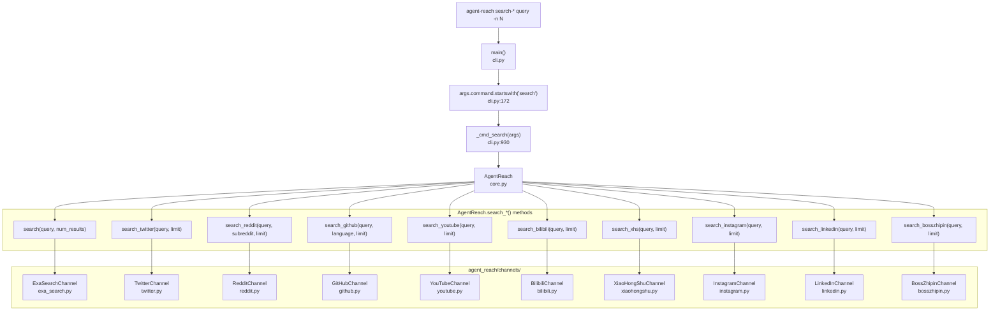
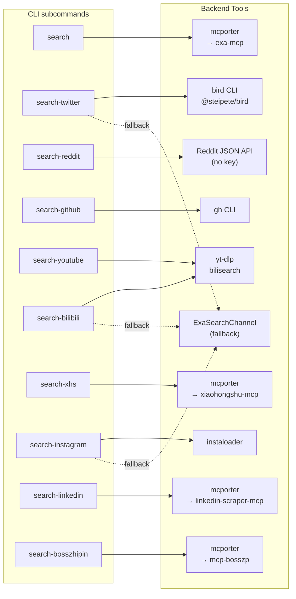

# Search Commands

<details>
<summary>Relevant source files</summary>

The following files were used as context for generating this wiki page:

- [agent_reach/channels/__init__.py](agent_reach/channels/__init__.py)
- [agent_reach/channels/v2ex.py](agent_reach/channels/v2ex.py)
- [agent_reach/cli.py](agent_reach/cli.py)

</details>


This page documents all `search-*` subcommands exposed by the `agent-reach` CLI: their syntax, flags, default behaviors, and which backend channel each one invokes. For information about reading a specific URL (rather than issuing a search query), see [2.2](). For details on how individual channels work internally, see [3]().

---

## Overview

Every search command follows the same pattern:

```bash
agent-reach <search-subcommand> "<query>" [flags]
```

All commands accept a free-text query (multiple words do not need to be quoted — they are joined by the CLI) and a common `-n` flag to control result count.

The dispatching logic lives in `_cmd_search()` in [agent_reach/cli.py:930-995](). It instantiates `AgentReach` from `core.py`, calls the appropriate `search_*` method, then prints numbered results to stdout.

**Output format per result (all commands):**

```text
1. <title>
   🔗 <url>
   <snippet, up to 200 chars>
   ⭐ <stars>  🍴 <forks>  📝 <language>   ← GitHub only
```

Sources: [agent_reach/cli.py:930-995](), [agent_reach/skill/SKILL.md:46-61]()

---

## Command Reference

### Subcommand Summary

| Subcommand | Default `-n` | Platform-specific flags | Backend |
|---|---|---|---|
| `search` | 5 | — | `ExaSearchChannel` (mcporter → exa-mcp) |
| `search-twitter` | 10 | — | `TwitterChannel` → `bird` CLI |
| `search-reddit` | 10 | `--sub <subreddit>` | `RedditChannel` → Reddit JSON API |
| `search-github` | 5 | `--lang <language>` | `GitHubChannel` → `gh` CLI |
| `search-youtube` | 5 | — | `YouTubeChannel` → `yt-dlp` |
| `search-bilibili` | 5 | — | `BilibiliChannel` → `bilisearch` |
| `search-xhs` | 10 | — | `XiaoHongShuChannel` → mcporter |
| `search-instagram` | 10 | — | `InstagramChannel` → `instaloader` |
| `search-linkedin` | 10 | — | `LinkedInChannel` → mcporter |
| `search-bosszhipin` | 10 | — | `BossZhipinChannel` → mcporter |

Sources: [agent_reach/cli.py:55-105](), [agent_reach/channels/__init__.py:29-46]()

---

### Common Flag: `-n / --num`

All search subcommands accept `-n` (or `--num`) to control the number of results returned.

```bash
agent-reach search "rust async runtime" -n 10
agent-reach search-reddit "homelab" -n 20
```

The value is passed directly as the `limit` (or `num_results`) argument to the underlying `AgentReach.search_*()` method.

Sources: [agent_reach/cli.py:58-105]()

---

### `search` — General Web Search

```bash
agent-reach search "<query>" [-n N]
```

Routes to `AgentReach.search()`, which delegates to `ExaSearchChannel`. Uses mcporter to call the Exa MCP server at `mcp.exa.ai`. No API key is required (free tier, zero-config after `agent-reach install`).

Sources: [agent_reach/cli.py:56-59](), [agent_reach/cli.py:941-942]()

---

### `search-twitter` — Twitter/X Search

```bash
agent-reach search-twitter "<query>" [-n N]
```

Routes to `AgentReach.search_twitter()` → `TwitterChannel`. Primary backend is the `bird` CLI (npm package `@steipete/bird`), which requires `AUTH_TOKEN` and `CT0` cookies to be configured. If `bird` fails, `TwitterChannel` falls back to `ExaSearchChannel`.

Configure Twitter cookies first:
```bash
agent-reach configure twitter-cookies "auth_token=xxx; ct0=yyy; ..."
```

Sources: [agent_reach/cli.py:73-75](), [agent_reach/cli.py:948]()

---

### `search-reddit` — Reddit Search

```bash
agent-reach search-reddit "<query>" [--sub <subreddit>] [-n N]
```

Routes to `AgentReach.search_reddit()` → `RedditChannel`. Uses the Reddit JSON API (no API key). The optional `--sub` flag restricts search to a specific subreddit.

```bash
agent-reach search-reddit "async python" --sub learnpython -n 5
```

> **Note:** Reddit blocks many server/datacenter IPs. On VPS environments, configure a residential proxy: `agent-reach configure proxy http://user:pass@ip:port`. See [4.2]() for details.

Sources: [agent_reach/cli.py:61-64](), [agent_reach/cli.py:944]()

---

### `search-github` — GitHub Repository Search

```bash
agent-reach search-github "<query>" [--lang <language>] [-n N]
```

Routes to `AgentReach.search_github()` → `GitHubChannel` → `gh` CLI. The optional `--lang` flag filters results by programming language.

```bash
agent-reach search-github "vector database" --lang rust -n 5
```

GitHub search results include extra metadata (stars, forks, language) rendered below the snippet.

Sources: [agent_reach/cli.py:66-70](), [agent_reach/cli.py:946](), [agent_reach/cli.py:992-995]()

---

### `search-youtube` — YouTube Search

```bash
agent-reach search-youtube "<query>" [-n N]
```

Routes to `AgentReach.search_youtube()` → `YouTubeChannel` → `yt-dlp`. Returns video titles, URLs, and descriptions.

Sources: [agent_reach/cli.py:77-80](), [agent_reach/cli.py:950]()

---

### `search-bilibili` — Bilibili Search

```bash
agent-reach search-bilibili "<query>" [-n N]
```

Routes to `AgentReach.search_bilibili()` → `BilibiliChannel`. Uses the `bilisearch` functionality of `yt-dlp`. Falls back to `ExaSearchChannel` if Bilibili's server-side IP blocking interferes.

> **Note:** Bilibili blocks server IPs. A proxy is recommended for VPS use. See [4.2]().

Sources: [agent_reach/cli.py:82-85](), [agent_reach/cli.py:952]()

---

### `search-xhs` — XiaoHongShu (小红书) Search

```bash
agent-reach search-xhs "<query>" [-n N]
```

Routes to `AgentReach.search_xhs()` → `XiaoHongShuChannel` → mcporter → xiaohongshu-mcp (Docker, `localhost:18060`). Requires the Docker-based MCP server to be running and registered with mcporter.

Sources: [agent_reach/cli.py:87-90](), [agent_reach/cli.py:954]()

---

### `search-instagram` — Instagram Search

```bash
agent-reach search-instagram "<query>" [-n N]
```

Routes to `AgentReach.search_instagram()` → `InstagramChannel` → `instaloader`. Falls back to `ExaSearchChannel` if instaloader is not configured or authenticated.

Sources: [agent_reach/cli.py:92-95](), [agent_reach/cli.py:956]()

---

### `search-linkedin` — LinkedIn Search

```bash
agent-reach search-linkedin "<query>" [-n N]
```

Routes to `AgentReach.search_linkedin()` → `LinkedInChannel` → mcporter → linkedin-scraper-mcp. Requires the linkedin-scraper-mcp service to be running and registered.

Sources: [agent_reach/cli.py:97-100](), [agent_reach/cli.py:958]()

---

### `search-bosszhipin` — Boss直聘 Job Search

```bash
agent-reach search-bosszhipin "<query>" [-n N]
```

Routes to `AgentReach.search_bosszhipin()` → `BossZhipinChannel` → mcporter → mcp-bosszp. Requires mcp-bosszp service to be running with a valid QR-code login session.

Sources: [agent_reach/cli.py:102-105](), [agent_reach/cli.py:960]()

---

## Internal Dispatch Flow

**Diagram: Search Command Dispatch — from CLI to Channel**



Sources: [agent_reach/cli.py:172-173](), [agent_reach/cli.py:930-963]()

---

## Backend and Fallback Map

**Diagram: Search Channel → Backend Tool → External Platform**



Sources: [agent_reach/cli.py:930-963](), [agent_reach/skill/SKILL.md:46-61]()

---

## Setup Requirements by Command

| Subcommand | Tier | Required setup |
|---|---|---|
| `search` | Zero-config | `mcporter` + `exa` MCP auto-configured by `agent-reach install` |
| `search-reddit` | Zero-config (local); proxy for server | No credentials; optional proxy for VPS |
| `search-github` | Zero-config | `gh` CLI; optional token for higher rate limits |
| `search-youtube` | Zero-config | `yt-dlp` (installed automatically) |
| `search-bilibili` | Zero-config (local); proxy for server | Optional proxy |
| `search-twitter` | Needs credentials | `bird` CLI + Twitter cookies (`AUTH_TOKEN`, `CT0`) |
| `search-xhs` | Needs setup | Docker + `xiaohongshu-mcp` + `mcporter` |
| `search-instagram` | Needs credentials | `instaloader` + Instagram session cookies |
| `search-linkedin` | Needs setup | `linkedin-scraper-mcp` + `mcporter` + browser login |
| `search-bosszhipin` | Needs setup | `mcp-bosszp` + `mcporter` + QR code login |

For credential configuration, see [2.4](). For proxy setup, see [4.2](). For mcporter setup, see [4.3]().

Sources: [agent_reach/cli.py:55-105](), [agent_reach/channels/__init__.py:29-46]()
