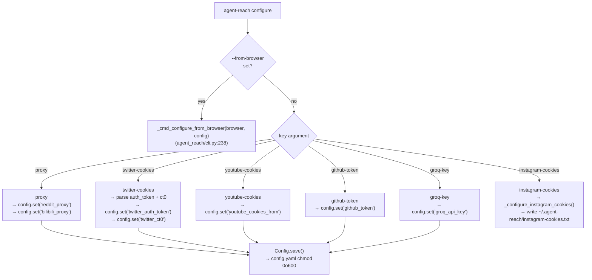
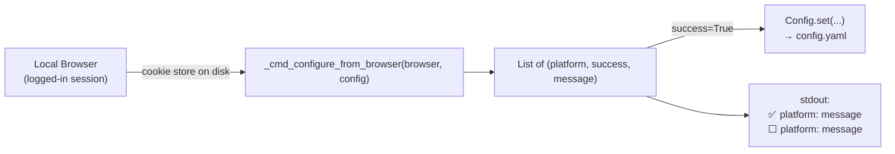
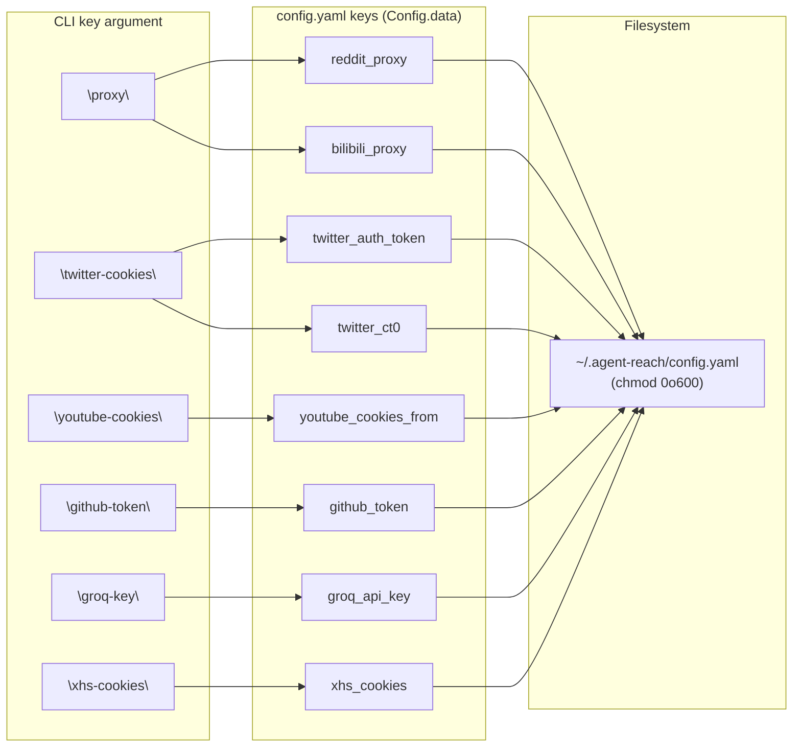

# Configure Command

<details>
<summary>Relevant source files</summary>

The following files were used as context for generating this wiki page:

- [agent_reach/cli.py](agent_reach/cli.py)
- [agent_reach/config.py](agent_reach/config.py)
- [agent_reach/guides/setup-twitter.md](agent_reach/guides/setup-twitter.md)
- [agent_reach/integrations/mcp_server.py](agent_reach/integrations/mcp_server.py)
- [docs/troubleshooting.md](docs/troubleshooting.md)

</details>


The `configure` command stores credentials and settings that channels need to access specific platforms. It writes values to `~/.agent-reach/config.yaml` with restricted file permissions. This page documents all configurable keys, their accepted formats, and the automatic browser extraction option.

For details on the underlying storage mechanism, see [Configuration](#4). For a guide on exporting cookies from a browser, see [Cookie Export Guide](#4.1). For proxy-specific details (why it's needed and per-channel behavior), see [Proxy Configuration](#4.2).

---

## Command Syntax

```bash
agent-reach configure <key> <value>
agent-reach configure --from-browser <browser>
```

The `key` argument is constrained to a fixed set of accepted names [agent_reach/cli.py:73-78](). The `value` argument accepts one or more space-separated tokens which are processed by the command handler [agent_reach/cli.py:79]().

**Key Mapping: CLI name → Internal config key(s)**

| CLI `key` | Internal config key(s) stored | Storage location |
|---|---|---|
| `proxy` | `reddit_proxy`, `bilibili_proxy` | `config.yaml` |
| `github-token` | `github_token` | `config.yaml` |
| `groq-key` | `groq_api_key` | `config.yaml` |
| `twitter-cookies` | `twitter_auth_token`, `twitter_ct0` | `config.yaml` |
| `youtube-cookies` | `youtube_cookies_from` | `config.yaml` |
| `xhs-cookies` | `xhs_cookies` | `config.yaml` |
| `instagram-cookies` | _(file-based)_ | `~/.agent-reach/instagram-cookies.txt` |

Sources: [agent_reach/cli.py:72-82](), [agent_reach/cli.py:636-813](), [agent_reach/config.py:15-28]()

---

## How Values Are Stored

All values (except Instagram cookies) are written via `Config.set()`, which serializes to YAML and immediately sets the file to `0o600` (owner read/write only) [agent_reach/config.py:49-62](). On subsequent reads, `Config.get()` checks the YAML file first, then falls back to an uppercase environment variable of the same name [agent_reach/config.py:69-78]().

**Configure command: code flow**



Sources: [agent_reach/cli.py:636-768](), [agent_reach/config.py:49-62](), [agent_reach/config.py:69-78]()

---

## Configurable Keys

### `proxy`

Sets a residential proxy used by the Reddit and Bilibili channels to bypass server-side IP blocking.

```bash
agent-reach configure proxy http://user:pass@ip:port
```

Internally sets both `reddit_proxy` and `bilibili_proxy` to the same value [agent_reach/cli.py:679-684](). After saving, the command makes a live test request to `https://www.reddit.com/r/test.json` through the proxy to verify connectivity [agent_reach/cli.py:686-699]().

Sources: [agent_reach/cli.py:679-699]()

---

### `twitter-cookies`

Provides Twitter session credentials to the `bird` CLI backend. Two input formats are accepted [agent_reach/cli.py:701-725]():

| Format | Example |
|---|---|
| Full cookie header string | `"auth_token=abc123; ct0=xyz789; ..."` |
| Two space-separated tokens | `AUTH_TOKEN_VALUE CT0_VALUE` |

The parser scans for `auth_token=` and `ct0=` prefixes or splits on whitespace. Both `twitter_auth_token` and `twitter_ct0` must be present for configuration to succeed [agent_reach/cli.py:727-735](). After saving, the command invokes `bird check` or a test search to verify credentials [agent_reach/cli.py:737-752]().

Sources: [agent_reach/cli.py:701-752](), [agent_reach/guides/setup-twitter.md:31-46]()

---

### `youtube-cookies`

Configures a browser name for `yt-dlp`'s `--cookies-from-browser` flag [agent_reach/cli.py:754-757](). This enables downloading age-restricted or member-only content.

```bash
agent-reach configure youtube-cookies chrome
```

The value is stored as `youtube_cookies_from` in `config.yaml`.

Sources: [agent_reach/cli.py:754-757]()

---

### `github-token`

Stores a GitHub personal access token as `github_token` [agent_reach/cli.py:759-761](). This raises the GitHub API rate limit for the `GitHubChannel`.

```bash
agent-reach configure github-token ghp_xxxxxxxxxxxx
```

Sources: [agent_reach/cli.py:759-761](), [agent_reach/config.py:27]()

---

### `groq-key`

Stores a Groq API key as `groq_api_key` [agent_reach/cli.py:763-765](). This key is used by the `XiaoYuzhouChannel` for Whisper transcription via the Groq API.

```bash
agent-reach configure groq-key gsk_xxxxxxxxxxxx
```

Sources: [agent_reach/cli.py:763-765](), [agent_reach/config.py:26]()

---

### `instagram-cookies`

Unlike other keys, Instagram cookies are **not** stored in `config.yaml`. They are written as a raw cookie header string to `~/.agent-reach/instagram-cookies.txt` with `0o600` permissions [agent_reach/cli.py:790-813]().

```bash
agent-reach configure instagram-cookies "sessionid=xxx; csrftoken=yyy; ds_user_id=zzz"
```

The `_configure_instagram_cookies()` function validates that `sessionid` is present before writing [agent_reach/cli.py:799-803]().

Sources: [agent_reach/cli.py:767-768](), [agent_reach/cli.py:790-813]()

---

## `--from-browser` Option

Automatically extracts cookies from a locally installed browser and configures all supported platforms at once [agent_reach/cli.py:80-82]().

```bash
agent-reach configure --from-browser chrome
```

Accepted values: `chrome`, `firefox`, `edge`, `brave`, `opera`. This delegates to `_cmd_configure_from_browser()`, which uses the `cookie_extract` module to pull data from browser profiles [agent_reach/cli.py:238-266]().

**`--from-browser` data flow**



Sources: [agent_reach/cli.py:238-266](), [agent_reach/cli.py:644-666]()

---

## Internal Configuration Keys Reference

The `Config` class uses its own internal key names. This table maps CLI arguments to `config.yaml` keys.



Sources: [agent_reach/cli.py:679-768](), [agent_reach/config.py:15-28]()

---

## Environment Variable Fallback

`Config.get()` checks the config file first, then falls back to an environment variable with the same name uppercased [agent_reach/config.py:69-78]().

| Internal key | Environment variable |
|---|---|
| `reddit_proxy` | `REDDIT_PROXY` |
| `bilibili_proxy` | `BILIBILI_PROXY` |
| `twitter_auth_token` | `TWITTER_AUTH_TOKEN` |
| `twitter_ct0` | `TWITTER_CT0` |
| `github_token` | `GITHUB_TOKEN` |
| `groq_api_key` | `GROQ_API_KEY` |

Sources: [agent_reach/config.py:69-78](), [docs/troubleshooting.md:11-17]()

---

## Post-Configure Verification

After running `configure`, use `agent-reach doctor` to confirm the channel status has changed. The `Config.is_configured()` method checks whether all required keys for a feature are present [agent_reach/config.py:90-94]().

| Feature name | Required keys |
|---|---|
| `twitter_xreach` | `twitter_auth_token`, `twitter_ct0` |
| `reddit_proxy` | `reddit_proxy` |
| `github_token` | `github_token` |
| `groq_whisper` | `groq_api_key` |

Sources: [agent_reach/config.py:22-28](), [agent_reach/config.py:90-94]()
