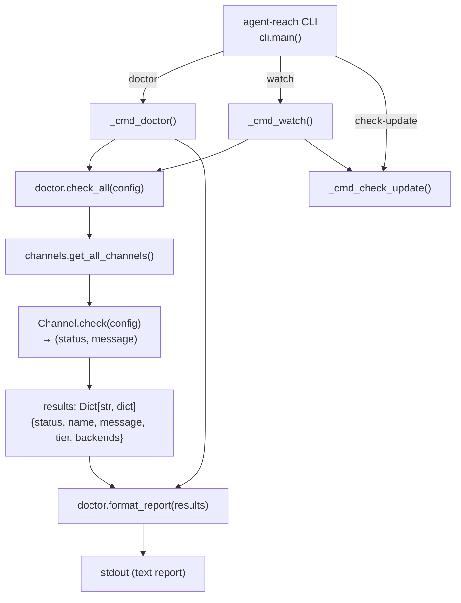
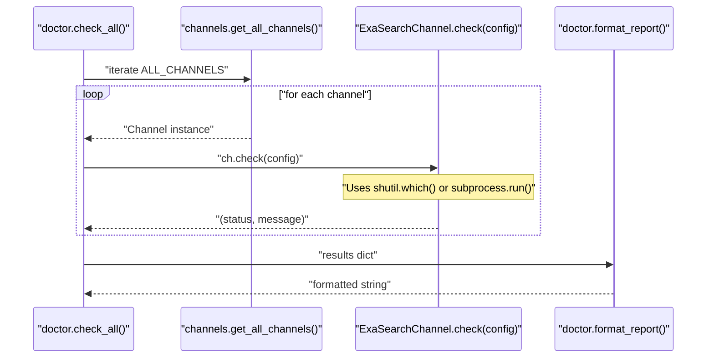
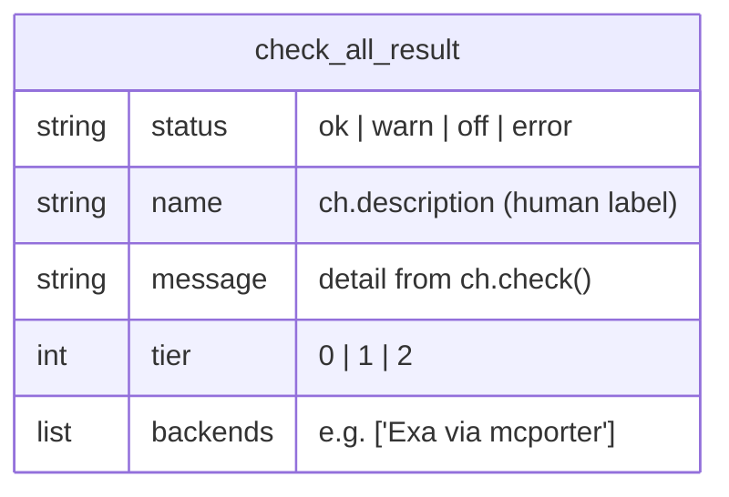

# Diagnostics and Monitoring

<details>
<summary>Relevant source files</summary>

The following files were used as context for generating this wiki page:

- [agent_reach/channels/exa_search.py](agent_reach/channels/exa_search.py)
- [agent_reach/config.py](agent_reach/config.py)
- [agent_reach/doctor.py](agent_reach/doctor.py)
- [agent_reach/guides/setup-twitter.md](agent_reach/guides/setup-twitter.md)
- [agent_reach/integrations/mcp_server.py](agent_reach/integrations/mcp_server.py)
- [docs/troubleshooting.md](docs/troubleshooting.md)
- [docs/update.md](docs/update.md)
- [tests/test_doctor.py](tests/test_doctor.py)

</details>


This page covers the three commands used to inspect and monitor the health of an Agent Reach installation: `agent-reach doctor`, `agent-reach watch`, and `agent-reach check-update`. These commands let you identify which channels are functional, detect configuration problems, and check for package updates.

For information on configuring credentials and proxies to resolve issues flagged by `doctor`, see [Configure Command](#2.4). For background on the channel tier system referenced in `doctor` output, see [Channel Architecture](#3.1).

---

## Overview

**Diagnostics flow diagram**



Sources: [agent_reach/doctor.py:1-24](), [agent_reach/doctor.py:27-104]()

---

## `agent-reach doctor`

### Purpose

`doctor` runs a health check across every registered channel and prints a tiered status report. It is the primary tool for diagnosing installation problems and verifying that channels are correctly configured.

### Implementation

The command handler is `_cmd_doctor()`. It:

1. Instantiates `Config()` to load `~/.agent-reach/config.yaml`.
2. Calls `check_all(config)` from `agent_reach/doctor.py`.
3. Passes the result to `format_report(results)` and prints it.

`check_all()` is defined at [agent_reach/doctor.py:12-24](). It iterates over every channel returned by `get_all_channels()` (the `ALL_CHANNELS` list), calls `ch.check(config)` on each, and assembles a results dict:

```python
results[ch.name] = {
    "status": status,      # "ok" | "warn" | "off" | "error"
    "name": ch.description,
    "message": message,
    "tier": ch.tier,
    "backends": ch.backends,
}
```

`format_report()` is defined at [agent_reach/doctor.py:27-104](). It groups channels by tier and renders each group with emoji status indicators using `rich` markup [agent_reach/doctor.py:35-85]().

### Status Indicators

| Status value | Display symbol | Meaning |
|---|---|---|
| `ok` | ✅ | Channel is fully functional [agent_reach/doctor.py:48]() |
| `warn` | [!] (Yellow) | Channel is partially available (e.g., backend present but not authenticated) [agent_reach/doctor.py:50]() |
| `off` | [X] (Red) / -- | Channel is unavailable — dependency missing or not configured [agent_reach/doctor.py:52]() |
| `error` | [X] (Red) | An unexpected error occurred during the check [agent_reach/doctor.py:52]() |

### Report Structure

`format_report()` groups channels into three sections based on `tier`:

| Tier | Section label | Meaning |
|---|---|---|
| `0` | ✅ 装好即用 | Zero-config — works immediately after installation [agent_reach/doctor.py:43]() |
| `1` | 搜索（mcporter 即可解锁）| Requires `mcporter` and Exa MCP [agent_reach/doctor.py:58]() |
| `2` | 配置后可用 | Requires per-user authentication or optional third-party services [agent_reach/doctor.py:70]() |

A summary line at the bottom counts active channels: e.g., `状态：7/12 个渠道可用` [agent_reach/doctor.py:82]().

`format_report()` also includes a **security check** [agent_reach/doctor.py:87-102](): if `~/.agent-reach/config.yaml` is readable by group or other users (i.e., permissions wider than `0o600` on Unix), a warning is appended to the report.

### Channel check flow

**Channel.check() dispatch diagram**



Sources: [agent_reach/doctor.py:12-24](), [agent_reach/channels/exa_search.py:18-39](), [agent_reach/doctor.py:27-104]()

---

## `agent-reach watch`

### Purpose

`watch` is a lightweight command designed to be invoked by a **scheduled task** (e.g., a cron job). It runs both a health check and an update check in a single pass, printing a machine-readable summary.

The intended AI agent workflow is described in the update guide [docs/update.md:19-51]():

- If output contains `全部正常` → no notification needed; exit silently.
- If output contains `❌`, `⚠️`, or `🆕` (new version) → surface the report to the user and suggest fixes or an upgrade.

### Implementation

The handler combines:
1. `check_all(config)` + `format_report(results)` from `agent_reach/doctor.py` — the same logic as `doctor`.
2. `check-update` — version comparison against the GitHub releases API.

If all channels are `ok` and no update is available, the output enables automated scripts to detect the healthy state.

---

## `agent-reach check-update`

### Purpose

`check-update` performs a standalone version check. It compares the locally installed version against the latest release on the GitHub API [docs/update.md:31-33]().

### Update Workflow

When a new version is detected, the following steps are recommended [docs/update.md:37-76]():

1. **Install Update**: `pip install --upgrade https://github.com/Panniantong/agent-reach/archive/main.zip` [docs/update.md:40]().
2. **Verify**: Run `agent-reach doctor` to ensure no channels broke during the update [docs/update.md:47]().
3. **Update Skills**: Run `agent-reach install --skill-only` to refresh the `SKILL.md` file in agent directories [docs/update.md:57]().

---

## Troubleshooting Guide

Common issues identified by diagnostics:

### bird CLI Connection Failures (Twitter)
**Symptom**: `bird search` or `doctor` reports failure for Twitter.
**Causes**:
- Missing `AUTH_TOKEN` or `CT0` [docs/troubleshooting.md:5-7]().
- Network blocking (requires proxy) [docs/troubleshooting.md:7-8]().
**Solutions**:
- Configure cookies: `agent-reach configure twitter-cookies "JSON"` [agent_reach/guides/setup-twitter.md:43]().
- Set proxy: `export HTTP_PROXY="..."` [docs/troubleshooting.md:11-15]().
- Fallback: Use `ExaSearchChannel` for Twitter search if bird is unavailable [docs/troubleshooting.md:29-36]().

### mcporter Configuration
**Symptom**: Tier 1 search channels show `off`.
**Fix**:
- Install `mcporter`: `npm install -g mcporter` [agent_reach/channels/exa_search.py:23]().
- Add Exa endpoint: `mcporter config add exa https://mcp.exa.ai/mcp` [agent_reach/channels/exa_search.py:24]().

---

## Data structures

**`check_all()` result dict schema**



Sources: [agent_reach/doctor.py:12-24](), [agent_reach/channels/exa_search.py:9-13]()

---

## Tests

Unit tests for the doctor module are in [tests/test_doctor.py]().

| Test | What it verifies |
|---|---|
| `test_check_all_collects_channel_results` | Verifies that `check_all` correctly aggregates data from `Channel.check()` [tests/test_doctor.py:29-64](). |
| `test_format_report` | Verifies `rich` markup formatting and tier grouping logic [tests/test_doctor.py:66-102](). |

Sources: [tests/test_doctor.py:28-102]()
