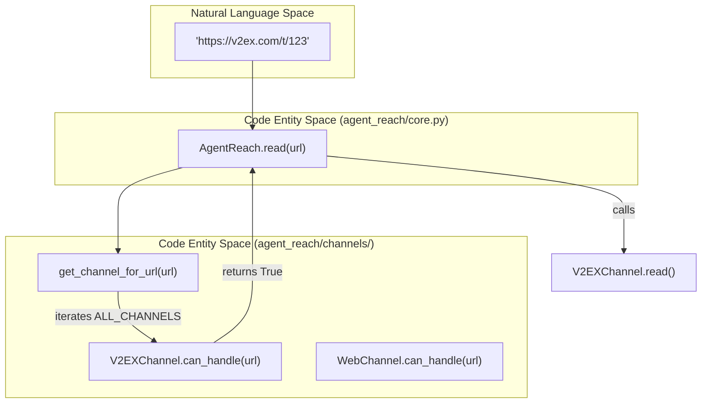
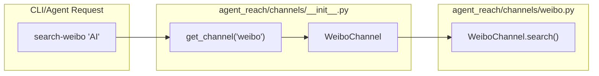

# Channels

<details>
<summary>Relevant source files</summary>

The following files were used as context for generating this wiki page:

- [agent_reach/channels/__init__.py](agent_reach/channels/__init__.py)
- [agent_reach/channels/v2ex.py](agent_reach/channels/v2ex.py)
- [agent_reach/channels/weibo.py](agent_reach/channels/weibo.py)
- [agent_reach/channels/xueqiu.py](agent_reach/channels/xueqiu.py)
- [tests/test_channel_contracts.py](tests/test_channel_contracts.py)
- [tests/test_channels.py](tests/test_channels.py)

</details>


This page describes what channels are, how they are registered and selected at runtime, and the full list of supported platforms with their tier requirements. For the abstract `Channel` base class interface and the `ReadResult`/`SearchResult` data structures, see [Channel Architecture](#3.1). For per-channel deep dives, see sections [Twitter Channel](#3.2) through [Chinese Platform Channels](#3.10).

---

## What Is a Channel?

A **channel** is a Python module in `agent_reach/channels/` that wraps a single external tool or API and exposes standardized operations:

- **`can_handle(url)`** — returns `True` if the channel can process the given URL.
- **`check(config)`** — performs a health check to see if dependencies (CLIs, APIs, cookies) are available.
- **`read(url)`** — fetches and returns structured content from a specific URL.
- **`search(query)`** — searches the platform and returns a ranked list of results.

Every channel implements the `Channel` abstract base class defined in [agent_reach/channels/base.py](). Each channel is responsible for exactly one platform or tool. If the underlying tool changes, only that channel's file needs to change.

Sources: [agent_reach/channels/__init__.py:7-25](), [agent_reach/channels/base.py:1-20]()

---

## Channel Registry

All channels are registered in `agent_reach/channels/__init__.py`. The order in the `ALL_CHANNELS` list determines the priority for URL routing.

**`ALL_CHANNELS`** — the ordered routing list:

```python
ALL_CHANNELS: List[Channel] = [
    GitHubChannel(),
    TwitterChannel(),
    YouTubeChannel(),
    RedditChannel(),
    BilibiliChannel(),
    XiaoHongShuChannel(),
    DouyinChannel(),
    LinkedInChannel(),
    WeChatChannel(),
    WeiboChannel(),
    XiaoyuzhouChannel(),
    V2EXChannel(),
    XueqiuChannel(),
    RSSChannel(),
    ExaSearchChannel(),
    WebChannel(),
]
```

Sources: [agent_reach/channels/__init__.py:29-46]()

---

## URL Routing and Lookup

When `AgentReach.read(url)` is called, it iterates through `ALL_CHANNELS` and selects the first one that claims the URL.

**Figure 1: URL dispatch path from Natural Language Space to Code Entity Space**



**Figure 2: Named channel lookup for platform-specific search**



Sources: [agent_reach/channels/__init__.py:49-54](), [tests/test_channels.py:16-30](), [tests/test_channel_contracts.py:108-128]()

---

## Tier Classification

Channels are classified into tiers based on their configuration requirements.

| Tier | Label | Meaning | Examples |
|------|-------|---------|---------|
| 0 | Zero-config | Works immediately via public APIs or standard CLIs | `V2EXChannel`, `XueqiuChannel`, `WebChannel`, `RSSChannel` |
| 1 | Needs Key/Setup | Requires an API key (Exa) or a specific CLI bridge (mcporter) | `ExaSearchChannel`, `WeiboChannel`, `DouyinChannel`, `RedditChannel` |
| 2 | Needs Account | Requires authenticated cookies or session tokens | `XiaoHongShuChannel`, `InstagramChannel`, `LinkedInChannel`, `BossZhipinChannel` |

Sources: [agent_reach/channels/v2ex.py:24](), [agent_reach/channels/xueqiu.py:55](), [agent_reach/channels/weibo.py:13](), [tests/test_channel_contracts.py:14-19]()

---

## Supported Platforms

| Platform | Channel Class | Channel Name | Tier | Primary Backend |
|----------|--------------|--------------|------|-----------------|
| 🌐 Web | `WebChannel` | `web` | 0 | Jina Reader |
| 📦 GitHub | `GitHubChannel` | `github` | 0 | `gh` CLI |
| 🐦 Twitter/X | `TwitterChannel` | `twitter` | 0/1 | `bird` CLI |
| 📺 YouTube | `YouTubeChannel` | `youtube` | 0 | `yt-dlp` |
| 📖 Reddit | `RedditChannel` | `reddit` | 1 | JSON API |
| 📺 Bilibili | `BilibiliChannel` | `bilibili` | 0/1 | `yt-dlp` |
| 📕 XiaoHongShu | `XiaoHongShuChannel` | `xiaohongshu` | 2 | `mcporter` + `xiaohongshu-mcp` |
| 🎵 Douyin | `DouyinChannel` | `douyin` | 1 | `mcporter` + `douyin-mcp-server` |
| 💼 LinkedIn | `LinkedInChannel` | `linkedin` | 2 | `mcporter` + `linkedin-scraper-mcp` |
| 💬 WeChat | `WeChatChannel` | `wechat` | 1 | `wechat-article-for-ai` |
| 微博 Weibo | `WeiboChannel` | `weibo` | 1 | `mcporter` + `mcp-server-weibo` |
| 🎙️ 小宇宙 | `XiaoyuzhouChannel` | `xiaoyuzhou` | 1 | `Groq Whisper` |
| 🟢 V2EX | `V2EXChannel` | `v2ex` | 0 | Public API |
| 📈 雪球 | `XueqiuChannel` | `xueqiu` | 0 | Public API |
| 🔍 Exa Search | `ExaSearchChannel` | `exa_search` | 1 | `mcporter` + `exa-mcp` |

Sources: [agent_reach/channels/__init__.py:29-46](), [agent_reach/channels/weibo.py:9-13](), [agent_reach/channels/v2ex.py:20-24](), [agent_reach/channels/xueqiu.py:51-55]()

---

## Detailed Channel Documentation

- [Channel Architecture](#3.1) — The base interface and result types.
- [Twitter Channel](#3.2) — Twitter-specific logic using the `bird` CLI.
- [YouTube and Bilibili Channels](#3.3) — Video platforms using `yt-dlp`.
- [GitHub Channel](#3.4) — Code and repo reading via `gh` CLI.
- [Reddit Channel](#3.5) — Community reading via JSON API.
- [Web and RSS Channels](#3.6) — Fallback web reading and feed parsing.
- [XiaoHongShu Channel](#3.7) — Social commerce platform integration.
- [Exa Search Channel](#3.8) — Semantic web search integration.
- [Instagram, LinkedIn, and Boss直聘 Channels](#3.9) — Professional and social networking.
- [Chinese Platform Channels](#3.10) — Weibo, Douyin, WeChat, Xiaoyuzhou, V2EX, and Xueqiu.
