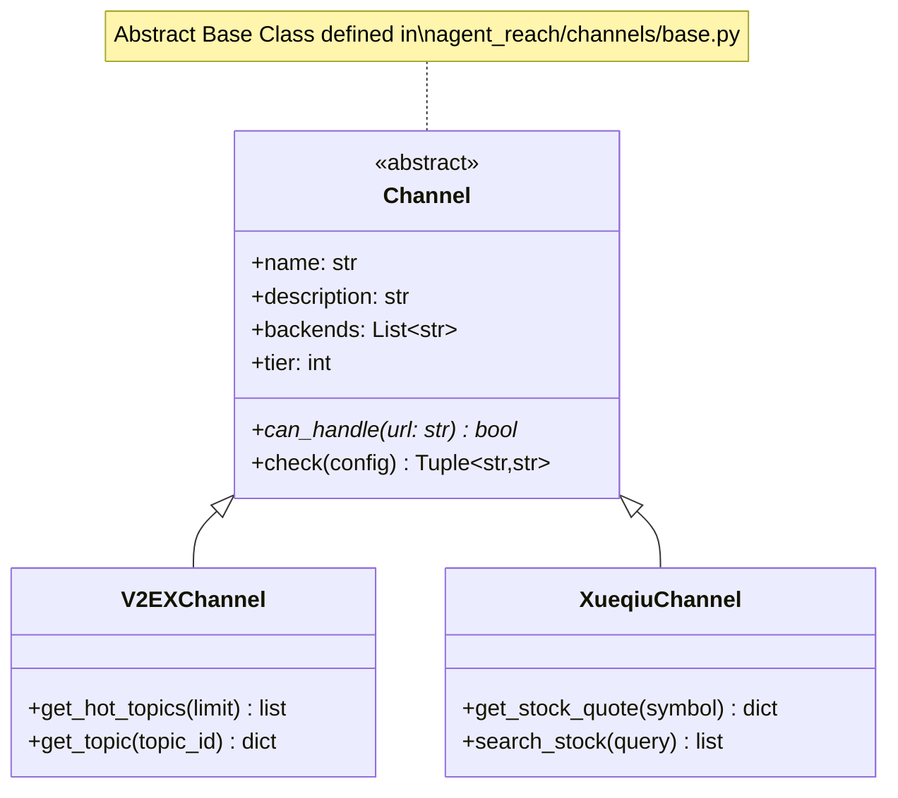
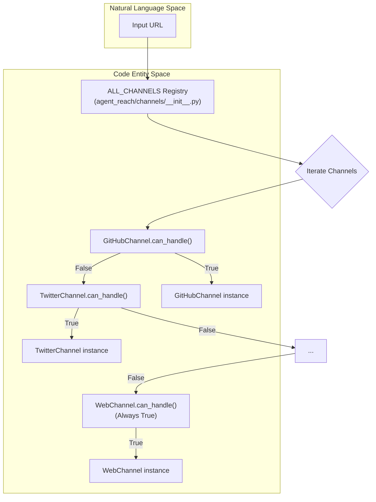

# Channel Architecture

Relevant source files

The following files were used as context for generating this wiki page:

- [agent_reach/channels/__init__.py](agent_reach/channels/__init__.py)
- [agent_reach/channels/base.py](agent_reach/channels/base.py)
- [agent_reach/channels/bilibili.py](agent_reach/channels/bilibili.py)
- [agent_reach/channels/reddit.py](agent_reach/channels/reddit.py)
- [agent_reach/channels/rss.py](agent_reach/channels/rss.py)
- [agent_reach/channels/v2ex.py](agent_reach/channels/v2ex.py)
- [agent_reach/channels/web.py](agent_reach/channels/web.py)
- [agent_reach/channels/weibo.py](agent_reach/channels/weibo.py)
- [agent_reach/channels/xueqiu.py](agent_reach/channels/xueqiu.py)
- [tests/test_channel_contracts.py](tests/test_channel_contracts.py)
- [tests/test_channels.py](tests/test_channels.py)

This page documents the internal architecture of the channels subsystem: the `Channel` abstract base class, the `ReadResult` and `SearchResult` data structures, and the registries (`ALL_CHANNELS` and `SEARCH_CHANNELS`) that route requests to the correct implementation.

---

## Overview

Every platform integration in Agent Reach is a `Channel` — a class that implements a common interface and wraps a specific external backend tool or API. The channel system has three responsibilities:

1.  **URL routing** — determine which channel handles a given URL via `can_handle()`.
2.  **Health reporting** — report whether the channel's dependencies (tools, APIs, or configs) are satisfied via `check()`.
3.  **Data Fetching** — Provide structured access to platform-specific data (e.g., `get_hot_topics`, `get_stock_quote`).

All channels live under `agent_reach/channels/`. The abstract contract is defined in `agent_reach/channels/base.py`, and the registry that connects everything is in `agent_reach/channels/__init__.py`.

Sources: [agent_reach/channels/base.py:1-11](), [agent_reach/channels/__init__.py:1-7]()

---

## The `Channel` Abstract Base Class

**File:** [agent_reach/channels/base.py:18-37]()

Every channel subclasses `Channel` and must implement the `can_handle` abstract method.

### Class-Level Attributes

| Attribute | Type | Purpose |
| :--- | :--- | :--- |
| `name` | `str` | Unique identifier (e.g. `"youtube"`, `"v2ex"`) [agent_reach/channels/base.py:21]() |
| `description` | `str` | Human-readable summary of the platform [agent_reach/channels/base.py:22]() |
| `backends` | `List[str]` | Names of external tools used (e.g. `["yt-dlp"]`) [agent_reach/channels/base.py:23]() |
| `tier` | `int` | Setup complexity: `0`=zero-config, `1`=needs key, `2`=needs setup [agent_reach/channels/base.py:24]() |

### Core Methods

**`can_handle(url: str) -> bool`**  
Returns `True` if this channel is responsible for the given URL. Typically inspects the URL's domain via `urlparse`. [agent_reach/channels/base.py:27-29]()

**`check(config=None) -> Tuple[str, str]`**  
Returns a `(status, message)` tuple. `status` is one of `"ok"`, `"warn"`, `"off"`, or `"error"`. The base implementation returns `"ok"` and lists the backends. Subclasses override this to perform active connectivity tests or tool presence checks using `shutil.which`. [agent_reach/channels/base.py:31-36]()

---

**Diagram: Channel Class Interface and Data Flow**

Sources: [agent_reach/channels/base.py:18-37](), [agent_reach/channels/v2ex.py:20-24](), [agent_reach/channels/xueqiu.py:51-55]()

---

## Data Structures

While the base `Channel` class provides the interface for routing and health, specific channels implement methods that return structured data for AI consumption.

### Standardized Results
Channels often return lists of dictionaries or specific objects. For example:
*   **V2EX**: Returns topic dictionaries with `title`, `url`, `replies`, and `content` (truncated to 200 chars for context efficiency). [agent_reach/channels/v2ex.py:52-75]()
*   **Xueqiu**: Returns stock quotes with `symbol`, `current`, `percent`, and `market_capital`. [agent_reach/channels/xueqiu.py:85-114]()

---

## Channel Registry

### `ALL_CHANNELS` — URL Routing Mechanism

`ALL_CHANNELS` is an ordered list of instantiated `Channel` objects defined in [agent_reach/channels/__init__.py:29-46](). Order is critical because the system iterates the list and returns the **first match**. `WebChannel` is always last, acting as a catch-all fallback.

**Registry Order:**
1.  `GitHubChannel`
2.  `TwitterChannel`
3.  `YouTubeChannel`
4.  `RedditChannel`
5.  `BilibiliChannel`
6.  `XiaoHongShuChannel`
7.  ... (other specific platforms) ...
8.  `RSSChannel`
9.  `ExaSearchChannel`
10. `WebChannel` (Fallback)

### Registry Functions

| Function | Signature | Purpose |
| :--- | :--- | :--- |
| `get_channel` | `(name: str) -> Optional[Channel]` | Lookup by `channel.name` [agent_reach/channels/__init__.py:49-54]() |
| `get_all_channels` | `() -> List[Channel]` | Returns the full `ALL_CHANNELS` list [agent_reach/channels/__init__.py:57-59]() |

---

**Diagram: URL Routing to Code Entities**

Sources: [agent_reach/channels/__init__.py:29-54](), [agent_reach/channels/web.py:13-14]()

---

## Tier Classification

The `tier` attribute on each `Channel` class signals the setup requirements.

| Tier | Meaning | Examples |
| :--- | :--- | :--- |
| **0** | **Zero-Config**: Works out of the box or uses public APIs. | `V2EXChannel` [v2ex.py:24](), `XueqiuChannel` [xueqiu.py:55](), `WebChannel` [web.py:11]() |
| **1** | **Needs Setup/Key**: Requires a binary (e.g., `yt-dlp`) or a free API key. | `YouTubeChannel` [test_channel_contracts.py:34](), `RedditChannel` [reddit.py:27](), `BilibiliChannel` [bilibili.py:44]() |
| **2** | **Complex Setup**: Requires MCP servers, cookies, or browser automation. | `XiaoHongShuChannel` (Needs MCP) |

Sources: [agent_reach/channels/base.py:24](), [agent_reach/channels/v2ex.py:24](), [agent_reach/channels/reddit.py:27]()

---

## Implementation Details: Health Checks

The `check()` method is used by the `agent-reach doctor` command to verify environment readiness.

*   **Tool Detection**: Uses `shutil.which` to find binaries like `yt-dlp` or `mcporter`. [agent_reach/channels/bilibili.py:52](), [agent_reach/channels/weibo.py:21]()
*   **Connectivity Probing**: Channels like `V2EXChannel` and `XueqiuChannel` attempt a small JSON fetch to verify API access. [agent_reach/channels/v2ex.py:39-46](), [agent_reach/channels/xueqiu.py:71-79]()
*   **Proxy Awareness**: Channels like `RedditChannel` and `BilibiliChannel` check if a proxy is configured in `Config` or environment variables to bypass regional blocks. [agent_reach/channels/reddit.py:34-45](), [agent_reach/channels/bilibili.py:55-69]()

Sources: [agent_reach/channels/base.py:31-36](), [agent_reach/channels/v2ex.py:39-46](), [agent_reach/channels/bilibili.py:51-80]()
