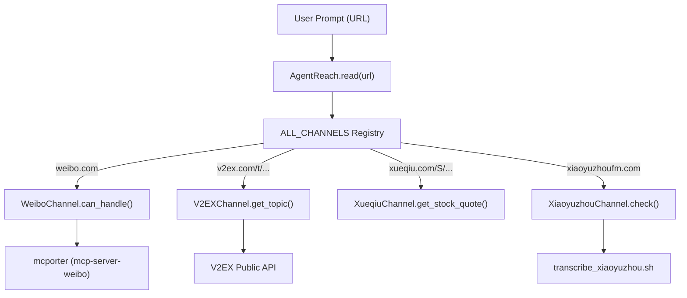
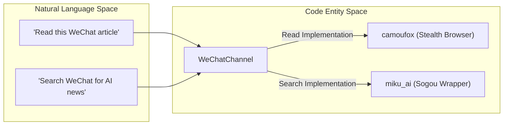

# Chinese Platform Channels

Relevant source files

The following files were used as context for generating this wiki page:

- [agent_reach/channels/__init__.py](agent_reach/channels/__init__.py)
- [agent_reach/channels/v2ex.py](agent_reach/channels/v2ex.py)
- [agent_reach/channels/wechat.py](agent_reach/channels/wechat.py)
- [agent_reach/channels/weibo.py](agent_reach/channels/weibo.py)
- [agent_reach/channels/xiaoyuzhou.py](agent_reach/channels/xiaoyuzhou.py)
- [agent_reach/channels/xueqiu.py](agent_reach/channels/xueqiu.py)
- [agent_reach/scripts/transcribe_xiaoyuzhou.sh](agent_reach/scripts/transcribe_xiaoyuzhou.sh)
- [tests/test_channel_contracts.py](tests/test_channel_contracts.py)
- [tests/test_channels.py](tests/test_channels.py)

This page documents the specialized Chinese platform channels supported by Agent Reach. These channels provide deep integration with major Chinese social media, content, and financial platforms, often utilizing the Model Context Protocol (MCP) via `mcporter` or specialized scraping and transcription pipelines to bypass anti-crawling measures and deliver structured data to AI agents.

### Channel Overview and Tiers

The Chinese platform channels are categorized into tiers based on their configuration requirements:
*   **Tier 0 (Zero-Config):** Uses public APIs; works out-of-the-box (e.g., V2EX, Xueqiu).
*   **Tier 1 (Needs Setup):** Requires external CLI tools or API keys (e.g., Weibo, Douyin, Xiaoyuzhou).
*   **Tier 2 (Advanced):** Requires specialized browser environments or multiple dependencies (e.g., WeChat).

---

### WeiboChannel

`WeiboChannel` provides access to trending content and user timelines on Sina Weibo. It relies on the `mcp-server-weibo` backend, which is bridged into Agent Reach via `mcporter`.

*   **Implementation:** Dispatches requests to the `mcp-server-weibo` MCP server [agent_reach/channels/weibo.py:12-13]().
*   **Capabilities:** Supports fetching hot searches (`hot_search`), searching users, and retrieving user status updates/comments [agent_reach/channels/weibo.py:48-49]().
*   **Data Flow:**
    1.  `can_handle` checks for `weibo.com` or `weibo.cn` domains [agent_reach/channels/weibo.py:15-18]().
    2.  `check()` verifies if `mcporter` is installed and the `weibo` config is registered [agent_reach/channels/weibo.py:21-40]().
    3.  Commands are executed via `mcporter list weibo` to ensure tool availability [agent_reach/channels/weibo.py:44-49]().

**Sources:** [agent_reach/channels/weibo.py:1-53]()

---

### DouyinChannel

`DouyinChannel` handles video metadata extraction for ByteDance's Douyin platform.

*   **Implementation:** Utilizes `douyin-mcp-server` via the `mcporter` bridge [agent_reach/channels/__init__.py:19]().
*   **Key Function:** `parse_douyin_video_info` is the primary tool used to resolve video URLs into structured metadata [tests/test_channel_contracts.py:91]().
*   **Validation:** The `check()` method uses `mcporter list douyin` to verify the presence of the parsing tool without triggering rate limits by hitting the live site during diagnostics [tests/test_channel_contracts.py:71-106]().

**Sources:** [agent_reach/channels/__init__.py:19-36](), [tests/test_channel_contracts.py:71-106]()

---

### WeChatChannel

`WeChatChannel` provides a dual-capability system for reading and searching WeChat Official Account (公众号) articles.

*   **Implementation:**
    *   **Reading:** Uses `wechat-article-for-ai` which utilizes the **Camoufox** stealth browser to bypass WeChat's strict anti-bot detection [agent_reach/channels/wechat.py:16]().
    *   **Searching:** Integrates `miku_ai` for Sogou-based WeChat article searches [agent_reach/channels/wechat.py:16]().
*   **Routing:** Matches `mp.weixin.qq.com` and `weixin.qq.com` [agent_reach/channels/wechat.py:19-22]().
*   **Dependency Management:** The `check()` method identifies which capability (read/search) is active based on the presence of `camoufox` and `miku_ai` Python packages [agent_reach/channels/wechat.py:28-48]().

**Sources:** [agent_reach/channels/wechat.py:1-58]()

---

### XiaoyuzhouChannel

`XiaoyuzhouChannel` implements a sophisticated transcription pipeline for the Xiaoyuzhou (小宇宙) podcast platform.

*   **Backend Pipeline:** Uses `ffmpeg` for audio processing and the **Groq Whisper** API for high-speed transcription [agent_reach/channels/xiaoyuzhou.py:13]().
*   **Logic Flow (`transcribe_xiaoyuzhou.sh`):**
    1.  **Parse:** Extracts the direct audio URL (m4a/mp3) from the show page using `grep` [agent_reach/scripts/transcribe_xiaoyuzhou.sh:35-44]().
    2.  **Transcode:** Uses `ffmpeg` to convert audio to a low-bitrate (64k) mono MP3 to minimize file size [agent_reach/scripts/transcribe_xiaoyuzhou.sh:62-66]().
    3.  **Chunk:** Splits files into 20MB segments to respect Groq's 25MB limit [agent_reach/scripts/transcribe_xiaoyuzhou.sh:69-88]().
    4.  **Transcribe:** Sends chunks to `whisper-large-v3` on Groq with automatic retry logic for HTTP 429 rate limits [agent_reach/scripts/transcribe_xiaoyuzhou.sh:93-141]().
    5.  **Merge:** Combines transcriptions into a Markdown document [agent_reach/scripts/transcribe_xiaoyuzhou.sh:144-160]().

**Sources:** [agent_reach/channels/xiaoyuzhou.py:1-55](), [agent_reach/scripts/transcribe_xiaoyuzhou.sh:1-168]()

---

### V2EXChannel

A Tier 0 channel that interacts with the V2EX developer community using public APIs.

*   **Key Functions:**
    *   `get_hot_topics()`: Fetches the top 20 trending posts [agent_reach/channels/v2ex.py:52-75]().
    *   `get_node_topics(node_name)`: Browses specific nodes (e.g., `python`, `jobs`) [agent_reach/channels/v2ex.py:77-108]().
    *   `get_topic(topic_id)`: Retrieves full post content and the first page of replies [agent_reach/channels/v2ex.py:110-161]().
*   **Implementation:** Uses standard `urllib.request` with a custom User-Agent to fetch JSON data [agent_reach/channels/v2ex.py:9-17]().

**Sources:** [agent_reach/channels/v2ex.py:1-204](), [tests/test_channels.py:33-198]()

---

### XueqiuChannel

`XueqiuChannel` provides financial data and community posts from the Xueqiu (雪球) platform.

*   **Session Management:** Implements `_ensure_cookies()` to visit the homepage and populate a `CookieJar` before making API calls, ensuring the platform accepts the request [agent_reach/channels/xueqiu.py:18-33]().
*   **Capabilities:**
    *   `get_stock_quote(symbol)`: Real-time price, change, and volume for SH/SZ/HK/US stocks [agent_reach/channels/xueqiu.py:85-114]().
    *   `get_hot_posts()`: Retrieves trending community discussions with HTML stripping [agent_reach/channels/xueqiu.py:141-169]().
    *   `get_hot_stocks()`: Returns popularity rankings (人气榜) [agent_reach/channels/xueqiu.py:171-196]().

**Sources:** [agent_reach/channels/xueqiu.py:1-197]()

---

### System Architecture: Natural Language to Code Entities

The following diagrams illustrate how user intent for Chinese platforms is dispatched to specific code entities.

**Diagram 1: URL Dispatch for Chinese Content**
This diagram shows how the `ALL_CHANNELS` registry routes specific URLs to the appropriate Channel class.

**Sources:** [agent_reach/channels/__init__.py:29-46](), [agent_reach/channels/v2ex.py:30-33](), [agent_reach/channels/xueqiu.py:61-65]()

**Diagram 2: WeChat Read/Search Pipeline**
This diagram maps the natural language requirements for WeChat to the specific backends used in the `WeChatChannel`.

**Sources:** [agent_reach/channels/wechat.py:13-17](), [agent_reach/channels/wechat.py:40-48]()

### Comparison Table: Chinese Platform Features

| Channel | Backend | Tier | Key Feature | Config Key |
| :--- | :--- | :--- | :--- | :--- |
| **Weibo** | `mcp-server-weibo` | 1 | Hot Search / User Timeline | N/A (MCP) |
| **Douyin** | `douyin-mcp-server` | 1 | Video Parsing | N/A (MCP) |
| **WeChat** | `camoufox` / `miku_ai` | 2 | Stealth Article Reading | N/A |
| **Xiaoyuzhou** | `ffmpeg` + `Groq` | 1 | Podcast Transcription | `groq_api_key` |
| **V2EX** | Public API | 0 | Node & Topic Browsing | N/A |
| **Xueqiu** | Public API | 0 | Stock Quotes & Hot Posts | N/A |

**Sources:** [agent_reach/channels/__init__.py:29-46](), [agent_reach/channels/xiaoyuzhou.py:10-14](), [agent_reach/channels/wechat.py:13-17]()
