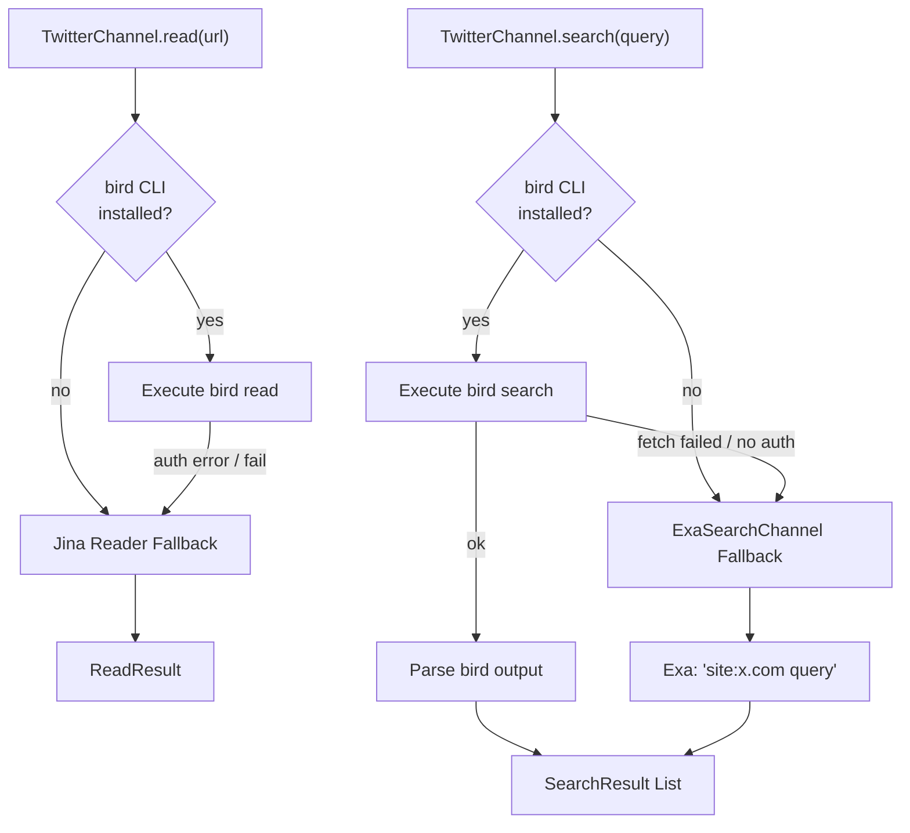
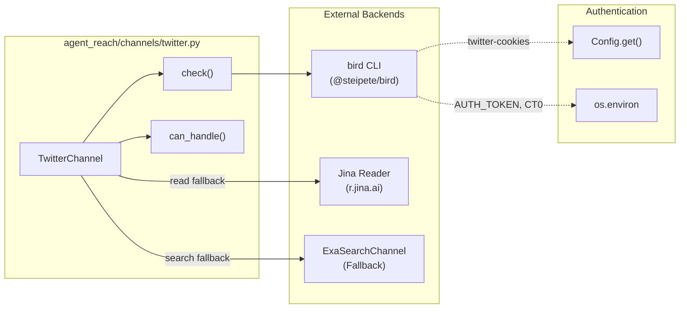

# Twitter Channel

<details>
<summary>Relevant source files</summary>

The following files were used as context for generating this wiki page:

- [agent_reach/channels/twitter.py](agent_reach/channels/twitter.py)
- [agent_reach/config.py](agent_reach/config.py)
- [agent_reach/guides/setup-twitter.md](agent_reach/guides/setup-twitter.md)
- [agent_reach/integrations/mcp_server.py](agent_reach/integrations/mcp_server.py)
- [docs/troubleshooting.md](docs/troubleshooting.md)
- [tests/test_twitter_channel.py](tests/test_twitter_channel.py)

</details>


This page documents `TwitterChannel`, the channel implementation for reading and searching Twitter/X content. It covers the `bird` CLI primary backend, Jina Reader and Exa fallback paths, cookie authentication (AUTH_TOKEN, CT0), and the Node.js fetch proxy injection mechanism.

---

## Overview

`TwitterChannel` is defined in [agent_reach/channels/twitter.py:9-51]() and handles all URLs on `x.com` and `twitter.com` [agent_reach/channels/twitter.py:15-18](). It is classified as **tier 1** [agent_reach/channels/twitter.py:13-13](). While basic reading can fall back to Jina Reader, advanced features like searching and timeline access rely on the `bird` CLI backend.

| Property | Value |
|---|---|
| `name` | `"twitter"` [agent_reach/channels/twitter.py:10-10]() |
| `tier` | `1` [agent_reach/channels/twitter.py:13-13]() |
| `backends` | `bird CLI` [agent_reach/channels/twitter.py:12-12]() |
| URL match | `x.com`, `twitter.com` [agent_reach/channels/twitter.py:18-18]() |

**Feature availability by configuration:**

| State | Read single tweet | Search | Timeline |
|---|---|---|---|
| No bird, no cookies | ⚠️ (Jina fallback) | ⚠️ (Exa fallback) | ❌ |
| bird installed, no cookies | ⚠️ (Auth required) | ⚠️ (Auth required) | ❌ |
| bird + valid cookies | ✅ | ✅ | ✅ |

Sources: [agent_reach/channels/twitter.py:9-51](), [agent_reach/guides/setup-twitter.md:1-12]()

---

## Architecture

The `TwitterChannel` prioritizes the `bird` CLI for all operations. If `bird` is missing or fails, it employs a tiered fallback strategy using Jina Reader for content extraction and `ExaSearchChannel` for search queries.

**Diagram: TwitterChannel — backends and fallback paths**



Sources: [agent_reach/channels/twitter.py:20-35](), [agent_reach/guides/setup-twitter.md:3-9](), [docs/troubleshooting.md:29-36]()

---

**Diagram: Code entities and their roles**



Sources: [agent_reach/channels/twitter.py:9-51](), [agent_reach/config.py:22-28](), [agent_reach/guides/setup-twitter.md:52-59]()

---

## Authentication

`TwitterChannel` requires two specific cookie values for the `bird` CLI to interact with the Twitter API. These are handled via environment variables or the internal configuration system.

| Cookie name | Config key | Environment variable |
|---|---|---|
| `auth_token` | `twitter_auth_token` | `AUTH_TOKEN` |
| `ct0` | `twitter_ct0` | `CT0` |

The `Config` class maps the legacy key `twitter_xreach` to these tokens [agent_reach/config.py:25-25](). Users can configure these using:

```bash
agent-reach configure twitter-cookies "auth_token=xxx; ct0=yyy"
```

This command extracts the required tokens from a cookie string or JSON [agent_reach/channels/twitter.py:43-43](), [agent_reach/guides/setup-twitter.md:42-44]().

Sources: [agent_reach/config.py:25-25](), [agent_reach/channels/twitter.py:38-48](), [agent_reach/guides/setup-twitter.md:35-46]()

---

## Health Check and Diagnostics

The `check()` function validates the environment by looking for `bird` or `birdx` binaries using `shutil.which` [agent_reach/channels/twitter.py:21-21]().

1. **Missing Binary:** If neither `bird` nor `birdx` is found, it returns a `warn` status with installation instructions for `@steipete/bird` [agent_reach/channels/twitter.py:22-26]().
2. **Missing Credentials:** It executes `bird check` [agent_reach/channels/twitter.py:29-32](). If the output contains "Missing credentials", it prompts the user to set `AUTH_TOKEN` and `CT0` [agent_reach/channels/twitter.py:37-44]().
3. **Connection Failures:** General exceptions during the subprocess call result in a "connection failed" warning [agent_reach/channels/twitter.py:49-50]().

The `agent-reach doctor` command aggregates these results to provide a system health overview [agent_reach/integrations/mcp_server.py:47-48]().

Sources: [agent_reach/channels/twitter.py:20-50](), [tests/test_twitter_channel.py:16-71]()

---

## Proxy Support and Node.js fetch()

The `bird` CLI is a Node.js application. A common issue is that Node.js `fetch()` does not automatically respect system environment variables like `HTTP_PROXY` in certain versions.

### The "fetch failed" Issue
When running in environments requiring a proxy (e.g., behind a firewall), `bird` may return a "fetch failed" error even if `HTTP_PROXY` is set in the shell [docs/troubleshooting.md:3-7]().

### Troubleshooting Process
1. **Manual Proxy Export:** Explicitly export `HTTP_PROXY` and `HTTPS_PROXY` before running commands [docs/troubleshooting.md:11-17]().
2. **Global Proxy Tools:** Use tools like `proxychains` or `tun2socks` to wrap the `bird` execution [docs/troubleshooting.md:19-28]().
3. **Exa Fallback:** If proxy issues persist, the system is designed to use Exa search as a zero-config alternative [docs/troubleshooting.md:29-36]().

Sources: [docs/troubleshooting.md:1-44](), [agent_reach/guides/setup-twitter.md:67-82]()

---

## Integration via MCP

The Twitter channel's status is exposed to AI agents through the Model Context Protocol (MCP) server. The `get_status` tool allows agents to verify if the Twitter backend is correctly configured before attempting a search or read operation.

```python
@server.list_tools()
async def list_tools():
    return [
        Tool(name="get_status",
             description="Get Agent Reach status: which channels are installed and active.",
             inputSchema={"type": "object", "properties": {}}),
    ]
```

Sources: [agent_reach/integrations/mcp_server.py:36-43](), [agent_reach/integrations/mcp_server.py:47-48]()
