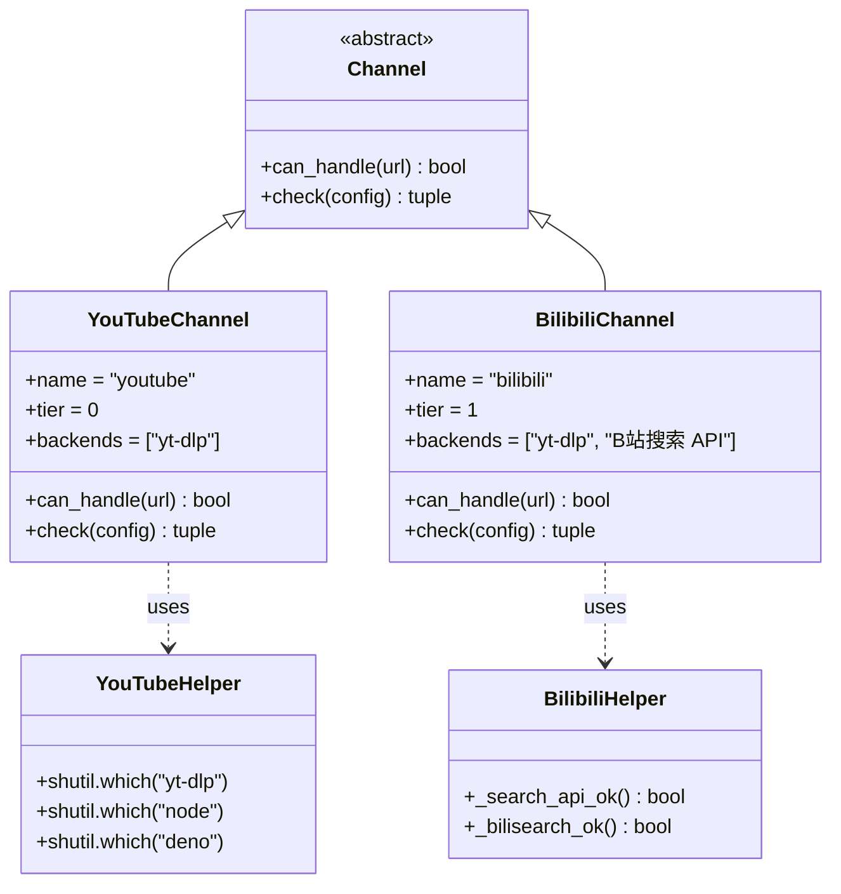
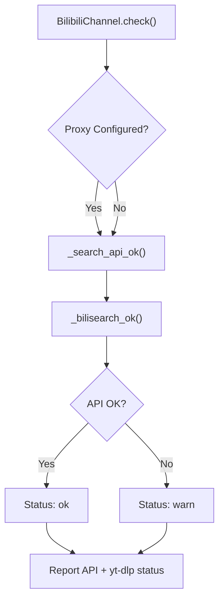

# YouTube and Bilibili Channels

Relevant source files

The following files were used as context for generating this wiki page:

- [agent_reach/channels/base.py](agent_reach/channels/base.py)
- [agent_reach/channels/bilibili.py](agent_reach/channels/bilibili.py)
- [agent_reach/channels/douyin.py](agent_reach/channels/douyin.py)
- [agent_reach/channels/github.py](agent_reach/channels/github.py)
- [agent_reach/channels/reddit.py](agent_reach/channels/reddit.py)
- [agent_reach/channels/rss.py](agent_reach/channels/rss.py)
- [agent_reach/channels/web.py](agent_reach/channels/web.py)
- [agent_reach/channels/youtube.py](agent_reach/channels/youtube.py)

This page documents `YouTubeChannel` and `BilibiliChannel`: the two primary video platform channels in Agent Reach. Both leverage `yt-dlp` as their core backend for video metadata and subtitle extraction. While they share a similar architecture, Bilibili includes specialized logic for handling server-side IP blocking via proxy configuration and a dual-strategy search approach.

---

## Overview

| Property | `YouTubeChannel` | `BilibiliChannel` |
|---|---|---|
| File | [agent_reach/channels/youtube.py:9-45]() | [agent_reach/channels/bilibili.py:40-81]() |
| Class | `YouTubeChannel` | `BilibiliChannel` |
| `name` | `"youtube"` | `"bilibili"` |
| `tier` | `0` (Zero-config) | `1` (Needs Proxy/Check) |
| Backends | `yt-dlp` | `yt-dlp`, Bilibili Search API |
| `can_handle` domains | `youtube.com`, `youtu.be` | `bilibili.com`, `b23.tv` |
| Proxy support | No | Yes (`bilibili_proxy`) |

Both channels are defined as subclasses of the `Channel` base class [agent_reach/channels/base.py:18-37]().

Sources: [agent_reach/channels/youtube.py:9-19](), [agent_reach/channels/bilibili.py:40-50]()

---

## Architecture

The following diagram maps the natural language requirements for video processing to the specific code entities that implement them.

**Diagram: Video Channel Code Entities**

Sources: [agent_reach/channels/youtube.py:9-45](), [agent_reach/channels/bilibili.py:40-81](), [agent_reach/channels/base.py:18-37]()

---

## YouTube Channel

The `YouTubeChannel` focuses on extracting video information and subtitles using `yt-dlp`. A critical requirement for YouTube is the presence of a JavaScript runtime, as `yt-dlp` requires it to solve signature challenges.

### Runtime Requirements
The `check()` method [agent_reach/channels/youtube.py:20-44]() performs a multi-step validation:
1. **Binary Check**: Verifies `yt-dlp` is in the system PATH [agent_reach/channels/youtube.py:21-22]().
2. **JS Runtime Check**: Looks for `node` or `deno` [agent_reach/channels/youtube.py:24-29]().
3. **Configuration Check**: If using Node.js without Deno, it checks `~/.config/yt-dlp/config` for the `--js-runtimes node` flag [agent_reach/channels/youtube.py:32-43]().

Sources: [agent_reach/channels/youtube.py:20-44]()

---

## Bilibili Channel

The `BilibiliChannel` handles video content and search functionality. It is classified as `tier 1` [agent_reach/channels/bilibili.py:44]() because it often requires proxy configuration to bypass Bilibili's anti-crawler measures.

### Search Implementation
Bilibili search uses a tiered detection system to determine the best available method:
- **Bilibili Search API**: Uses the `/x/web-interface/search/all/v2` endpoint [agent_reach/channels/bilibili.py:13]().
- **yt-dlp bilisearch**: Uses the `bilisearch` extractor within `yt-dlp` [agent_reach/channels/bilibili.py:32]().

### Connectivity Detection
The `check()` function [agent_reach/channels/bilibili.py:51-80]() performs deep inspection:
- **_search_api_ok()**: Attempts a direct request to the Bilibili search API using `urllib.request` [agent_reach/channels/bilibili.py:16-24]().
- **_bilisearch_ok()**: Runs `yt-dlp --flat-playlist -j bilisearch1:test` to check for HTTP 412 (Precondition Failed) errors commonly caused by IP blocking [agent_reach/channels/bilibili.py:27-37]().

**Diagram: Bilibili Connectivity Logic**

Sources: [agent_reach/channels/bilibili.py:51-80](), [agent_reach/channels/bilibili.py:16-37]()

---

## IP Blocking and Proxies

Bilibili frequently blocks datacenter IP addresses. To mitigate this, `BilibiliChannel` supports a dedicated proxy setting.

### Proxy Resolution
The channel looks for a proxy in the following order [agent_reach/channels/bilibili.py:55]():
1. `config.get("bilibili_proxy")` (set via `agent-reach configure`)
2. `os.environ.get("BILIBILI_PROXY")`

If a proxy is detected, the `check()` message confirms that video reading will utilize the configured proxy [agent_reach/channels/bilibili.py:65-66]().

### Search Fallback
If `yt-dlp`'s `bilisearch` fails (returning HTTP 412), the channel warns the user that search will default to the Bilibili Search API [agent_reach/channels/bilibili.py:76-77](). In broader search contexts, Agent Reach may also fall back to the `ExaSearchChannel` for `site:bilibili.com` queries.

Sources: [agent_reach/channels/bilibili.py:55-78](), [agent_reach/channels/reddit.py:35-44]()

---

## Subtitle and Info Extraction

Both channels rely on `yt-dlp` for the heavy lifting of extracting video data.

| Feature | Implementation Detail |
|---|---|
| **Video Info** | Extracted via `yt-dlp --dump-json` |
| **Subtitles** | Fetched using `--write-auto-sub` and `--sub-lang` flags |
| **Formats** | Preference for `zh-Hans`, `zh`, and `en` |

`YouTubeChannel` explicitly mentions its capability to extract both video information and subtitles [agent_reach/channels/youtube.py:44](), while `BilibiliChannel` describes its purpose as "B站视频和字幕" [agent_reach/channels/bilibili.py:42]().

Sources: [agent_reach/channels/youtube.py:44](), [agent_reach/channels/bilibili.py:42-43]()
