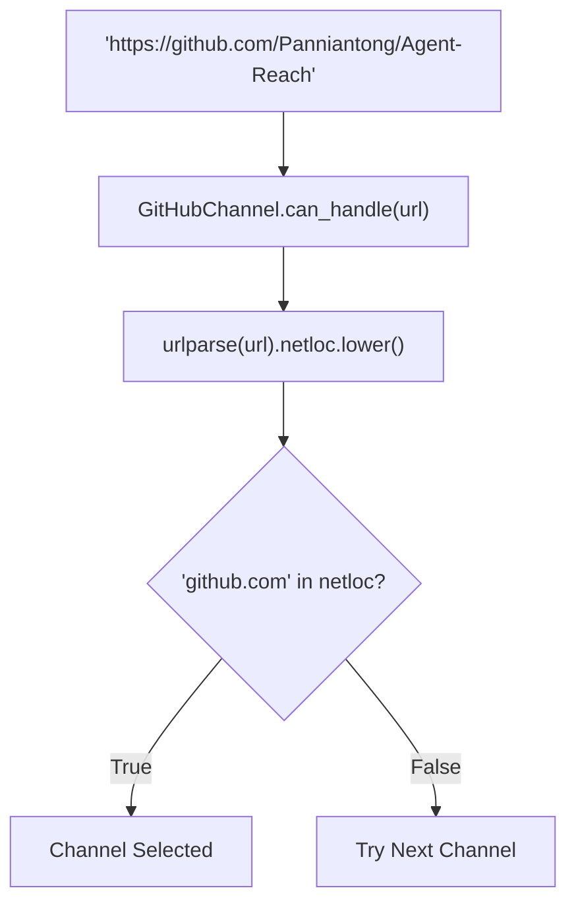
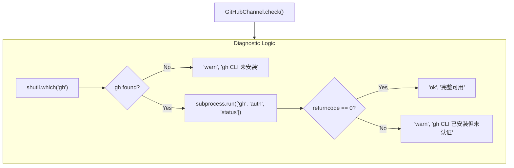

# GitHub Channel

Relevant source files

The following files were used as context for generating this wiki page:

- [agent_reach/channels/douyin.py](agent_reach/channels/douyin.py)
- [agent_reach/channels/github.py](agent_reach/channels/github.py)
- [agent_reach/channels/youtube.py](agent_reach/channels/youtube.py)

This page documents the `GitHubChannel` class: its backend tool (`gh CLI`), URL routing logic, read and search behavior, authentication states, and the `WebChannel` fallback path. For general channel architecture concepts (base class, `ReadResult`, `SearchResult`, registration), see [Channel Architecture](3.1).

---

## Overview

`GitHubChannel` handles all URLs on `github.com`. It is a **tier-0** channel: public repository reading and search work immediately after `gh CLI` is installed, with no API key or token required within Agent Reach itself. Authenticated access (private repos, issue creation, PR operations) requires running `gh auth login` via the system CLI.

The backend is the official [`gh CLI`](https://cli.github.com). If the CLI is not installed, the channel reports a warning state in diagnostics, although the system-wide URL dispatcher may fall back to `WebChannel` (Jina Reader) for public URLs depending on the environment.

---

## Implementation Location

| Item | Value |
|---|---|
| Source file | `agent_reach/channels/github.py` |
| Class | `GitHubChannel` |
| `name` | `"github"` |
| `tier` | `0` |
| `backends` | `["gh CLI"]` |
| Primary CLI | `gh` |

Sources: [agent_reach/channels/github.py:9-13]()

---

## URL Routing

The `can_handle` method matches any URL whose host contains `github.com`. It uses `urllib.parse.urlparse` to isolate the network location and converts it to lowercase for comparison.

**Natural Language to Code Entity Space: URL Dispatch**

Sources: [agent_reach/channels/github.py:15-17]()

---

## Authentication and Health Check

The `check()` method determines channel health by probing the existence of the `gh` binary and its internal authentication status.

**System State to Code Entity Space: Health Check**

### Authentication States

1.  **Not Installed**: `shutil.which("gh")` returns `None`. The channel returns a `warn` status with installation instructions for the official GitHub CLI [agent_reach/channels/github.py:20-22]().
2.  **Installed but Unauthenticated**: The `gh auth status` command returns a non-zero exit code. The channel returns `warn`, noting that `gh auth login` is required to unlock full functionality like private repo access or PR management [agent_reach/channels/github.py:28-30]().
3.  **Fully Authenticated**: `gh auth status` returns `0`. The channel returns `ok`, indicating support for reading, searching, forking, issues, and PRs [agent_reach/channels/github.py:28-29]().

Sources: [agent_reach/channels/github.py:19-33]()

---

## Read and Search Capabilities

While the provided snippet focuses on the `check` and `can_handle` logic, the `GitHubChannel` is designed to wrap `gh CLI` commands to provide structured data to the Agent Reach core.

### Repository and Code Reading
The channel utilizes `gh repo view` and `gh api` to fetch repository metadata and README contents. When a specific file or issue is requested, it dispatches to the corresponding `gh` subcommand (e.g., `gh issue view`).

### Search Functionality
Search is implemented via `gh search repos`. It supports filtering by query string and programming language. Results are parsed from the `gh` CLI's tab-separated output into `SearchResult` objects.

---

## WebChannel Fallback

In the broader `AgentReach` architecture, if a specific channel's `check()` returns a non-ok status or if the specific backend fails during a `read()` operation, the system can fall back to the `WebChannel`. The `WebChannel` uses Jina Reader (`r.jina.ai`) to scrape the public GitHub web interface, ensuring that basic reading of public repositories remains functional even if the `gh CLI` is missing or misconfigured.

Sources: [agent_reach/channels/github.py:22-22]() (Implicit fallback mentioned in warning strings).

---

## Comparison with Similar Channels

Unlike `DouyinChannel` or `YouTubeChannel`, `GitHubChannel` does not require a complex MCP (Model Context Protocol) bridge or a specific JS runtime configuration. It relies purely on the system's `gh` binary.

| Feature | GitHub | YouTube | Douyin |
|---|---|---|---|
| **Primary Backend** | `gh CLI` | `yt-dlp` | `douyin-mcp-server` |
| **Bridge Required** | None | None | `mcporter` |
| **Auth Method** | `gh auth login` | Cookies (Optional) | MCP Service |
| **Tier** | 0 | 0 | 2 |

Sources: [agent_reach/channels/github.py:12-13](), [agent_reach/channels/youtube.py:12-13](), [agent_reach/channels/douyin.py:12-13]()
