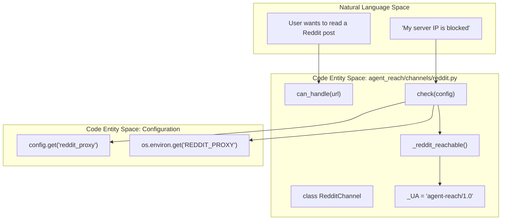
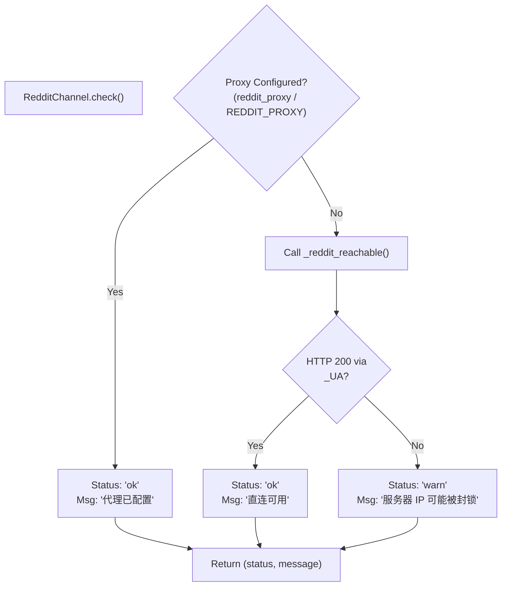

# Reddit Channel

<details>
<summary>Relevant source files</summary>

The following files were used as context for generating this wiki page:

- [agent_reach/channels/base.py](agent_reach/channels/base.py)
- [agent_reach/channels/bilibili.py](agent_reach/channels/bilibili.py)
- [agent_reach/channels/reddit.py](agent_reach/channels/reddit.py)
- [agent_reach/channels/rss.py](agent_reach/channels/rss.py)
- [agent_reach/channels/web.py](agent_reach/channels/web.py)
- [agent_reach/guides/setup-reddit.md](agent_reach/guides/setup-reddit.md)

</details>


This page documents `RedditChannel`: how it routes Reddit URLs, how it fetches content using the Reddit public JSON API, its proxy requirement for server environments, and how it handles connectivity checks. For general channel architecture, see [Channel Architecture](#3.1). For proxy configuration details, see [Proxy Configuration](#4.2).

---

## Overview

`RedditChannel` is a **Tier 1** channel that provides access to Reddit posts and comments. It utilizes Reddit's public JSON API — which is accessed by appending `.json` to standard Reddit URLs — requiring no official API keys or OAuth credentials for basic read access.

| Property | Value |
|---|---|
| Class | `RedditChannel` |
| File | `agent_reach/channels/reddit.py` |
| Tier | 1 (needs free key/setup — proxy often required) |
| Backends | `JSON API`, `Exa` |
| URL patterns | `reddit.com`, `redd.it` |

While the channel does not require an API key, Reddit aggressively blocks datacenter and server IP ranges with `403 Forbidden` errors. Consequently, a residential or ISP proxy is often necessary for reliable operation in cloud environments.

Sources: [agent_reach/channels/reddit.py:24-27](), [agent_reach/guides/setup-reddit.md:3-6]()

---

## URL Handling

### URL Matching

The `can_handle()` method identifies Reddit URLs by checking if the netloc contains `reddit.com` or `redd.it`.

[agent_reach/channels/reddit.py:29-33]()

### JSON API Usage

The channel interacts with the public API by appending `.json` to the target URL. For example, to check connectivity, it requests:
`https://www.reddit.com/r/linux.json?limit=1`

Requests must include a valid `User-Agent` (defined as `agent-reach/1.0`) to avoid immediate rejection by Reddit's edge security.

Sources: [agent_reach/channels/reddit.py:8-15]()

---

## Architecture and Data Flow

The following diagram illustrates how `RedditChannel` bridges the Natural Language Space (User requests) to the Code Entity Space (API and Config entities).

**Diagram: Reddit Channel Logic Flow**



Sources: [agent_reach/channels/reddit.py:8-45]()

---

## Proxy Configuration

Reddit's anti-bot measures frequently return `403` or `429` errors to non-residential IPs. The channel supports a specific `reddit_proxy` configuration to bypass these blocks.

### Configuration Resolution
The `check()` method resolves the proxy in the following order:
1.  The `reddit_proxy` key in the `agent-reach` configuration file.
2.  The `REDDIT_PROXY` environment variable.

[agent_reach/channels/reddit.py:35]()

### Setup via CLI
Users can configure the proxy using the following command:
```bash
agent-reach configure proxy http://user:pass@ip:port
```

Sources: [agent_reach/channels/reddit.py:35-44](), [agent_reach/guides/setup-reddit.md:28-30]()

---

## Connectivity and Health Checks

The `check()` method performs a real-time probe to determine if the Reddit JSON API is accessible from the current environment.

**Diagram: Health Check Decision Tree**



### Connectivity Logic
The `_reddit_reachable()` function attempts a `urllib.request` to a sample subreddit JSON endpoint with a 10-second timeout. It specifically validates that the response status is `200`.

Sources: [agent_reach/channels/reddit.py:12-20](), [agent_reach/channels/reddit.py:34-45]()

---

## Search and Content Extraction

While `RedditChannel` handles the identification and connectivity for the platform, the actual search functionality is delegated to the **Exa** backend.

-   **Reading:** When a specific URL is provided, the channel uses the JSON API (with the configured proxy) to extract the post body and recursive comment threads.
-   **Searching:** `agent-reach search-reddit` routes queries through Exa to find relevant Reddit content without requiring a direct connection to Reddit's search index, which is often more restrictive.

Sources: [agent_reach/channels/reddit.py:26](), [agent_reach/channels/reddit.py:37-40](), [agent_reach/guides/setup-reddit.md:6]()

---

## Implementation Details

### Recursive Comment Extraction
The underlying implementation (referenced in `backends = ["JSON API"]`) handles the recursive nature of Reddit comments. It traverses the JSON tree to flatten the nested structure into a readable format for AI agents, typically including:
- Post title and self-text.
- Author and upvote scores.
- Comment hierarchy (indented for clarity).

### Error Handling
The channel is designed to distinguish between network failures and IP blocks. If `_reddit_reachable()` fails, the `doctor` command (via `check()`) provides the specific CLI command needed to fix the issue.

Sources: [agent_reach/channels/reddit.py:12-20](), [agent_reach/channels/reddit.py:41-44]()
