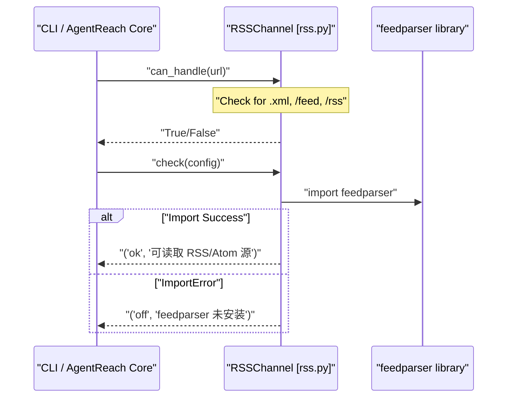

# Web and RSS Channels

<details>
<summary>Relevant source files</summary>

The following files were used as context for generating this wiki page:

- [agent_reach/channels/base.py](agent_reach/channels/base.py)
- [agent_reach/channels/bilibili.py](agent_reach/channels/bilibili.py)
- [agent_reach/channels/reddit.py](agent_reach/channels/reddit.py)
- [agent_reach/channels/rss.py](agent_reach/channels/rss.py)
- [agent_reach/channels/web.py](agent_reach/channels/web.py)

</details>


This page documents two zero-configuration channels: `WebChannel` ([agent_reach/channels/web.py:7]()) and `RSSChannel` ([agent_reach/channels/rss.py:7]()). Both are classified as **Tier 0** (zero-config) and work immediately after installation without API keys or environment setup.

`WebChannel` is the system's catch-all fallback — it handles any URL that no other channel claims. `RSSChannel` handles RSS and Atom feed URLs specifically using pattern detection.

---

## WebChannel

`WebChannel` uses the [Jina Reader](https://r.jina.ai) HTTP service as its backend. It acts as a proxy that transforms complex HTML into clean, LLM-friendly Markdown.

### Role as Catch-All Fallback
In the `ALL_CHANNELS` registry, `WebChannel` is positioned as the final entry. Its `can_handle` method [agent_reach/channels/web.py:13-14]() returns `True` for any input, ensuring that if no specialized channel (like `TwitterChannel` or `GitHubChannel`) matches the URL, the system still attempts to read it via Jina Reader.

### Implementation and Diagnostics
- **Backend**: `Jina Reader` [agent_reach/channels/web.py:10]().
- **Mechanism**: Prepend `https://r.jina.ai/` to the target URL and perform an HTTP GET request.
- **Status Check**: The `check()` method [agent_reach/channels/web.py:16-17]() always returns `ok` because it relies on a public web service rather than local binaries or credentials.

### Usage as a Fallback in Other Channels
Several specialized channels utilize `WebChannel` logic when their primary high-fidelity backends (like CLI tools) are unavailable:
- **GitHubChannel**: Falls back to `WebChannel` if the `gh` CLI is not authenticated.
- **BilibiliChannel**: While it primarily uses `yt-dlp`, it acknowledges `WebChannel` as a general web capability [agent_reach/channels/bilibili.py:43]().
- **RedditChannel**: Uses `WebChannel` (Jina) as a secondary method if the JSON API is blocked and no proxy is configured [agent_reach/channels/reddit.py:26]().

**Diagram 1: WebChannel Dispatch and Fallback Routing**

```mermaid
graph TD
    "URL_Input" --> "Router[get_channel_for_url]"
    "Router[get_channel_for_url]" -->|"Match Found"| "Specialized_Channel[e.g. TwitterChannel]"
    "Router[get_channel_for_url]" -->|"No Match"| "WebChannel[agent_reach/channels/web.py]"
    
    "Specialized_Channel[e.g. TwitterChannel]" -->|"Success"| "ReadResult"
    "Specialized_Channel[e.g. TwitterChannel]" -->|"Auth/Binary Fail"| "WebChannel[agent_reach/channels/web.py]"
    
    "WebChannel[agent_reach/channels/web.py]" --> "Jina_Reader_API[https://r.jina.ai/URL]"
    "Jina_Reader_API[https://r.jina.ai/URL]" --> "ReadResult"
```
Sources: [agent_reach/channels/web.py:7-17](), [agent_reach/channels/base.py:18-37]()

---

## RSSChannel

`RSSChannel` provides structured access to syndicated content. It wraps the `feedparser` library to process XML-based feeds into a standardized format.

### URL Detection logic
The `can_handle` method [agent_reach/channels/rss.py:13-14]() performs string-based pattern matching on the URL to identify potential feeds before attempting to parse them. It looks for:
- Path segments: `/feed`, `/rss`, `atom`
- File extensions: `.xml`

### Backend Requirements
The channel depends on the `feedparser` Python package. The `check()` method [agent_reach/channels/rss.py:16-21]() verifies the presence of this dependency:
- **Status `ok`**: `feedparser` is successfully imported.
- **Status `off`**: `feedparser` is missing, prompting the user to run `pip install feedparser`.

### Data Flow
When `read(url)` is called, the channel fetches the XML, parses the entries, and constructs a `ReadResult`. If the feed contains multiple items, it typically generates a Markdown list of titles and summaries to provide the AI agent with a concise overview of the latest updates.

**Diagram 2: RSSChannel Code Entity Interaction**


Sources: [agent_reach/channels/rss.py:1-22]()

---

## Comparison of Generic Channels

| Feature | WebChannel | RSSChannel |
| :--- | :--- | :--- |
| **Class** | `WebChannel` [agent_reach/channels/web.py:7]() | `RSSChannel` [agent_reach/channels/rss.py:7]() |
| **Tier** | 0 (Zero Config) | 0 (Zero Config) |
| **Primary Backend** | Jina Reader (HTTP) | `feedparser` (Python Lib) |
| **Trigger Pattern** | `True` (Catch-all) | `.xml`, `/feed`, `/rss`, `atom` |
| **Standard Output** | Full Page Markdown | Feed Entry List / Summary |
| **Proxy Support** | Global System Proxy | Global System Proxy |

Sources: [agent_reach/channels/web.py:1-18](), [agent_reach/channels/rss.py:1-22](), [agent_reach/channels/base.py:21-24]()
