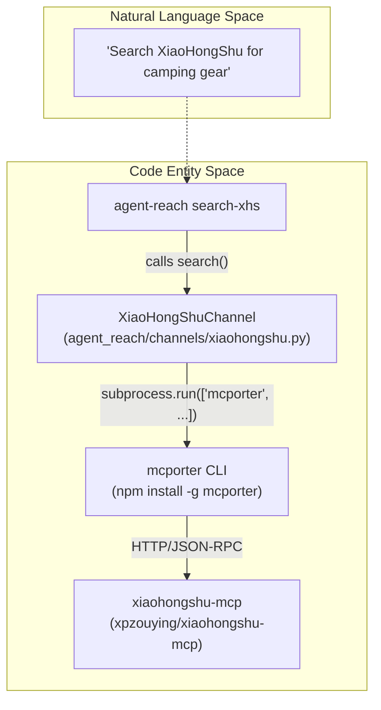
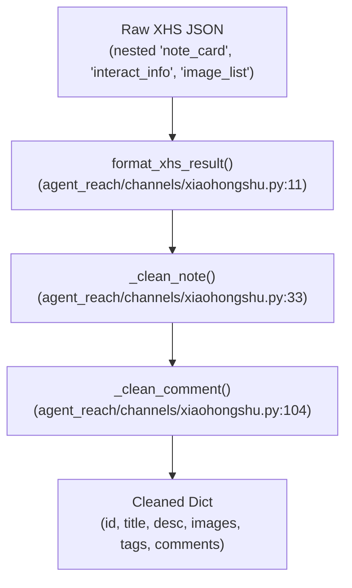
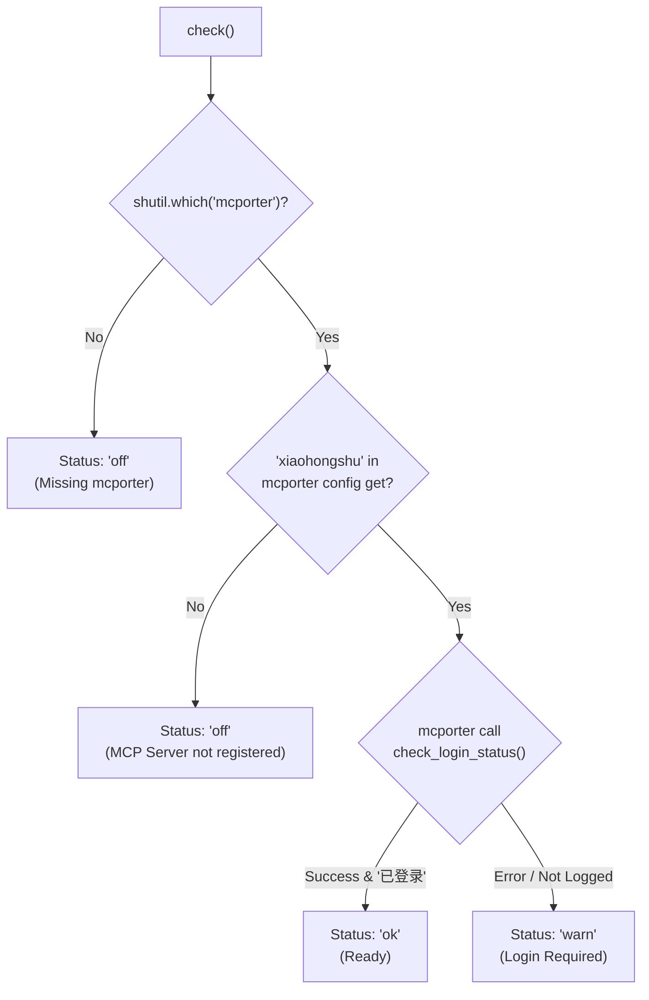

# XiaoHongShu Channel

Relevant source files

The following files were used as context for generating this wiki page:

- [agent_reach/channels/xiaohongshu.py](agent_reach/channels/xiaohongshu.py)
- [agent_reach/guides/setup-exa.md](agent_reach/guides/setup-exa.md)
- [agent_reach/guides/setup-wechat.md](agent_reach/guides/setup-wechat.md)
- [agent_reach/guides/setup-xiaohongshu.md](agent_reach/guides/setup-xiaohongshu.md)
- [tests/test_skill_command.py](tests/test_skill_command.py)
- [tests/test_xhs_format.py](tests/test_xhs_format.py)

This page documents `XiaoHongShuChannel`: its backend stack, authentication model, data cleaning logic, Docker-based setup, and health-check diagnostics. For the general channel interface that all channels implement, see [Channel Architecture](). For mcporter configuration, see [mcporter Setup]().

---

## Overview

`XiaoHongShuChannel` bridges Agent Reach to the XiaoHongShu (小红书) platform via a locally-running MCP server. It is a **tier-2 channel** — it requires explicit setup (Docker + mcporter) before it becomes functional.

| Property | Value |
|---|---|
| Class | `XiaoHongShuChannel` [agent_reach/channels/xiaohongshu.py:163]() |
| `name` | `"xiaohongshu"` [agent_reach/channels/xiaohongshu.py:164]() |
| `description` | `"小红书笔记"` [agent_reach/channels/xiaohongshu.py:165]() |
| `backends` | `["xiaohongshu-mcp"]` [agent_reach/channels/xiaohongshu.py:166]() |
| `tier` | `2` [agent_reach/channels/xiaohongshu.py:167]() |
| Supported Domains | `xiaohongshu.com`, `xhslink.com` [agent_reach/channels/xiaohongshu.py:172]() |

Sources: [agent_reach/channels/xiaohongshu.py:163-172]()

---

## Backend Architecture

The channel relies on `mcporter` (a Model Context Protocol bridge) to communicate with `xiaohongshu-mcp`, a Go-based service running in Docker that encapsulates a headless browser for platform interaction.

**System Entity Mapping:**

Sources: [agent_reach/channels/xiaohongshu.py:174-210](), [agent_reach/guides/setup-xiaohongshu.md:4-15]()

---

## Data Flow and Formatting

A critical component of this channel is `format_xhs_result`, which aggressively prunes the verbose JSON returned by the XHS internal API to minimize token consumption for AI agents.

**Data Transformation Flow:**

### Key Formatting Rules
- **Fields Kept**: `id`, `note_id`, `xsec_token`, `title`, `desc`, `type`, `time`. [agent_reach/channels/xiaohongshu.py:44-46]()
- **Image Handling**: Extracts only raw URLs from `image_list` or `images_list`, discarding metadata like `width`, `height`, or `trace_id`. [agent_reach/channels/xiaohongshu.py:70-82]()
- **Engagement**: Flattens `interact_info` (likes, collections, comments, shares) into the top-level dictionary. [agent_reach/channels/xiaohongshu.py:59-64]()
- **Redundancy Removal**: Strips `at_user_list`, `geo_info`, `audit_info`, and nested author metadata except for `nickname` and `user_id`. [tests/test_xhs_format.py:73-83]()

Sources: [agent_reach/channels/xiaohongshu.py:11-117](), [tests/test_xhs_format.py:9-130]()

---

## Health Check and Diagnostics

The `check()` method validates the environment across three levels: presence of the bridge tool, registration of the specific MCP server, and the actual login status of the XHS account.

**Diagnostic Logic:**

Sources: [agent_reach/channels/xiaohongshu.py:174-214]()

### Login Status Parsing
The helper `_mcporter_status_ok` handles platform-specific quirks when parsing `mcporter` output, such as stripping UTF-8 BOM characters sometimes prepended by Windows PowerShell. [agent_reach/channels/xiaohongshu.py:126-146]()

---

## Setup and Requirements

### Docker Configuration
The `xiaohongshu-mcp` image is primarily built for `amd64`. For ARM64 (Apple Silicon), the channel provides a hint to use the `--platform linux/amd64` flag via `_docker_run_hint()`. [agent_reach/channels/xiaohongshu.py:148-161]()

### Persistent Storage
To avoid re-scanning the QR code every time the container restarts, users should mount a volume to `/app/data` to persist session cookies. [agent_reach/guides/setup-xiaohongshu.md:57-65]()

### xsec_token Requirement
For direct note fetching (`read()`), the platform requires an `xsec_token`. If the URL does not provide it, the channel attempts to resolve it by listing recent feeds via the MCP server to find a matching `note_id`.

Sources: [agent_reach/guides/setup-xiaohongshu.md:1-92](), [agent_reach/channels/xiaohongshu.py:148-161]()
