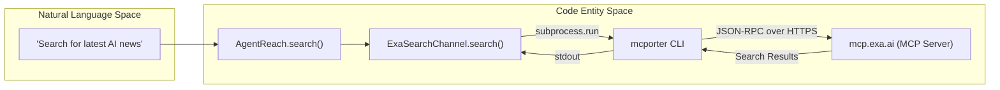
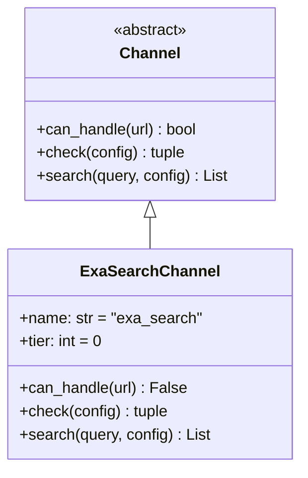

# Exa Search Channel

<details>
<summary>Relevant source files</summary>

The following files were used as context for generating this wiki page:

- [agent_reach/channels/exa_search.py](agent_reach/channels/exa_search.py)
- [agent_reach/doctor.py](agent_reach/doctor.py)
- [agent_reach/guides/setup-exa.md](agent_reach/guides/setup-exa.md)
- [agent_reach/guides/setup-wechat.md](agent_reach/guides/setup-wechat.md)
- [agent_reach/guides/setup-xiaohongshu.md](agent_reach/guides/setup-xiaohongshu.md)

</details>


This page documents `ExaSearchChannel`, the semantic web search channel implemented in `agent_reach/channels/exa_search.py`. It covers the channel's role as both a first-class search channel and a cross-channel search fallback, its `mcporter` + Exa MCP backend, and its zero-configuration setup.

For the abstract channel interface that `ExaSearchChannel` conforms to, see **3.1 Channel Architecture**. For `mcporter` configuration details, see **4.3 mcporter Setup**.

---

## Overview

`ExaSearchChannel` provides semantic web search by bridging to the Exa MCP server (`mcp.exa.ai`) via the `mcporter` CLI. It is a **search-only** channel: `can_handle()` always returns `False` [agent_reach/channels/exa_search.py:15-16](), ensuring it never intercepts URL reads. It is classified as **Tier 0** (zero-config) because it requires no API keys or complex local setup beyond the `mcporter` bridge [agent_reach/channels/exa_search.py:13]().

| Property | Value |
|---|---|
| `name` | `exa_search` [agent_reach/channels/exa_search.py:10]() |
| `description` | 全网语义搜索 [agent_reach/channels/exa_search.py:11]() |
| `backends` | `["Exa via mcporter"]` [agent_reach/channels/exa_search.py:12]() |
| `tier` | `0` [agent_reach/channels/exa_search.py:13]() |
| `can_handle()` | Always `False` [agent_reach/channels/exa_search.py:16]() |
| API key required | No [agent_reach/guides/setup-exa.md:31]() |

Sources: [agent_reach/channels/exa_search.py:9-16](), [agent_reach/guides/setup-exa.md:29-31]()

---

## Role in the System

`ExaSearchChannel` serves two primary functions:

1.  **Primary Search Provider**: Invoked directly via `agent-reach search` for general web queries.
2.  **Cross-Channel Fallback**: Used by other channels (Twitter, Bilibili, Instagram, LinkedIn) when their native search mechanisms fail or are blocked (e.g., Bilibili server IP blocks) [agent_reach/guides/setup-exa.md:4-8]().

**Search Capabilities via Exa:**
-   **General Web**: AI-powered semantic search.
-   **Reddit**: Targeted via `site:reddit.com` [agent_reach/guides/setup-exa.md:6]().
-   **Twitter/X**: Targeted via `site:x.com` [agent_reach/guides/setup-exa.md:7]().

Sources: [agent_reach/guides/setup-exa.md:3-8]()

---

## Architecture and Data Flow

The channel communicates with Exa exclusively through the `mcporter` CLI process, which acts as a bridge to the official Exa MCP endpoint at `https://mcp.exa.ai/mcp` [agent_reach/guides/setup-exa.md:20]().

### Search Execution Flow



Sources: [agent_reach/channels/exa_search.py:18-39](), [agent_reach/guides/setup-exa.md:13-21]()

### Class Structure and Interface



Sources: [agent_reach/channels/exa_search.py:9-16]()

---

## Health Check and Diagnostics

The `check()` method is used by `agent-reach doctor` to verify the environment [agent_reach/doctor.py:15-16](). It validates both the presence of the `mcporter` binary and the registration of the `exa` server.

| Condition | Status | Message / Action |
|---|---|---|
| `mcporter` missing | `"off"` | Prompts installation of `mcporter` [agent_reach/channels/exa_search.py:21-25]() |
| `exa` not in `mcporter config list` | `"off"` | Prompts `mcporter config add exa https://mcp.exa.ai/mcp` [agent_reach/channels/exa_search.py:33-36]() |
| All checks pass | `"ok"` | "全网语义搜索可用（免费，无需 API Key）" [agent_reach/channels/exa_search.py:32]() |
| Subprocess failure | `"off"` | "mcporter 连接异常" [agent_reach/channels/exa_search.py:38]() |

Sources: [agent_reach/channels/exa_search.py:18-39](), [agent_reach/doctor.py:44-53]()

---

## Setup and Configuration

Setup is typically handled automatically by `agent-reach install --env=auto` [agent_reach/guides/setup-exa.md:11]().

### Manual Configuration
If manual intervention is required, the following steps register the Exa MCP server:

1.  **Install Bridge**: `npm install -g mcporter` [agent_reach/guides/setup-exa.md:14-15]()
2.  **Register Server**: `mcporter config add exa https://mcp.exa.ai/mcp` [agent_reach/guides/setup-exa.md:20]()
3.  **Verify**: `agent-reach doctor | grep "Search"` [agent_reach/guides/setup-exa.md:25]()

### Implementation Detail: `check()`
The implementation uses `shutil.which` to locate the binary and `subprocess.run` to inspect the `mcporter` configuration:

```python
# [agent_reach/channels/exa_search.py:19-31]
mcporter = shutil.which("mcporter")
if not mcporter:
    return "off", "需要 mcporter + Exa MCP..."
r = subprocess.run(
    [mcporter, "config", "list"], capture_output=True,
    encoding="utf-8", errors="replace", timeout=5
)
if "exa" in r.stdout.lower():
    return "ok", "全网语义搜索可用..."
```

Sources: [agent_reach/channels/exa_search.py:18-31](), [agent_reach/guides/setup-exa.md:13-27]()

---

## Limitations and Behavior

-   **Search-Only**: `ExaSearchChannel` does not implement `read()`. Any attempt to call it will result in an error or fallback to `WebChannel` because `can_handle` returns `False` [agent_reach/channels/exa_search.py:15-16]().
-   **No API Key**: The official MCP endpoint provided by Exa (`mcp.exa.ai`) currently operates without requiring an API key for the bridge [agent_reach/guides/setup-exa.md:31]().
-   **Dependency**: Relies on Node.js being installed to run `mcporter` [agent_reach/channels/exa_search.py:23]().

Sources: [agent_reach/channels/exa_search.py:15-25](), [agent_reach/guides/setup-exa.md:29-32]()
