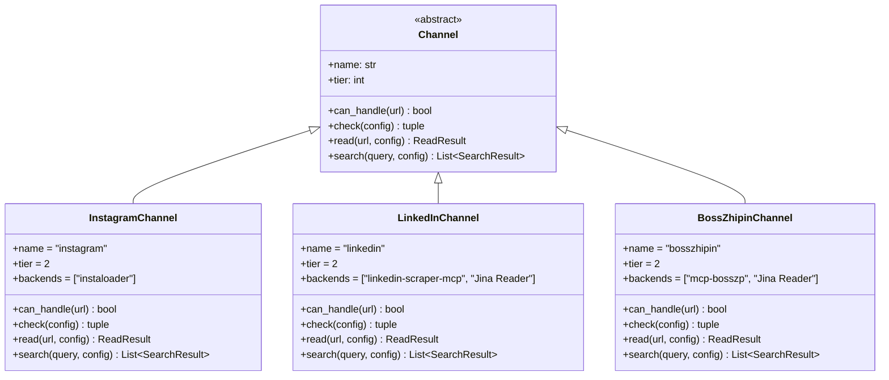

# Instagram, LinkedIn, and Boss直聘 Channels

Relevant source files

The following files were used as context for generating this wiki page:

- [CHANGELOG.md](CHANGELOG.md)
- [agent_reach/channels/linkedin.py](agent_reach/channels/linkedin.py)

This page documents the three **tier-2** channels in Agent Reach: `InstagramChannel`, `LinkedInChannel`, and `BossZhipinChannel`. All three require additional setup beyond the default installation. They each follow the same general pattern: attempt a primary backend (instaloader or mcporter+MCP), fall back to Jina Reader on failure, and delegate search to `ExaSearchChannel` when the primary backend is unavailable.

For the general channel architecture (abstract base class, `ReadResult`, `SearchResult`, tier levels), see [3.1](). For mcporter setup details, see [4.3](). For cookie export procedures, see [4.1]().

---

## Overview

| Channel | Class | File | Primary Backend | Fallback | Tier |
|---|---|---|---|---|---|
| Instagram | `InstagramChannel` | [agent_reach/channels/instagram.py:17-22]() | `instaloader` (Python lib) | Jina Reader | 2 |
| LinkedIn | `LinkedInChannel` | [agent_reach/channels/linkedin.py:9-13]() | `mcporter` → `linkedin-scraper-mcp` | Jina Reader | 2 |
| Boss直聘 | `BossZhipinChannel` | [agent_reach/channels/bosszhipin.py:62-67]() | `mcporter` → `mcp-bosszp` | Jina Reader | 2 |

**Tier 2** means: "needs setup" — the channel is not functional out of the box. The `check()` method on each channel reports the current state and prints setup instructions. Note that as of version 1.1.0, the Instagram channel was temporarily removed due to aggressive anti-scraping measures [CHANGELOG.md:31-34]().

Sources: [agent_reach/channels/instagram.py:17-22](), [agent_reach/channels/linkedin.py:9-13](), [agent_reach/channels/bosszhipin.py:62-67](), [CHANGELOG.md:31-34]()

---

## Backend and Dispatch Diagram

**Diagram: Channel dispatch and fallback paths**

```mermaid
flowchart TD
    readURL["agent-reach read <url>"]
    searchQuery["agent-reach search-instagram/linkedin/bosszhipin"]

    subgraph "InstagramChannel (instagram.py)"
        ig_can["can_handle(): instagram.com or instagr.am"]
        ig_read["read()"]
        ig_instaloader["_read_instaloader()"]
        ig_jina["_read_jina()"]
        ig_search["search()"]
        ig_post["_read_post_sync()"]
        ig_profile["_read_profile_sync()"]
    end

    subgraph "LinkedInChannel (linkedin.py)"
        li_can["can_handle(): linkedin.com"]
        li_read["read()"]
        li_mcp_check["_mcporter_has_linkedin()"]
        li_profile_mcp["_read_profile_mcp()"]
        li_company_mcp["_read_company_mcp()"]
        li_job_mcp["_read_job_mcp()"]
        li_jina["_read_jina()"]
        li_search["search()"]
        li_search_mcp["_search_mcp()"]
    end

    subgraph "BossZhipinChannel (bosszhipin.py)"
        bz_can["can_handle(): zhipin.com or boss.com"]
        bz_read["read()"]
        bz_jina["_read_jina()"]
        bz_search["search()"]
        bz_mcp_check["_mcporter_has_bosszhipin()"]
        bz_search_mcp["_search_mcp()"]
        bz_parse["_parse_jobs()"]
    end

    subgraph "External Backends"
        instaloader["instaloader (Python lib)"]
        mcporter_li["mcporter → linkedin-scraper-mcp"]
        mcporter_bz["mcporter → mcp-bosszp"]
        jina_reader["Jina Reader (r.jina.ai)"]
        exa["ExaSearchChannel"]
    end

    readURL --> ig_can & li_can & bz_can
    searchQuery --> ig_search & li_search & bz_search

    ig_read --> ig_instaloader --> instaloader
    ig_instaloader -->|"URL has /p/ or /reel/"| ig_post
    ig_instaloader -->|"other paths"| ig_profile
    ig_instaloader -->|"ImportError or timeout"| ig_jina
    ig_jina --> jina_reader
    ig_search --> exa

    li_read --> li_mcp_check
    li_mcp_check -->|"ok"| li_profile_mcp & li_company_mcp & li_job_mcp
    li_profile_mcp & li_company_mcp & li_job_mcp --> mcporter_li
    li_mcp_check -->|"not configured"| li_jina
    li_profile_mcp & li_company_mcp & li_job_mcp -->|"exception"| li_jina
    li_jina --> jina_reader
    li_search --> li_search_mcp --> mcporter_li
    li_search -->|"MCP unavailable"| exa

    bz_read --> bz_jina --> jina_reader
    bz_search --> bz_mcp_check
    bz_mcp_check -->|"ok"| bz_search_mcp --> mcporter_bz
    bz_search_mcp --> bz_parse
    bz_mcp_check -->|"not configured"| exa
```

Sources: [agent_reach/channels/instagram.py:50-58](), [agent_reach/channels/linkedin.py:15-17](), [agent_reach/channels/linkedin.py:19-41](), [CHANGELOG.md:36-51]()

---

## InstagramChannel

**File:** [agent_reach/channels/instagram.py]()

### How it works

`InstagramChannel` historically used the `instaloader` Python library as its primary backend. The `read()` method checks if the module is importable; if not, it falls directly to Jina Reader. When `instaloader` is available, `_read_instaloader()` wraps the synchronous instaloader API in a `ThreadPoolExecutor` with a **15-second timeout** to prevent blocking.

URL routing inside `_sync_read`:
- URLs containing `/p/` or `/reel/` → `_read_post_sync()`
- All other paths → `_read_profile_sync()`

Any exception or timeout in the executor causes an automatic fallback to `_read_jina()`. **Note:** This channel was marked as removed in the v1.1.0 changelog due to upstream breakage [CHANGELOG.md:31-34]().

### Authentication

Authentication is loaded inside `_sync_read` from the cookie file at `~/.agent-reach/instagram-cookies.txt`. The channel parses the semicolon-delimited header string into a dict and calls `L.context.load_session(username, cookies)`.

Sources: [agent_reach/channels/instagram.py:27-48](), [CHANGELOG.md:31-34]()

### Search

`InstagramChannel.search()` has no native search capability. It always delegates to `ExaSearchChannel` with the query `"site:instagram.com {query}"`.

Sources: [agent_reach/channels/instagram.py:243-248]()

---

## LinkedInChannel

**File:** [agent_reach/channels/linkedin.py]()

### How it works

`LinkedInChannel` uses `mcporter` to communicate with a locally-running `linkedin-scraper-mcp` MCP server. Before attempting any MCP call, it checks availability via `check()`, which runs `mcporter config list` and checks for `"linkedin"` in the output [agent_reach/channels/linkedin.py:29-34]().

Functionality includes:
- Reading person profiles, company pages, and job details via [linkedin-scraper-mcp](https://github.com/stickerdaniel/linkedin-mcp-server) [CHANGELOG.md:37]().
- Fallback to Jina Reader when MCP is not configured [CHANGELOG.md:39]().
- Search for people and jobs via MCP, with Exa fallback [CHANGELOG.md:38]().

### Search

`LinkedInChannel` supports a dedicated CLI subcommand `search-linkedin` [CHANGELOG.md:56]().

### `check()` status matrix

| Condition | Status | Message |
|---|---|---|
| `mcporter` not found | `off` | Basic content via Jina. Needs `mcporter` + `linkedin-scraper-mcp` [agent_reach/channels/linkedin.py:20-27]() |
| `mcporter` exists but `linkedin` not in config | `off` | LinkedIn MCP not configured. Run `mcporter config add...` [agent_reach/channels/linkedin.py:37-41]() |
| `linkedin` found in `mcporter config list` | `ok` | Full functionality (Profile, Company, Job search) [agent_reach/channels/linkedin.py:33-34]() |

Sources: [agent_reach/channels/linkedin.py:9-41](), [CHANGELOG.md:36-43]()

---

## Boss直聘Channel

**File:** [agent_reach/channels/bosszhipin.py]()

### How it works

`BossZhipinChannel` uses `mcporter` and the `mcp-bosszp` backend.
- **Login:** QR code login via [mcp-bosszp](https://github.com/mucsbr/mcp-bosszp) [CHANGELOG.md:45]().
- **Search:** Job search and recruiter greeting via MCP [CHANGELOG.md:46]().
- **Reading:** Fallback to Jina Reader for reading job pages [CHANGELOG.md:47]().

### Search

`BossZhipinChannel` supports a dedicated CLI subcommand `search-bosszhipin` [CHANGELOG.md:56]().

Sources: [CHANGELOG.md:44-51](), [CHANGELOG.md:56-60]()

---

## Comparison Diagram

**Diagram: Channel class structure and key methods**

Sources: [agent_reach/channels/instagram.py:17-22](), [agent_reach/channels/linkedin.py:9-13](), [CHANGELOG.md:36-51]()

---

## Module-Level Helpers

**`linkedin.py`**:
- `check()` — uses `shutil.which("mcporter")` and `subprocess.run([mcporter, "config", "list"])` to verify setup [agent_reach/channels/linkedin.py:19-32]().

Sources: [agent_reach/channels/linkedin.py:19-41]()
