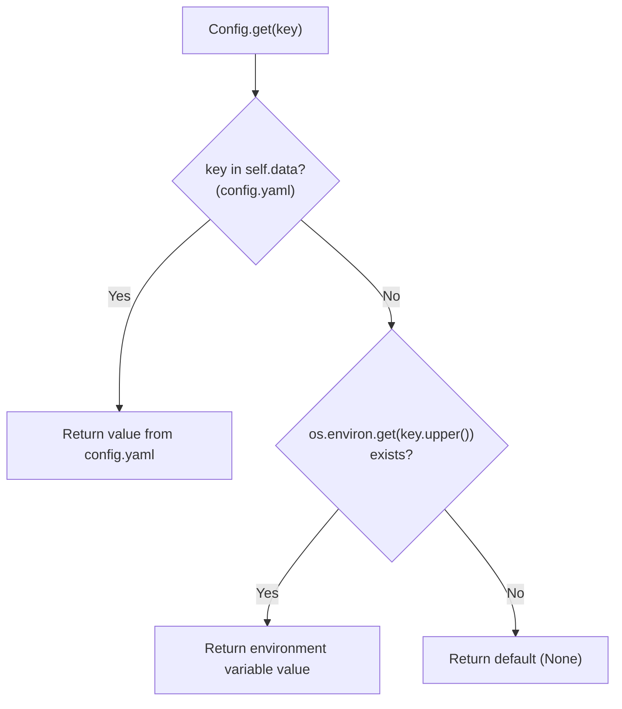
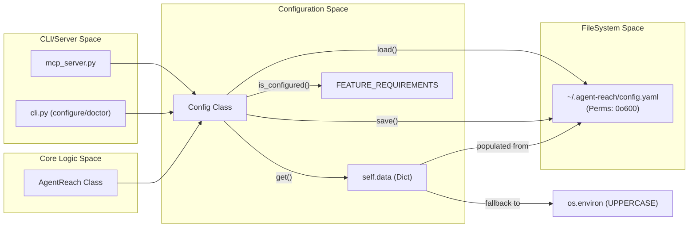

# Configuration

<details>
<summary>Relevant source files</summary>

The following files were used as context for generating this wiki page:

- [agent_reach/config.py](agent_reach/config.py)
- [agent_reach/guides/setup-twitter.md](agent_reach/guides/setup-twitter.md)
- [agent_reach/integrations/mcp_server.py](agent_reach/integrations/mcp_server.py)
- [docs/troubleshooting.md](docs/troubleshooting.md)

</details>


This page documents Agent Reach's configuration system: where settings are stored, how the `Config` class manages them, and how values are resolved at runtime. For step-by-step instructions on specific configuration tasks, see the following sub-pages:

- Cookie export for Twitter, Instagram, XiaoHongShu, and Bilibili → [Cookie Export Guide](#4.1)
- Proxy configuration for Reddit, Bilibili, and other blocked platforms → [Proxy Configuration](#4.2)
- Setting up mcporter for XiaoHongShu, LinkedIn, Exa, and Boss直聘 → [mcporter Setup](#4.3)

---

## Storage Location

All configuration is stored in a single YAML file at:

```
~/.agent-reach/config.yaml
```

The directory and file are created automatically on first use by `_ensure_dir()` in [agent_reach/config.py:37-39](). The file is written with **mode `0o600`** (owner read/write only) to protect credentials stored inside.

**Sources:** [agent_reach/config.py:18-19](), [agent_reach/config.py:49-59]()

---

## The `Config` Class

The `Config` class in [agent_reach/config.py:15-110]() is the single point of access for all configuration in the system. It is instantiated by `AgentReach` in [agent_reach/integrations/mcp_server.py:34]() and by several CLI commands directly.

**Diagram: Config class structure**

```mermaid
classDiagram
    class "Config" {
        +CONFIG_DIR: Path
        +CONFIG_FILE: Path
        +FEATURE_REQUIREMENTS: dict
        +config_path: Path
        +data: dict
        +load()
        +save()
        +get(key, default) Any
        +set(key, value)
        +delete(key)
        +is_configured(feature) bool
        +get_configured_features() dict
        +to_dict() dict
        -_ensure_dir()
    }
```

**Sources:** [agent_reach/config.py:15-110]()

### Core Methods

| Method | Description |
|---|---|
| `load()` | Reads `config.yaml` into `self.data` using `yaml.safe_load`. If the file does not exist, `self.data` is set to `{}`. [agent_reach/config.py:41-47]() |
| `save()` | Writes `self.data` to `config.yaml` using `yaml.dump`, using `os.open` with `stat.S_IRUSR | stat.S_IWUSR` to ensure restricted permissions. [agent_reach/config.py:49-68]() |
| `get(key, default)` | Returns a value from `self.data`, falling back to the uppercase environment variable, then `default`. [agent_reach/config.py:69-78]() |
| `set(key, value)` | Writes a key into `self.data` and calls `save()`. [agent_reach/config.py:80-83]() |
| `delete(key)` | Removes a key from `self.data` and calls `save()`. [agent_reach/config.py:85-88]() |
| `is_configured(feature)` | Returns `True` if all required keys for the named feature (defined in `FEATURE_REQUIREMENTS`) are present and non-empty. [agent_reach/config.py:90-93]() |
| `to_dict()` | Returns a masked copy of `self.data`, truncating sensitive keys (containing "key", "token", "password", or "proxy") to protect privacy during logging or display. [agent_reach/config.py:102-110]() |

**Sources:** [agent_reach/config.py:41-110]()

---

## Value Resolution Order

When `get(key)` is called, values are resolved in the following priority order:

**Diagram: Value resolution in `Config.get()`**



This means `config.yaml` always wins over environment variables. Environment variables serve as a fallback for CI/CD environments or users who prefer not to use the config file.

**Sources:** [agent_reach/config.py:69-78]()

---

## Feature Requirements Map

`Config.FEATURE_REQUIREMENTS` is a static dictionary that maps **feature names** to the **config keys** that must be present for that feature to be considered active. This is used by `is_configured(feature)` and drives status reporting in `agent-reach doctor`.

| Feature name | Required config keys | Used by |
|---|---|---|
| `exa_search` | `exa_api_key` | `ExaSearchChannel` |
| `reddit_proxy` | `reddit_proxy` | `RedditChannel` |
| `twitter_xreach` | `twitter_auth_token`, `twitter_ct0` | `TwitterChannel` (via `bird` CLI) |
| `groq_whisper` | `groq_api_key` | `XiaoyuzhouChannel` / Video transcription |
| `github_token` | `github_token` | `GitHubChannel` |

**Sources:** [agent_reach/config.py:22-28]()

---

## Security and Permissions

The `save()` method implements a security-first approach to credential storage. It uses `os.open` with flags `os.O_WRONLY | os.O_CREAT | os.O_TRUNC` and mode `stat.S_IRUSR | stat.S_IWUSR` (octal `0o600`). This ensures that the file is created with restricted permissions from the start, preventing a race condition where credentials might be briefly world-readable.

On Windows or edge cases where `os.open` flags are not fully supported, the system falls back to a standard `open()` call.

**Sources:** [agent_reach/config.py:52-68]()

---

## Config Lifecycle Diagram

**Diagram: How `Config` is created and used across modules**



**Sources:** [agent_reach/config.py:15-110](), [agent_reach/integrations/mcp_server.py:32-34]()
