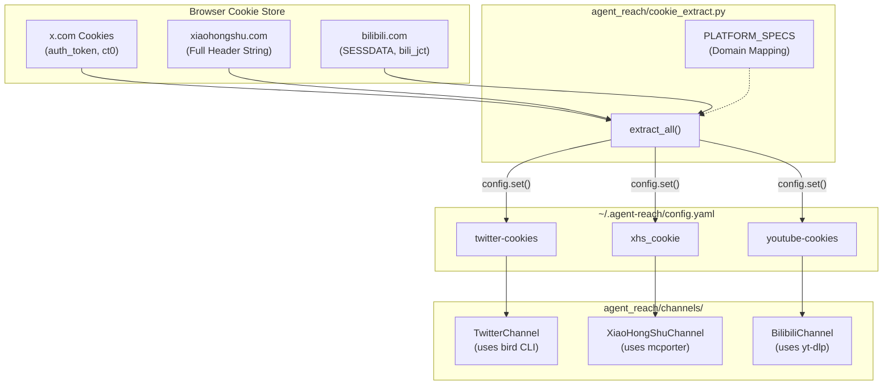

# Cookie Export Guide

<details>
<summary>Relevant source files</summary>

The following files were used as context for generating this wiki page:

- [agent_reach/cookie_extract.py](agent_reach/cookie_extract.py)
- [docs/cookie-export.md](docs/cookie-export.md)

</details>


This page explains how to export browser session cookies from your local machine and supply them to Agent Reach. This is necessary when Agent Reach is running on a server without direct browser access, or when you want to automate authentication for specific channels using your existing browser session.

Agent Reach provides a built-in automated extraction tool (`--from-browser`) for local environments and manual methods for server environments.

---

## When Cookies Are Required

Not all channels need cookies. The following table maps platforms to their required config keys and the channels that consume them:

| Platform | Config Key | Channel Class | What it unlocks |
|---|---|---|---|
| Twitter / X | `twitter-cookies` | `TwitterChannel` | Search, timeline, authenticated reads |
| XiaoHongShu | `xhs_cookie` | `XiaoHongShuChannel` | Note fetching, search |
| Instagram | `instagram-cookies` | `InstagramChannel` | Private content, profile reads |
| Bilibili | `youtube-cookies` | `BilibiliChannel` | Age-restricted and member-only content |

Sources: [agent_reach/cookie_extract.py:16-35](), [docs/cookie-export.md:24-31]()

---

## Method 1: Auto-Extraction (Local Only)

If you are running Agent Reach on the same machine as your browser, you can use the built-in `cookie_extract.py` module via the CLI.

**Command:**
```bash
agent-reach configure --from-browser chrome
```
*Supported browsers: chrome, firefox, edge, brave, opera.*

### Implementation Details
The `configure_from_browser` function [agent_reach/cookie_extract.py:166-172]() uses the `browser_cookie3` library to access local cookie stores. 

**Data Flow (Auto-Extraction):**
1. `extract_all(browser)` [agent_reach/cookie_extract.py:38-48]() iterates through `PLATFORM_SPECS` [agent_reach/cookie_extract.py:16-35]().
2. It filters the browser's `cookie_jar` by domain (e.g., `.x.com`, `.xiaohongshu.com`) [agent_reach/cookie_extract.py:88-91]().
3. For Twitter, it specifically extracts `auth_token` and `ct0` [agent_reach/cookie_extract.py:20-20]().
4. For XiaoHongShu, it aggregates all domain cookies into a single header string [agent_reach/cookie_extract.py:101-107]().
5. **Sync Logic:** After extraction, `_sync_bird_env` [agent_reach/cookie_extract.py:141-146]() writes Twitter credentials to `~/.config/bird/credentials.env` to ensure the `bird` CLI backend is immediately authenticated.

Sources: [agent_reach/cookie_extract.py:38-163]()

---

## Method 2: Cookie-Editor Extension (Recommended for Servers)

This method is best when your Agent is on a remote server.

**Steps:**
1. Install **Cookie-Editor** (Chrome/Firefox/Edge).
2. Go to the website (e.g., `https://x.com`) and log in.
3. Click the extension icon → **Export** → **Header String**.
4. Run the configuration command on your server:
   ```bash
   agent-reach configure twitter-cookies "auth_token=xxx; ct0=yyy; ..."
   ```

Sources: [docs/cookie-export.md:6-22]()

---

## Method 3: Browser DevTools (Manual)

1. Open the site and press **F12** (Network tab).
2. Refresh the page and select any request.
3. Locate the `Cookie:` header in **Request Headers**.
4. Copy the value and provide it to `agent-reach configure`.

Sources: [docs/cookie-export.md:32-43]()

---

## Technical Mapping: Browser to Code Entities

The following diagram illustrates how extracted browser data is mapped to internal configuration keys and eventually used by specific Channel classes.

**Diagram: Cookie Data Flow to Channel Entities**



Sources: [agent_reach/cookie_extract.py:16-48](), [agent_reach/cookie_extract.py:166-206]()

---

## Platform-Specific Details

### Twitter / X
Twitter authentication requires `auth_token` and `ct0`. When configured, Agent Reach automatically syncs these to:
- `~/.config/bird/credentials.env`: Used by the `bird` Node.js CLI [agent_reach/cookie_extract.py:141-156]().
- `~/.config/xfetch/session.json`: Legacy compatibility [agent_reach/cookie_extract.py:115-135]().

### XiaoHongShu (XHS)
XHS requires a complete cookie string. This is stored under `xhs_cookie` in the config [agent_reach/cookie_extract.py:204-204](). In server environments, this string is often passed to the `xiaohongshu-mcp` Docker container [docs/cookie-export.md:29-30]().

### Bilibili
Bilibili uses `SESSDATA` and `bili_jct`. These are stored under the `youtube-cookies` key because both channels utilize the `yt-dlp` backend which shares a common cookie handling mechanism [agent_reach/cookie_extract.py:30-34](), [docs/cookie-export.md:30-30]().

---

## Security and Permissions
- **File Permissions:** Configuration files containing cookies are set to `0o600` (read/write for owner only) [agent_reach/cookie_extract.py:135-135](), [agent_reach/cookie_extract.py:156-156]().
- **Dedicated Accounts:** It is strongly recommended to use secondary "bot" accounts for cookie export to prevent primary account risk [docs/install.md:82-84]().

Sources: [agent_reach/cookie_extract.py:135-156](), [docs/install.md:82-84]()
