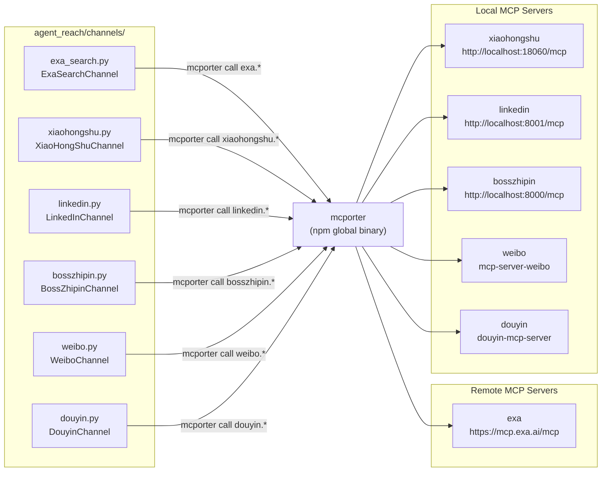
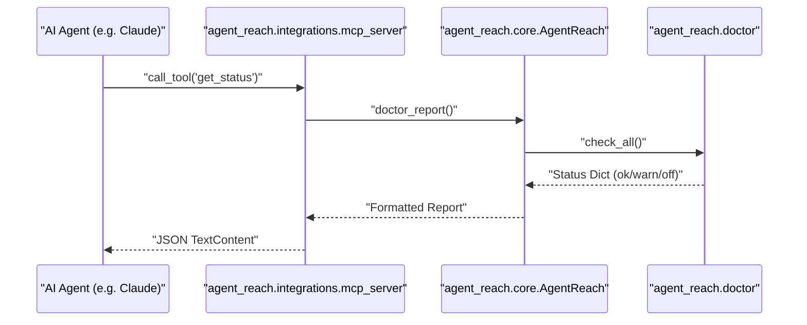

# mcporter Setup

<details>
<summary>Relevant source files</summary>

The following files were used as context for generating this wiki page:

- [agent_reach/config.py](agent_reach/config.py)
- [agent_reach/guides/setup-twitter.md](agent_reach/guides/setup-twitter.md)
- [agent_reach/integrations/__init__.py](agent_reach/integrations/__init__.py)
- [agent_reach/integrations/mcp_server.py](agent_reach/integrations/mcp_server.py)
- [config/mcporter.json](config/mcporter.json)
- [docs/troubleshooting.md](docs/troubleshooting.md)

</details>


This page covers what `mcporter` is, how Agent Reach uses it as an MCP bridge, the `config/mcporter.json` configuration structure, and the setup steps for each dependent channel. It also documents the Agent Reach MCP server which exposes internal diagnostics.

For broader configuration of Agent Reach credentials and settings, see [Configuration](). For details on the individual channels that use mcporter (XiaoHongShu, Exa, LinkedIn, Boss直聘, Weibo, Douyin), see [Channels]().

---

## What mcporter Is

`mcporter` is a command-line tool (`npm install -g mcporter`) that acts as a bridge between a shell process and one or more **MCP servers** (Model Context Protocol servers). Agent Reach's channel implementations invoke it as a subprocess to call tools exposed by remote or local MCP servers.

The two key operations Agent Reach performs via `mcporter`:

| Command | Purpose |
|---|---|
| `mcporter list` | Lists all configured MCP server names; used to check if a server is registered |
| `mcporter call <expr>` | Calls a tool on a configured MCP server, e.g. `exa.web_search_exa(query: "foo")` |
| `mcporter config add <name> <url>` | Registers an MCP server endpoint by name |

mcporter is installed via npm and must be on `PATH` for mcporter-dependent channels to function. Both `ExaSearchChannel` and `XiaoHongShuChannel` detect it using `shutil.which("mcporter")`.

Sources: [agent_reach/channels/exa_search.py:21-29](), [agent_reach/channels/xiaohongshu.py:22-31](), [docs/troubleshooting.md:29-36]()

---

## Configuration File

The repository ships a reference configuration at `config/mcporter.json` [config/mcporter.json:1-11](). This file uses the `mcpServers` key to declare named MCP server endpoints.

```json
{
  "mcpServers": {
    "exa": {
      "baseUrl": "https://mcp.exa.ai/mcp"
    },
    "xiaohongshu": {
      "baseUrl": "http://localhost:18060/mcp"
    }
  },
  "imports": []
}
```

| Field | Type | Description |
|---|---|---|
| `mcpServers` | object | Map of logical server name → endpoint config |
| `mcpServers.<name>.baseUrl` | string | HTTP(S) URL of the MCP server's endpoint |
| `imports` | array | Additional config files to merge (unused in default config) |

Individual server entries are typically added at runtime using `mcporter config add <name> <baseUrl>` rather than editing this file directly.

Sources: [config/mcporter.json:1-11]()

---

## Channels That Depend on mcporter

**Channel-to-MCP-server mapping:**



Sources: [agent_reach/channels/exa_search.py:1-11](), [agent_reach/channels/xiaohongshu.py:1-11](), [config/mcporter.json:1-11]()

---

## Agent Reach's Own MCP Server

Agent Reach includes its own MCP server implementation at `agent_reach/integrations/mcp_server.py` [agent_reach/integrations/mcp_server.py:1-68](). This server allows external AI agents (like Claude Code or Cursor) to inspect the health and capabilities of Agent Reach via the MCP protocol.

### Implementation Details
- **Class/Function**: `create_server()` [agent_reach/integrations/mcp_server.py:27-57]() initializes an MCP `Server` instance.
- **Dependency**: Requires `mcp` Python package (`pip install agent-reach[mcp]`) [agent_reach/integrations/mcp_server.py:18-24]().
- **Transport**: Uses `stdio_server` for communication [agent_reach/integrations/mcp_server.py:62-63]().

### Exposed Tools
| Tool Name | Description | Implementation |
|---|---|---|
| `get_status` | Returns which channels are installed and active. | Calls `AgentReach.doctor_report()` [agent_reach/integrations/mcp_server.py:47-48]() |

### Data Flow for get_status


Sources: [agent_reach/integrations/mcp_server.py:32-57](), [agent_reach/core.py:1-20]()

---

## How Channels Invoke mcporter

Both `ExaSearchChannel` and `XiaoHongShuChannel` follow the same pattern for external tool invocation:

**Step 1 — Availability check (`_mcporter_ok`)**

[agent_reach/channels/exa_search.py:21-29]() and [agent_reach/channels/xiaohongshu.py:22-31]() each define a `_mcporter_ok()` method that:
1. Checks `shutil.which("mcporter")` to confirm the binary is on `PATH`.
2. Runs `mcporter list` and checks whether the expected server name (`"exa"` or `"xiaohongshu"`) appears in stdout.

**Step 2 — Tool call (`_call`)**

[agent_reach/channels/exa_search.py:32-38]() and [agent_reach/channels/xiaohongshu.py:34-41]() each define a `_call(expr, timeout)` method that runs `mcporter call <expr>` as a subprocess and returns stdout, or raises `RuntimeError` on non-zero exit.

Sources: [agent_reach/channels/exa_search.py:21-73](), [agent_reach/channels/xiaohongshu.py:22-41]()

---

## Setup by Channel

### Exa Search (tier 1, remote server)

Exa uses a publicly hosted MCP endpoint. No Docker or local process is required.

```bash
npm install -g mcporter
mcporter config add exa https://mcp.exa.ai/mcp
```

The `ExaSearchChannel.check()` method returns `"ok"` when `mcporter list` output contains `"exa"`.

Sources: [agent_reach/channels/exa_search.py:49-57](), [docs/troubleshooting.md:29-36]()

---

### XiaoHongShu (tier 2, local Docker server)

XiaoHongShu requires a locally running MCP server (`xiaohongshu-mcp`) exposed over HTTP.

```bash
npm install -g mcporter

# Start the MCP server (Docker required)
docker run -d --name xiaohongshu-mcp -p 18060:18060 xpzouying/xiaohongshu-mcp

# Register the local endpoint with mcporter
mcporter config add xiaohongshu http://localhost:18060/mcp
```

After setup, `XiaoHongShuChannel.check()` calls `xiaohongshu.check_login_status()` via mcporter to distinguish between `"ok"` (logged in) and `"warn"` (MCP running but not authenticated) [agent_reach/channels/xiaohongshu.py:49-70]().

Sources: [agent_reach/channels/xiaohongshu.py:49-70](), [config/mcporter.json:6-8]()

---

## Channel Status Summary

The `AgentReach.doctor_report()` method (and the corresponding MCP tool) evaluates channel health. For mcporter-dependent channels, the possible statuses are:

| Status | Meaning |
|---|---|
| `"off"` | `mcporter` binary not found on PATH, or named server not in `mcporter list`. |
| `"warn"` | mcporter and server are configured, but the service is not authenticated (e.g. XiaoHongShu not logged in). |
| `"ok"` | mcporter connected and service responding correctly. |

Sources: [agent_reach/integrations/mcp_server.py:47-48](), [agent_reach/channels/exa_search.py:49-57](), [agent_reach/channels/xiaohongshu.py:49-70]()
