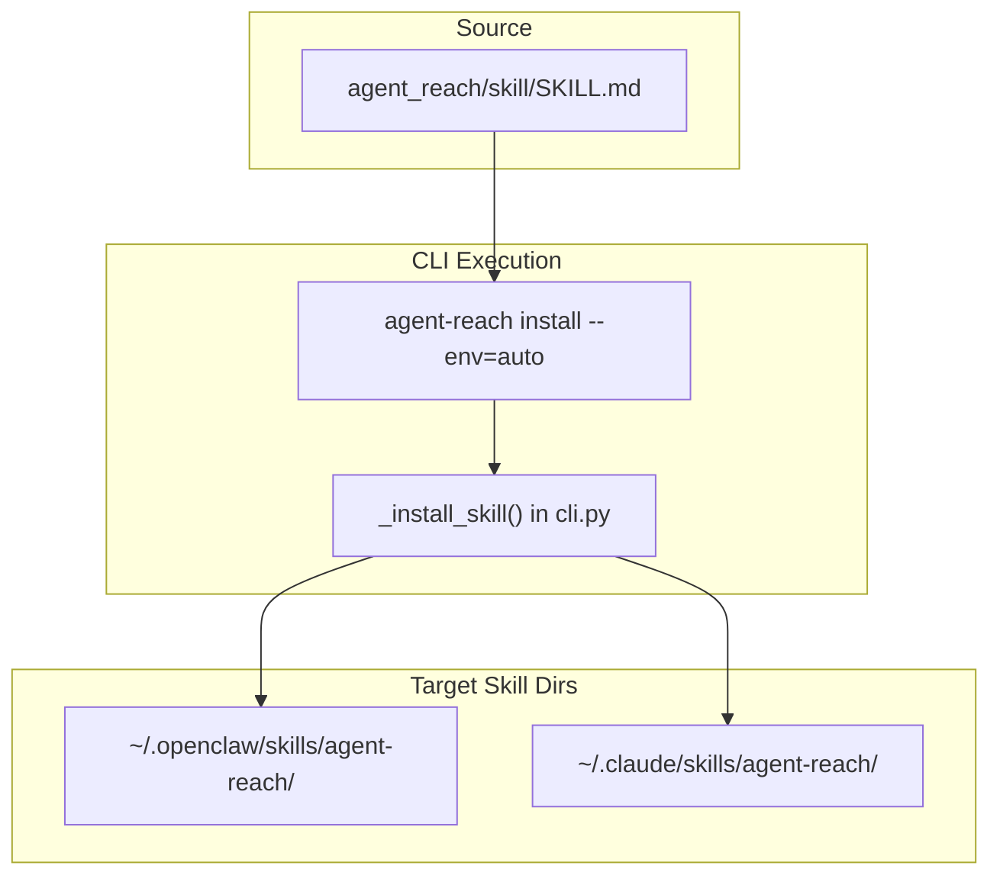
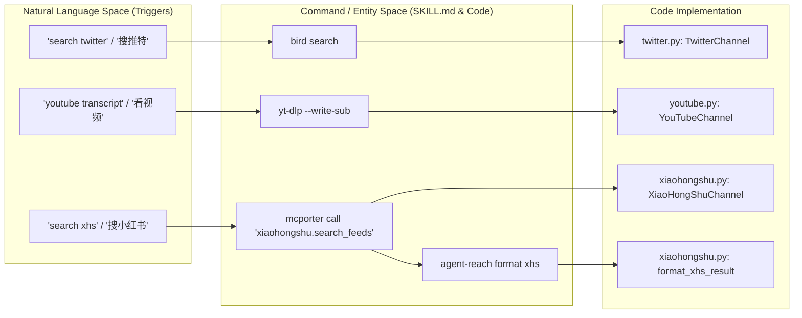
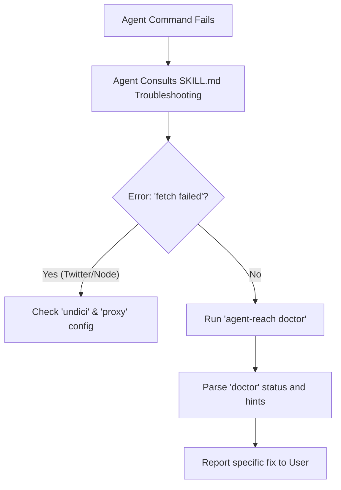

# AI Agent Integration

<details>
<summary>Relevant source files</summary>

The following files were used as context for generating this wiki page:

- [agent_reach/channels/xiaohongshu.py](agent_reach/channels/xiaohongshu.py)
- [agent_reach/skill/SKILL.md](agent_reach/skill/SKILL.md)
- [tests/test_skill_command.py](tests/test_skill_command.py)
- [tests/test_xhs_format.py](tests/test_xhs_format.py)

</details>


This page documents how AI agents (Claude Code, Cursor, OpenClaw, Windsurf, and others) discover and use agent-reach capabilities through the `SKILL.md` skill registration mechanism. It covers the skill file structure, installation into agent skill directories, natural language trigger mapping, and the expected agent interaction model.

---

## Overview

Agent Reach is a CLI tool, but it is primarily intended to be driven by an AI agent. The integration works through a single mechanism: a file called `SKILL.md` that is installed into the agent's skill directory. Once installed, the agent reads this file to learn what agent-reach can do, when to invoke it, and how to invoke it.

### Agent Interaction Flow
```mermaid
sequenceDiagram
    participant "User" as User
    participant "AI Agent" as Agent
    participant "SKILL.md" as Skill Definition
    participant "agent-reach CLI" as CLI / Backends

    User->>Agent: "Search Twitter for opinions on this product"
    Agent->>Skill Definition: Consult registered skill metadata
    Skill Definition-->>Agent: Trigger matched; Use "bird search" or "agent-reach search-twitter"
    Agent->>CLI: bird search "product opinions" -n 10
    CLI-->>Agent: Structured JSON/Text results
    Agent-->>User: Summarized response with citations
```

Sources: [agent_reach/skill/SKILL.md:1-18](), [agent_reach/skill/SKILL.md:43-50]()

---

## The SKILL.md File

`SKILL.md` is the contract between the agent-reach package and any agent that supports the skills protocol. It lives at `agent_reach/skill/SKILL.md` and serves as the primary instruction set for the agent.

### Frontmatter: Registration Metadata
The file begins with YAML frontmatter that defines the skill's identity and activation triggers.

[agent_reach/skill/SKILL.md:1-18]()

| Field | Purpose |
|---|---|
| `name` | Unique identifier (`agent-reach`) |
| `description` | Tells the agent *when* to use this skill (e.g., "Search and read 17 platforms") |
| `triggers` | Keywords like "搜推特", "search reddit", "播客", "web search" that activate the skill |
| `metadata` | Integration-specific data (e.g., `openclaw` homepage) |

### Skill Body: Command Reference
The body of the file provides the agent with specific shell commands to execute for different platforms. Unlike the human-facing CLI, the agent is often encouraged to call underlying backends directly for speed or to use `mcporter` for MCP-based channels.

**Key Command Examples for Agents:**
- **Web Search (Exa):** `mcporter call 'exa.web_search_exa(query: "query", numResults: 5)'` [agent_reach/skill/SKILL.md:36-41]()
- **Twitter (bird):** `bird search "query" -n 10` [agent_reach/skill/SKILL.md:43-50]()
- **XiaoHongShu (mcporter):** `mcporter call 'xiaohongshu.search_feeds(keyword: "query")' | agent-reach format xhs` [agent_reach/skill/SKILL.md:89-105]()
- **WeChat (Camoufox):** `cd ~/.agent-reach/tools/wechat-article-for-ai && python3 main.py "URL"` [agent_reach/skill/SKILL.md:133-138]()

Sources: [agent_reach/skill/SKILL.md:20-138]()

---

## Skill Installation

Installation is handled by internal CLI helpers that detect common agent skill directories.

### Implementation: `_install_skill` and `_uninstall_skill`
The functions `_install_skill()` and `_uninstall_skill()` in `agent_reach/cli.py` manage the lifecycle of the `SKILL.md` file within the agent's environment.

- **Detection:** It looks for directories like `~/.openclaw/skills/` or paths defined by `OPENCLAW_HOME`. [tests/test_skill_command.py:15-29]()
- **Action:** It creates an `agent-reach` subdirectory and copies the `SKILL.md` content into it. [tests/test_skill_command.py:66-86]()

### Installation Logic Flow


Sources: [tests/test_skill_command.py:9-86]()

---

## Natural Language to Code Mapping

This section illustrates how the agent bridges the gap between a user's natural language request and the specific code entities or commands defined in `agent-reach`.

### Intent Mapping Table

| User Prompt (Natural Language) | Agent Action (Command) | Internal Logic / Backend |
|---|---|---|
| "Read this link" | `agent-reach read <url>` | `AgentReach.read()` in `core.py` |
| "Search Twitter for AI news" | `bird search "AI news"` | `TwitterChannel` via `bird` CLI |
| "Find XHS notes about hiking" | `mcporter call 'xiaohongshu...'` | `XiaoHongShuChannel` via MCP |
| "Transcribe this podcast" | `transcribe.sh <url>` | `XiaoyuzhouChannel` (Groq Whisper) |
| "Search GitHub for python libs" | `gh search repos "python libs"` | `GitHubChannel` via `gh` CLI |

### Bridge: Natural Language to Code Entity Space


Sources: [agent_reach/skill/SKILL.md:1-14](), [agent_reach/skill/SKILL.md:43-105](), [agent_reach/channels/xiaohongshu.py:11-30]()

---

## Agent Interaction Model

### Output Formatting for Context Windows
Agents are sensitive to token limits. `agent-reach` provides specific formatters to strip redundant metadata from API responses before they reach the agent.

- **XiaoHongShu Formatter:** The `format_xhs_result` function in `agent_reach/channels/xiaohongshu.py` cleans large JSON responses from the MCP server, keeping only `title`, `desc`, `user`, `images`, and engagement metrics. [agent_reach/channels/xiaohongshu.py:11-101]()
- **Usage in Skill:** The `SKILL.md` explicitly instructs the agent to pipe output: `mcporter call ... | agent-reach format xhs`. [agent_reach/skill/SKILL.md:100-105]()

### Diagnostic-Driven Configuration
The agent does not hardcode configuration logic. Instead, it follows a "Doctor-First" model:
1. **Trigger:** User asks "Why isn't Twitter working?"
2. **Action:** Agent runs `agent-reach doctor`.
3. **Analysis:** Agent reads the "Remedy" text provided in the `doctor` output (e.g., "Need cookies").
4. **Resolution:** Agent instructs the user on how to use the Cookie-Editor extension or runs `agent-reach configure` if it has the data.

### Troubleshooting Model


Sources: [agent_reach/skill/SKILL.md:24-28](), [agent_reach/skill/SKILL.md:100-105](), [agent_reach/channels/xiaohongshu.py:11-30](), [tests/test_xhs_format.py:58-83]()
