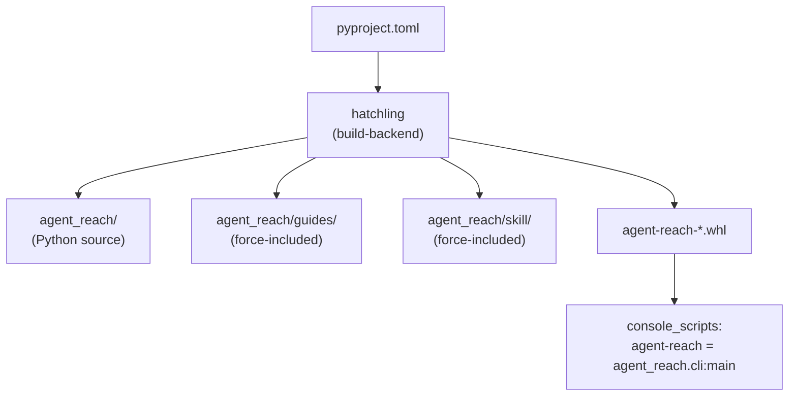
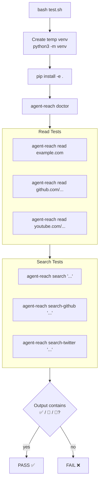
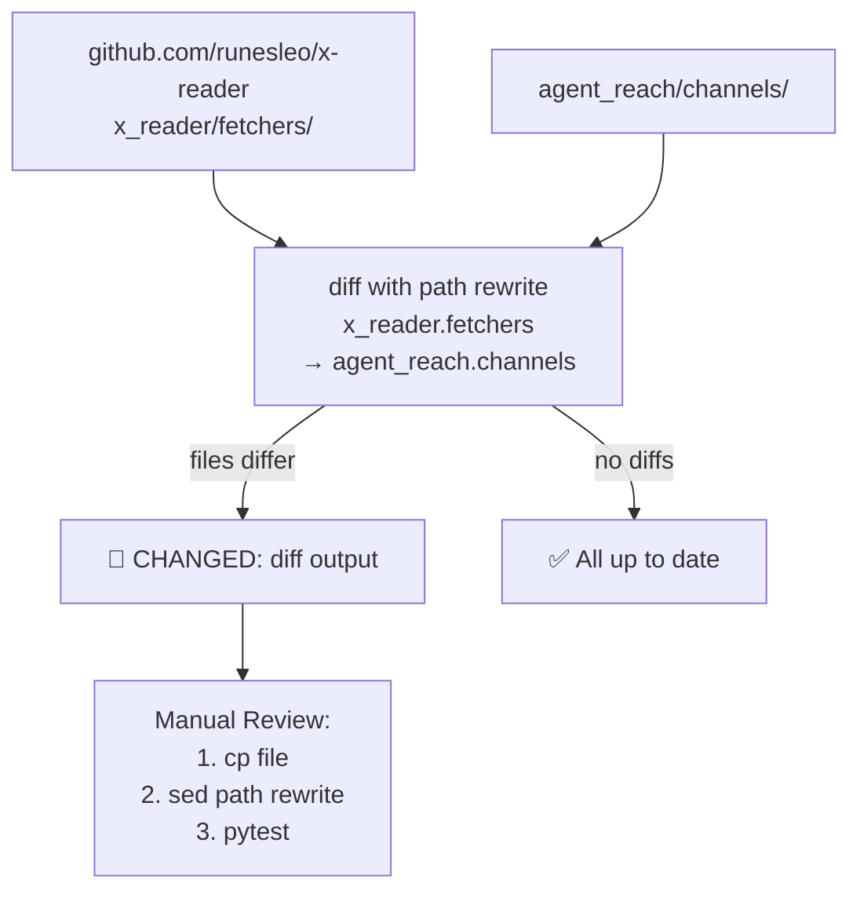

# Development

Relevant source files

The following files were used as context for generating this wiki page:

- [CLAUDE.md](CLAUDE.md)
- [CONTRIBUTING.md](CONTRIBUTING.md)
- [agent_reach/__init__.py](agent_reach/__init__.py)
- [docs/wechat-group-qr.jpg](docs/wechat-group-qr.jpg)
- [llms.txt](llms.txt)
- [pyproject.toml](pyproject.toml)
- [tests/test_cli.py](tests/test_cli.py)

This page is a contributor-oriented overview of how the `agent-reach` package is structured, built, tested, and kept up to date with upstream dependencies. It covers the build system configuration, the included data directories, the test suite, and the development conventions defined in `CLAUDE.md`.

For end-user installation steps, see the Getting Started page ([Getting Started](#1.2)). For detailed dependency and extras documentation, see [Package and Dependencies](#6.1). For the test suite specifics, see [Testing](#6.2). For upstream sync details, see [Upstream Sync](#6.3).

---

## Repository Layout

The repository contains the following top-level directories and files relevant to contributors:

| Path | Purpose |
|---|---|
| `agent_reach/` | Main Python package source [pyproject.toml:65]() |
| `agent_reach/channels/` | All platform implementations inheriting from `BaseChannel` [CLAUDE.md:21-22]() |
| `agent_reach/guides/` | Bundled documentation included in the wheel [pyproject.toml:68]() |
| `agent_reach/skill/` | `SKILL.md` bundled for AI agent skill registration [pyproject.toml:69]() |
| `scripts/sync-upstream.sh` | Shell script to diff channel files against upstream `runesleo/x-reader` [CLAUDE.md:16-28]() |
| `test.sh` | End-to-end integration test script [CLAUDE.md:12]() |
| `tests/` | Pytest suite (CLI, config, channels, doctor) [CLAUDE.md:26]() |
| `pyproject.toml` | Package metadata, dependencies, and build configuration [pyproject.toml:1-63]() |
| `CLAUDE.md` | Developer guide: commands, structure, and rules [CLAUDE.md:1-45]() |

Sources: [pyproject.toml:65-70](), [CLAUDE.md:16-28](), [CONTRIBUTING.md:52-59]()

---

## Package Build

**Build system diagram — `pyproject.toml` to wheel contents**

Sources: [pyproject.toml:53-63](), [pyproject.toml:67-70]()

The build backend is `hatchling` [pyproject.toml:61-62](). The `packages` directive includes the core `agent_reach` directory [pyproject.toml:65](). Three data directories—`agent_reach/guides/`, `agent_reach/skill/`, and `agent_reach/scripts/`—are force-included via the `[tool.hatch.build.targets.wheel.force-include]` table [pyproject.toml:67-70]() to ensure they are present in the installed wheel.

The console script entrypoint maps the `agent-reach` command to the `main` function in `agent_reach.cli` [pyproject.toml:52-53]().

### Runtime Dependencies

| Dependency | Minimum Version | Role |
|---|---|---|
| `requests` | 2.28 | HTTP requests and GitHub API updates [pyproject.toml:31]() |
| `feedparser` | 6.0 | RSS channel backend [pyproject.toml:32]() |
| `python-dotenv` | 1.0 | Environment variable management [pyproject.toml:33]() |
| `loguru` | 0.7 | Structured logging across the package [pyproject.toml:34]() |
| `pyyaml` | 6.0 | `config.yaml` parsing and storage [pyproject.toml:35]() |
| `rich` | 13.0 | CLI formatting and "doctor" reports [pyproject.toml:36]() |
| `yt-dlp` | 2024.0 | YouTube/Bilibili transcript and info extraction [pyproject.toml:37]() |

Sources: [pyproject.toml:30-38]()

### Optional Extras

| Extra | Packages Added | Enables |
|---|---|---|
| `[browser]` | `playwright>=1.40` | Headless browser for WeChat/Camoufox [pyproject.toml:41]() |
| `[cookies]` | `browser-cookie3>=0.19` | `agent-reach configure --from-browser` [pyproject.toml:42]() |
| `[all]` | `playwright`, `mcp[cli]`, `browser-cookie3` | Full feature set including MCP [pyproject.toml:43]() |
| `[dev]` | `pytest`, `ruff`, `mypy` | Linting, type checking, and testing [pyproject.toml:44-50]() |

Sources: [pyproject.toml:40-50]()

---

## Developer Conventions (`CLAUDE.md`)

The `CLAUDE.md` file defines the primary rules and conventions for the project to maintain consistency:

- **Channel Contract**: Every platform must implement `can_handle(url)`, `read(url)`, `search(query)`, and `check()` [CLAUDE.md:32]().
- **Glue Layer Philosophy**: Agent Reach is a "glue layer" that routes and calls existing tools; it does not reimplement their internals [CLAUDE.md:39]().
- **Version Synchronization**: The version string must match exactly in `pyproject.toml`, `agent_reach/__init__.py`, and `tests/test_cli.py` [CLAUDE.md:40]().
- **Authentication**: For XHS and Twitter, only cookie-based exports are supported to avoid hanging on QR scans [CLAUDE.md:43-44]().

Sources: [CLAUDE.md:29-45](), [agent_reach/__init__.py:4]()

---

## Testing

The test suite consists of automated unit tests and a manual integration script.

| Component | File | Type | What it tests |
|---|---|---|---|
| Integration | `test.sh` | Shell script | Full CLI commands (install, doctor, read, search) [CLAUDE.md:12]() |
| CLI Logic | `tests/test_cli.py` | Pytest | Arg parsing, version output, and cookie parsing [tests/test_cli.py:11-45]() |
| Update Logic | `tests/test_cli.py` | Pytest | GitHub API retry logic and error classification [tests/test_cli.py:46-127]() |
| Diagnostics | `tests/test_doctor.py` | Pytest | Health check logic and report formatting [CLAUDE.md:20]() |

### Integration Test Flow

**`test.sh` execution flow**

Sources: [CLAUDE.md:8-15](), [tests/test_cli.py:26-32]()

For full details on the test suite and how to run specific platform tests, see [Testing](#6.2).

---

## Upstream Sync

Channel implementations in `agent_reach/channels/` are tracked against the `runesleo/x-reader` repository. The script `scripts/sync-upstream.sh` automates the comparison.

**Upstream sync workflow**

Sources: [CLAUDE.md:21-22](), [CONTRIBUTING.md:52-59]()

For details on the path rewriting logic and manual merge workflow, see [Upstream Sync](#6.3).
