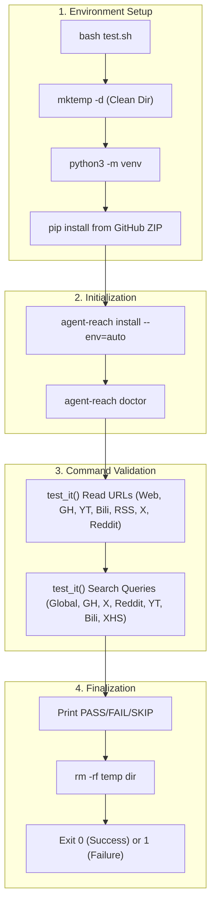
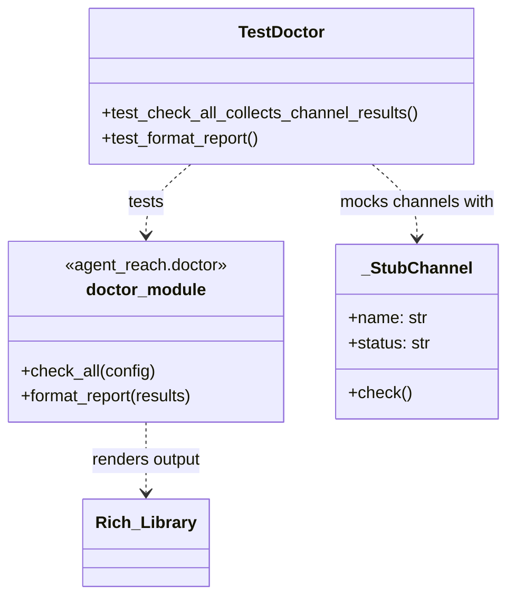

# Testing

Relevant source files

The following files were used as context for generating this wiki page:

- [.github/workflows/pytest.yml](.github/workflows/pytest.yml)
- [agent_reach/channels/xiaohongshu.py](agent_reach/channels/xiaohongshu.py)
- [constraints.txt](constraints.txt)
- [docs/dependency-locking.md](docs/dependency-locking.md)
- [test.sh](test.sh)
- [tests/test_core.py](tests/test_core.py)
- [tests/test_doctor.py](tests/test_doctor.py)
- [tests/test_skill_command.py](tests/test_skill_command.py)
- [tests/test_xhs_format.py](tests/test_xhs_format.py)
- [tests/test_xiaoyuzhou_install.py](tests/test_xiaoyuzhou_install.py)

This page documents the test suite for Agent Reach, which includes a bash-based end-to-end integration script, a comprehensive set of pytest unit tests, and specialized format validators. The suite ensures functional correctness across CLI commands, channel contracts, and configuration handling.

---

## Test Components Overview

| Component | File | Type | Scope |
|---|---|---|---|
| **Integration** | `test.sh` | Bash E2E | Installation, `doctor`, `read`, and `search` command validation |
| **Doctor Unit** | `tests/test_doctor.py` | pytest | `check_all()` collection and `format_report()` Rich output |
| **XHS Format** | `tests/test_xhs_format.py` | unittest | Token reduction logic for XiaoHongShu JSON responses |
| **Skill CLI** | `tests/test_skill_command.py` | unittest | `SKILL.md` installation and uninstallation logic |
| **Core/CLI** | `tests/test_core.py`, `tests/test_cli.py` | pytest | `AgentReach` class initialization and CLI argument parsing |
| **Contract** | `tests/test_channel_contracts.py` | pytest | Interface compliance for all registered channels |

Sources: [test.sh:1-93](), [tests/test_doctor.py:1-102](), [tests/test_xhs_format.py:1-133](), [tests/test_skill_command.py:1-90]()

---

## `test.sh` — End-to-End Integration Script

`test.sh` is a self-contained script that validates the entire user journey: from a clean environment to successful content retrieval.

**E2E Test Flow Diagram:**

Sources: [test.sh:13-93]()

### Validation Logic: `test_it()`
The script uses a heuristic approach to determine success without requiring hard-coded mock responses [test.sh:39-55]().

*   **PASS (✅):** Output contains success markers like `📖`, `🔗`, or a URL string `http`.
*   **SKIP (⏭️):** Output contains `⚠️` or phrases like `not installed`/`not configured`. This allows tests to run in partial environments (e.g., without `bird` or `mcporter`) without failing the CI [test.sh:47-49]().
*   **FAIL (❌):** Any other output or a non-zero exit code [test.sh:50-54]().

---

## Unit Testing: `tests/test_doctor.py`

This module validates the diagnostic engine. It uses a `monkeypatch` strategy to simulate various channel states without requiring actual system dependencies like `gh` or `mcporter`.

**Doctor Logic Association:**

Sources: [tests/test_doctor.py:10-38]()

### Key Test Features
*   **State Collection:** `test_check_all_collects_channel_results` verifies that `doctor.check_all` correctly aggregates the `status`, `tier`, and `backends` from every channel in the registry [tests/test_doctor.py:29-64]().
*   **Output Formatting:** `test_format_report` ensures the final string contains necessary headers like "Agent Reach" and correctly categorizes channels into "Ready to use" (装好即用) or "Needs config" (配置后可用) sections [tests/test_doctor.py:66-101](). It uses regex to strip Rich markup tags before assertion [tests/test_doctor.py:94-95]().

---

## Specialized Test Modules

### XiaoHongShu Format Validation
`tests/test_xhs_format.py` focuses on the `format_xhs_result` function in `agent_reach/channels/xiaohongshu.py`.

*   **Token Optimization:** It ensures that redundant metadata (e.g., `at_user_list`, `geo_info`, `audit_info`) is stripped from XHS API responses to save LLM context tokens [tests/test_xhs_format.py:73-82]().
*   **Data Normalization:** It tests the extraction of clean image URLs from complex `image_list` structures and the flattening of author/comment dictionaries [tests/test_xhs_format.py:58-71]().

### Skill Command Validation
`tests/test_skill_command.py` tests the integration with AI agents (Claude Code, OpenClaw).

*   **Installation:** `test_install_skill_creates_skill_md` verifies that `_install_skill()` correctly locates target directories (like `~/.openclaw/skills`) and writes the `SKILL.md` file [tests/test_skill_command.py:15-43]().
*   **Uninstallation:** `test_uninstall_skill_removes_dir` ensures that the `agent-reach` skill directory is recursively deleted upon request [tests/test_skill_command.py:44-64]().

### Dependency & CI
The project uses GitHub Actions (`.github/workflows/pytest.yml`) to run the test suite across Python versions 3.10 through 3.13 [github/workflows/pytest.yml:12-13](). To ensure reproducibility, tests are run against pinned versions in `constraints.txt` [constraints.txt:1-18]().

| Dependency | Purpose | File |
|---|---|---|
| `pytest` | Main test runner | [constraints.txt:13]() |
| `ruff` | Linting and formatting check | [constraints.txt:14]() |
| `mypy` | Static type validation | [constraints.txt:15]() |

Sources: [docs/dependency-locking.md:1-31](), [.github/workflows/pytest.yml:1-31]()
