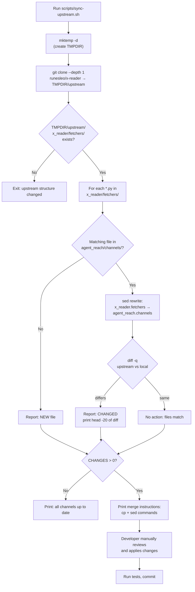
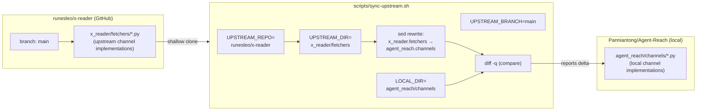

# Upstream Sync

<details>
<summary>Relevant source files</summary>

The following files were used as context for generating this wiki page:

- [LICENSE](LICENSE)
- [scripts/sync-upstream.sh](scripts/sync-upstream.sh)

</details>


This page documents the `scripts/sync-upstream.sh` script, which is used to track and merge channel implementation updates from an upstream open-source repository. This is a developer/contributor workflow concern.

For information about what channels are and how they are structured, see [Channel Architecture](). For information about the overall development environment, see [Development]().

---

## Purpose

Agent Reach's channel implementations are partially derived from the [`runesleo/x-reader`](https://github.com/runesleo/x-reader) project. The script at `scripts/sync-upstream.sh` provides a semi-automated way to identify which channel files have diverged from their upstream counterparts, so a developer can manually review and merge relevant improvements.

The sync is intentionally **manual**: the script only reports differences, it does not apply them automatically. This preserves Agent Reach-specific modifications (import paths, added config integration, etc.) during the merge process.

---

## Repository Mapping

The key relationship is between two directories in two separate repositories:

| Upstream (`runesleo/x-reader`) | Local (`Panniantong/Agent-Reach`) |
|---|---|
| `x_reader/fetchers/` | `agent_reach/channels/` |
| Import prefix: `x_reader.fetchers` | Import prefix: `agent_reach.channels` |

The upstream branch tracked is `main`.

Sources: [scripts/sync-upstream.sh:12-16]()

---

## Script Internals

**Script: `scripts/sync-upstream.sh`**

The script workflow has four phases:

1. **Clone** — shallow-clone the upstream repo into a temporary directory [scripts/sync-upstream.sh:25-27]()
2. **Validate** — confirm that `x_reader/fetchers/` still exists in the upstream (guards against upstream restructuring) [scripts/sync-upstream.sh:29-33]()
3. **Compare** — for each `.py` file in the upstream fetchers directory, diff it against the local channel file of the same name, normalizing import paths before comparing [scripts/sync-upstream.sh:40-58]()
4. **Report** — print a diff summary and emit the exact `cp` + `sed` commands needed to apply each file [scripts/sync-upstream.sh:60-72]()

**Import path normalization in the diff:**

When comparing files, the script rewrites the upstream import prefix on-the-fly using `sed` before passing it to `diff`:

```bash
sed 's/x_reader\.fetchers/agent_reach.channels/g'
```

This means a file that differs only in import paths will appear **unchanged** in the comparison output. Only substantive logic differences are surfaced.

Sources: [scripts/sync-upstream.sh:51-53]()

---

## Workflow Diagram

**Upstream Sync Workflow**



Sources: [scripts/sync-upstream.sh:22-72]()

---

## Comparison Logic Detail

The comparison logic in the script processes each upstream file as follows:

**File Classification**

| Condition | Output Label | Meaning |
|---|---|---|
| File exists upstream but not in `agent_reach/channels/` | `🆕 NEW` | Upstream added a new fetcher; consider porting it |
| File exists in both, content differs (after import rewrite) | `📝 CHANGED` | Upstream has logic changes worth reviewing |
| File exists in both, content matches (after import rewrite) | *(silent)* | In sync; no action needed |

For changed files, the script prints the first 20 lines of the unified diff (`diff --color -u ... | head -20`) followed by an ellipsis, giving a quick overview without overwhelming the terminal.

Sources: [scripts/sync-upstream.sh:40-58]()

---

## Manual Merge Instructions

When changes are detected, the script emits the exact commands needed to apply a specific upstream file:

```sh
cp $TMPDIR/upstream/x_reader/fetchers/FILENAME.py agent_reach/channels/FILENAME.py
sed -i 's/x_reader\.fetchers/agent_reach.channels/g' agent_reach/channels/FILENAME.py
```

After applying:
1. Review the diff manually — the upstream may not have Agent Reach-specific config integration, proxy support, or fallback channels.
2. Run the test suite. See [Testing]() for the test runner.
3. Commit the updated channel file.

> **Important:** The upstream files use raw `x_reader.fetchers` import paths. The `sed` substitution in the merge command handles the rename. Forgetting this step will produce broken imports.

Sources: [scripts/sync-upstream.sh:63-72]()

---

## Structural Diagram: Code Entities

**Entities involved in the sync process**



Sources: [scripts/sync-upstream.sh:12-16]()

---

## Environment and Prerequisites

The script has minimal requirements:

| Requirement | Purpose |
|---|---|
| `bash` | Script interpreter (`set -e` is used) |
| `git` | Shallow-clones the upstream repository |
| `diff` | Compares file content |
| `sed` | Rewrites import paths in-memory before comparison |
| Network access | GitHub must be reachable for the clone step |

The temporary directory is created with `mktemp -d` and is automatically removed on exit via `trap "rm -rf $TMPDIR" EXIT`, so no cleanup is required even if the script is interrupted.

Sources: [scripts/sync-upstream.sh:10-23]()
