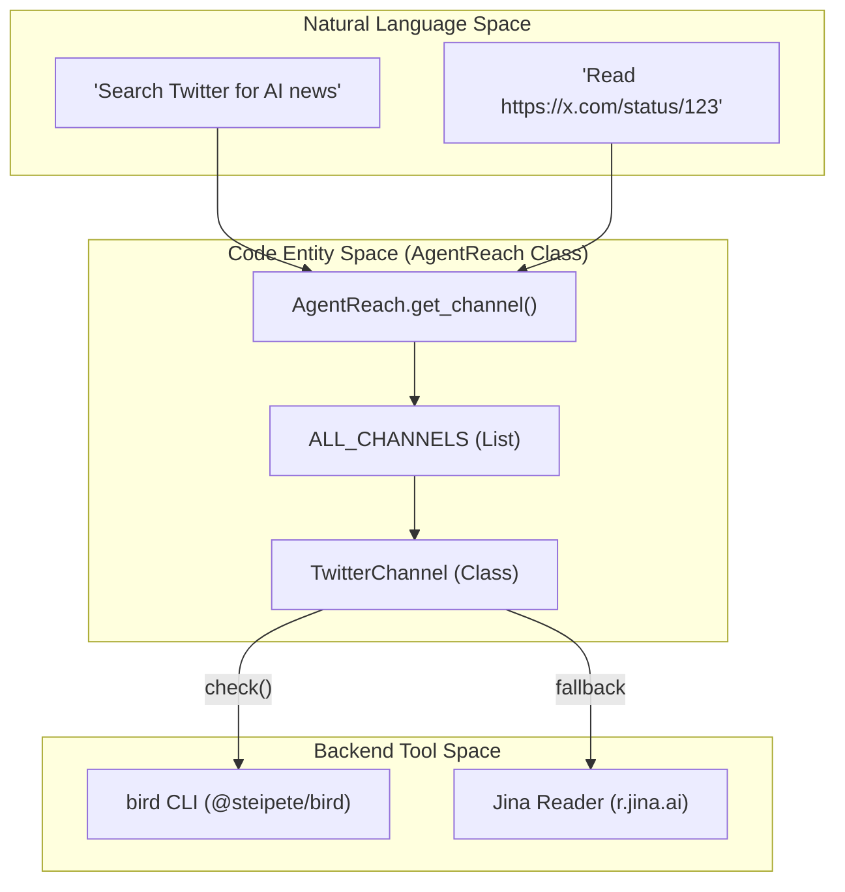
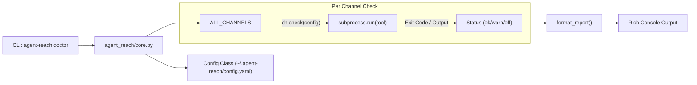

# Glossary

Relevant source files

The following files were used as context for generating this wiki page:

- [README.md](README.md)
- [agent_reach/channels/__init__.py](agent_reach/channels/__init__.py)
- [agent_reach/channels/twitter.py](agent_reach/channels/twitter.py)
- [agent_reach/channels/v2ex.py](agent_reach/channels/v2ex.py)
- [agent_reach/channels/wechat.py](agent_reach/channels/wechat.py)
- [agent_reach/channels/weibo.py](agent_reach/channels/weibo.py)
- [agent_reach/channels/xiaoyuzhou.py](agent_reach/channels/xiaoyuzhou.py)
- [agent_reach/channels/xueqiu.py](agent_reach/channels/xueqiu.py)
- [agent_reach/scripts/transcribe_xiaoyuzhou.sh](agent_reach/scripts/transcribe_xiaoyuzhou.sh)
- [agent_reach/skill/SKILL.md](agent_reach/skill/SKILL.md)
- [tests/test_channel_contracts.py](tests/test_channel_contracts.py)
- [tests/test_channels.py](tests/test_channels.py)
- [tests/test_twitter_channel.py](tests/test_twitter_channel.py)

This page provides definitions for codebase-specific terms, jargon, and abbreviations used throughout Agent Reach. It serves as a technical reference for onboarding engineers to understand the internal nomenclature and the specific tools integrated into the system.

## Core Concepts

### Channel
A **Channel** is a pluggable adapter that provides a standardized interface for interacting with a specific internet platform (e.g., Twitter, GitHub, Reddit). Each channel is responsible for detecting if it can handle a specific URL, checking its own health/dependency status, and providing methods for reading or searching content [agent_reach/channels/base.py:1-50]().

### ALL_CHANNELS
The global registry of all supported platforms. It is an ordered list of instantiated `Channel` objects used by the system to route URLs. The order is significant: the system iterates through this list and calls `can_handle(url)` on each; the first channel to return `True` is selected to process the request [agent_reach/channels/__init__.py:29-46]().

### Tier (0/1/2)
Channels are categorized into tiers based on their configuration requirements:
*   **Tier 0 (Zero Config):** Works out-of-the-box with no API keys or login (e.g., Web, V2EX, Xueqiu) [agent_reach/channels/xueqiu.py:55-55]().
*   **Tier 1 (Needs Key/Tool):** Requires a free API key or a specific system tool installation (e.g., Twitter via `bird`, YouTube via `yt-dlp`) [agent_reach/channels/twitter.py:13-13]().
*   **Tier 2 (Complex Setup):** Requires cookies, stealth browsers, or local Docker containers (e.g., WeChat, Instagram) [agent_reach/channels/wechat.py:17-17]().

### can_handle & check()
*   **`can_handle(url)`**: A method implemented by every channel to determine if a given URL belongs to its platform using regex or domain parsing [agent_reach/channels/twitter.py:15-18]().
*   **`check(config)`**: A diagnostic method used by `agent-reach doctor`. It verifies if the required backends (CLI tools, environment variables, or cookies) are present and functional [agent_reach/channels/twitter.py:20-50]().

### System Entity Mapping

The following diagram illustrates how natural language platform requests map to specific code entities and backend CLI tools.

**Platform Routing and Backend Mapping**

Sources: [agent_reach/channels/__init__.py:29-46](), [agent_reach/channels/twitter.py:9-50](), [README.md:155-187]()

---

## Technical Components & Backends

### bird / birdx
A Node.js-based CLI tool (`@steipete/bird`) used as the primary backend for the Twitter channel. It handles authenticated requests for reading tweets, searching, and viewing timelines [agent_reach/channels/twitter.py:21-26]().

### mcporter
The **Model Context Protocol (MCP) bridge**. It is a CLI tool that allows Agent Reach to call tools from various MCP servers (like Exa, XiaoHongShu, or Weibo) via a unified `mcporter call` interface [agent_reach/skill/SKILL.md:39-41]().

### MCP (Model Context Protocol)
An open standard that enables AI models to connect to external data sources and tools. Agent Reach uses MCP servers to access platforms like XiaoHongShu, Douyin, and Weibo without building custom scrapers for each [README.md:195-200]().

### SKILL.md
A specialized Markdown file located at `agent_reach/skill/SKILL.md`. It contains a structured "Usage Guide" that AI agents (like Claude Code or Cursor) read to understand which commands to run for specific user requests [agent_reach/skill/SKILL.md:1-25]().

### doctor
The diagnostic command (`agent-reach doctor`) that iterates through all registered channels in `ALL_CHANNELS` and executes their `check()` methods to report system health [README.md:61-61](), [agent_reach/channels/__init__.py:49-60]().

### Jina Reader
A fallback web reading service (`https://r.jina.ai/`) that converts any URL into clean, LLM-friendly Markdown. It is used by the `WebChannel` and as a fallback for several Tier 1/2 channels [README.md:192-192]().

### yt-dlp
A powerful command-line media downloader used by the `YouTubeChannel` and `BilibiliChannel` to extract video metadata and subtitles/transcripts [agent_reach/skill/SKILL.md:52-66]().

### gh CLI
The official GitHub Command Line Interface. It is the primary backend for the `GitHubChannel`, handling repository views, issue tracking, and code search [agent_reach/skill/SKILL.md:79-87]().

---

## Specialized Terms

### xsec_token
A mandatory security token required by the XiaoHongShu (XHS) API for fetching feed details. It is usually extracted from browser cookies and passed to the `mcporter` call [agent_reach/skill/SKILL.md:92-94]().

### Node (V2EX)
In the context of the `V2EXChannel`, a **Node** refers to a specific sub-forum or category (e.g., `python`, `tech`, `jobs`) [agent_reach/skill/SKILL.md:205-206]().

### Cookie Auth
A method of authentication where the user exports cookies from their browser (often via the **Cookie-Editor** extension) and provides them to Agent Reach to bypass login screens on platforms like Twitter or XHS [README.md:88-91]().

### Visitor Passport / Passport
Refers to the automated "Visitor Cookie" generation used by the Weibo channel to allow unauthenticated access to hot searches and public profiles [agent_reach/skill/SKILL.md:174-174]().

### Residential Proxy
A recommended configuration for server-side deployments. Since platforms like Reddit and Bilibili often block Data Center IP ranges, a residential proxy is used to make the traffic appear as if it originates from a home network [README.md:91-91]().

### Scaffolding
The design philosophy of Agent Reach. It is not a heavy framework; instead, it acts as **scaffolding** that sets up and configures independent upstream tools, allowing the AI agent to call those tools directly [README.md:157-164]().

### Vibe-coded
A colloquial term used in the development of the project to describe the "zero-config" and "natural language first" approach where the system is optimized for how AI agents "feel" and interact with tools.

---

## Internal Logic Flow

The following diagram describes the data flow when the `agent-reach doctor` command is executed to verify system health.

**Doctor Diagnostic Data Flow**

Sources: [agent_reach/channels/base.py:20-30](), [agent_reach/channels/twitter.py:20-50](), [agent_reach/channels/weibo.py:20-52]()

### Key Classes
*   **AgentReach**: The central orchestrator that manages the lifecycle of requests and channel selection.
*   **Config**: Handles reading and writing to `~/.agent-reach/config.yaml`, managing API keys, and proxy settings [agent_reach/channels/xiaoyuzhou.py:43-46]().

### Upstream Integration Tools
*   **wechat-article-for-ai**: Uses a stealth browser (**Camoufox**) to read WeChat articles [agent_reach/channels/wechat.py:16-16]().
*   **douyin-mcp-server**: An MCP server for parsing Douyin video information [README.md:199-199]().
*   **mcp-server-weibo**: An MCP server for accessing Weibo trends and comments [agent_reach/channels/weibo.py:12-12]().
*   **Groq Whisper**: A pipeline used by the `XiaoyuzhouChannel` to transcribe podcast audio into text using the Groq API [agent_reach/channels/xiaoyuzhou.py:2-13]().

Sources: [README.md:155-200](), [agent_reach/channels/__init__.py:29-46](), [agent_reach/skill/SKILL.md:1-216](), [agent_reach/channels/twitter.py:1-50](), [agent_reach/channels/wechat.py:1-58](), [agent_reach/channels/xiaoyuzhou.py:1-55]()
