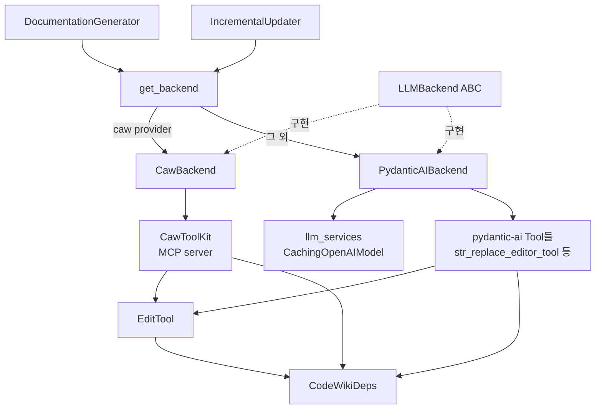
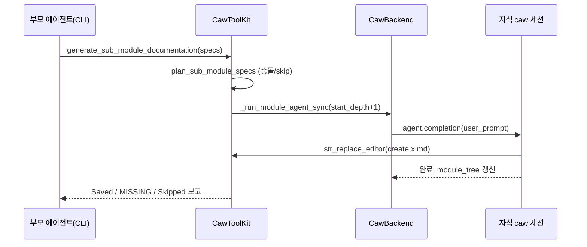
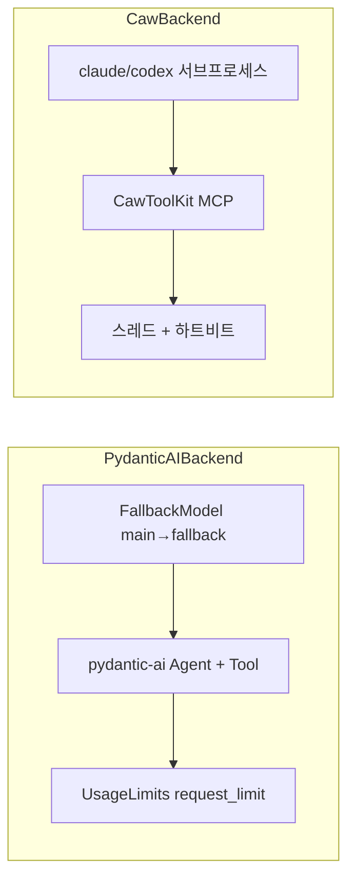

# agent_backends_and_tools

## 개요

`agent_backends_and_tools`는 CodeWiki가 LLM을 호출하는 방식을 하나의 인터페이스(`LLMBackend`) 뒤로 감추고, 문서 작성 에이전트가 사용하는 도구(파일 뷰/편집, 소스 읽기, 하위 모듈 위임)를 제공하는 모듈이다. 두 가지 호출 형태를 다룬다.

- **단발성 동기 completion**: 클러스터링, 부모/레포 overview 생성
- **비동기 다중 턴 에이전트 루프**: 모듈별 문서 작성 및 증분 업데이트

백엔드는 두 가지다.

| 백엔드 | provider | 인증 | 구현 |
|---|---|---|---|
| `PydanticAIBackend` | `openai-compatible`, `anthropic`, `bedrock`, `azure-openai` | API 키 | pydantic-ai + litellm/openai |
| `CawBackend` | `claude-code`, `codex` | CLI 구독(OAuth) | `caw` 라이브러리 → `claude`/`codex` CLI |

이 모듈은 [documentation_generation_core](documentation_generation_core.md)의 `DocumentationGenerator`가 호출하고, [incremental_updater](incremental_updater.md)가 `run_update_agent`로 사용한다. 설정(`Config`)은 [documentation_generation_core](documentation_generation_core.md), 컴포넌트(`Node`)는 [dependency_analysis_engine](dependency_analysis_engine.md)에서 온다.

## 아키텍처

## 핵심 컴포넌트

### `LLMBackend` / `AgentReply` (`backend.py`)

- `LLMBackend`(ABC): `complete()`(단발 completion), `run_module_agent()`(모듈 에이전트 루프, 갱신된 `module_tree` 반환), `run_update_agent()`(증분 업데이트용 편집 에이전트, 기본은 `NotImplementedError`).
- `last_usage`: 가장 최근 호출의 토큰 사용량. 증분 업데이터가 기록용으로 읽는다.
- `AgentReply`: 업데이트 에이전트의 최종 메시지(`text`), `usage`, `seconds`, `meta`.
- `usage_to_dict()`: provider별 usage 객체를 숫자 dict로 변환(best-effort).
- `get_backend(config)`: 유일한 provider 선택 지점. `is_caw_provider()`(`claude-code`, `codex`)면 `CawBackend`, 아니면 `PydanticAIBackend`. 순환 import를 피하려고 함수 내부에서 import한다.

### `PydanticAIBackend` (`pydantic_ai_backend.py`)

API 키 기반 경로. `create_fallback_models(config)`로 만든 `FallbackModel`을 사용한다.

- `complete()`: `call_llm()` 호출 후 `pop_last_usage()`로 usage 수집.
- `run_module_agent()`:
  1. `module_tree.json`을 로드하고, 루트면 `overview.md`, 아니면 `{module_name}.md`가 이미 있으면 건너뜀(재개 지원).
  2. `is_complex_module()`이면 `read_code_components_tool`, `str_replace_editor_tool`, `generate_sub_module_documentation_tool`을 가진 에이전트(`format_system_prompt`), 아니면 위임 도구 없는 leaf 에이전트(`format_leaf_system_prompt`).
  3. `CodeWikiDeps`를 만들고 `agent.run(..., usage_limits=UsageLimits(request_limit=...))` 실행 후 `module_tree` 저장.
- `run_update_agent()`: 읽기 + 편집 도구만 갖고 위임은 없다. 쓰기 범위는 `deps.allowed_write_paths`로 제한.

### `CawBackend` (`caw_backend.py`)

`claude`/`codex` CLI를 `caw`로 감싸는 구독 모드 백엔드.

- 생성 시 CLI 바이너리 존재를 `shutil.which`로 확인, 없으면 `RuntimeError`. claude-code는 `MCP_TOOL_TIMEOUT`/`MCP_TIMEOUT`을 `setdefault`로 늘려 긴 하위 모듈 재귀가 취소되지 않게 한다.
- `config.main_model`은 그대로 CLI에 전달, `fallback_model`은 무시된다.
- 도구 그룹: `ToolGroup.READER | ToolGroup.PARALLEL`. 쓰기 도구(Write/Edit)는 꺼서 반드시 `str_replace_editor`(Mermaid 검증 포함)를 쓰게 한다. codex는 MCP 도구가 안정적으로 동작하도록 `EXEC`를 추가한다.
- `run_module_agent()`는 blocking인 `caw` 호출을 `asyncio.to_thread`로 넘기고, PythonMonkey(Mermaid 검증)가 메인 스레드에 묶여 있으므로 `set_main_loop()`로 메인 루프를 전달한다.
- `_run_module_agent_sync()`:
  - `can_delegate = is_complex_module(...) and start_depth < max_depth and num_tokens >= max_token_per_leaf_module` 로 위임 여부 결정(PydanticAI 경로의 조기 컷과 동일한 취지).
  - `start_depth`와 `module_tree`를 재귀 호출에 전달해 `max_depth` 우회와 디스크 재로드로 인한 트리 손실을 방지.
  - 작업 디렉터리 고정: claude는 repo root(권한 모드가 `acceptEdits`로 다운그레이드돼도 소스 읽기 가능), codex는 docs 출력 디렉터리(`file_change`가 상대 경로를 해석).
- 스톱갭 패치(모듈 import 시 적용, 업스트림 반영 시 제거 대상):
  - `_patch_codex_tool_timeout`: codex의 MCP `tool_timeout_sec`을 24시간으로.
  - `_patch_claude_allowed_tools`: `caw.providers.claude_code`의 `subprocess`를 프록시로 바꿔 `--mcp-config`의 서버들에 `--allowedTools mcp__<server>`를 주입(`_with_allowed_tools`). 전역 `subprocess.Popen`은 건드리지 않는다.

### `CawToolKit` (`caw_toolkit.py`)

세션마다 생성되는 MCP 서버(`codewiki_tools`)로, 세 가지 도구를 노출한다.

| 도구 | 역할 |
|---|---|
| `read_code_components` | component id로 소스 코드 반환(없으면 not found 표기) |
| `str_replace_editor` | `EditTool` 재사용. `working_dir`(`repo`/`docs`)·`command` 검증, 절대경로/`..` 탈출 차단, `allowed_write_paths` 검사, `.md`는 Mermaid 검증 결과 첨부 |
| `generate_sub_module_documentation` | 하위 모듈 위임. `allow_subagent=False`면 호출하지 말라는 안내 반환 |

위임 흐름(`_run_sub_modules`): `plan_sub_module_specs`로 이름 충돌 해결/이미 문서화된 항목 skip → 메모리 상의 `module_tree`에 자식 추가 → 각 하위 모듈에 대해 `deps`의 이름·경로·깊이를 갱신하며 `CawBackend._run_module_agent_sync` 재귀 호출 → 디스크에 실제 저장된 파일과 누락/skip 목록을 보고. 긴 재귀 동안 `_heartbeat`가 10초마다 MCP progress를 보내 CLI가 취소하지 않게 한다. `CawBackend`는 순환 import 방지를 위해 `TYPE_CHECKING`으로만 참조한다.

### `CodeWikiDeps` (`agent_tools/deps.py`)

도구와 에이전트가 공유하는 dataclass. docs/repo 절대 경로, `registry`(편집 이력 저장), `components`, 현재 모듈 경로·이름·깊이, `module_tree`, `max_depth`, `config`, `custom_instructions`, 그리고 `allowed_write_paths`(증분 업데이트 시 허용된 쓰기 경로 집합, `None`이면 제한 없음)를 담는다.

### `str_replace_editor` 도구군 (`agent_tools/str_replace_editor.py`)

SWE-agent의 편집기를 기반으로 한다.

- `EditTool`: `view`/`create`/`str_replace`/`insert`/`undo_edit`. 절대 경로·존재 여부·디렉터리 검증, `old_str` 유일성 검사, 여러 인코딩 fallback 읽기, 편집 이력은 `REGISTRY["file_history"]`(JSON)에 저장. 디렉터리 `view`는 숨김 항목을 제외하되 `.github`는 포함한다. 결과는 `cat -n` 형식이며 16000자 초과 시 `maybe_truncate`.
- `check_write_allowed()`: `allowed_write_paths`를 resolve해 symlink/`..` 우회를 막는다. 허용 목록 밖이면 오류 메시지를 반환.
- `str_replace_editor()`(pydantic-ai용)와 `CawToolKit.str_replace_editor`는 동일 정책(상대 경로 강제, `repo`는 view만, 경로 탈출 차단, Mermaid 검증)을 적용한다.
- `_coerce_json_string`(`ViewRange`, `InsertLine`): 일부 로컬 모델이 리스트/정수를 JSON 문자열로 내보내는 문제를 흡수.
- `Flake8Error`, `format_flake8_output`, `flake8`: 편집 후 lint 경고 필터링. 단 `USE_LINTER = False`가 기본이라 비활성.
- `Filemap`(tree-sitter로 긴 함수 본문 생략), `WindowExpander`(뷰포트를 함수/클래스 경계로 확장): `USE_FILEMAP = False`, `MAX_WINDOW_EXPANSION_* = 0`이 기본이라 사실상 비활성 상태의 옵션 기능이다.

### `llm_services.py`

- `CompatibleOpenAIModel`: 일부 프록시가 `choices[].index`를 `None`으로 주는 응답을 검증 전에 보정.
- `CachingOpenAIModel`: 마지막 system 메시지와 마지막 메시지에 `cache_control: ephemeral`을 주입(Anthropic 프롬프트 캐싱, LiteLLM 등이 전달). 400/422 거절 시 마커 없이 1회 재시도하고 `(base_url, model)`을 모듈 전역 `_CACHE_UNSUPPORTED`에 기록해 이후 주입을 생략. 재시도도 실패하면 캐싱 탓이 아니므로 기록을 되돌린다. pydantic-ai 버전별 `_map_messages` 시그니처 차이도 `inspect`로 처리.
- `create_fallback_models()`: main + fallback 모델을 `FallbackModel`로 묶고, `UnexpectedModelBehavior`(200이지만 본문이 깨진 응답)도 fallback 대상에 포함.
- `call_llm()`: provider별 단발 completion. `bedrock`/`anthropic`은 litellm, `azure-openai`는 `AzureOpenAI`, 기본은 OpenAI 호환 클라이언트. `max_tokens`와 `max_completion_tokens` 중 모델에 맞는 것을 선택하고, 서버가 거절하면 다른 쪽으로 1회 재시도. temperature는 보내지 않는다. `finish_reason == "length"`나 빈 content는 경고 로그를 남기고 `None`을 반환할 수 있다.
- `pop_last_usage()`/`_remember_usage()`: 마지막 completion usage 전달용 모듈 전역 저장소(스레드 안전하지 않음).

## 두 백엔드 비교

| 항목 | PydanticAIBackend | CawBackend |
|---|---|---|
| fallback 모델 | 지원 | 무시 |
| 위임 결정 | `is_complex_module` | `is_complex_module` + 깊이 + 토큰 임계값 |
| 실행 방식 | 네이티브 async | `asyncio.to_thread` + 서브프로세스 |
| 재귀 | 위임 도구가 새 에이전트 생성 | 동기 재귀(`_run_module_agent_sync`) |
| 프롬프트 캐싱 | `CachingOpenAIModel` | CLI에 위임 |

## 운영 시 유의점

- 두 도구 구현(`str_replace_editor`의 pydantic-ai 판/caw 판)은 검증 로직이 중복되어 있어 정책 변경 시 양쪽을 함께 고쳐야 한다.
- `CawBackend`는 프로세스 전역 `cwd`를 바꾸므로 모듈을 순차 처리한다는 전제에 의존한다.
- `caw` 내부(`CodexSession._mcp_config_args`, `claude_code.subprocess`)를 monkey patch하므로 `caw` 업그레이드 시 깨질 수 있다.
- 새 provider를 추가하려면 `LLMBackend`를 구현하고 `get_backend()`에 분기를 추가하면 된다.
