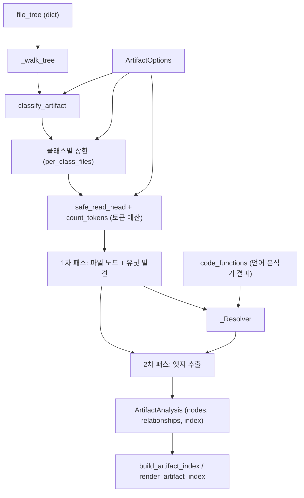
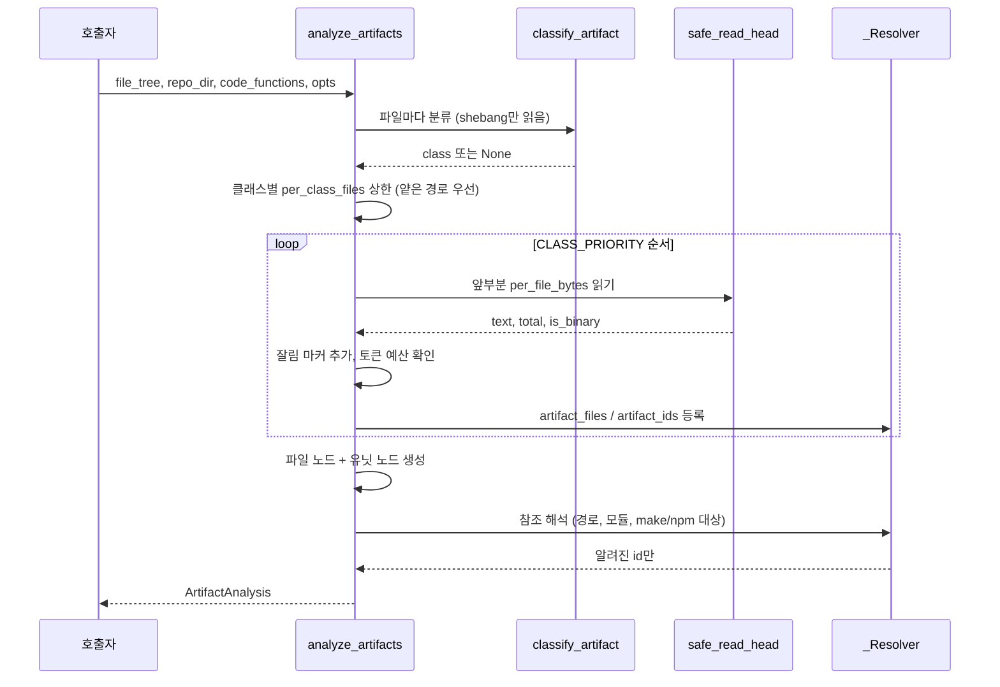
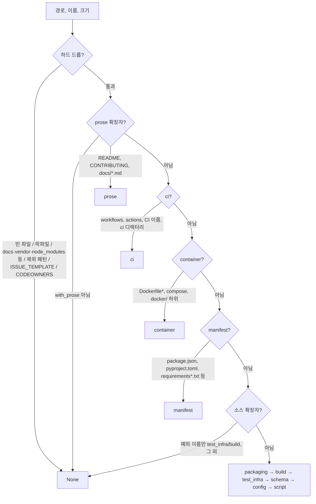

# artifact_analysis 모듈

## 소개

`artifact_analysis`는 `codewiki/src/be/dependency_analyzer/analyzers/artifact.py` 하나로 이루어진 모듈이다. 언어 분석기는 `CODE_EXTENSIONS`에 속한 소스 파일만 본다. 그래서 Dockerfile, GitHub 워크플로, Makefile, `pyproject.toml`, `package.json`, `*.proto` 같이 시스템의 빌드·패키징·배포·설정·테스트 방식을 설명하는 파일은 `Node`가 되지 못했고, 문서에도 나타나지 않았다. 이 모듈은 언어 분석기가 끝난 뒤 같은 파일 트리를 다시 훑어서 그런 파일을 **일급 의존성 그래프 노드(`component_type="artifact"`)**로 만든다.

핵심 컴포넌트는 다음과 같다.

| 컴포넌트 | 역할 |
|---|---|
| `ArtifactOptions` | 분석 옵션 dataclass: 활성화 여부, 토큰 예산, prose 포함 여부, 제외 패턴, 파일/클래스/유닛별 상한 |
| `ArtifactAnalysis` | 결과 컨테이너: `nodes`, `relationships`, `index` |
| `_Resolver` | 텍스트 참조(경로, `module:function`)를 이미 알려진 노드 id로 변환하는 내부 클래스 |

이 모듈은 config나 prompt 코드를 import하지 않는다. `prompt_template`이 이 모듈을 순환 import 없이 가져다 쓸 수 있게 하려는 의도다(모듈 docstring에 명시됨).

## 산출물

1. **파일 노드**: 아티팩트 파일마다 하나. id는 `<relative_path>::<file_name>`, `node_type="artifact_file"`, `source_code`는 상한이 적용된 파일 앞부분이다.
2. **유닛 노드**: 값싼 파서가 있는 경우 파일 안의 단위마다 하나. id는 `<relative_path>::<unit>`, `node_type="artifact_unit"`이다. 단위는 CI job, Dockerfile stage, compose service, Makefile target, `package.json` script, `pyproject.toml`/`setup.cfg` entry point이다.
3. **`CallRelationship` 엣지**: 아티팩트에서 코드 컴포넌트나 다른 아티팩트로 가는 참조이다. `ast_parser`는 해석되지 않은 callee를 이름 매칭으로 대체하기 때문에, **완전히 해석된 id만** `is_resolved=True`로 내보낸다.

## 아키텍처

### 외부 의존성

- `models.core`의 `Node`, `CallRelationship`
- `utils.patterns`의 `ARTIFACT_LOCKFILES`(락파일 제외)
- `utils.security`의 `safe_read_head`(경로 안전 읽기, 바이너리 감지)
- `be.utils`의 `count_tokens`
- `tomllib`(Python 3.11 이상). 없으면 정규식으로 대체한다.

상위 맥락은 [language_analyzers](language_analyzers.md), 그래프 조립은 [dependency_analysis_engine](dependency_analysis_engine.md)을 참고한다. `Node`와 `CallRelationship` 정의는 이 모듈이 아니라 dependency_analysis_engine 쪽 `models/core.py`에 있다.

## 처리 흐름 (`analyze_artifacts`)

1. **분류**: 실제 파일 읽기는 없다. 예외는 `bin/`, `scripts/` 아래 확장자 없는 파일의 shebang 확인뿐이다.
2. **클래스별 상한**: 경로 깊이와 경로 순으로 정렬하고 `per_class_files`(기본 40)개만 남긴다. 나머지는 `omitted_by_class_cap`에 최대 50개까지 기록한다.
3. **예산 내 로딩**: `CLASS_PRIORITY`(`manifest → build → container → ci → packaging → test_infra → schema → config → script → prose`) 순서로 읽는다. 누적 토큰이 `token_budget`(기본 200,000)을 넘으면 그 파일은 `not_loaded_budget`에 기록하고 건너뛴다. 바이너리나 빈 파일도 건너뛴다.
4. **노드 생성**: 1차 패스에서 파일 노드와 유닛 스펙을 만든다. 이렇게 해야 파일 사이의 유닛 참조(예: CI에서 `make lint` 호출)가 해석된다. 유닛 id가 이미 알려진 id와 충돌하면 유닛을 버리고 파일 노드를 유지한다.
5. **엣지 생성**: 2차 패스에서 `_add_edges`가 `resolver.known(callee)`이고 자기 자신이 아닌 경우만 `(caller, callee)` 집합에 넣는다. 결과는 정렬해서 `CallRelationship`으로 내보내므로 출력이 결정적이다.

## 분류 규칙 (`classify_artifact`)

규칙은 위에서 아래로 처음 맞는 것이 적용된다. 순서가 중요하다.

- `manifest`는 `packaging`보다 먼저 판정한다. `packages/*/package.json`이 packaging으로 잘못 분류되지 않게 하기 위해서다.
- 소스 확장자(`.py`, `.js` 등)는 원칙적으로 코드이므로 아티팩트가 아니다. 다만 `conftest.py`, `noxfile.py`, `setup.py`, `webpack.config.js` 등 이름 규칙에 걸리는 것은 예외로 아티팩트가 된다.
- `docs`, `node_modules`, `vendor`, `fixtures` 등 `_DROP_SEGMENTS` 경로는 제외한다. `with_prose=True`이면 최상위 `docs`, `doc`만 예외로 허용한다.
- `opts.exclude_patterns`는 `fnmatch`로 전체 경로와 파일명에 적용하고, 디렉터리 접두사도 검사한다.

## 유닛 파서

라이브러리 없이 정규식이나 표준 라이브러리만 쓰는 가벼운 파서이다.

| 대상 | 함수 | 유닛 |
|---|---|---|
| `.github/workflows/*.yml` | `_yaml_children(text, "jobs")` | job (예: `lint`, `test`) |
| compose 파일 | `_yaml_children(text, "services")` | service |
| Dockerfile | `_dockerfile_units` | `FROM ... AS name` 스테이지. 단일 무명 스테이지면 유닛 없음 |
| Makefile / `*.mk` | `_makefile_units` | 명시적 target. 패턴 규칙, `$` 포함 이름, `.PHONY`, 변수 대입은 제외 |
| `package.json` | `_package_json_units` | `scripts` 항목 |
| `pyproject.toml`, `setup.cfg` | `_entry_point_units` | console script (`tomllib`, 실패 시 정규식) |

유닛이 `per_file_units`(기본 25)보다 많으면 `_prioritise_units`가 `PRIORITY_UNITS`(`build`, `test`, `lint`, `deploy` 등)를 앞에 둔다.

## 참조 해석 (`_Resolver`)

`_Resolver`는 `code_functions`(언어 분석기가 낸 함수/클래스 dict)로 `code_ids`와 `by_path`(상대 경로 → 최상위 정의 id 목록)를 만든다. `class_name`이 있는 항목은 파일을 대표하지 않으므로 `by_path`에서 뺀다.

- `known(node_id)`: 코드 id나 아티팩트 id에 있는지 확인한다.
- `resolve_path(ref, base_dir)`: 다음 경우는 빈 목록을 반환한다.
  - 글롭/변수 문자(`*?$[{}<>|`)가 있는 경우
  - URL, 절대 경로, `..`, `~`인 경우
  - 디렉터리인 경우
  - 정확히 일치하면 코드 id(최대 10개) 또는 아티팩트 파일 id를 반환한다. 일치하지 않으면 마지막 두 세그먼트가 유일하게 맞는 경우에 한해 `dist/lib` → 소스 대체 매칭(`.js` ↔ `.ts`)을 시도한다.
- `resolve_module(module, func)`: `pkg.mod`를 `pkg/mod.py`, `pkg/mod/__init__.py`, `src/pkg/mod.py`, `pkg/mod/__main__.py` 후보로 바꾸고, `func`가 있으면 `path::func` id를 먼저 찾는다.

`_refs_from_shell_text`는 CI `run:` 블록, Dockerfile `RUN/CMD/ENTRYPOINT`, Makefile 레시피, npm 스크립트 값에서 다음 참조를 추출한다.

- 경로 토큰(`PATH_TOKEN_RE`)
- `python -m module`(`PYTHON_MODULE_RE`)
- `make target`(`MAKE_TARGET_RE`)
- `npm/pnpm/yarn/bun run script`(`NPM_SCRIPT_RE`, `_NPM_RESERVED` 제외)
- `docker build -f file`(`DOCKER_BUILD_FILE_RE`)

### 아티팩트 종류별 엣지

| 종류 | 엣지 |
|---|---|
| 모든 파일 | 파일 노드 → 자신의 유닛 노드 |
| GitHub 워크플로 job | 로컬 `uses: ./action` → `action.yml`, `working-directory` 기준 셸 텍스트 참조 |
| compose service | `build.context` + `dockerfile` → Dockerfile |
| Dockerfile 스테이지 | `COPY/ADD` 소스 경로, `--from=alias` → 다른 스테이지, `RUN/CMD/ENTRYPOINT` 참조 |
| Makefile | `include` 파일, target 레시피 참조, 헤더의 선행 조건(다른 target 또는 파일) |
| `package.json` | `main/module/types/browser`, `bin`, `exports`(재귀), 각 script 값 |
| `pyproject.toml` / `setup.cfg` | entry point → `resolve_module(module, func)`로 코드 함수 |
| `script`, `ci`, `packaging`, `test_infra` | 파일 전체 텍스트 참조 |

## 인덱스와 프롬프트 렌더링

`analyze_artifacts`는 `index` dict를 만든다. 내용은 `token_budget`, `tokens_used`, `caps`, `with_prose`, 클래스별 파일 목록(`truncated`, `units` 포함)·`omitted_by_class_cap`·`not_loaded_budget`, 노드/엣지 수이다.

프롬프트용 렌더링은 JSON이 아니라 `Node` 객체에서 다시 만든다(주석에 "prompts never read the JSON"이라고 명시).

- `build_artifact_index(components)`: 아티팩트 파일 노드를 클래스별로 묶고 유닛 이름을 붙인다. `[codewiki: truncated` 마커 유무로 잘림 여부를 판단한다.
- `render_artifact_index(components, max_files_per_class=40)`: `<REPOSITORY_ARTIFACTS>` 텍스트 블록을 만든다. 아티팩트가 없으면 `""`을 반환한다. 이 블록이 이 문서를 만든 프롬프트 상단의 저장소 아티팩트 목록이다.

## 이 저장소에 대한 적용 예

REPOSITORY_ARTIFACTS 목록 기준으로 이 모듈이 분류·파싱하는 대상은 다음과 같다. 아래 항목은 목록의 요약만 근거로 했고, 각 파일의 내용은 열어 확인하지 않았다(미확인).

- manifest: `pyproject.toml`(유닛 `codewiki`), `requirements.txt`
- container: `docker/Dockerfile`, `docker/docker-compose.yml`(service `codewiki`)
- ci: `.github/workflows/ci.yml`(job `lint`, `test`)

`pyproject.toml`의 console script `codewiki`는 `resolve_module`을 통해 CLI 진입 함수로 연결될 수 있다. 관련 컴포넌트는 [build_ci_and_deployment](build_ci_and_deployment.md)와 [user_interfaces_and_entry_points](user_interfaces_and_entry_points.md)에서 다룬다.

## 유의사항

- **상한**: 큰 저장소에서는 `per_file_bytes`(16,384), `per_class_files`(40), `per_file_units`(25), `token_budget`(200,000)이 출력을 제한한다. 잘린 파일은 `TRUNCATION_MARKER`가 붙는다.
- **정규식 기반 파서**: YAML/Makefile/Dockerfile을 실제 파서 없이 정규식으로 처리하므로 복잡한 문법(앵커, 멀티라인 연속 등)은 유닛이나 엣지를 놓칠 수 있다. 의도된 트레이드오프이다(모듈 docstring의 "cheap parser").
- **정확도 우선**: 해석되지 않는 참조는 버려서 이름 매칭 오탐을 피한다. 재현율은 낮아질 수 있다.
- **`package.json` 유닛 위치**: 스크립트 시작 위치를 `"key":` 정규식 첫 매칭으로 찾아서, 다른 곳에 같은 키 이름이 먼저 나오면 줄 번호가 어긋날 수 있다(코드에서 확인한 동작이며, 영향은 추론).
