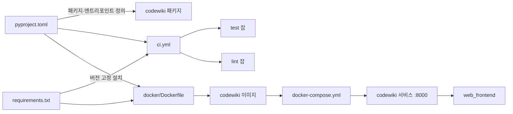
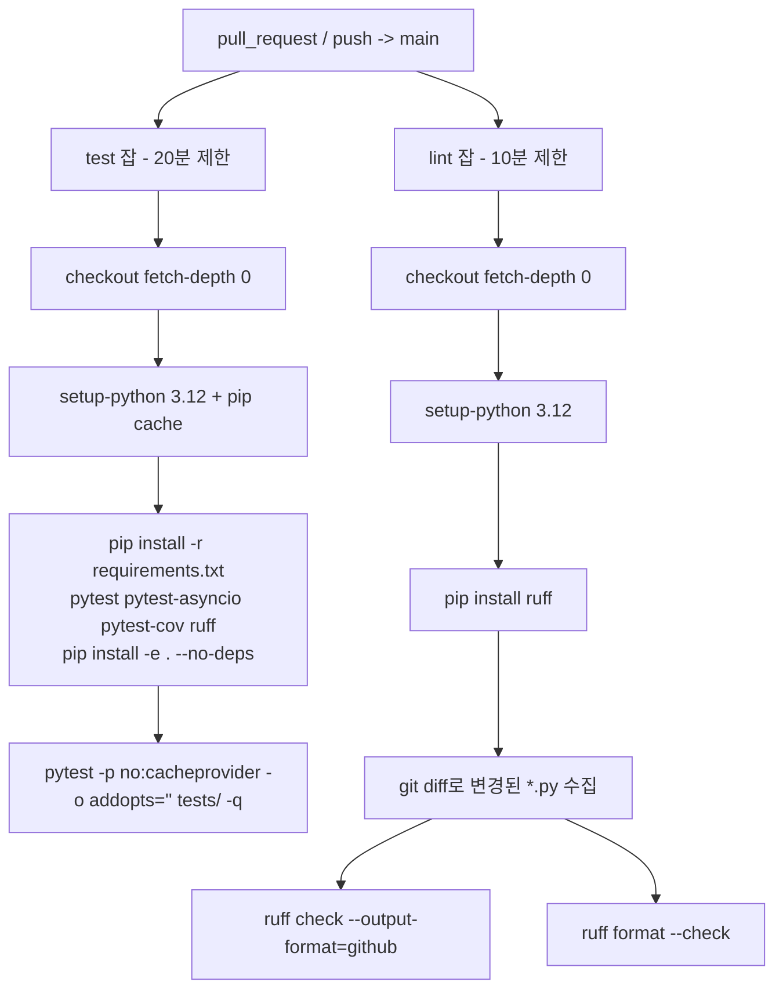
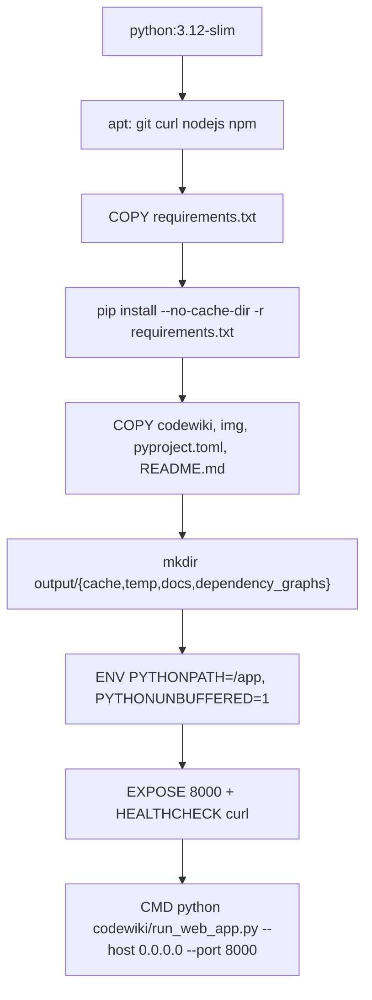
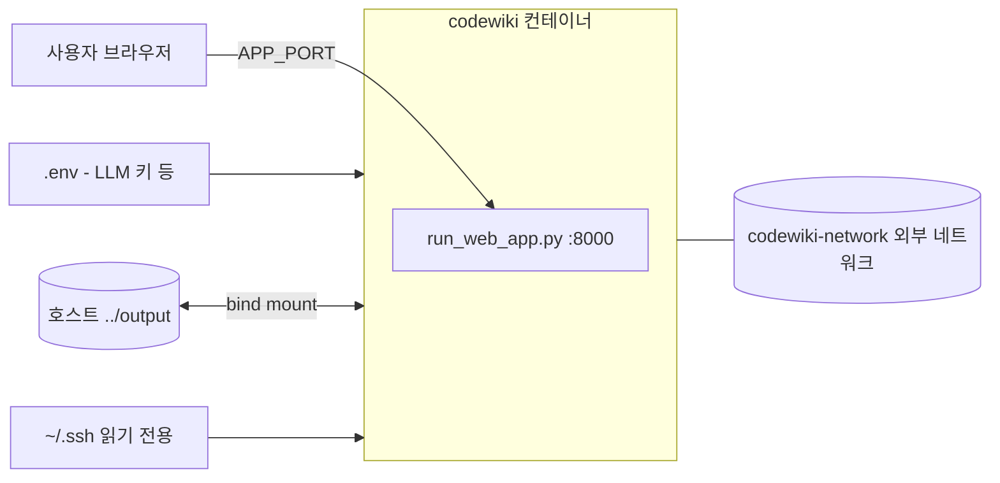

# build_ci_and_deployment 모듈

`build_ci_and_deployment`는 CodeWiki를 **패키징(빌드) → 검증(CI) → 컨테이너 배포**하는 데 쓰이는 설정 파일 묶음이다. 실행 로직은 없고 선언적 설정만 있다. 각 파일은 저장소의 다른 모듈을 설치·검증·실행하는 방식을 정의한다.

| 파일 | 역할 |
|---|---|
| `pyproject.toml` | 패키지 메타데이터, 의존성, 엔트리포인트(`codewiki`), 도구 설정(ruff/black/mypy/pytest) |
| `requirements.txt` | 고정(pinned) 버전 의존성 목록. CI와 Docker 빌드가 사용 |
| `.github/workflows/ci.yml` | GitHub Actions의 `test`, `lint` 잡 |
| `docker/Dockerfile` | 웹 앱 이미지 빌드 정의 |
| `docker/docker-compose.yml` | `codewiki` 서비스 실행 정의(포트, 볼륨, 헬스체크, 네트워크) |

검증 수준: 아래 내용은 제공된 파일 내용을 직접 읽은 **코드 확인**이다. 개발자 의도 해석은 `추론`으로 표시했다.

## 1. 전체 구조



빌드 대상 코드는 다음 모듈에 있다.
- CLI 진입점 `codewiki.cli.main:cli`: [user_interfaces_and_entry_points](user_interfaces_and_entry_points.md)
- 웹 앱(`codewiki/run_web_app.py`, `codewiki/src/fe`): [web_frontend](web_frontend.md)
- 문서 생성 파이프라인: [documentation_generation_pipeline](documentation_generation_pipeline.md)
- 언어별 파서(tree-sitter): [source_code_analysis_engine](source_code_analysis_engine.md)

## 2. 패키징 — `pyproject.toml`

- **빌드 백엔드**: `setuptools>=68.0.0` + `wheel` (`setuptools.build_meta`).
- **프로젝트**: 이름 `codewiki`, 버전 `2.0.0`, `requires-python >=3.12`, MIT 라이선스.
- **엔트리포인트**: `[project.scripts] codewiki = "codewiki.cli.main:cli"`. 설치하면 `codewiki` 명령이 생긴다.
- **패키지 목록**: `[tool.setuptools] packages`에 하위 패키지를 명시적으로 나열한다(`codewiki.cli.*`, `codewiki.src.be.*`, `codewiki.src.fe`, `codewiki.mcp`, `codewiki.mcp.tools` 등). 자동 탐색이 아니므로 **새 하위 패키지를 추가하면 이 목록에도 넣어야 한다.** 빠지면 배포본에서 import 오류가 난다(`추론`: 목록 누락 시 wheel에 포함되지 않음).
- **package-data**: `codewiki`에 `templates/**/*`, `py.typed` 포함.
- **의존성 범주**
  - CLI/설정: `click`, `keyring`, `GitPython`, `Jinja2`, `rich`, `colorama`
  - 코드 분석: `tree-sitter` 및 언어별 grammar(Python, Java, JS, TS, C, C++, C#, PHP, Kotlin, Ruby, Scala). Scala는 `<0.24.0`으로 상한 고정
  - LLM: `openai`, `litellm`, `pydantic-ai`, `pydantic`, `logfire`
  - 웹: `fastapi`, `uvicorn`, `python-multipart`
  - 기타: `networkx`, `pathspec`, `psutil`, `PyYAML`, `mermaid-parser-py`, `mermaid-py`, `mcp`
  - `coding-agent-wrapper`는 Git 브랜치(`fix/codex-exec-robustness`)를 직접 참조한다. 재현성이 떨어질 수 있으므로 브랜치가 사라지면 설치가 깨진다.
- **`[external] build-requires`**: `nodejs>=14`. 주석에 따르면 `mermaid-parser-py`가 끌어오는 PythonMonkey의 `pminit`이 **설치 시점**에 npm을 호출하기 때문이다. `mermaid-py`는 Node가 필요 없고 원격 렌더 서비스(기본 mermaid.ink)로 HTTP 검증한다. 이것이 Dockerfile이 `nodejs`, `npm`을 설치하는 이유다.
- **optional `dev`**: `pytest`, `pytest-cov`, `pytest-asyncio`, `black`, `mypy`, `ruff`.
- **도구 설정**
  - `ruff`: line-length 100, `py312`, lint 규칙 `E4, E7, E9, F`. 주석대로 ruff 0.16에서 기본 규칙이 크게 늘어났기 때문에, 버전 미고정 `pip install ruff`를 쓰는 CI가 흔들리지 않도록 이전 기본값으로 고정했다.
  - `black`(line-length 100), `mypy`(3.12, 느슨한 설정).
  - `pytest`: `testpaths=["tests"]`, `addopts = "-v --cov=codewiki --cov-report=term-missing"`, 일부 디렉터리(`.venv`, `atlascloud`, `titan-sight`) 제외.

## 3. 의존성 고정 — `requirements.txt`

`==`로 버전을 고정한 전이(transitive) 의존성 전체 목록이다(예: `pydantic-ai==1.0.6`, `litellm==1.77.0`, `tree-sitter==0.23.2`, `pythonmonkey==1.2.0`, `mcp==1.12.3`). 예외로 `keyring>=24.0.0`은 범위 지정이다.

주의할 점:
- `appnope`, `ipykernel`, `ipython`, `debugpy` 등 개발·노트북 성격 패키지도 포함되어 있다. macOS 전용 `appnope`가 들어 있어 `pip freeze` 결과를 그대로 옮긴 것으로 보인다(`추론`).
- `pyproject.toml`에는 `tree-sitter-scala>=0.23.2,<0.24.0`인데 `requirements.txt`는 `tree-sitter-scala==0.23.4`로 범위 안에 있어 서로 모순되지 않는다.
- `pyproject.toml`의 `coding-agent-wrapper`(Git 의존성)는 `requirements.txt`에 없다. 그래서 `pip install -r requirements.txt` 후 `pip install -e . --no-deps`를 하는 CI에서는 이 패키지가 설치되지 않는다. Docker 이미지도 같은 이유로 설치하지 않는다. 이 패키지를 쓰는 코드(`caw_backend.py` 등, [agent_backends_and_tools](agent_backends_and_tools.md) 참고)는 CI 테스트에서 import할 수 없을 수 있다(`추론`, 실제 import 방식은 **미확인**).

## 4. CI — `.github/workflows/ci.yml`

트리거: `main` 브랜치 대상 `pull_request`와 `push`. 권한은 `contents: read`로 최소화했다. 두 잡은 병렬로 실행된다.



### `test` 잡
- `pip install -e . --no-deps`로 의존성은 `requirements.txt`가 담당하고, 패키지 자체만 editable 설치한다.
- `-o addopts=""`로 `pyproject.toml`의 `addopts`(`-v --cov ...`)를 덮어써서 커버리지·상세 출력을 끈다. `-p no:cacheprovider`는 pytest 캐시 디렉터리를 만들지 않는다.

### `lint` 잡
- **변경된 Python 파일만** 검사한다. `pull_request`면 `base...head`, `push`면 `github.event.before..GITHUB_SHA` 범위의 `git diff --name-only --diff-filter=ACMR -z`를 쓴다. 그래서 두 이벤트 모두 `fetch-depth: 0`이 필요하다. 기존 코드의 lint 부채를 무시하고 새 변경만 강제하려는 설계로 보인다(`추론`).
- `-z`(NUL 구분)와 `xargs -0 -r`을 함께 써서 공백 포함 파일명을 안전하게 처리하고, 변경 파일이 없으면 실행하지 않는다.
- 이벤트 값은 `env`로 전달하고 셸에서 `"$VAR"`로 참조한다. 스크립트 인젝션을 피하는 표준 방식이다.
- `ruff check`는 `github` 출력 형식으로 PR에 주석을 달고, `ruff format --check`는 포맷만 검사한다.
- 알려진 한계: 새 브랜치의 첫 push처럼 `github.event.before`가 전부 0인 SHA일 때는 `git diff`가 실패할 수 있다(`추론`, 실행 확인 안 함).

## 5. 컨테이너 — `docker/Dockerfile`



- **레이어 캐시 최적화**: `requirements.txt`를 소스보다 먼저 복사해 소스만 바뀌면 의존성 레이어를 재사용한다.
- **시스템 패키지**: `git`(GitPython, 저장소 clone), `curl`(헬스체크), `nodejs`/`npm`(PythonMonkey 설치, 2절 참고).
- **패키지 설치 방식**: `pip install -e .`나 `pip install .`을 하지 않는다. 대신 `PYTHONPATH=/app`으로 소스를 직접 import한다. 따라서 이미지에서는 `codewiki` CLI 스크립트가 등록되지 않고, `pyproject.toml`의 `packages` 목록도 영향을 주지 않는다.
- **출력 디렉터리**: `output/cache`, `output/temp`, `output/docs`, `output/dependency_graphs`. 웹 앱의 캐시·작업 결과 저장 위치이며 [web_frontend](web_frontend.md)의 `CacheManager`, `WebAppConfig`와 연관된다(경로 사용 방식은 **미확인**).
- **헬스체크**: 30초 간격, 타임아웃 10초, 시작 유예 5초, 재시도 3회로 `curl -f http://localhost:8000/`를 호출한다.

## 6. 배포 — `docker/docker-compose.yml`

| 항목 | 값 |
|---|---|
| 서비스/컨테이너 | `codewiki` |
| 이미지 | `codewiki:0.0.1` (빌드 컨텍스트 `..`, `docker/Dockerfile`) |
| 포트 | `${APP_PORT:-8000}:8000` |
| 환경 | `PYTHONPATH`, `PYTHONUNBUFFERED`, `../.env` (`env_file`) |
| 볼륨 | `../output:/app/output`(영속 캐시·결과), `~/.ssh:/root/.ssh:ro`(비공개 저장소용) |
| 네트워크 | 외부 네트워크 `codewiki-network`(별칭 `net`) |
| 재시작 | `unless-stopped` |
| 헬스체크 | Dockerfile과 같은 `curl` 방식, `start_period` 20초 |



운영 시 알아 둘 점:
- `codewiki-network`는 `external: true`라서 **미리 만들어야 한다**: `docker network create codewiki-network`. 없으면 `docker compose up`이 실패한다.
- `../.env`도 미리 있어야 한다. `.env`에 들어갈 설정 키는 [web_frontend](web_frontend.md)의 `WebAppConfig`와 [documentation_generation_core](documentation_generation_core.md)의 `Config`를 참고한다.
- `~/.ssh`를 읽기 전용으로 마운트하므로 호스트 SSH 키가 컨테이너에 노출된다. 비공개 저장소가 필요 없다면 제거하는 편이 안전하다.
- `image`의 태그 `0.0.1`은 `pyproject.toml`의 `version = "2.0.0"`과 불일치한다. 릴리스마다 자동 동기화되지 않는다.
- Compose 실행 명령: `docker compose -f docker/docker-compose.yml up -d --build`.

## 7. 로컬 개발·검증 재현

CI와 동일하게 로컬에서 검증하려면 다음과 같이 한다.

```bash
pip install -r requirements.txt
pip install pytest pytest-asyncio pytest-cov ruff
pip install -e . --no-deps
pytest -p no:cacheprovider -o addopts="" tests/ -q
ruff check <변경된 파일> && ruff format --check <변경된 파일>
```

## 8. 다른 모듈과의 관계 요약

| 이 모듈의 산출물 | 소비/대상 모듈 |
|---|---|
| `[project.scripts] codewiki` | [cli_generation_and_utils](cli_generation_and_utils.md), [cli_config_and_models](cli_config_and_models.md) |
| Docker `CMD` (`run_web_app.py`) | [web_frontend](web_frontend.md) |
| tree-sitter 의존성 | [language_analyzers](language_analyzers.md), [dependency_analysis_engine](dependency_analysis_engine.md) |
| `mcp` 의존성, `codewiki.mcp` 패키지 | [mcp_server](mcp_server.md) |
| `pydantic-ai`, `litellm`, `openai` | [agent_backends_and_tools](agent_backends_and_tools.md) |
