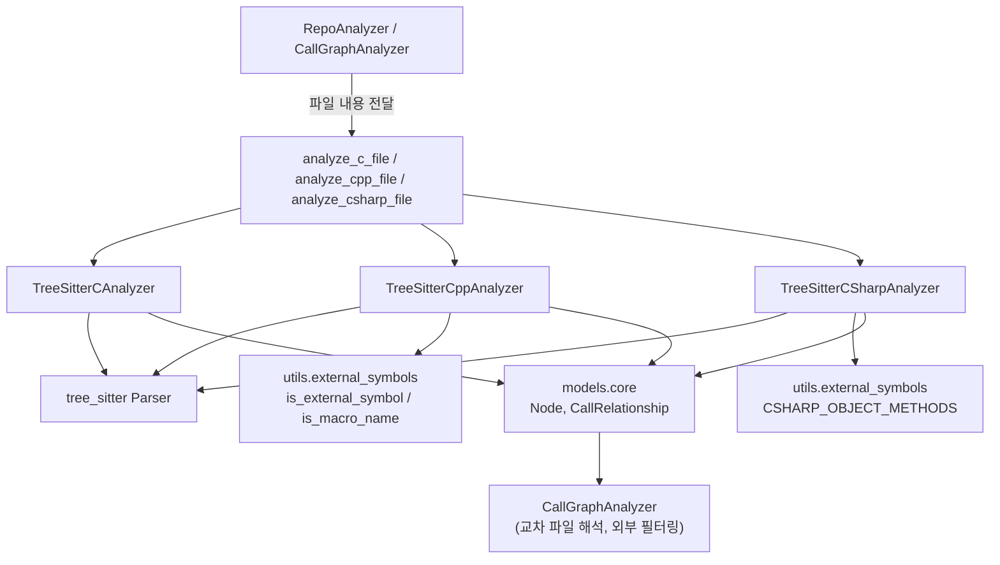
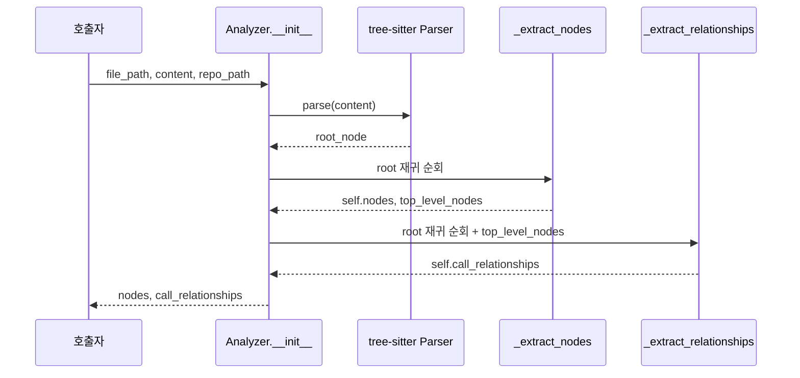
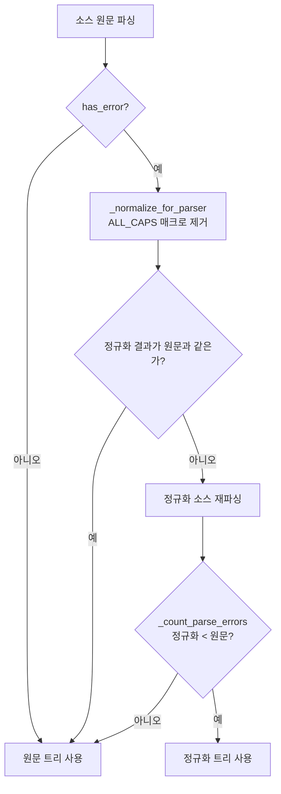
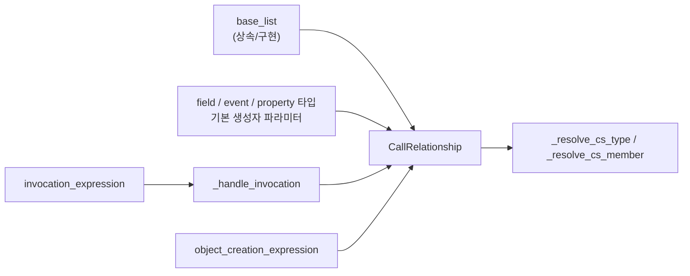

# c_family_analyzers 모듈

## 1. 개요

`c_family_analyzers`는 CodeWiki의 의존성 분석 엔진 중 **C, C++, C#** 소스 파일을 tree-sitter로 파싱하여 코드 컴포넌트(`Node`)와 컴포넌트 간 관계(`CallRelationship`)를 추출하는 언어별 분석기 모음이다.

| 파일 | 클래스 | 진입 함수 | 언어 |
|---|---|---|---|
| `codewiki/src/be/dependency_analyzer/analyzers/c.py` | `TreeSitterCAnalyzer` | `analyze_c_file` | C (`.c`, `.h`) |
| `codewiki/src/be/dependency_analyzer/analyzers/cpp.py` | `TreeSitterCppAnalyzer` | `analyze_cpp_file` | C++ |
| `codewiki/src/be/dependency_analyzer/analyzers/csharp.py` | `TreeSitterCSharpAnalyzer` | `analyze_csharp_file` | C# |

세 분석기는 동일한 계약을 따른다.

- 생성자 `(file_path, content, repo_path=None)` 안에서 즉시 `_analyze()`를 실행한다.
- 결과는 `self.nodes: List[Node]`, `self.call_relationships: List[CallRelationship]`에 저장된다.
- 컴포넌트 ID는 `"<repo 상대경로>::<이름>"` 형식이다 (`_get_component_id`).
- 이름 해석이 끝나지 않은 참조는 `is_resolved=False`로 내보내고, 파일 간 해석과 외부 심볼 필터링은 상위의 `CallGraphAnalyzer`가 맡는다. 자세한 내용은 [dependency_analysis_engine](dependency_analysis_engine.md)를 참고한다.

상위 그룹 [language_analyzers](language_analyzers.md)에는 형제 모듈인 [artifact_analysis](artifact_analysis.md), [jvm_language_analyzers](jvm_language_analyzers.md), [web_language_analyzers](web_language_analyzers.md), [scripting_language_analyzers](scripting_language_analyzers.md)가 있다. C#은 Java 분석기를 이식한 것이므로 [jvm_language_analyzers](jvm_language_analyzers.md)와 구조가 비슷하다.

## 2. 아키텍처

### 공통 처리 흐름

두 번의 AST 순회로 이루어진다. 첫 번째 순회는 선언(노드)을 수집해 `top_level_nodes` 심볼 테이블을 만든다. 두 번째 순회는 그 테이블을 참조해 관계를 만든다.

## 3. 컴포넌트 상세

### 3.1 `TreeSitterCAnalyzer` (`c.py`)

가장 단순한 분석기다.

- **추출 대상**: `function_definition`(function), `struct_specifier`와 `typedef struct`(struct), 전역 `declaration`(variable).
- **노드 등록 규칙**: `function`과 `struct`만 `self.nodes`에 들어간다. 전역 변수는 `top_level_nodes`에만 등록되어 관계 추출용 심볼 테이블로 쓰인다.
- **관계**
  1. `call_expression` → 호출 이름만으로 `CallRelationship(is_resolved=False)`를 만든다. libc 등 외부 함수 필터링은 `CallGraphAnalyzer`가 파일 간 해석 뒤에 수행하므로, libc 이름을 가리는 프로젝트 함수의 엣지도 보존된다.
  2. 함수 안에서 전역 변수 식별자를 사용하면 `is_resolved=True` 엣지를 만든다. 같은 파일 안의 관계이기 때문이다.
- `_find_containing_function`은 부모 방향으로 올라가며 `function_definition`을 찾는다.
- `_is_global_variable`은 `function_definition` 안에 있는 선언을 제외한다.
- `_get_module_path`는 `.c`와 `.h` 확장자를 제거한다.

### 3.2 `TreeSitterCppAnalyzer` (`cpp.py`)

C 분석기보다 훨씬 많은 것을 다룬다.

**추출 대상 타입**: `class`, `struct`, `function`, `method`, `type_alias`(`using X = ...`, `typedef`), `namespace`, `variable`. `self.nodes`에는 `class`, `struct`, `function`, `method`, `type_alias`만 포함된다. `namespace`와 `variable`은 심볼 테이블에만 남는다.

**메서드 ID**: `"<path>::<Class>.<method>"`. 클래스 안에 정의된 메서드, 클래스 안의 선언, 그리고 `Foo::bar()`처럼 외부에 정의된 멤버(`qualified_identifier`의 마지막에서 두 번째 요소가 클래스)를 모두 처리한다. `top_level_nodes`에는 같은 노드가 `component_id`, 이름, `Class.method` 등 여러 키로 등록된다.

#### 매크로 복구 파싱

- 모듈 상단의 정규식(`_SPECIFIER_MACRO_RE`, `_SPECIFIER_MACRO_CALL_RE`, `_KEYWORD_MACRO_RE`, `_STANDALONE_MACRO_RE`)이 `EXPORT_API void foo()`, `class LIB_API logger {`, `LIB_BEGIN_NAMESPACE` 같은 내보내기·가시성 매크로를 제거한다.
- 이름 규칙은 라이브러리별 접두어가 아니라 ALL_CAPS 관례에 의존한다. `is_macro_name`으로 한 번 더 확인한다.
- 줄 수를 바꾸지 않는다(삭제할 줄은 빈 줄로 대체). 따라서 `start_line`/`end_line`이 정확하게 유지된다.
- Win32의 `HANDLE`/`DWORD`처럼 타입이 ALL_CAPS인 코드에서는 정규화가 오히려 해가 될 수 있다. 그래서 오류 개수를 비교해 더 나은 쪽만 채택하며, 깨끗한 파일은 건드리지 않는다.

#### 관계 추출

| AST 노드 | 결과 엣지 | `is_resolved` |
|---|---|---|
| `call_expression` (멤버 호출) | 수신자 변수 타입을 `_find_variable_type`으로 찾고 `_find_method_component`로 `Class.method` 해석 | True (해석 성공 시) |
| `call_expression` (일반 호출) | 같은 파일 심볼이면 해당 ID, 아니면 단순 이름 | True / False |
| `base_class_clause` | 포함 클래스 → 기반 클래스 이름 | False |
| `new_expression` | 함수 → 인스턴스화 대상 클래스 | True |
| 전역 변수 `identifier` | 함수 → 변수 | False |

억제 규칙:

- 수신자 타입을 알 수 없는 멤버 호출은 `_is_system_function`(`is_external_symbol("cpp", ...)` 또는 매크로 이름)이면 버린다. STL 멤버 노이즈를 줄이기 위해서다.
- 일반 호출은 매크로 이름이거나 템플릿 파라미터(`_find_template_parameters`)이면 내보내지 않는다. 외부 심볼 필터링은 이후 중앙에서 한다.
- 기반 클래스가 템플릿 파라미터나 매크로이면 건너뛴다.

`_class_has_method`는 클래스 소스 텍스트에서 `name(`과 `void`/`int`/`bool` 같은 문자열을 찾는 **문자열 휴리스틱**이다. 정확한 시그니처 분석이 아니므로 오탐 가능성이 있다.

### 3.3 `TreeSitterCSharpAnalyzer` (`csharp.py`)

Java 분석기를 이식한 것으로, 네임스페이스 한정 이름과 `using` 기반 해석을 갖춘다.

**추가 상태**

| 필드 | 의미 |
|---|---|
| `alias_map` | `using A = B.C;` 별칭 매핑 |
| `using_namespaces` | 일반 `using X;` 목록 |
| `static_usings` | `using static X;` 목록 |
| `file_scoped_namespace` | `namespace X;` 파일 범위 네임스페이스 |

`_extract_usings`가 AST 순회로 이 값을 채우며, 정규식이 놓치기 쉬운 블록 네임스페이스 안의 `using`과 `global using`도 처리한다.

**노드 종류**: `class`, `static class`, `abstract class`, `interface`, `struct`, `enum`, `record`, `record struct`, `delegate`, `method`. 메서드는 `Class.method` 이름을 가지며, `qualified_name`은 `_qualify`가 네임스페이스와 중첩 타입을 이어 붙여 만든다. `///` XML 문서 주석은 `_extract_doc_comment`가 수집해 `docstring`으로 채운다(사이의 `attribute_list`는 건너뜀).

**관계 추출**: 모든 엣지가 `is_resolved=False`로 나가며 실제 해석은 공통 리졸버가 맡는다.

`_handle_invocation`의 분기:

1. **단순 식별자 / `this.X()`**: `_enclosing_member_candidates`로 둘러싼 타입의 멤버 후보를 시도한다. 없으면 `static_usings`마다 `"<static>.<method>"` 후보를 하나씩 내보낸다(어느 `using static`에서 왔는지 알 수 없기 때문). 맞는 후보는 이후 교차 파일 해석에서 해석되고, 없는 것은 미해결로 남는다.
2. **`base.X()`**: 첫 번째 기반 타입을 대상으로 삼는다.
3. **`receiver.X()`**: `_find_variable_type`이 파라미터, 지역 변수(`var x = new T()`인 경우만 복구), 기본 생성자 파라미터, 필드, 프로퍼티 순으로 타입을 찾는다. 변수가 없고 PascalCase(전부 대문자 아님)이면 정적 호출로 보고 타입 이름으로 취급한다.
4. **체인/한정 수신자** (`a.B().C()`, `Outer.Inner.M()`): 지원하지 않고 건너뛴다.
5. `System.Object` 메서드(`CSHARP_OBJECT_METHODS`)는 프로젝트에 없는 경우 엣지를 만들지 않는다.

**타입 필터링 원칙 ("resolve first, filter second")**: `_skip_type`은 기본형(`_CSHARP_PRIMITIVES`)과 범위 안의 제네릭 타입 파라미터만 제외한다. `List`, `Console` 같은 프레임워크 타입은 프로젝트 타입이 같은 이름을 가릴 수 있으므로 추출 시점에 버리지 않는다. 미해결로 내보낸 뒤 하류의 `_is_external_callee`가 분류한다.

**타입 해석 순서** (`_resolve_cs_type`): 이미 점이 있는 이름 → `alias_map` → 둘러싼 타입 기준 한정 후보 → `using_namespaces`에서 알려진 노드 → 단순 이름 그대로 반환. 마지막에 파일 자신의 네임스페이스를 만들어 붙이지 않는 것은 의도적이다. 서드파티 타입이 프로젝트 타입으로 오인되는 것을 막고, 프로젝트 타입은 단순/꼬리 이름으로 교차 파일 매칭이 가능하게 한다.

**알려진 한계** (모듈 docstring에 명시)

- 여러 파일에 걸친 `partial class`는 파일마다 노드가 생기며, 단순 참조는 미해결로 남는다.
- 최상위 문(`global_statement`)의 호출은 포함 타입이 없어 귀속되지 않는다.
- 파일 간 `global using` 가시성, `new()` 암시적 생성, 튜플 타입, 체인 수신자 타입은 모델링하지 않는다.

## 4. 세 분석기 비교

| 항목 | C | C++ | C# |
|---|---|---|---|
| 노드 종류 | function, struct | class, struct, function, method, type_alias | class 계열, interface, struct, enum, record, delegate, method |
| 메서드/멤버 | 없음 | `Class.method` | `Class.method` |
| 이름 한정 | 없음 | 클래스 한정만 | 네임스페이스 + 중첩 타입 |
| 문서 주석 | 없음 | 없음 | `///` |
| 전처리/매크로 대응 | 없음 | 오류 비교 기반 매크로 정규화 | 해당 없음 |
| 엣지 해석 상태 | 호출은 False, 전역 변수는 True | 혼합 | 전부 False |
| 외부 심볼 처리 | 하류 필터 | 일부 추출 시 억제 + 하류 필터 | 하류 필터 |
| `Node.language` | `"c"` | `"cpp"` | `"csharp"` |

## 5. 시스템 내 위치와 의존성

- **입력 공급**: 파일 확장자에 따라 분석기를 고르고 소스 내용을 넘기는 쪽은 [dependency_analysis_engine](dependency_analysis_engine.md)의 `RepoAnalyzer`/`CallGraphAnalyzer`다.
- **출력 모델**: `codewiki/src/be/dependency_analyzer/models/core.py`의 `Node`, `CallRelationship`.
- **외부 심볼 목록**: `codewiki/src/be/dependency_analyzer/utils/external_symbols.py`의 `is_external_symbol`, `is_macro_name`, `CSHARP_OBJECT_METHODS` (C++, C#만 사용, C는 미사용).
- **런타임 의존성**: `tree_sitter`, `tree_sitter_c`, `tree_sitter_cpp`, `tree_sitter_c_sharp`. 패키지 선언은 `pyproject.toml`과 `requirements.txt`에서 관리한다.
- **하류 소비자**: 만들어진 컴포넌트는 [documentation_generation_pipeline](documentation_generation_pipeline.md)에서 모듈 클러스터링과 문서 생성의 입력이 된다.

## 6. 유지보수 시 유의점

- 새 노드 종류를 추가할 때는 `self.nodes`(공개 컴포넌트)와 `top_level_nodes`(내부 심볼 테이블)에 각각 넣을지 구분해서 결정한다. C와 C++에서 변수는 후자에만 들어간다.
- C++의 `_find_containing_function`, `_get_component_id_for_function`은 현재 관계 추출 경로에서 쓰이지 않는 것으로 보인다 (`_find_containing_function_or_method`가 대체). *(코드 확인: 이 파일 안에서 호출 지점이 보이지 않음. 다른 파일에서의 사용 여부는 미확인.)*
- C++ 매크로 정규화를 수정할 때는 줄 수 보존 규칙과 "오류 개수가 줄 때만 채택" 규칙을 유지해야 한다.
- C#에서 새 참조 유형을 추가할 때는 `_skip_type` → `_resolve_cs_type` → `CallRelationship(is_resolved=False)` 순서를 따라 프레임워크 타입의 조기 필터링을 피한다.
- 각 분석기는 `_get_module_path`(C, C++) 같은 보조 메서드를 갖지만 `_analyze` 경로에서는 호출되지 않는다. *(이 파일 범위에서의 코드 확인)*
