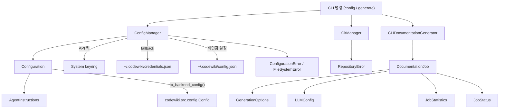
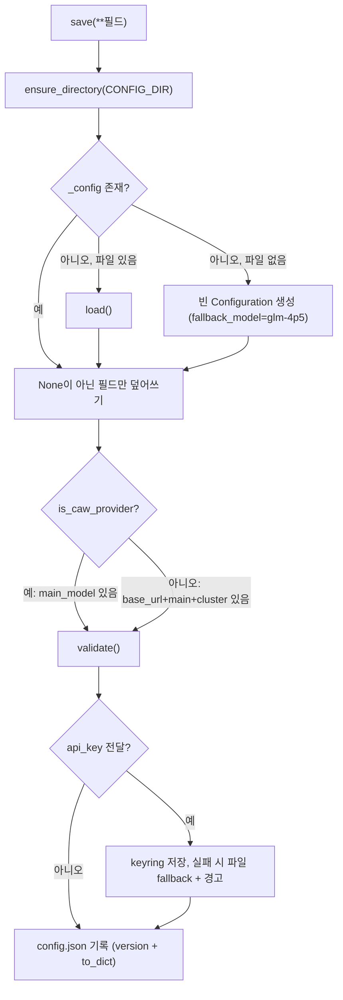
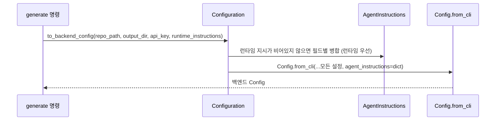
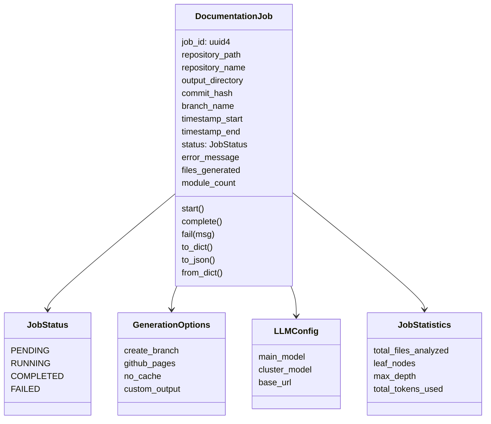
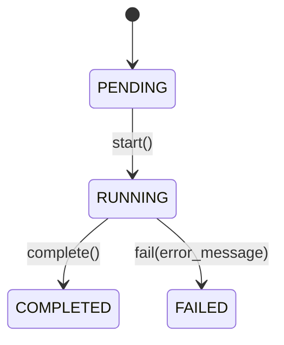
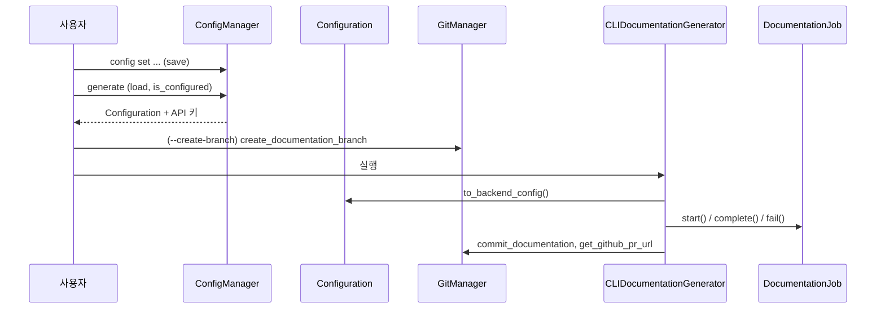

# cli_config_and_models 모듈

`cli_config_and_models`는 CodeWiki CLI의 **영속 설정, API 키 보관, Git 작업, 작업(Job) 데이터 모델**을 담당하는 모듈입니다. 상위 모듈 `user_interfaces_and_entry_points`의 하위 모듈이며, CLI 명령(`codewiki config`, `codewiki generate`)이 사용하는 기반 계층입니다.

| 파일 | 핵심 컴포넌트 | 역할 |
|---|---|---|
| `codewiki/cli/config_manager.py` | `ConfigManager` | `~/.codewiki/config.json` 및 keyring/파일 기반 API 키 관리 |
| `codewiki/cli/git_manager.py` | `GitManager` | 상태 확인, 문서 브랜치 생성, 커밋, 원격/PR URL 조회 |
| `codewiki/cli/models/config.py` | `Configuration`, `AgentInstructions` | 사용자 설정 데이터 모델, 백엔드 `Config`로의 변환 |
| `codewiki/cli/models/job.py` | `DocumentationJob`, `GenerationOptions`, `JobStatistics`, `JobStatus`, `LLMConfig` | 문서 생성 작업의 상태·메타데이터 모델 |

---

## 1. 아키텍처 개요

- 오류 타입(`ConfigurationError`, `FileSystemError`, `RepositoryError`)은 [cli_generation_and_utils](cli_generation_and_utils.md)에 정의되어 있습니다.
- 백엔드 `Config`와 파이프라인은 [documentation_generation_core](documentation_generation_core.md), 프로바이더 판별 함수 `is_caw_provider`는 [agent_backends_and_tools](agent_backends_and_tools.md)의 `backend.py`에 있습니다.
- 작업 객체를 실제로 사용하는 어댑터는 [cli_generation_and_utils](cli_generation_and_utils.md)의 `CLIDocumentationGenerator`입니다.

---

## 2. ConfigManager

### 저장소 구조

| 데이터 | 위치 | 비고 |
|---|---|---|
| API 키 | 시스템 keyring (`KEYRING_SERVICE="codewiki"`, 계정 `api_key`) | macOS Keychain / Windows Credential Manager / Linux Secret Service |
| API 키 fallback | `~/.codewiki/credentials.json` | 평문, `chmod 0o600` 시도 |
| 기타 설정 | `~/.codewiki/config.json` | `version: "1.0"` 포함 |

환경 변수 `CODEWIKI_NO_KEYRING`이 `1`/`true`/`yes`이면 keyring을 건너뛰고 파일 저장을 강제합니다. 헤드리스 컨테이너나 Secret Service가 없는 환경을 위한 장치입니다. 초기화 시 `_check_keyring_available()`이 `keyring.get_password`를 시험 호출하여 가용성을 판단합니다.

### save() 흐름

핵심 동작:
- **부분 갱신**: 인자로 넘긴 필드만 바뀝니다 (`None`은 "변경 없음"). `codewiki config set`이 일부 키만 바꿔도 나머지는 유지됩니다.
- **조건부 검증**: 최소 필수 필드가 채워졌을 때만 `validate()`가 호출됩니다. caw 프로바이더(`claude-code`, `codex` 등 구독 모드)는 `main_model`만, API 프로바이더는 `base_url`·`main_model`·`cluster_model`이 필요합니다.
- **런타임 keyring 실패**: `keyring.set_password`가 실패하면 `_keyring_available=False`로 전환하고 파일에 저장하며 경고를 로깅합니다.
- **버전 검사**: `load()`는 `version`이 다르더라도 현재는 마이그레이션 없이 통과시킵니다 (코드상 `pass`).

### 주요 메서드

| 메서드 | 설명 |
|---|---|
| `load()` | 설정 파일이 없으면 `False`. 파싱 실패 시 `ConfigurationError`. keyring → 파일 순서로 API 키 로드 |
| `save(...)` | 위 흐름 참조 |
| `get_api_key()` | 캐시 → keyring → 파일 순으로 조회 |
| `get_config()` | 메모리 상의 `Configuration` 반환 |
| `is_configured()` | caw 프로바이더가 아니면 API 키 필수, 그다음 `Configuration.is_complete()` |
| `delete_api_key()` | keyring과 `credentials.json` 모두 삭제 |
| `clear()` | API 키 + `config.json` 삭제, 메모리 초기화 |
| `keyring_available`, `config_file_path` | 읽기 전용 프로퍼티 |

---

## 3. Configuration / AgentInstructions

`Configuration`은 `~/.codewiki/config.json`에 저장되는 **영속 사용자 설정**의 dataclass입니다.

| 그룹 | 필드 (기본값) |
|---|---|
| 모델/엔드포인트 | `base_url`, `main_model`, `cluster_model`, `fallback_model="glm-4p5"`, `provider="openai-compatible"` |
| 클라우드별 | `aws_region="us-east-1"`, `api_version="2024-12-01-preview"`, `azure_deployment=""` |
| 토큰/깊이 | `max_tokens=32768`, `max_token_per_module=36369`, `max_token_per_leaf_module=16000`, `max_depth=2` |
| 에이전트 | `request_limit=100`, `agent_retries=3`, `prompt_caching=True` |
| 기타 | `default_output="docs"`, `use_gitignore=True`, `agent_instructions` |

- `validate()`: caw 프로바이더는 `main_model`만, 그 외에는 `validate_url(base_url)`과 세 모델명을 `validate_model_name`으로 검증합니다 (`codewiki.cli.utils.validation`).
- `is_complete()`: 동일한 프로바이더 분기로 필수 필드 존재 여부를 확인합니다.
- `to_dict()` / `from_dict()`: JSON 직렬화. `agent_instructions`는 비어 있지 않을 때만 기록됩니다.

### AgentInstructions

문서 에이전트 맞춤화 옵션입니다: `include_patterns`, `exclude_patterns`, `artifact_exclude`, `focus_modules`, `doc_type`, `custom_instructions`.

- `get_prompt_addition()`은 `doc_type`(`api`, `architecture`, `user-guide`, `developer` 또는 임의 문자열), `focus_modules`, `custom_instructions`를 프롬프트 문장으로 합칩니다.
- `to_dict()`는 빈 값을 제외하고, `is_empty()`로 전체가 비었는지 확인합니다.

### to_backend_config()

런타임 지시(예: `--include`, `--instructions`)는 필드 단위로 영속 설정보다 우선합니다 (`runtime or persistent`). 주의: 병합 시 `AgentInstructions(...)`를 새로 만들면서 **`artifact_exclude`는 복사하지 않으므로**, 런타임 지시가 있을 때는 영속 설정의 `artifact_exclude`가 백엔드로 전달되지 않습니다 (코드 확인). 런타임 지시가 없으면 영속 설정 그대로 전달됩니다.

---

## 4. GitManager

`git.Repo(repo_path, search_parent_directories=True)`를 감싸며, 유효한 저장소가 아니면 `RepositoryError`를 던집니다.

| 메서드 | 동작 |
|---|---|
| `check_clean_working_directory()` | `(is_clean, 메시지)` 반환. 수정/미추적 파일을 각각 최대 3개까지 나열 |
| `create_documentation_branch(force=False)` | 더러운 작업 트리면 `RepositoryError`(`force`로 우회). 이름은 `docs/codewiki-YYYYMMDD-HHMMSS`, 충돌 시 `-N` 접미사 후 체크아웃 |
| `commit_documentation(docs_path, message=None)` | `index.add` 후 커밋, 해시 반환 |
| `get_remote_url(remote_name="origin")` | 원격이 없으면 `None` |
| `get_current_branch()` | detached HEAD면 `"HEAD"` |
| `get_commit_hash()` | 현재 HEAD SHA |
| `branch_exists(name)` | 브랜치 존재 여부 |
| `get_github_pr_url(branch)` | GitHub 원격일 때만 `.../compare/<branch>` 반환, SSH URL은 HTTPS로 변환 |

---

## 5. Job 모델 (`models/job.py`)

상태 전이:

- `start()`는 `timestamp_start`를 갱신하고, `complete()`/`fail()`은 `timestamp_end`를 기록합니다. 코드상 상태 전이를 강제하는 검사는 없습니다.
- `to_dict()`는 중첩 dataclass를 `asdict`로 변환하며, `from_dict()`는 `GenerationOptions(**opts)` 등으로 복원합니다. 저장된 딕셔너리에 알 수 없는 키가 있으면 `TypeError`가 발생할 수 있습니다 (코드 확인).
- `LLMConfig`에는 `provider`나 `fallback_model`이 없어 기록되는 LLM 정보는 세 필드로 제한됩니다.
- 이 `JobStatus`는 CLI 전용이며, 웹 프런트엔드의 동명 타입(`codewiki/src/fe/models.py`)은 별개입니다. 자세한 내용은 [web_frontend](web_frontend.md)를 참고하세요.

---

## 6. 시스템 내 위치와 사용 흐름

검증 수준: 위 내용은 제공된 소스 코드(`config_manager.py`, `git_manager.py`, `models/config.py`, `models/job.py`)를 직접 읽고 작성했습니다(코드 확인). CLI 명령 및 `CLIDocumentationGenerator`의 호출 순서는 컴포넌트 간 의존 관계에서 도출한 것으로, 해당 파일은 이번에 읽지 않았습니다(추론).
