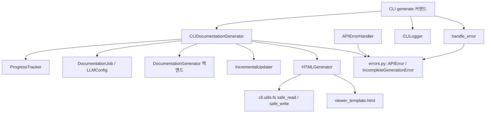
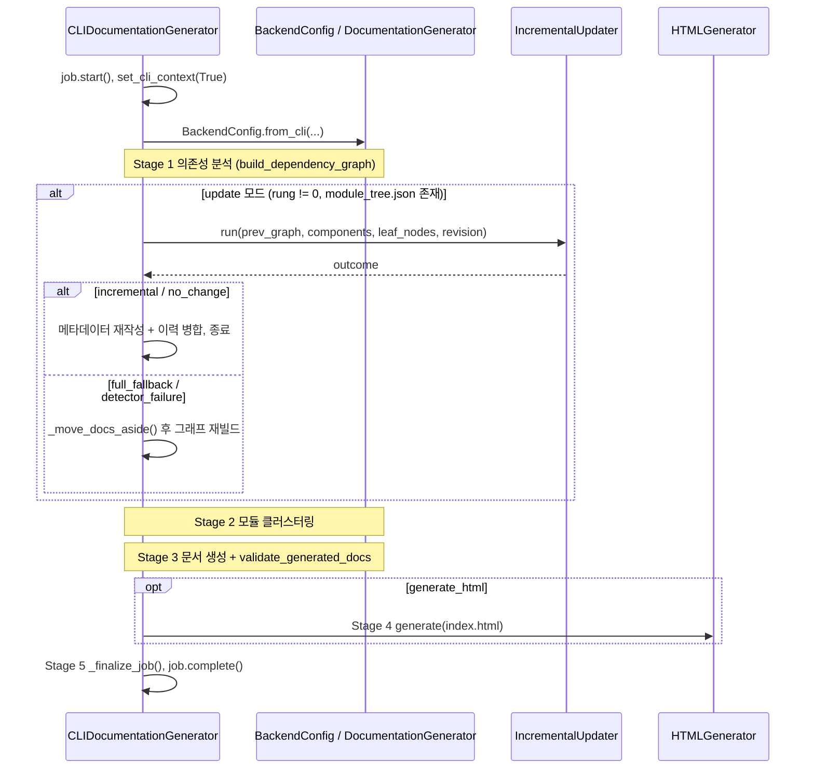
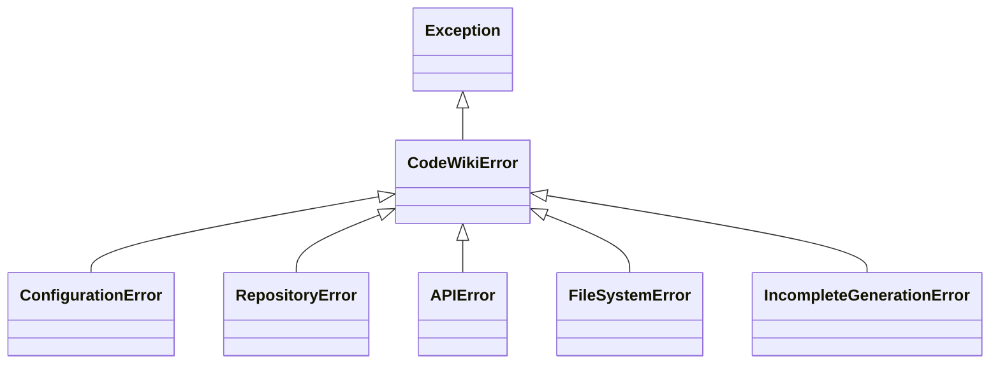

# cli_generation_and_utils 모듈

`cli_generation_and_utils`는 CodeWiki CLI에서 **문서 생성 실행을 조율하고(어댑터), 정적 HTML 뷰어를 만들고, 오류·로그·진행률 같은 공통 유틸을 제공**하는 모듈입니다. 백엔드 [documentation_generation_pipeline](documentation_generation_pipeline.md)를 CLI 환경에 맞게 감싸는 얇은 계층입니다.

관련 모듈:
- 설정/작업 모델: [cli_config_and_models](cli_config_and_models.md) (`Configuration`, `DocumentationJob`, `LLMConfig`)
- 백엔드 생성 엔진: [documentation_generation_core](documentation_generation_core.md), [incremental_updater](incremental_updater.md)
- 의존성 분석: [dependency_analysis_engine](dependency_analysis_engine.md)

## 구성 요소

| 파일 | 컴포넌트 | 역할 |
|---|---|---|
| `codewiki/cli/adapters/doc_generator.py` | `CLIDocumentationGenerator` | 백엔드 `DocumentationGenerator`를 5단계 진행률과 함께 실행 |
| `codewiki/cli/html_generator.py` | `HTMLGenerator` | `viewer_template.html`에 트리/메타데이터를 주입해 `index.html` 생성 |
| `codewiki/cli/utils/errors.py` | `CodeWikiError` 및 하위 예외 5종 | 종료 코드가 있는 예외 계층 |
| `codewiki/cli/utils/api_errors.py` | `APIErrorHandler` | LLM API 예외를 사용자 친화적 `APIError`로 변환 |
| `codewiki/cli/utils/logging.py` | `CLILogger` | 색상 로그(verbose/일반 모드) |
| `codewiki/cli/utils/progress.py` | `ProgressTracker`, `ModuleProgressBar` | 단계별 진행률/ETA, 모듈 진행 바 |

## 아키텍처

## CLIDocumentationGenerator

### 초기화
- `ProgressTracker(total_stages=5)`와 `DocumentationJob`을 만들고 저장소 경로/이름/출력 디렉터리/`LLMConfig`를 기록합니다.
- `_configure_backend_logging()`이 `codewiki.src.be` 로거의 핸들러를 초기화하고 `ColoredFormatter`를 붙입니다. verbose면 stdout에 INFO 이상, 아니면 stderr에 WARNING 이상만 출력하며 `propagate=False`로 중복 출력을 막습니다.

### generate() 흐름

핵심 동작:
1. **Stage 1**: `graph_builder.build_dependency_graph()`로 컴포넌트/리프 노드를 얻고 통계를 기록합니다. 실패 시 `APIError("Dependency analysis failed: ...")`.
2. **증분 업데이트** (`_update_options`): `config["update"]`가 참이고, `rung`이 `"0"`이 아니며 `module_tree.json`이 있을 때만 `UpdateOptions.from_rung`을 반환합니다. 이 경우 빌더가 덮어쓰기 전에 `snapshot_old_graph`로 이전 그래프를 보관합니다. `incremental`/`no_change`면 `prune_superseded_graphs`로 오래된 그래프를 정리하고 조기 반환합니다. 그 외에는 기존 문서를 `<output>.prev-<sha8>`로 이동(`_move_docs_aside`)하고 처음부터 재생성합니다.
3. **Stage 2**: `first_module_tree.json` 캐시가 있으면 로드하고(기존 `module_tree.json`은 덮어쓰지 않음), 없으면 `cluster_modules` → `super_group_modules` → `ensure_artifact_module`(빌드/CI/설정 아티팩트 보장) → `dedupe_module_tree_names` 순으로 만들어 저장합니다. 실패 시 `APIError("Module clustering failed: ...")`.
4. **Stage 3**: `generate_module_documentation` 후 `create_documentation_metadata`, `_merge_update_summary`를 호출합니다. 이후 `validate_generated_docs`로 트리와 디스크를 대조해 누락 시 `IncompleteGenerationError`를 발생시킵니다(APIError로 오인되지 않도록 try 블록 밖).
5. **Stage 4(선택)**: `_run_html_generation`이 `HTMLGenerator.detect_repository_info` → `generate`를 호출해 `index.html` 생성.
6. **Stage 5**: `_finalize_job`이 `metadata.json`이 없을 때만 `job.to_json()`으로 대체 생성.

예외 발생 시 `job.fail(str(e))` 후 재발생시키므로 호출자(CLI 커맨드)가 `handle_error`로 종료 코드를 결정합니다.

### 메타데이터 이력
`_read_update_history`가 기존 `metadata.json`의 `update_history`를 읽고, `_merge_update_summary`가 `merge_into_metadata`로 병합합니다. `create_documentation_metadata`가 파일을 새로 쓰기 때문에 업데이트 체인이 누적되도록 미리 읽어 둡니다.

## HTMLGenerator

`viewer_template.html`(기본 위치 `codewiki/templates/github_pages`)의 플레이스홀더를 치환합니다.

| 플레이스홀더 | 값 |
|---|---|
| `{{TITLE}}` | HTML 이스케이프된 제목 |
| `{{REPO_LINK}}` | 저장소 링크 `<a>` |
| `{{SHOW_INFO}}` / `{{INFO_CONTENT}}` | 모델·생성일·커밋·컴포넌트 수·최대 깊이 |
| `{{CONFIG_JSON}}`, `{{MODULE_TREE_JSON}}`, `{{METADATA_JSON}}` | 임베딩할 JSON |
| `{{DOCS_BASE_PATH}}` | 출력과 docs 디렉터리가 다를 때의 상대 경로 |

- `load_module_tree`: 파일이 없으면 `Overview` 단일 노드 폴백, 파싱 실패 시 `FileSystemError`.
- `load_metadata`: 실패해도 `None`(치명적이지 않음).
- 템플릿이 없으면 `FileSystemError`. `codewiki-icon.png`를 출력 옆에 복사해 자체 완결형으로 유지합니다.
- `detect_repository_info`: GitPython으로 `origin` URL을 https로 정규화하고 `https://<owner>.github.io/<repo>/`를 계산합니다. 실패는 무시합니다.
- 주의(코드 확인): `remote_url.replace(".git", "")`는 URL 내부의 다른 `.git` 문자열도 제거할 수 있습니다.

## 오류 처리 유틸

### 예외 계층과 종료 코드 (`errors.py`)

| 예외 | 종료 코드 |
|---|---|
| `CodeWikiError` (기본), `IncompleteGenerationError` | 1 |
| `ConfigurationError` | 2 |
| `RepositoryError` | 3 |
| `APIError` | 4 |
| `FileSystemError` | 5 |

`IncompleteGenerationError`는 `missing_modules` 목록을 보관합니다. `handle_error`는 `CodeWikiError`면 메시지와 코드, 그 외엔 "Unexpected error"(verbose 시 traceback)를 출력하고 종료 코드를 반환합니다. `error_with_suggestion`, `warning`, `success`, `info` 출력 헬퍼도 제공합니다.

### APIErrorHandler (`api_errors.py`)
`handle_api_error`가 메시지 문자열을 검사해 분류합니다: `429`/rate limit, `401`/authentication, `timeout`, `network`/`connection`, 그 외. 각각 문제 해결 안내가 담긴 `APIError`를 만들며 `context`가 있으면 앞에 붙입니다. `wrap_api_call`은 `fail_fast=True`면 변환된 예외를 발생시키고, 아니면 `display_api_error`로 출력 후 `None`을 반환합니다. (`fail_fast` 인자는 `handle_api_error` 내부에서는 사용되지 않습니다.)

## 로깅과 진행률

- `CLILogger`: `debug`(verbose 전용, 타임스탬프), `info`, `success`, `warning`, `error`(stderr), `step`, `elapsed_time`. `create_logger`가 팩토리입니다.
- `ProgressTracker`: 단계 가중치 1=40%, 2=20%, 3=30%, 4=5%, 5=5%. `start_stage`/`update_stage`/`complete_stage`, `get_overall_progress`, `get_eta`. verbose일 때만 경과 시간 접두어와 세부 메시지를 출력합니다.
  - 참고(코드 확인): 실제 생성기는 1~4단계만 `start_stage`로 호출하며(증분 업데이트는 2단계 재사용) Stage 5는 명시적으로 시작하지 않습니다. 또한 단계 가중치는 정적 추정치로 실제 소요 시간과 무관합니다.
- `ModuleProgressBar`: 비verbose에서 `click.progressbar`를 열고 `finish()`에서 닫으며, verbose에서는 모듈별 줄 출력. 제공된 `CLIDocumentationGenerator`에서는 사용되지 않습니다(다른 호출자 존재 여부는 미확인).

## 설계 메모
- 백엔드 실패는 대부분 `APIError`로 감싸 종료 코드 4로 통일하며, 누락 문서 검증은 일부러 분리해 코드 1로 보고합니다.
- 캐시된 `first_module_tree.json`은 재개 실행을 위해 재사용하되, 이미 서브모듈이 삽입된 `module_tree.json`을 덮어쓰지 않습니다.
- 검증 수준: 위 내용은 제공된 소스 코드 기준 **코드 확인**이며, `graph_store`, `UpdateOptions.from_rung` 내부 및 CLI 커맨드 측 호출부는 **미확인**입니다.
