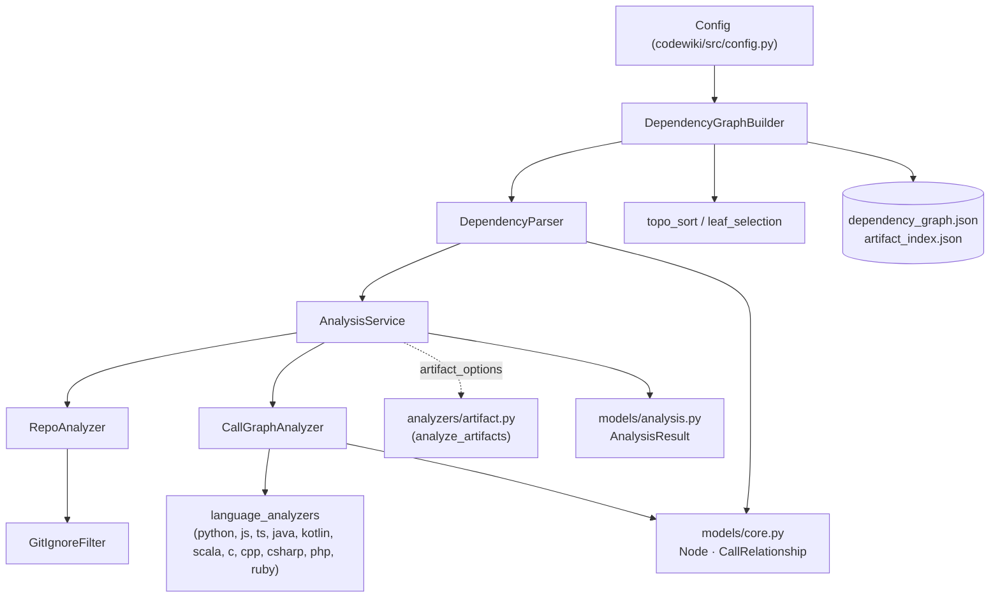
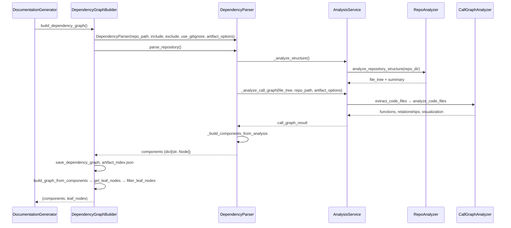
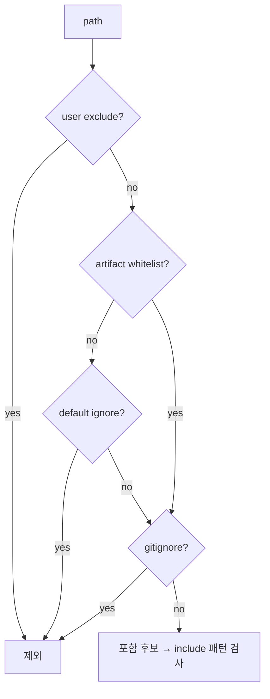
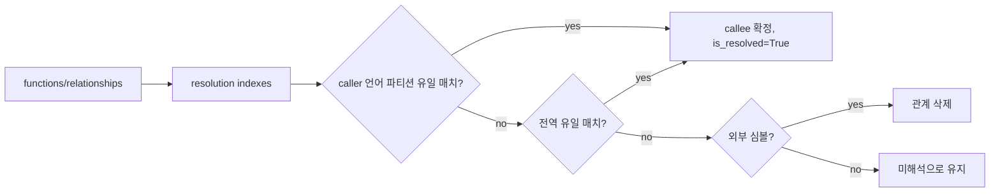
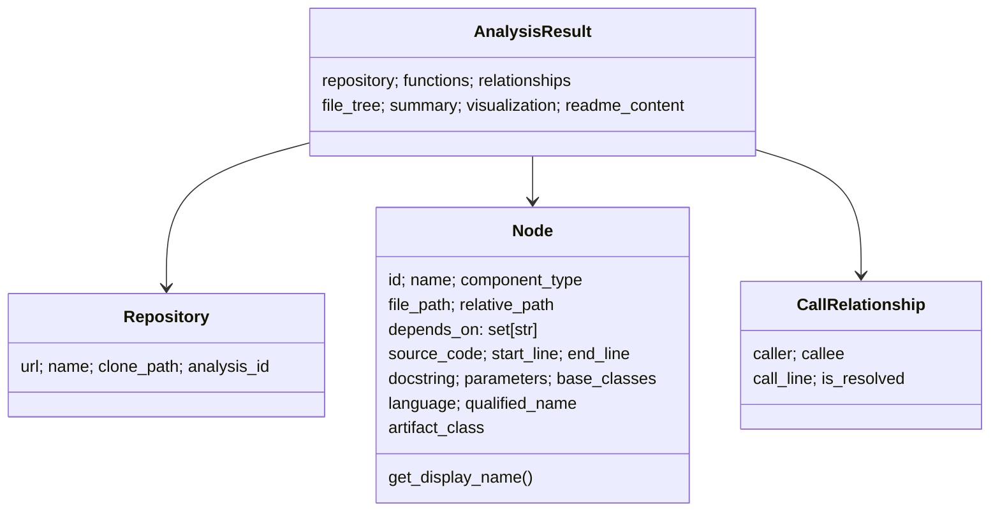

# dependency_analysis_engine

`dependency_analysis_engine`은 저장소를 스캔해 **컴포넌트(함수·클래스·메서드·artifact)와 호출 의존성 그래프**를 만드는 핵심 모듈이다. 파일 트리 구성 → 언어별 분석기 라우팅 → 호출 관계 해석 → `Node` 그래프 생성 → leaf 노드 선정까지를 담당한다. 언어별 실제 파싱은 하위 모듈 [language_analyzers](language_analyzers.md)가 맡고, 이 모듈은 그 결과를 조립·해석한다. 결과 그래프는 [documentation_generation_pipeline](documentation_generation_pipeline.md)의 [documentation_generation_core](documentation_generation_core.md)가 문서 생성 입력으로 사용한다.

## 1. 구성 요소 한눈에 보기

| 컴포넌트 | 파일 | 역할 |
|---|---|---|
| `DependencyGraphBuilder` | `dependency_graphs_builder.py` | 파이프라인 진입점. `Config`로 파서를 구성하고 그래프 저장, leaf 노드 선정 |
| `DependencyParser` | `ast_parser.py` | 분석 결과(dict)를 `Node` 컴포넌트 맵과 `depends_on` 관계로 변환, JSON 저장 |
| `AnalysisService` | `analysis/analysis_service.py` | clone·구조 분석·call graph 분석 오케스트레이션 (로컬/GitHub URL) |
| `RepoAnalyzer`, `GitIgnoreFilter` | `analysis/repo_analyzer.py` | include/exclude/.gitignore를 적용한 파일 트리 생성 |
| `CallGraphAnalyzer`, `TimeoutError` | `analysis/call_graph_analyzer.py` | 언어별 분석기 호출, callee 해석, 외부 심볼 제거, 중복 제거 |
| `Node`, `CallRelationship`, `Repository` | `models/core.py` | 핵심 pydantic 모델 |
| `AnalysisResult`, `NodeSelection` | `models/analysis.py` | 전체 분석 결과 / 부분 내보내기 선택 모델 |
| `ColoredFormatter` | `utils/logging_config.py` | 색상 로그 포맷터 (`setup_logging`, `setup_module_logging`) |

## 2. 아키텍처

의존 방향은 단방향이다: builder → parser → service → (repo analyzer / call graph analyzer) → 언어 분석기. `AnalysisService`는 `cloning`, `utils.security`(`assert_safe_path`, `safe_open_text`)를, `CallGraphAnalyzer`는 `utils.external_symbols`, `utils.patterns`(`CODE_EXTENSIONS`)를 사용한다. 이 파일들은 제공된 코드에 포함되지 않았으므로 여기서는 이름과 사용처만 기술한다(미확인: 내부 구현).

## 3. 주 실행 흐름 (`build_dependency_graph`)

### 3.1 단계별 설명

1. **구조 분석** – `RepoAnalyzer.analyze_repository_structure`가 재귀적으로 파일 트리를 만든다. 심볼릭 링크와 base 밖으로 탈출하는 경로는 거부하고, 빈 디렉터리는 제외한다(루트는 예외).
2. **코드 파일 추출** – `CallGraphAnalyzer.extract_code_files`가 `CODE_EXTENSIONS` 확장자로 `{path, name, extension, language}` 목록을 만든다. `AnalysisService._filter_supported_languages`가 지원 언어만 남긴다.
3. **파일별 분석** – `analyze_code_files`가 `.h` 헤더 라우팅 후 파일마다 언어별 함수를 호출한다. 언어 분석기는 지연 import 된다.
4. **호출 해석/정리** – `_resolve_call_relationships` → `_deduplicate_relationships` → `_generate_visualization_data`.
5. **선택적 artifact 패스** – `artifact_options.enabled`이면 빌드/CI/컨테이너/매니페스트 파일을 `artifact` 노드로 `functions`/`relationships`에 덧붙인다 ([artifact_analysis](artifact_analysis.md)).
6. **컴포넌트 변환** – `DependencyParser._build_components_from_analysis`가 dict를 `Node`로 바꾸고, `caller → callee`를 `depends_on` 집합에 넣는다.
7. **leaf 선정** – `DependencyGraphBuilder`가 그래프를 만들고 leaf 노드를 뽑아 `compute_valid_leaf_types`/`filter_leaf_nodes`로 걸러 반환한다.

## 4. 컴포넌트 상세

### 4.1 `RepoAnalyzer` / `GitIgnoreFilter`

- **include**: 지정하면 기본값을 *대체*한다. **exclude**: 기본 `DEFAULT_IGNORE_PATTERNS`에 *병합*되지만, `default_exclude_patterns`와 `user_exclude_patterns`를 분리 보관한다.
- 우선순위: 사용자 exclude(항상 우선) > 기본 ignore(단, `ARTIFACT_WHITELIST`에 해당하면 유지, 예: `.github/workflows`) > `.gitignore`.
- `GitIgnoreFilter`는 Git worktree면 `git ls-files --others --ignored --exclude-standard --directory -z`로 Git과 동일한 의미를 얻고(타임아웃 10s/30s), 실패하거나 Git이 없으면 `pathspec.GitIgnoreSpec`으로 중첩 `.gitignore`를 직접 평가하는 폴백을 쓴다.

### 4.2 `CallGraphAnalyzer`

- **타임아웃**: `timeout(30)` 컨텍스트 매니저가 `SIGALRM`을 쓴다. Windows나 메인 스레드가 아닌 경우(예: MCP 서버의 `asyncio.to_thread`) 타임아웃 없이 실행한다. 초과 시 `TimeoutError`(내장 `TimeoutError`를 가리는 동명 클래스)를 발생시켜 해당 파일만 건너뛴다.
- **오류 격리**: 파일 하나가 실패해도 전체 분석은 계속된다(`files_failed` 집계).
- **`.h` 헤더 라우팅** (`_route_contextual_headers`): 헤더 내용에 C++ 신호(`namespace`, `class`, `template<`, `::`, C++ 표준 헤더 include)가 있거나, 저장소가 C++ 전용이면 `cpp`로, 혼합 저장소의 신호 없는 헤더는 `c`로 처리한다.
- **callee 해석** (`_build_resolution_indexes`, `_resolve_callee`): exact/simple 인덱스를 전역과 언어별로 구성한다. 호출자 언어 파티션을 먼저 시도하고 실패하면 전역으로 폴백한다. 매치가 **유일할 때만** 해석한다(모호하면 미해석). `::`, `.` 접미사, Java/C# 동일 패키지 규칙을 추가로 적용한다.
- **외부 호출 제거** (`_is_external_callee`): 미해석 관계 중 외부로 판단되는 것을 버린다.
  - `is_external_symbol` 표준 라이브러리/접두사 규칙
  - C/C++ ALL_CAPS 매크로
  - Java/C#: 프로젝트 패키지와 접두 관계가 없는 dotted 패키지
  - Python: 프로젝트 모듈과 정렬되면 "프로젝트 내부 미해결"로 유지, 외부 import 루트 또는 `PYTHON_OBJECT_METHODS` 꼬리면 외부
- **중복 제거**: `(caller, callee)` 쌍 기준 첫 항목만 유지.
- **시각화 데이터**: Cytoscape.js 호환 `elements`(노드에 `lang-*` 클래스, 해석된 엣지만 `edge-call`)와 요약을 만든다.
- **기타**: `generate_llm_format`(LLM용 요약), `_select_most_connected_nodes`(degree centrality 상위 N개 유지)는 있지만 이 모듈의 제공 코드 안에서는 호출되지 않는다(호출처 미확인).

### 4.3 `AnalysisService`

- `analyze_local_repository`: 로컬 폴더 분석. `max_files`, `languages` 필터 지원, 요약 dict 반환.
- `analyze_repository_full`: GitHub URL clone → 구조 → call graph → README 로드 → `AnalysisResult`. 성공/실패 모두 임시 디렉터리를 정리한다.
- `analyze_repository_structure_only`: call graph 없이 트리와 통계만.
- `_read_readme_file`: `README.md`/`README`/`readme.md`/`README.txt` 순으로 찾고 `assert_safe_path`, `safe_open_text`로 안전하게 읽는다. 실패는 경고 후 `None`.
- 임시 디렉터리는 `_temp_directories`로 추적하며 `cleanup_all`과 `__del__`에서 정리한다.
- 하위 호환 함수 `analyze_repository`, `analyze_repository_structure_only`(모듈 수준)는 `(결과, None)` 튜플을 반환한다.
- 주의: `_filter_supported_languages`는 `go`, `rust`를 포함하지만 `_get_supported_languages`는 포함하지 않아 두 목록이 다르다. 또한 `CallGraphAnalyzer._analyze_code_file`에는 go/rust 분기가 없으므로 실제로는 분석되지 않는다(코드 확인).

### 4.4 `DependencyParser`

- `parse_repository`는 `AnalysisService`의 비공개 메서드 `_analyze_structure`, `_analyze_call_graph`를 직접 호출한다.
- 컴포넌트 ID가 없으면 건너뛴다. 레거시 ID(`file_path:name`)를 현재 ID로 매핑하는 `component_id_mapping`을 만든다.
- callee ID를 못 찾으면 **이름이 같은 첫 컴포넌트**로 폴백한다(동명이인이면 부정확할 수 있음, 코드 확인).
- `modules`는 `::` 앞 파일 경로 또는 dotted ID의 접두로 채운다.
- `save_dependency_graph`: `depends_on`(set)을 list로 바꿔 JSON 저장.
- `_determine_component_type`, `_file_to_module_path`는 정의만 있고 제공 코드 내 호출이 없다.

### 4.5 `DependencyGraphBuilder`

- 출력 경로: `<dependency_graph_dir>/<sanitized_repo_name>_dependency_graph.json`.
- `Config`에서 `include_patterns`, `exclude_patterns`, `use_gitignore`, 그리고 `artifacts_enabled`(기본 True), `artifact_token_budget`(기본 200_000), `with_prose`, `artifact_exclude`를 `getattr`로 읽어 `ArtifactOptions`를 구성한다.
- artifact가 활성인데 0개면 `--include` 때문일 수 있다는 경고를 남긴다.
- 반환: `(components, keep_leaf_nodes)`.

### 4.6 모델

`NodeSelection`(`selected_nodes`, `include_relationships`, `custom_names`)은 부분 내보내기용 모델이다. `artifact_class`는 `component_type == "artifact"`일 때만 채워진다.

### 4.7 로깅

`ColoredFormatter`는 `[HH:MM:SS] LEVEL message`를 레벨별 색으로 출력한다(DEBUG 파랑, INFO 시안, WARNING 노랑, ERROR 빨강, CRITICAL 밝은 빨강). `setup_logging`은 루트 로거 핸들러를 교체하고, `setup_module_logging`은 특정 모듈 로거에 전파를 끈 핸들러를 붙인다.

## 5. 설계상 특징과 주의점

- **Best-effort 분석**: 파일별 예외/타임아웃을 흡수해 부분 결과라도 반환한다. 실패는 로그(`warning`/`debug`)로만 남으므로 누락 여부는 로그로 확인해야 한다.
- **보안**: 파일 읽기는 `safe_open_text`, 트리 생성 시 symlink·경로 탈출 거부.
- **보수적 해석**: 유일 매치만 확정해 오탐을 줄이는 대신 일부 호출은 미해석으로 남는다.
- **스레드 제약**: `SIGALRM` 타임아웃은 메인 스레드·Unix에서만 동작한다. 그 외에는 파일 하나가 오래 걸려도 중단되지 않는다.
- **`AnalysisService`의 비공개 API를 `DependencyParser`가 직접 사용**하므로 시그니처 변경 시 함께 수정해야 한다.

## 6. 관련 문서

- [language_analyzers](language_analyzers.md) — 언어별 tree-sitter/AST 분석기 ([scripting_language_analyzers](scripting_language_analyzers.md), [web_language_analyzers](web_language_analyzers.md), [jvm_language_analyzers](jvm_language_analyzers.md), [c_family_analyzers](c_family_analyzers.md), [artifact_analysis](artifact_analysis.md))
- [documentation_generation_core](documentation_generation_core.md) — `Config`, `DocumentationGenerator`가 이 모듈을 호출
- [source_code_analysis_engine](source_code_analysis_engine.md) — 상위 모듈
- [build_ci_and_deployment](build_ci_and_deployment.md) — 패키징/CI (artifact 분석 대상이기도 함)

## 7. 검증 수준

- 위 내용은 제공된 소스(`analysis_service.py`, `call_graph_analyzer.py`, `repo_analyzer.py`, `ast_parser.py`, `dependency_graphs_builder.py`, `models/*`, `logging_config.py`) 기준 **코드 확인**.
- `cloning`, `security`, `external_symbols`, `patterns`, `topo_sort`, `leaf_selection`의 내부 동작은 **미확인**.
