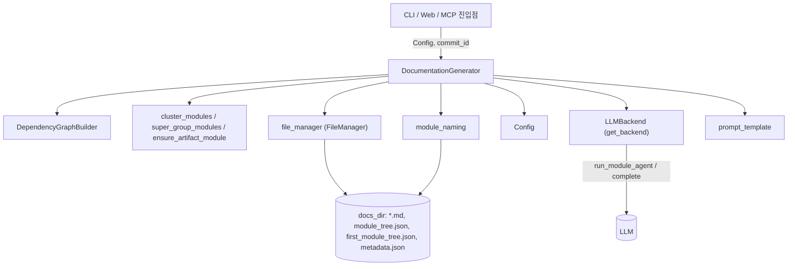
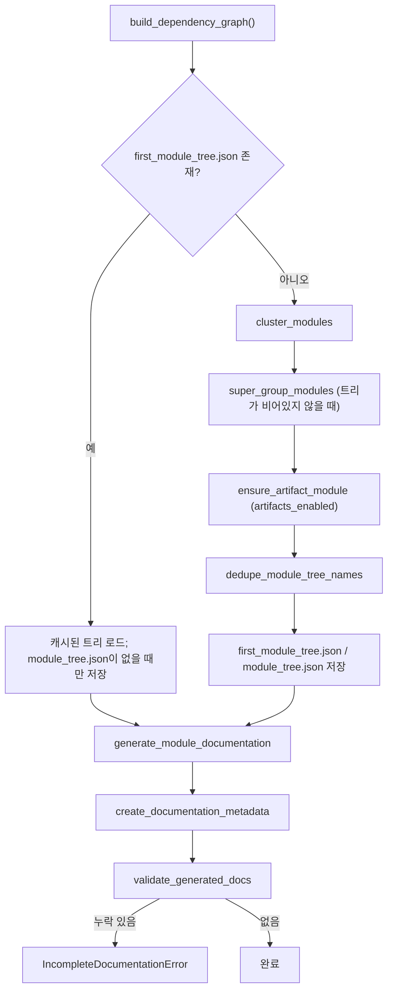
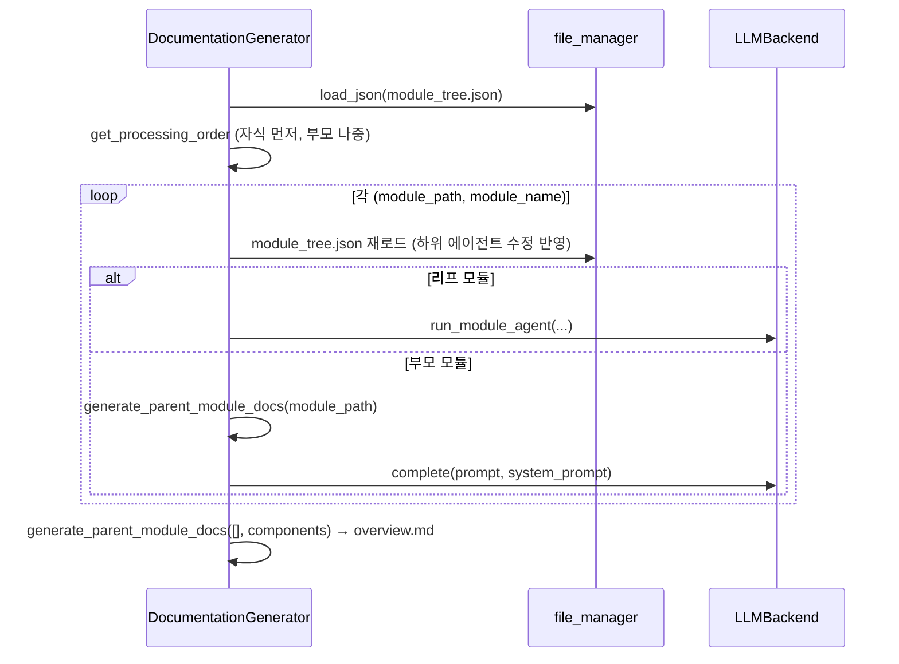
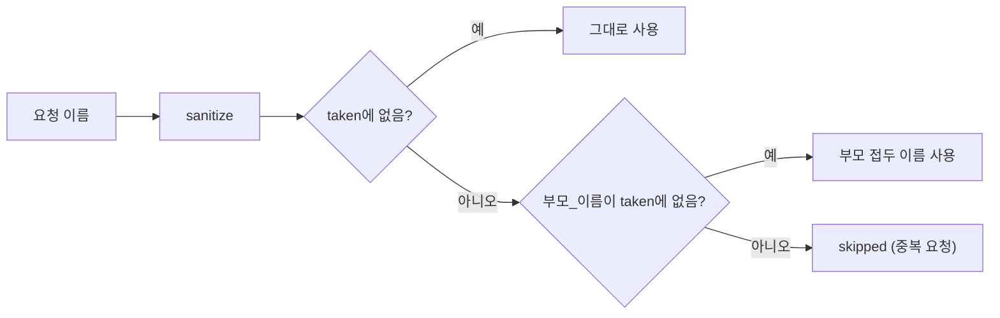

# documentation_generation_core

`documentation_generation_core`는 CodeWiki 백엔드에서 문서 생성 전체 과정을 지휘하는 핵심 모듈입니다. 아래 네 가지 파일로 구성됩니다.

| 파일 | 컴포넌트 | 역할 |
|---|---|---|
| `codewiki/src/be/documentation_generator.py` | `DocumentationGenerator`, `IncompleteDocumentationError` | 의존성 그래프 구축 → 클러스터링 → 모듈별 문서 생성 → 개요 생성 → 검증까지의 오케스트레이션 |
| `codewiki/src/be/module_naming.py` | `SubModulePlan` (및 이름 관련 함수) | LLM이 정한 모듈 이름을 유일하고 파일명에 안전하게 유지 |
| `codewiki/src/config.py` | `Config` | 경로, 모델, 토큰 한도, 에이전트 지시사항 등 실행 설정 |
| `codewiki/src/utils.py` | `FileManager` (`file_manager` 싱글턴) | JSON/텍스트 파일 I/O |

이 모듈은 [agent_backends_and_tools](agent_backends_and_tools.md)의 `LLMBackend`에 실제 LLM 호출을 위임하고, 소스 분석은 [source_code_analysis_engine](source_code_analysis_engine.md)(`DependencyGraphBuilder`)에 맡깁니다. `--update` 경로의 증분 갱신은 [incremental_updater](incremental_updater.md)가 담당합니다. 이 모듈을 호출하는 진입점은 [user_interfaces_and_entry_points](user_interfaces_and_entry_points.md)(특히 `CLIDocumentationGenerator`, `BackgroundWorker`)입니다.

---

## 1. 아키텍처

`DocumentationGenerator`는 생성 시 `DependencyGraphBuilder(config)`를 만들고, `backend`가 주어지지 않으면 `get_backend(config)`로 백엔드를 선택합니다(`PydanticAIBackend` 또는 `CawBackend`, [agent_backends_and_tools](agent_backends_and_tools.md) 참고).

## 2. 실행 흐름 (`DocumentationGenerator.run`)

핵심 포인트:

- **재개(resume) 안전성**: 캐시된 `first_module_tree.json`이 있어도 기존 `module_tree.json`을 덮어쓰지 않습니다. 이전 실행에서 에이전트가 삽입한 하위 모듈이 보존되기 때문입니다.
- **이름 중복 제거는 새로 클러스터링한 트리에만** 적용합니다. 이미 `.md`가 있는 키를 바꾸면 문서가 고아가 됩니다.
- **클러스터링 모델 분리**: `config.cluster_model`을 `backend.complete(p, model=cluster_model)`에 바인딩합니다. 비어 있으면 백엔드 기본 모델을 사용합니다.
- 트리가 비면(`len(module_tree) == 0`) **전체 저장소 모드**로 진행합니다.

## 3. 모듈 문서 생성 (`generate_module_documentation`)

- `get_processing_order`는 후위 순회로 리프 → 부모 순서를 만듭니다. 순서는 `first_module_tree.json`이 아니라 **`module_tree.json`** 기준입니다. 에이전트가 삽입한 모듈도 `--update` 시 무효화 대상이 되므로, 첫 트리 기준이면 이를 건너뛰어 `IncompleteDocumentationError`로 끝날 수 있습니다.
- 각 모듈은 이미 `.md`가 있으면 LLM 호출 없이 건너뜁니다. 따라서 트리 전체를 순회해도 비용이 늘지 않습니다.
- **모듈 단위 실패 격리**: 한 모듈의 예외는 로그만 남기고 계속 진행합니다. 누락은 마지막 검증 단계에서 잡습니다.
- **전체 저장소 모드**: `run_module_agent(module_path=[])`를 한 번 호출한 뒤 결과 트리를 `module_tree.json`에 저장하고, `<repo_name>.md`를 `overview.md`로 이름 변경합니다.

### 부모/개요 문서 (`generate_parent_module_docs`)

1. `module_path`가 비어 있으면 저장소 개요(`REPO_OVERVIEW_PROMPT`), 아니면 `MODULE_OVERVIEW_PROMPT`를 사용합니다.
2. `build_overview_structure`가 트리를 복사한 뒤 `_strip_components`로 `components` 목록을 제거하고, 자식 문서는 내용을 인라인하지 않고 절대경로 `docs_path`로만 참조합니다. 대형 저장소에서 프로바이더 입력 상한(예: 1,048,576자)을 넘는 문제를 피하기 위함입니다.
3. 개요 프롬프트에는 `render_artifact_index(components)` 결과를 `REPO_OVERVIEW_ARTIFACT_ADDENDUM`으로 덧붙입니다.
4. 응답이 `<OVERVIEW>…</OVERVIEW>`로 감싸져 있으면 내부만 저장하고, 아니면(구독형 CLI 백엔드) 원문을 그대로 저장합니다. 빈 응답은 `RuntimeError`입니다.

## 4. 모듈 이름 관리 (`module_naming.py`)

모든 문서는 하나의 평면 디렉터리에 `{module_name}.md`로 저장되고, 트리 키는 파일명 stem과 같아야 합니다(HTML 뷰어와 `--update` 무효화가 이에 의존, issue #76). 이름을 LLM이 자유롭게 정하므로 충돌 해소가 필요합니다.

| 함수 | 설명 |
|---|---|
| `sanitize_module_name` | 위험 문자를 `_`로 치환하고 공백→`_`, 앞뒤 `._` 제거. 대소문자는 유지 |
| `collect_module_tree_names` | 모든 깊이의 이름 수집 |
| `resolve_unique_name` | 사용 가능하면 그대로 → 부모 이름 접두 → 숫자 접미(`_2`, `_3`…) |
| `normalize_sub_module_specs` | 요청 이름 → 최종 유일 이름 매핑(숫자 접미 허용) |
| `plan_sub_module_specs` → `SubModulePlan` | 생성할 것(`name_map`)과 건너뛸 것(`skipped`) 결정 |
| `dedupe_module_tree_names` | 새로 클러스터링한 트리 전체의 이름 정리 |
| `resolve_module_doc_path` | 공백→`_`/`-`/제거, 소문자 변형 등을 시도해 실제 `.md` 경로 탐색 |
| `find_missing_module_docs` | 트리 대비 디스크에 없는 문서 목록(+ `overview`) |

`RESERVED_STEMS = {"overview", "module_tree", "first_module_tree", "metadata", "index"}`는 모듈 이름으로 쓸 수 없습니다.

`SubModulePlan`은 issue #113의 해법입니다. 일반 이름과 부모 접두 이름이 모두 이미 사용 중이면 **숫자 접미로 바꾸지 않고 중복 요청으로 보고 건너뜁니다**(`skipped`에 사유 기록). 숫자 접미가 한 에이전트로 하여금 같은 모듈을 `x_2`, `x_3`…으로 끝없이 재생성하게 만들었기 때문입니다.

## 5. 설정 (`Config`)

`Config`는 dataclass이며 두 팩토리를 제공합니다.

- `Config.from_args(args)`: 웹앱/환경변수 기반(`MAIN_MODEL`, `LLM_BASE_URL`, `LLM_API_KEY` 등). 출력은 `output/docs/<repo>-docs`.
- `Config.from_cli(...)`: CLI 기반. `docs_dir = output_dir`, 중간 산출물은 `output_dir/temp` 아래(`dependency_graph_dir`)에 둡니다.

주요 필드:

| 분류 | 필드 | 기본값 |
|---|---|---|
| 모델 | `main_model`, `cluster_model`, `fallback_model`, `provider` | `openai-compatible` 등 |
| 토큰 | `max_tokens` / `max_token_per_module` / `max_token_per_leaf_module` | 32,768 / 36,369 / 4,000 |
| 클러스터링 | `min_modules_for_super_grouping`, `max_leaf_nodes_per_cluster`, `max_depth` | 3 / 600 / 2 |
| 에이전트 | `request_limit`, `agent_retries`, `prompt_caching` | 100 / 3 / True |
| 분석 | `use_gitignore`, `artifacts_enabled`, `artifact_token_budget`, `with_prose` | True / True / 200,000 / False |

`agent_instructions` 딕셔너리에서 `include_patterns`, `exclude_patterns`, `focus_modules`, `doc_type`, `custom_instructions`, `artifact_exclude`를 프로퍼티로 꺼내 쓰며, `get_prompt_addition()`이 이를 시스템 프롬프트 추가문(문서 유형별 지시, 집중 모듈, 사용자 지시)으로 합성합니다. 개요 생성 시 `format_overview_system_prompt(config.get_prompt_addition())`으로 주입됩니다.

`set_cli_context()`/`is_cli_context()` 전역 플래그로 CLI와 웹앱 실행 맥락을 구분합니다. 파일명 상수(`MODULE_TREE_FILENAME`, `FIRST_MODULE_TREE_FILENAME`, `OVERVIEW_FILENAME`)도 여기서 정의합니다. CLI 쪽 설정 모델과의 매핑은 [cli_config_and_models](cli_config_and_models.md)를 참고하세요.

## 6. 파일 I/O (`FileManager`)

정적 메서드만 가진 얇은 래퍼이고, 모듈 전역 `file_manager` 인스턴스를 공유합니다.

- `ensure_directory`, `save_json`(indent=4, `ensure_ascii=False`), `load_json`(파일이 없으면 `None`), `save_text`, `load_text`.
- 모두 UTF-8이므로 한국어 문서도 안전합니다.
- 주의: `load_json`이 `None`을 반환할 수 있는데, `generate_module_documentation`은 `module_tree.json`이 있다고 가정하고 `len(module_tree)`를 호출합니다. `run()`이 항상 먼저 저장하므로 정상 흐름에서는 문제가 없습니다.

## 7. 산출물과 메타데이터

`create_documentation_metadata`가 `metadata.json`을 작성합니다.

- `generation_info`: 타임스탬프(UTC), `main_model`, `generator_version`, `repo_path`, `commit_id`
- `statistics`: `total_components`, `leaf_nodes`, `max_depth`
- `files_generated`: 기본 3개 파일 + 디렉터리 내 `.md` 목록(목록 조회 실패는 경고만 남기는 best-effort)

## 8. 오류 처리

| 상황 | 동작 |
|---|---|
| 개별 모듈 생성 실패 | 로그 후 계속 진행 |
| 부모/개요 생성 실패 | 로그 후 재발생(raise) |
| 완료 후 `.md` 누락 | `IncompleteDocumentationError(missing_modules)` 발생. 속성 `missing_modules` 제공 |
| `run()` 내 모든 예외 | 트레이스백 로깅 후 재발생 |

`IncompleteDocumentationError`는 CLI 계층에서 [cli_generation_and_utils](cli_generation_and_utils.md)의 `IncompleteGenerationError`로 처리됩니다(확인 필요: 정확한 변환 위치는 해당 모듈 문서 참조).

## 9. 관련 모듈

- [agent_backends_and_tools](agent_backends_and_tools.md): `LLMBackend.run_module_agent`, `complete`
- [incremental_updater](incremental_updater.md): `--update`/`--compare-to`로 문서를 무효화한 뒤 이 모듈의 재개 동작을 재사용
- [dependency_analysis_engine](dependency_analysis_engine.md): `DependencyGraphBuilder`
- [documentation_generation_pipeline](documentation_generation_pipeline.md): 상위 모듈
