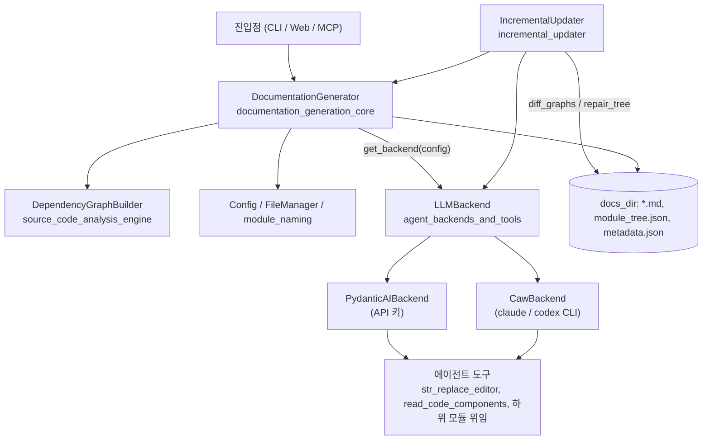
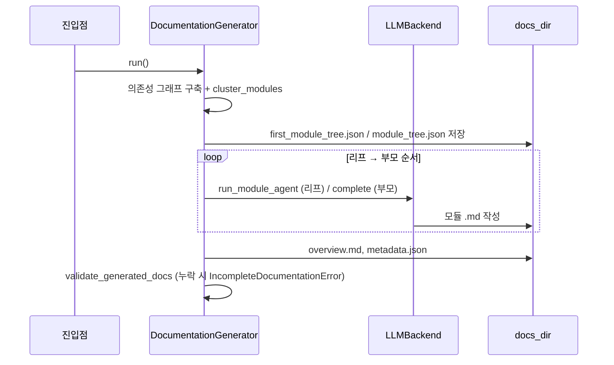

# documentation_generation_pipeline

## 목적

`documentation_generation_pipeline`(`codewiki/src`)은 CodeWiki 백엔드의 문서 생성 파이프라인입니다. 소스 분석 결과(의존성 그래프)를 받아 다음 작업을 수행합니다.

1. 컴포넌트를 모듈 트리로 클러스터링합니다.
2. 리프 모듈부터 LLM 에이전트로 문서를 작성합니다.
3. 부모 모듈 문서와 저장소 `overview.md`를 생성합니다.
4. 생성된 문서가 빠짐없이 있는지 검증합니다.
5. 코드가 바뀌면 영향받은 페이지만 갱신합니다(증분 업데이트).

CLI, 웹, MCP 진입점([user_interfaces_and_entry_points](user_interfaces_and_entry_points.md))이 이 파이프라인을 호출합니다. 소스 분석은 [source_code_analysis_engine](source_code_analysis_engine.md)에 맡깁니다.

## 아키텍처

### 하위 모듈 구성

| 하위 모듈 | 경로 | 역할 |
|---|---|---|
| [documentation_generation_core](documentation_generation_core.md) | `codewiki/src` | `DocumentationGenerator`가 그래프 구축 → 클러스터링 → 모듈별 문서 → 개요 → 검증을 지휘합니다. `Config`, `FileManager`, `module_naming`(이름 유일화, `SubModulePlan`)도 포함합니다. |
| [agent_backends_and_tools](agent_backends_and_tools.md) | `codewiki/src/be` | `LLMBackend` 추상화 뒤에 `PydanticAIBackend`와 `CawBackend`를 두고, 편집기(`EditTool`)와 MCP 도구(`CawToolKit`)를 제공합니다. |
| [incremental_updater](incremental_updater.md) | `codewiki/src/be/updater` | 두 시점의 코드 그래프를 diff하고 모듈 트리를 보정한 뒤, 영향받은 리프에만 편집 에이전트를 실행합니다. 변경이 크면 전체 빌드로 폴백합니다. |

## 전체 실행 흐름

## 핵심 설계 포인트

- **백엔드 선택은 한 곳에서**: `get_backend(config)`가 provider에 따라 API 키 방식과 CLI 구독 방식(`claude-code`, `codex`) 중 하나를 고릅니다. (코드 확인, 각 하위 문서 기준)
- **재개 안전성**: 이미 `.md`가 있는 모듈은 건너뛰고, 캐시된 `first_module_tree.json`이 있어도 기존 `module_tree.json`을 덮어쓰지 않습니다. 모듈 하나가 실패해도 로그만 남기고 계속하며, 누락은 마지막 검증에서 잡습니다.
- **증분 업데이트**: `--update` 경로에서는 `IncrementalUpdater`가 `UpdateRecord`에 모든 결정을 기록하고, 에이전트의 쓰기 범위를 `allowed_write_paths`로 제한합니다. 재생성이 필요하면 `DocumentationGenerator`의 재개 동작을 재사용합니다.
- **이름 충돌 관리**: 트리 키는 파일명 stem과 같아야 하므로 `module_naming`이 이름을 유일하게 만들고, 중복 요청은 건너뜁니다(`SubModulePlan`).

## 관련 문서

- 상위 진입점: [user_interfaces_and_entry_points](user_interfaces_and_entry_points.md)
- 소스 분석: [source_code_analysis_engine](source_code_analysis_engine.md)