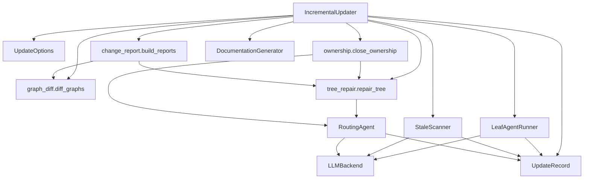
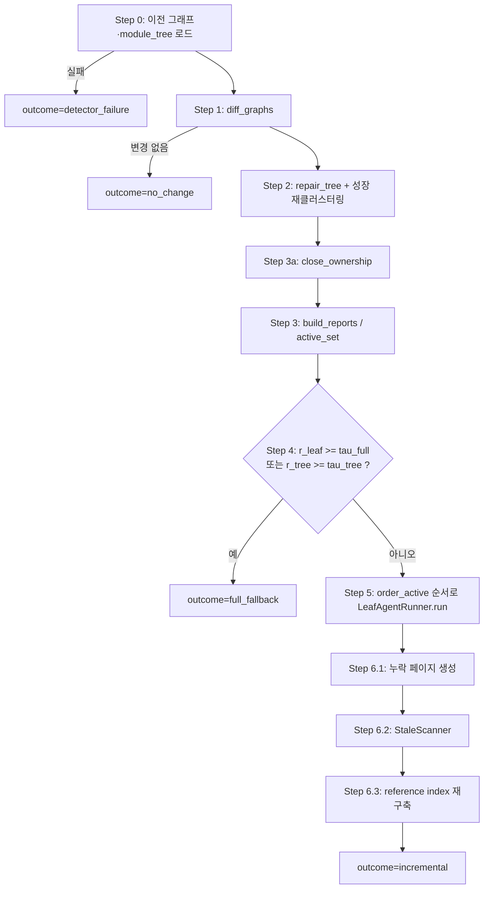
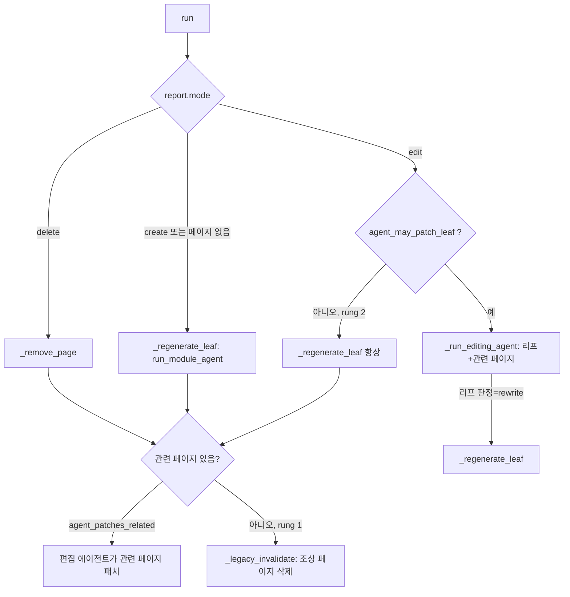

# incremental_updater 모듈

`codewiki/src/be/updater/` 패키지는 이전 빌드가 남긴 문서 디렉터리(`docs_dir`)를 **전체 재생성 없이** 갱신하는 증분 업데이터다. 두 시점의 코드 그래프를 컴포넌트 단위로 비교하고, 모듈 트리를 보정한 뒤, 영향받은 리프(leaf) 페이지에만 LLM 에이전트를 실행한다. 변경 범위가 너무 크면 전체 빌드로 폴백한다.

관련 모듈:
- 문서 생성 본체: [documentation_generation_core](documentation_generation_core.md) (`DocumentationGenerator`, `Config`, `FileManager`)
- LLM 백엔드와 에이전트 도구: [agent_backends_and_tools](agent_backends_and_tools.md) (`LLMBackend`, `CodeWikiDeps`)
- 코드 그래프(`Node`) 생성: [dependency_analysis_engine](dependency_analysis_engine.md)
- CLI 진입점: [cli_generation_and_utils](cli_generation_and_utils.md)

---

## 1. 구성 요소 한눈에 보기

| 파일 | 핵심 컴포넌트 | 역할 (Step) |
|---|---|---|
| `options.py` | `UpdateOptions` | 모든 임계값과 ablation rung(0, 1, 2, 3, 3b) 프리셋 |
| `graph_diff.py` | `GraphDiff`, `ChangeRecord` | Step 1: 컴포넌트 단위 diff (added/deleted/interface/body/edge/renamed) |
| `tree_repair.py` | `RepairResult`, `RoutingDecision` | Step 2: 모듈 트리 보정, 규칙 1~4 라우팅 |
| `routing.py` | `RoutingAgent` | 규칙 4: 고아(orphan) 컴포넌트를 LLM 한 번 호출로 배치 |
| `ownership.py` | `Adoption` | Step 3a: 추적되지 않는 변경 컴포넌트에 유효 소유자 부여 |
| `change_report.py` | `LeafReport` | Step 3/4: 리프별 변경 리포트, 활성 집합, 폴백 비율, 실행 순서 |
| `leaf_agent.py` | `LeafAgentRunner` | Step 5: 활성 리프마다 편집 에이전트 실행 (쓰기 집합 제한) |
| `stale_scan.py` | `StaleScanner` | Step 6.2: 이번에 쓰지 않은 페이지의 낡은 이름/링크 수정 |
| `record.py` | `UpdateRecord`, `PageVerdict`, `CallCost` | 한 번의 업데이트에서 내린 모든 결정 기록 |
| `orchestrator.py` | `IncrementalUpdater`, `_WholeRepoReport` | Step 0~6 전체 조율 |

이 표에 없지만 코드에서 import되는 보조 모듈: `tree`(`T`), `pages`(`P`), `prompts`, `verdicts`, `reference_index`, `graph_store`. 이 문서의 제공된 컴포넌트에는 포함되지 않아 본문을 확인하지 못했고, import와 사용 방식으로만 설명한다.

---

## 2. 아키텍처

핵심 설계 원칙:
- **결정은 모두 `UpdateRecord`로 남긴다.** 에이전트 호출 비용(`CallCost`), 페이지별 판정(`PageVerdict`), 쓰기 집합 위반 등이 `update_record.json`에 저장된다.
- **한 리프의 실패가 전체를 중단시키지 않는다.** 예외는 `rec.errors`에 기록하고 계속 진행한다.
- **모든 하이퍼파라미터는 `UpdateOptions` 하나에 모인다.** run은 이 값 하나로 완전히 설명된다.

---

## 3. 처리 흐름 (Step 0~6)

### Step 0. 상태 로드 (`IncrementalUpdater._load_state`)
- `load_graph`로 이전 그래프, `MODULE_TREE_FILENAME`으로 이전 트리를 읽는다. 없으면 `FileNotFoundError`가 나며, 이는 크래시가 아니라 `OUTCOME_DETECTOR_FAILURE`로 처리되어 호출자가 전체 빌드로 넘어가게 한다.
- 트리가 비어 있으면 **whole-repo 모드**다. `T.virtual_whole_repo_tree`로 overview 페이지 하나를 가리키는 가상 리프를 만든다.
- 저장된 참조 인덱스가 없으면 페이지에서 다시 만든다.

### Step 1. 그래프 diff (`graph_diff.py`)
컴포넌트를 id(`path::name`)로 조인해 비교한다.

| 분류 | 조건 |
|---|---|
| `added` / `deleted` | 한쪽에만 존재 |
| `interface` | 시그니처 `(name, parameters, base_classes)` 변경 |
| `body` | 공백 정규화한 본문 SHA-1 해시 변경 |
| `edge` | `depends_on`만 변경 |
| `renamed` | 삭제+추가 쌍 중 같은 `component_type`이고 토큰 유사도 ≥ `tau_ren`(0.95). 탐욕적 최고 유사도 매칭 |

- 길이 비율이 `tau_ren * 0.9` 미만이면 유사도 계산을 건너뛰어 비용을 줄인다.
- 각 변경의 unified diff는 `max_diff_tokens`(약 4자 = 1토큰 추정)로 잘리며, 가운데에 `... [diff truncated] ...` 표시가 들어간다.
- 이름이 바뀌면서 시그니처도 바뀐 경우 `interface`에도 추가되어 의존자에게 계약 변경으로 전파된다.

### Step 2. 트리 보정 (`tree_repair.py`)
순서: 이름 변경 반영 → 삭제 컴포넌트 제거 및 빈 노드 정리 → 추가 컴포넌트 라우팅.

`route_by_rules`의 배치 규칙:

| 규칙 | 상수 | 내용 |
|---|---|---|
| 1 | `RULE_SAME_FILE` | 같은 파일에서 이미 추적 중인 컴포넌트가 속한 리프 (최다 득표) |
| 2 | `RULE_SAME_DIR` | 같은 디렉터리의 추적 컴포넌트가 정확히 한 리프에만 속할 때 |
| 3 | `RULE_NEIGHBOR` | 그래프 이웃의 소유 리프 득표율 ≥ `tau_nb`(0.5) |
| 4 | `RULE_AGENT` | 위 규칙으로 못 정한 고아를 `RoutingAgent`에 위임 |

- 에이전트가 새 리프를 만들 수 있으며(`new_leaf`), 이름 충돌은 `unique_leaf_name`으로 해소한다. 알 수 없는 부모/리프는 고아로 남긴다.
- 리프별로 `entered`/`left`를 계산하고, 신규 비율 `g = entered / 전체 ≥ tau_grow`(0.33)이면 `growth_flagged`로 **표시만** 한다. 재클러스터링은 LLM과 클러스터링 단계가 필요하므로 오케스트레이터의 `_recluster`가 담당한다.

### Step 3a. 소유권 폐쇄 (`ownership.py`)
모듈 트리는 코드 그래프의 일부만 추적한다(주석에 svelte 사례: 2239개 중 764개). 추적되지 않는 컴포넌트가 바뀌면 소유자가 없어 조용히 누락된다. `close_ownership`은 Step 2와 **같은 규칙 1~3, 그리고 규칙 4**로 유효 소유자(`Adoption`)를 부여한다.
- 활성화 전용이다. 트리는 바꾸지 않고, 매 스텝마다 다시 계산한다.
- 삭제된 컴포넌트는 이전 그래프/소유자 맵으로 판단하며, 규칙으로 못 정하면 건너뛴다.
- 에이전트 호출은 `purpose="ownership"`이며, 새 리프 생성은 허용하지 않는다.
- `use_ownership_closure=False`(rung 1)면 빈 dict를 반환한다.

### Step 3. 변경 리포트 (`change_report.py`)
`build_reports`는 새 트리의 모든 단위(unit)와 삭제된 리프에 대해 `LeafReport`를 만든다.

| 필드 | 의미 |
|---|---|
| `own` | 이 리프에 속한 변경 컴포넌트 (이전·이후 트리 소유자 합집합, 이름 변경 전 id 포함) |
| `adopted` | `own` 중 유효 소유자로 배정된 것 (id → 규칙) |
| `up` | interface/deleted/renamed 계약 변화를 `k_hop` 만큼 역방향으로 따라가 찾은, 이를 사용하는 다른 리프의 코드 |
| `context` | 소유자를 못 찾은 변경의 이웃 리프에 주는 참고 정보. 단독으로는 리프를 활성화하지 않는다 |
| `refch` | 리프 페이지가 참조하는 id/링크/이름 중 바뀌거나 사라진 것. 본문만 바뀐 경우 이름 언급은 stale로 보지 않는다 |
| `entered` / `left` | 트리 보정으로 들어오고 나간 컴포넌트 |
| `children_added` / `children_removed`, `reclustered` | 트리 구조 변경 |
| `mode` | `edit`, `create`, `delete` |

`is_empty`는 `context`를 제외한 모든 필드가 비었는지를 본다. 활성 집합은 `not is_empty` 이거나 `mode != edit`인 리프다.

### Step 4. 폴백 판정
`fallback_ratios`:
- `r_leaf = 활성 리프 수 / 전체 리프 수` ≥ `tau_full`(0.5)
- `r_tree = (생성 + 삭제 + 재클러스터) / 전체 리프 수` ≥ `tau_tree`(0.3)

둘 중 하나라도 넘으면 `OUTCOME_FULL_FALLBACK`으로 기록하고 반환한다(실제 전체 빌드는 호출자 책임).

whole-repo 모드는 예외다. 리프가 하나라 `r_leaf`가 항상 100%이므로 의미가 없다. 대신 `get_clustering_input_token_count(scope)`가 `config.max_token_per_module` 이하면 폴백하지 않고 단일 페이지를 제자리에서 갱신하고, 초과하면 새 빌드는 클러스터링할 것이므로 폴백한다(코드 주석의 issue #113).

### Step 5. 리프 에이전트 (`leaf_agent.py`)
- **순서**: `order_active`가 리프 의존성을 끌어올린 그래프에서 위상 정렬한다(A가 B를 쓰면 B 먼저). 순환/동률은 트리 pre-order로 깨고, 삭제된 리프는 맨 뒤로 간다.
- **쓰기 집합**: `_write_roles`가 페이지 → 역할 매핑을 만든다. 역할은 `leaf`, `ancestor`(조상과 overview), `dependent`, `referrer`. 존재하는 페이지만 포함하고, 삭제 예정 노드는 제외한다.
- `_run_editing_agent`는 `CodeWikiDeps(allowed_write_paths=...)`로 쓰기 경로를 제한하고, 전후 `P.page_hashes`를 비교해 **쓰기 집합 밖 변경을 `write_set_violations`에 기록**한다.
- 에이전트가 돌려주는 판정(`parse_verdicts`)은 디스크 상태와 조정한다. 판정 없음이면 변경 여부로 `patch`/`no-op`을 정하고, `no-op`인데 디스크가 바뀌었으면 `patch`로 고친다.

모드별 분기 (`LeafAgentRunner.run`):

- 재생성은 기존 페이지를 지운 뒤 일반 `backend.run_module_agent`를 호출한다.
- rung 1의 `_legacy_invalidate`는 `ancestor` 역할의 페이지만 삭제하고, 이후 Step 6.1이 다시 생성한다.

### Step 6. 마무리
1. **6.1** `doc_generator.generate_module_documentation(new_graph, leaf_nodes)`로 여전히 없는 페이지(새 부모, 재클러스터된 서브트리, 루트)를 생성한다.
2. **6.2** `StaleScanner.run`이 이번에 쓰지 않은 페이지에서 낡은 항목을 찾는다: 이름 변경된 id/이름, 삭제된 id/이름(백틱으로 감싼 유일한 이름만), 삭제된 페이지로의 `.md` 링크. 히트가 있는 페이지마다 `STALE_FIX_SYSTEM_PROMPT`로 해당 페이지 하나만 쓰기 가능한 에이전트를 돌린다. 삭제된 페이지 링크의 대체 페이지는 `_nearest_page`(가장 가까운 살아있는 조상, 없으면 overview)다.
3. **6.3** 참조 인덱스를 다시 만들어 저장한다. 결과는 `OUTCOME_INCREMENTAL`.

---

## 4. `UpdateOptions`와 ablation rung

`UpdateOptions.from_rung(rung, **overrides)`로 만든다. 유효값은 `VALID_RUNGS = ("0","1","2","3","3b")`이며 그 외는 `ValueError`, `None` 오버라이드는 무시된다.

| rung | 설명 |
|---|---|
| `0` | 레거시 파일 단위 무효화. 이 패키지가 처리하지 않음 (`is_legacy`) |
| `1` | 라우팅 에이전트, 성장 재클러스터, Up, 리프 패치, 관련 페이지 패치, stale scan, 소유권 폐쇄 모두 끔 |
| `2` | `agent_may_patch_leaf=False` (리프는 항상 재작성) |
| `3` | 제안 방식 (기본값) |
| `3b` | rung 3에 `k_hop=2` |

주요 임계값: `tau_ren=0.95`, `max_diff_tokens=8000`, `tau_nb=0.5`, `tau_grow=0.33`, `k_hop=1`, `tau_full=0.5`, `tau_tree=0.3`.

---

## 5. 기록: `UpdateRecord`

- `update_record.json`(`RECORD_FILENAME`)에 `run()`의 `finally`에서 항상 저장한다. 저장 실패는 로그만 남긴다.
- `outcome`: `no_change`, `incremental`, `full_fallback`, `detector_failure`.
- `summary()`는 결과, rung, diff 개수, 활성 수, 소유권 채택 수(규칙이 `4:`로 시작하면 에이전트 채택), 호출 수와 사용량 합계, 쓴/지운 페이지, 소요 시간을 요약한다.
- `merge_into_metadata`가 `metadata.json`에 `last_update`와 `update_history`를 덧붙인다. 호출자가 metadata를 재작성한 경우를 위해 `prior_history`로 이력을 복원한다.
- `CallCost.kind` 값: `leaf_agent`, `rewrite`, `create`, `routing`, `stale_fix`, `missing_pages`, `recluster` 등 (코드의 주석 목록과 실제 사용 문자열이 조금 다르다).

---

## 6. 재클러스터링 (`IncrementalUpdater._recluster`)

`growth_flagged` 리프의 부모 서브트리를 대상으로 한다. 조상이 이미 처리됐으면 건너뛴다.
1. `info["children"] = {}`로 비우고 `cluster_modules`를 `backend.complete(model=cluster_model)` completer로 호출한다.
2. 결과가 비면 부모가 컴포넌트를 직접 갖는 리프가 된다.
3. 실패하면 오류를 기록하고 해당 서브트리는 손대지 않은 채 넘어간다. 다만 `children`은 이미 비워졌으므로 실패 시 복구 코드가 없다는 점에 유의한다(코드 확인: `except` 블록에서 복원하지 않음).
4. 성공하면 이전 단위 페이지들과 부모 페이지를 삭제하고, 새 단위 경로를 `reclustered`에 추가한다.

## 7. whole-repo 모드

- 리프는 overview 하나뿐이다. 고아는 LLM 호출 없이 `_route_to_overview`가 overview로 보낸다(새 리프 생성 방지).
- 소유권 폐쇄, 재클러스터링, 트리 저장은 건너뛴다.
- 활성 단위가 여러 개여도 overview 한 번만 실행한다.
- `_WholeRepoReport`가 리포트를 감싸 `page`는 overview, `leaf_path`는 빈 튜플(모듈 경로 없음)로 보이게 한다.

## 8. 사용상 참고와 한계

- 진입점은 `IncrementalUpdater.run(old_graph_path, new_graph, leaf_nodes, revision)`이다. 호출은 [cli_generation_and_utils](cli_generation_and_utils.md)의 `CLIDocumentationGenerator` 쪽 업데이트 경로에서 이루어질 것으로 보이나, 해당 코드는 이 문서의 입력에 없어 **미확인**이다.
- 에이전트 호출은 리프별로 순차 실행된다(의존 순서 보장을 위해).
- `RoutingAgent`는 응답 JSON을 `parse_json_block`으로 파싱하며, 파싱 실패나 호출 실패 시 고아는 추적되지 않은 채 남는다.
- 유사도 기반 이름 변경 탐지는 O(삭제 × 추가) 후보를 길이 비율로 걸러낸 뒤 토큰 단위 `difflib`을 쓰므로, 대규모 리팩터링에서 비용이 커질 수 있다.
- 빌드/CI 설정(`pyproject.toml`, `.github/workflows/ci.yml`)은 이 모듈의 동작에 직접 영향이 없어 확인하지 않았다.
