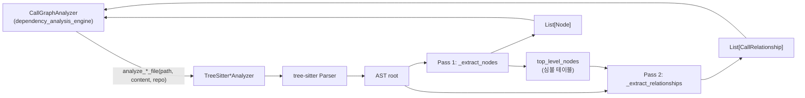
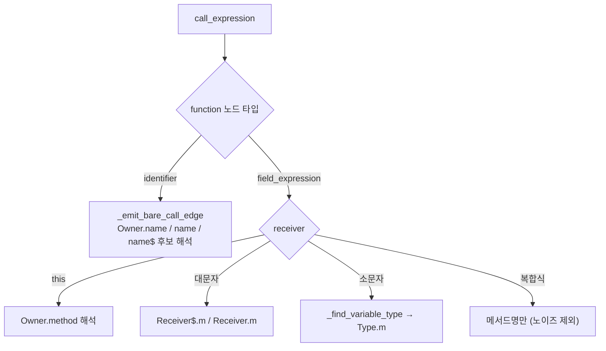

# jvm_language_analyzers 모듈

## 소개

`jvm_language_analyzers`는 JVM 계열 언어(Java, Kotlin, Scala) 소스 파일을 tree-sitter로 파싱해, 문서화 대상 **컴포넌트(`Node`)**와 컴포넌트 간 **의존 관계(`CallRelationship`)**를 추출하는 언어별 분석기 모음이다. 상위 모듈 [language_analyzers](language_analyzers.md)의 하위 모듈이며, 분석 결과는 [dependency_analysis_engine](dependency_analysis_engine.md)의 `CallGraphAnalyzer`/`DependencyGraphBuilder`가 취합해 의존성 그래프로 만든다.

| 파일 | 클래스 | 진입 함수 | tree-sitter 패키지 |
|---|---|---|---|
| `codewiki/src/be/dependency_analyzer/analyzers/java.py` | `TreeSitterJavaAnalyzer` | `analyze_java_file` | `tree_sitter_java` |
| `codewiki/src/be/dependency_analyzer/analyzers/kotlin.py` | `TreeSitterKotlinAnalyzer` | `analyze_kotlin_file` | `tree_sitter_kotlin` |
| `codewiki/src/be/dependency_analyzer/analyzers/scala.py` | `TreeSitterScalaAnalyzer` | `analyze_scala_file` | `tree_sitter_scala` |

## 공통 구조

세 분석기는 동일한 계약을 따른다: 생성자 `(file_path, content, repo_path)`에서 즉시 `_analyze()`를 실행하고, 결과를 `self.nodes`, `self.call_relationships`에 담는다. 분석은 **2-패스**다.

1. **Pass 1 – `_extract_nodes`**: AST를 재귀 순회하며 클래스/인터페이스/메서드 등을 `Node`로 만든다. ID는 `"<상대경로>::<이름>"` 형식이다.
2. **Pass 2 – `_extract_relationships`**: 상속, 구현, 필드/파라미터 타입 사용, 메서드 호출, 객체 생성을 `CallRelationship`으로 만든다. 모두 `is_resolved=False`로 나오며(Scala는 같은 파일에서 해석되면 `True`), 파일 간 해석은 상위 엔진이 담당한다.

모델(`Node`, `CallRelationship`)은 `codewiki/src/be/dependency_analyzer/models/core.py`에 정의되어 있다. 자세한 내용은 [dependency_analysis_engine](dependency_analysis_engine.md)를 참고한다.

## Java: `TreeSitterJavaAnalyzer`

**컴포넌트 추출** — `class_declaration`(abstract이면 `abstract class`), `interface_declaration`, `enum_declaration`, `record_declaration`, `annotation_type_declaration`, `method_declaration`. 메서드는 `Class.method` 이름을 쓰고, 중첩 타입은 `_find_containing_type_names`로 `Outer.Inner` 형태의 `qualified_name`(패키지 포함)을 만든다. `top_level_nodes`에는 단순명, component_id, qualified_name 여러 키로 등록한다.

**관계 추출** (5종)
1. `extends` (`superclass`)
2. `implements` (`super_interfaces` → `type_list`; class/enum/record)
3. 필드 타입 사용 (`field_declaration`)
4. 메서드 호출 (`method_invocation`)
5. 객체 생성 (`object_creation_expression`)

**해석/필터링 로직**
- `package`/`import`는 정규식으로 추출(`package_name`, `import_map`, `wildcard_imports`). `static import`도 `import_map`에 들어가 bare 호출 해석에 쓰인다.
- `_resolve_java_type`: import map → 포함 타입 중첩 후보 → 같은 패키지 순으로 FQN을 결정한다.
- `_skip_type`/`_is_primitive_type`: 기본형, `utils/external_symbols.py`의 `is_external_symbol("java", ...)` 접두사 규칙으로 JDK/런타임 타입을 제외하고, 스코프 내 제네릭 타입 파라미터(`K`, `V`)도 제외한다.
- 호출 수신자 타입은 `_find_variable_type`(지역 변수 → 파라미터 → 클래스 필드)로 추론한다. 대문자 시작 CamelCase 수신자는 정적 호출로 간주하고, `ALL_CAPS`는 상수로 보고 제외한다. `JAVA_OBJECT_METHODS`(`toString` 등)는 프로젝트가 재정의하지 않았다면 간선을 만들지 않는다.

## Kotlin: `TreeSitterKotlinAnalyzer`

**컴포넌트 추출** — `class_declaration`(modifier에 따라 `abstract class`/`data class`/`enum class`/`annotation class`/`interface`/`class`), `object_declaration`, `function_declaration`(클래스 내부면 `method`, 아니면 `function`). 직전 형제 `line_comment`/`block_comment`를 docstring으로 취한다. `_analyze` 전체가 `try/except`로 감싸져 파싱 실패 시 로그만 남기고 계속한다.

**관계 추출**
1. `delegation_specifiers`를 통한 상속/인터페이스 구현
2. `property_declaration` 타입 사용
3. `class_parameter`(주 생성자) 타입 사용
4. `call_expression`: 대문자 식별자 → 생성자/타입 호출, 소문자 → 이름만 기록, `navigation_expression` → 수신자 타입 추론 후 타입 컴포넌트를 callee로 삼는다.

Java와 달리 import 해석이 없어, callee는 **현재 파일 경로 기준의 component ID**이거나 단순 이름이다. 내장 타입 필터(`Int`, `String`, `List` 등)는 고정 집합이다. 변수 타입은 함수 파라미터 → 지역 `property_declaration`(명시 타입 또는 `Foo()` 초기화 추론) → 주 생성자 파라미터 → 클래스 프로퍼티 순으로 찾는다.

## Scala: `TreeSitterScalaAnalyzer`

세 분석기 중 가장 정교하며, 설계 결정(openspec `add-scala-language-support`)이 모듈 docstring에 반영되어 있다.

- **`component_type` / `node_type` 이원화**: 파이프라인의 리프 선택은 `component_type`을 기준으로 하므로 `trait → "interface"`, `object/package object/enum → "class"`로 매핑하고, 실제 구조는 `node_type`(`trait`, `object`, `enum`)과 `display_name`에 보존한다(`_TYPE_MAPPING`).
- **동반 객체(companion object)**: `object`는 논리 이름에 `$` 접미사(`Foo$`)를 붙여, 같은 이름의 class와 ID가 충돌하지 않게 한다(JVM 인코딩을 모방).
- **관계 dedup**: `_add_relationship_raw`가 `(caller, callee, line)` 중복과 자기 참조를 제거한다.
- **관계 종류**: `extends`(`_emit_extends_edges`), 클래스/트레이트 파라미터 타입, `val`/`var` 필드 타입, `instance_expression`(`new`), `call_expression`.
- **같은 파일 내 해석**: `_resolve_candidates`가 `top_level_nodes`에서 후보(`Foo`, `Foo$`, `Owner.method`)를 찾으면 `is_resolved=True`와 실제 ID를 쓰고, 못 찾으면 이름 그대로 `False`로 기록한다.
- **노이즈 필터**: `SCALA_PRIMITIVE_TYPES`, `SCALA_CORE_CALLS`(`map`, `filter`, `foldLeft`...)는 간선에서 제외한다. 단, 대문자 시작 이름은 인스턴스화 형태로 보아 유지한다.
- **커링 메서드**: `children_by_field_name("parameters")`로 모든 파라미터 그룹을 수집한다.
- **변수 타입 추론**: 메서드 파라미터 → 호출 이전의 지역 `val/var`(명시 타입 또는 `new T`) → 클래스 파라미터 → 클래스 필드.

## 언어별 비교

| 항목 | Java | Kotlin | Scala |
|---|---|---|---|
| import 해석 | O (`import_map`, wildcard) | X | X |
| `qualified_name` / `language` 필드 | 설정 | 미설정 | `language="scala"` |
| 외부(JDK) 필터 | `is_external_symbol` 접두사 규칙 | 고정 집합 | 고정 집합 |
| 파싱 오류 처리 | 예외 전파 | 로그 후 계속 | 로그 후 계속 |
| dedup | X | X | O |
| 같은 파일 내 `is_resolved=True` | X | X | O |
| docstring 추출 | X | O | O |

## 유의 사항

- Java 분석기는 `_analyze`에 `try/except`가 없어 파서 예외가 호출자에게 전파된다. 호출 측의 처리는 [dependency_analysis_engine](dependency_analysis_engine.md)에서 확인해야 한다(미확인).
- Kotlin/Scala의 `_get_module_path` 등 일부 헬퍼는 현재 사용되지 않는다(코드 확인: Java/Kotlin에서 호출처 없음).
- Kotlin의 관계 callee는 import를 고려하지 않으므로 다른 패키지 타입과 이름이 겹치면 오연결될 수 있다(추론).
- 관련 형제 모듈: [c_family_analyzers](c_family_analyzers.md), [web_language_analyzers](web_language_analyzers.md), [scripting_language_analyzers](scripting_language_analyzers.md), [artifact_analysis](artifact_analysis.md).
