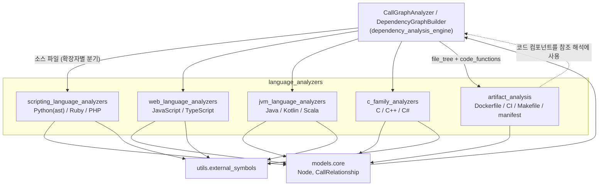
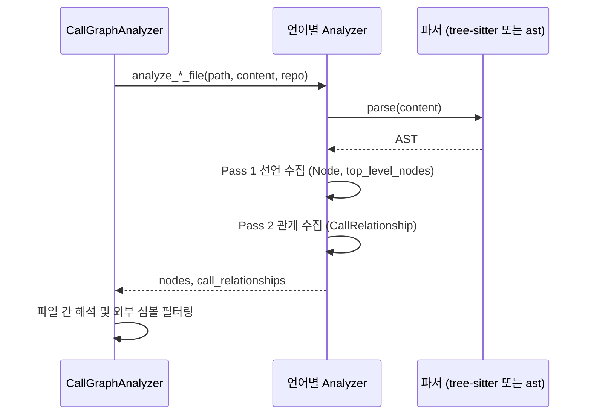

# language_analyzers 모듈 개요

## 1. 목적

`language_analyzers`(`codewiki/src/be/dependency_analyzer/analyzers`)는 소스 분석 엔진에서 **파일 하나를 읽어 컴포넌트(`Node`)와 컴포넌트 간 관계(`CallRelationship`)로 바꾸는 언어별 분석기 모음**이다. 하위 모듈은 다섯 개다.

- 언어 분석기 네 묶음은 Python, JS/TS, JVM 계열, C 계열 소스를 파싱한다.
- `artifact_analysis`는 Dockerfile, CI 워크플로, Makefile, 매니페스트처럼 소스 확장자가 아닌 파일을 그래프 노드로 만든다.

분석 결과는 [dependency_analysis_engine](dependency_analysis_engine.md)의 `CallGraphAnalyzer`와 `DependencyGraphBuilder`가 모아 전역 의존성 그래프로 만든다. 이 그래프는 [documentation_generation_pipeline](documentation_generation_pipeline.md)의 모듈 클러스터링과 문서 생성에 쓰인다.

### 공통 계약

| 항목 | 내용 |
|---|---|
| 입력 | `file_path`, `content`, 선택적 `repo_path` |
| 출력 | `nodes: List[Node]`, `call_relationships: List[CallRelationship]`. Python은 `external_import_roots`도 반환한다. |
| 컴포넌트 ID | `<repo 상대경로>::<이름>`. 메서드는 `<상대경로>::<Class>.<method>` |
| `is_resolved` | 같은 파일 안에서 해석되면 `True`. 아니면 `False`로 내보내 전역 리졸버가 처리한다. |
| 패스 구조 | 대부분 2-패스다. 1패스에서 선언을 수집해 `top_level_nodes` 심볼 테이블을 만든다. 2패스에서 이 테이블을 참조해 관계를 만든다. |
| 외부 심볼 처리 | 추출 시점에는 최소한만 거르고, 최종 필터링은 하류에 맡기는 경향이 있다. 필터에는 `utils/external_symbols.py`의 목록을 쓴다. |

`Node`와 `CallRelationship`은 `models/core.py`에 정의되어 있다. 이 모듈이 아니라 dependency_analysis_engine 쪽이다.

## 2. 아키텍처

### 소스 파일 분석 흐름

### 아티팩트 분석 흐름

`artifact_analysis`는 다른 분석기와 실행 시점과 입력이 다르다. 언어 분석기가 끝난 뒤, 같은 파일 트리를 다시 훑는다. 아래 순서로 동작한다.

1. `classify_artifact`로 파일을 분류한다.
2. 클래스별 상한과 토큰 예산 안에서 파일을 읽는다.
3. 파일 노드(`artifact_file`)와 유닛 노드(`artifact_unit`)를 만든다.
4. `_Resolver`로 완전히 해석된 참조만 엣지로 남긴다.

## 3. 하위 모듈

| 모듈 | 대상 | 파서 | 특징 | 문서 |
|---|---|---|---|---|
| `scripting_language_analyzers` | Python, Ruby, PHP | `ast` / tree-sitter | Python은 import 해석과 얕은 변수 타입 추적을 한다. Ruby는 mixin과 `initialize` 비노출 규칙이 있다. PHP는 `NamespaceResolver`로 FQN을 만들고, 템플릿 파일은 건너뛴다. | [scripting_language_analyzers](scripting_language_analyzers.md) |
| `web_language_analyzers` | JavaScript, TypeScript | tree-sitter | JS는 JSDoc 타입 의존을 읽는다. TS는 엔티티 수집 → 최상위 필터 → 관계 추출의 단계로 처리한다. `JS_TS_PROTOTYPE_METHODS`로 노이즈를 줄인다. | [web_language_analyzers](web_language_analyzers.md) |
| `jvm_language_analyzers` | Java, Kotlin, Scala | tree-sitter | Java는 import 맵과 `qualified_name`을 쓴다. Kotlin은 import 해석이 없다. Scala는 `component_type`/`node_type` 이원화, 동반 객체 `Foo$`, 관계 dedup을 갖는다. | [jvm_language_analyzers](jvm_language_analyzers.md) |
| `c_family_analyzers` | C, C++, C# | tree-sitter | C++는 오류 개수를 비교해 ALL_CAPS 매크로를 정규화한다. C#은 `using`/네임스페이스 기반 해석을 하고, 타입은 "resolve first, filter second" 원칙으로 처리한다. | [c_family_analyzers](c_family_analyzers.md) |
| `artifact_analysis` | Dockerfile, CI, Makefile, `package.json`, `pyproject.toml` 등 | 정규식/표준 라이브러리 | 정규식 기반 경량 파서를 쓴다. `ArtifactOptions`의 상한과 토큰 예산으로 출력을 제한한다. `<REPOSITORY_ARTIFACTS>` 프롬프트 블록을 렌더링한다. | [artifact_analysis](artifact_analysis.md) |

## 4. 설계상 공통 특징과 주의점

- **오류 격리**: 대부분의 분석기는 파싱 실패 시 로그만 남기고 빈 결과를 반환한다. 예외로 Java 분석기는 `_analyze`에 `try/except`가 없어 예외가 호출자에게 전파된다. 호출 측의 처리는 미확인이다.
- **해석 정책이 언어마다 다르다**:
  - Python, Ruby, Scala는 같은 파일 안에서 해석되면 `is_resolved=True`를 쓴다.
  - PHP와 C#은 거의 전부 `False`로 내보낸다.
  - 미해석 callee의 표기(dotted 경로, FQN, 논리 이름)를 바꾸면 전역 리졸버의 매칭이 깨질 수 있다.
- **정확도 우선**: `artifact_analysis`는 해석되지 않는 참조를 버려 이름 매칭 오탐을 피한다. 대신 재현율이 낮아질 수 있다.
- **확장 시**: 새 분석기는 `Node`/`CallRelationship` 계약과 ID 형식을 지켜야 한다. `self.nodes`(공개 컴포넌트)와 `top_level_nodes`(내부 심볼 테이블)에 무엇을 넣을지도 구분해서 정해야 한다.
- **검증 수준**: 위 내용은 하위 모듈 문서를 종합한 것이며, 각 하위 문서가 소스 코드를 읽고 확인한 내용에 기반한다(코드 확인). 확장자별 분석기 선택 로직(`ast_parser.py`)과 전역 리졸버의 실제 매칭 동작은 이 모듈 밖에 있어 확인하지 못했다(미확인).