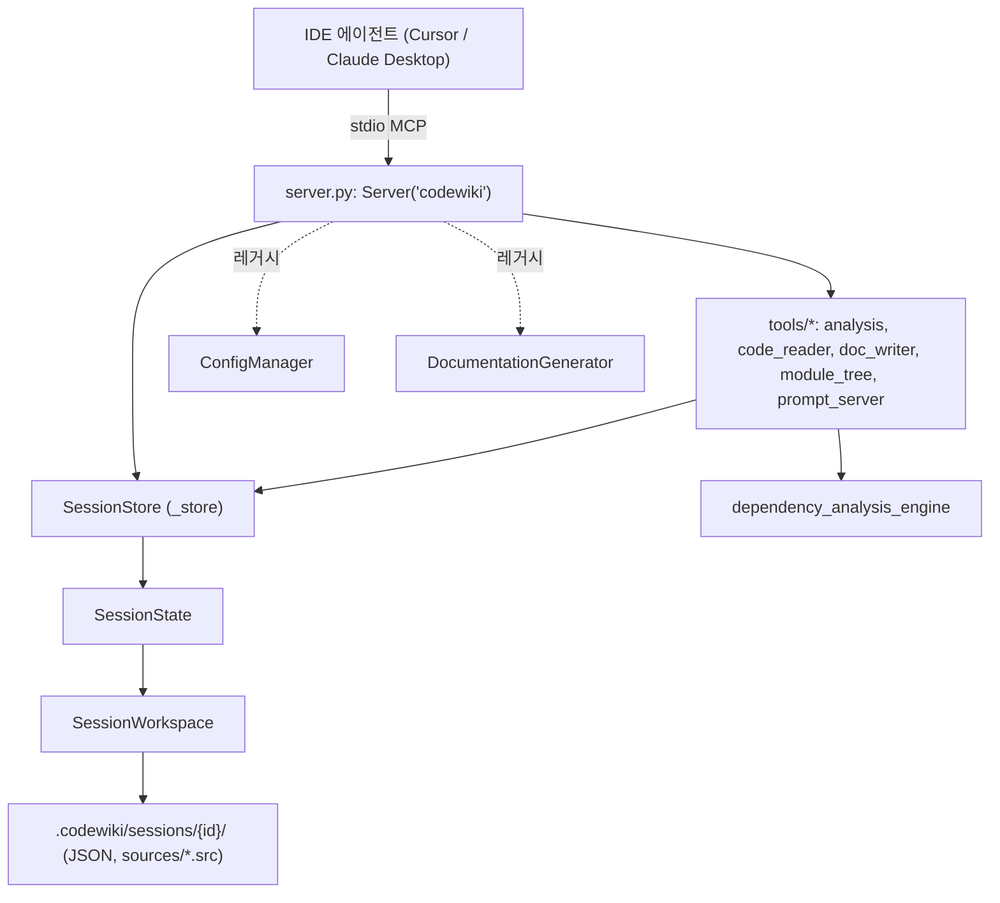
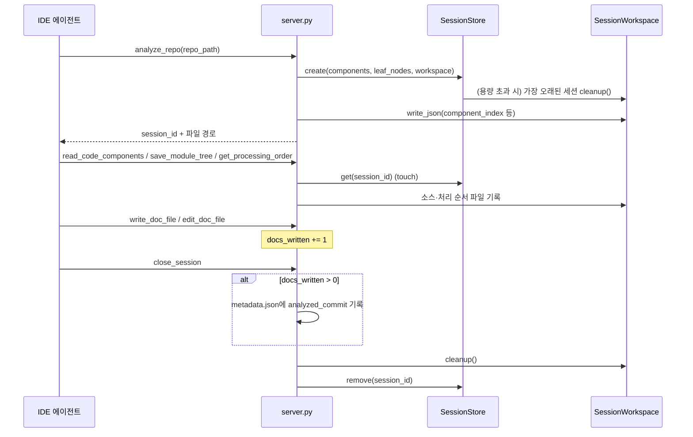

# mcp_server 모듈

## 개요

`mcp_server`는 CodeWiki를 **MCP(Model Context Protocol) 서버**로 노출하는 모듈이다. Cursor, Claude Desktop 같은 IDE 에이전트가 stdio로 접속해, LLM 설정 없이도 저장소 분석 → 모듈 클러스터링 → 문서 작성 → 세션 종료까지 진행하게 한다. 이 문서가 다루는 핵심 컴포넌트는 세션 상태 관리 두 파일이다.

| 컴포넌트 | 파일 | 역할 |
|---|---|---|
| `SessionState` | `codewiki/mcp/session.py` | 한 세션의 분석 결과·모듈 트리·기준 커밋 등 가변 상태 |
| `SessionStore` | `codewiki/mcp/session.py` | 활성 세션의 스레드 안전 인메모리 저장소 (TTL·용량 제한) |
| `SessionWorkspace` | `codewiki/mcp/workspace.py` | 세션별 디스크 작업 디렉터리 (`.codewiki/sessions/{session_id}/`) |

같은 패키지의 `server.py`와 `tools/*.py`(도구 핸들러)는 핵심 컴포넌트 목록에는 없지만, 위 컴포넌트가 어떻게 쓰이는지 보여 주므로 함께 설명한다.

## 아키텍처



설계 핵심은 두 가지다.

1. **세션 캐시**: `analyze_repo`가 파싱한 `components`, `leaf_nodes`를 메모리에 보관해, 이후 도구 호출이 `session_id`만으로 저장소를 재파싱하지 않고 동작한다.
2. **디스크 작업공간**: 큰 산출물(컴포넌트 인덱스, 소스 코드, 처리 순서)을 stdio 채널로 보내지 않고 파일로 쓴 뒤 경로만 반환한다. IDE 에이전트가 파일을 직접 읽는다.

## 컴포넌트 상세

### SessionState (`session.py`)

dataclass이며 필드는 다음과 같다.

- `session_id`, `repo_path`, `output_dir`
- `components: Dict[str, Node]`, `leaf_nodes: List[str]` — 분석 결과. `Node`는 [dependency_analysis_engine](dependency_analysis_engine.md)의 모델이다.
- `module_tree`, `registry` — `save_module_tree` 등이 채우는 값.
- `workspace: Optional[SessionWorkspace]`
- `analyzed_commit` — `analyze_repo` 시점의 HEAD. 증분 업데이트의 기준선이다. `close_session`은 종료 시점 HEAD가 아니라 **이 값**을 기록한다. 세션 중 생긴 커밋이 문서화 없이 기준선에 흡수되는 것을 막기 위해서다.
- `docs_written` — `write_doc_file`/`edit_doc_file` 성공 횟수. 0이면 `metadata.json` 기준선을 갱신하지 않는다.
- `created_at`, `last_accessed` — TTL 판단용.

`touch()`는 마지막 접근 시각을 갱신하고, `is_expired`는 마지막 접근 후 `_SESSION_TTL_SECONDS`(2시간)가 지나면 참이 된다.

### SessionStore (`session.py`)

`threading.Lock`으로 보호되는 `Dict[str, SessionState]`.

- `create(...)`: 만료 세션 정리(`_purge_expired_locked`) → 세션이 `_MAX_SESSIONS`(10)개면 `last_accessed`가 가장 오래된 세션을 축출(작업공간도 `cleanup()`) → `uuid4().hex[:12]` ID 발급(충돌 시 재발급) → 등록.
- `get(session_id)`: 없거나 만료면 `None`(만료 시 작업공간 정리 후 삭제). 유효하면 `touch()` 후 반환한다.
- `remove(session_id)`: 세션을 제거하고 존재 여부를 반환한다. **작업공간 정리는 하지 않으므로** 호출 측(`close_session`)이 먼저 `workspace.cleanup()`을 호출한다.

### SessionWorkspace (`workspace.py`)

`repo_path/.codewiki/sessions/{session_id}/` 아래를 관리한다.

```
component_index.json, leaf_nodes.json, languages.json, changes.json,
summary.json, processing_order.json, module_tree_validation.json
sources/{sanitized_component_id}_{sha1[:8]}.src
```

- `write_json(name, data)` / `read_json(name)`: 예쁘게 정렬한 UTF-8 JSON을 읽고 쓴다. 파일이 없으면 `read_json`은 `None`을 반환한다.
- `write_component_source(component_id, source, language)`: 주석 헤더(`// Component`, `// Language`)를 붙여 `.src`로 저장한다.
- `_safe_filename`: `[^\w\-.]`를 `__`로 치환하고 180자로 자른 뒤 SHA-1 8자리 접미사를 붙인다. `src/a-b.py`와 `src/a_b.py` 같은 충돌과 NAME_MAX(255바이트) 초과를 막는다.
- `cleanup()`: 세션 디렉터리를 삭제하고, 비어 있으면 `sessions/`와 `.codewiki/`도 지운다(`OSError`는 무시).

## 세션 생명주기와 데이터 흐름



## MCP 도구 (`server.py`)

**세분화 도구** (LLM 설정 불필요)

| 도구 | 동작 |
|---|---|
| `analyze_repo` | Tree-sitter로 분석, 세션 생성, 작업공간에 결과 기록. 기존 문서가 있으면 `changes` 반환 |
| `read_code_components` | 컴포넌트 소스를 `sources/*.src`로 기록 |
| `write_doc_file` / `edit_doc_file` | 문서 생성/편집(`str_replace`, `insert`, `undo`) 후 Mermaid 검증 |
| `save_module_tree` | 에이전트가 만든 모듈 트리 저장, 검증, 리프 우선 처리 순서 기록 |
| `get_processing_order` | 리프 우선 처리 순서 계산 |
| `get_prompt` | 단계별 프롬프트 템플릿 반환 |
| `close_session` | 기준선 기록, 작업공간 정리, 세션 제거 |

**레거시 도구**: `generate_docs`(전체 생성), `get_module_tree`. `ConfigManager`(→ [cli_config_and_models](cli_config_and_models.md))로 LLM 설정을 읽고 `DocumentationGenerator`(→ [documentation_generation_core](documentation_generation_core.md))를 실행한다.

### 동시성 처리

- 동기 핸들러는 `asyncio.to_thread()`로 실행해 stdio 이벤트 루프가 막히지 않게 한다.
- `analyze_repo`는 `_analyze_lock`으로 직렬화한다. Tree-sitter 파서를 여러 스레드에서 동시에 구동하면 안전하지 않고 작업도 무겁기 때문이다.
- `SessionStore`는 자체 락으로 스레드 안전성을 보장한다.

## 운영상 유의점

- 세션은 프로세스 메모리에만 있으므로 서버가 재시작되면 사라진다. 디스크의 `.codewiki/sessions/`는 정상 종료·만료·축출 때만 정리된다. 비정상 종료 시에는 찌꺼기가 남을 수 있다(추론).
- `get()`이 만료 세션을 지연 삭제하므로, 조회되지 않는 만료 세션은 다음 `create()`의 정리 단계까지 남는다.
- 상한 10개를 넘으면 가장 오래 쓰이지 않은 세션이 조용히 축출된다. 이후 그 `session_id`를 쓰면 not found 오류가 난다.
- `close_session`을 호출하지 않고 끝나면 `metadata.json` 기준선이 갱신되지 않아 다음 `analyze_repo`에서 변경분이 다시 감지된다.

## 관련 모듈

- [dependency_analysis_engine](dependency_analysis_engine.md): `analyze_repo`가 사용하는 `Node` 모델과 분석기
- [cli_config_and_models](cli_config_and_models.md): 레거시 도구의 `ConfigManager`
- [documentation_generation_core](documentation_generation_core.md): 레거시 `generate_docs`의 `DocumentationGenerator`
- [incremental_updater](incremental_updater.md): 같은 `metadata.json` 커밋 기준선 개념을 쓰는 증분 업데이트
- [build_ci_and_deployment](build_ci_and_deployment.md): 패키징과 실행 환경
