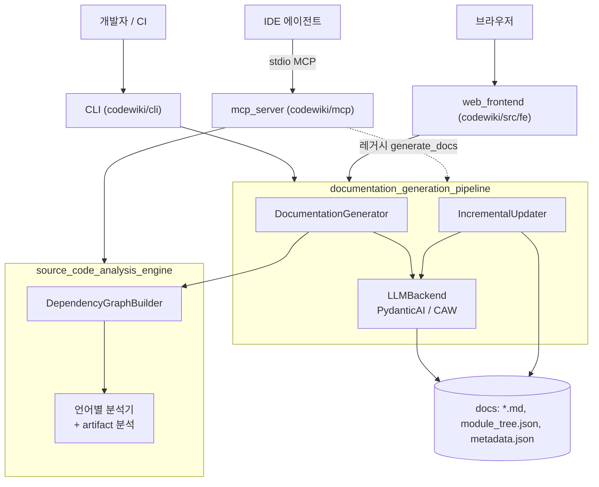
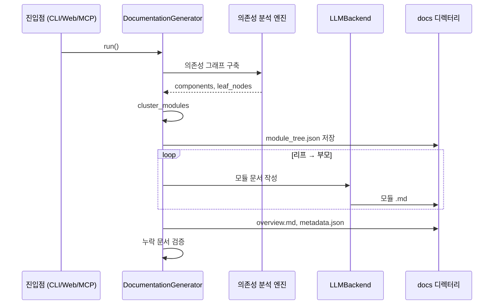

# CodeWiki 개요

## 목적

CodeWiki는 소스 저장소를 분석해 **구조화된 한국어(다국어) 문서를 자동으로 생성하는 도구**입니다. 처리 순서는 다음과 같습니다.

1. 언어별 분석기가 함수, 클래스, 메서드, artifact를 컴포넌트로 추출하고 호출 의존성 그래프를 만듭니다.
2. 컴포넌트를 모듈 트리로 클러스터링합니다.
3. LLM 에이전트가 리프 모듈부터 문서를 작성하고, 부모 모듈 문서와 저장소 `overview.md`를 만듭니다.
4. 코드가 바뀌면 영향받은 페이지만 증분 갱신합니다.

진입 경로는 세 가지입니다. CLI(`codewiki`), IDE 에이전트용 MCP 서버, 웹 프런트엔드입니다.

## 전체 아키텍처

## 대표 실행 흐름

## 핵심 모듈 문서

| 모듈 | 경로 | 요약 |
|---|---|---|
| [user_interfaces_and_entry_points](user_interfaces_and_entry_points.md) | `codewiki` | CLI, MCP 서버, 웹 프런트엔드 세 진입점. 설정, 세션, 작업 상태, 캐시를 관리하고 생성은 파이프라인에 위임합니다. |
| [documentation_generation_pipeline](documentation_generation_pipeline.md) | `codewiki/src` | 그래프 구축, 클러스터링, 모듈별 LLM 문서화, 개요 생성, 검증, 증분 업데이트를 담당합니다. 하위 문서: `documentation_generation_core`, `agent_backends_and_tools`, `incremental_updater` |
| [source_code_analysis_engine](source_code_analysis_engine.md) | `codewiki/src/be/dependency_analyzer` | 파일 트리 스캔과 언어별 분석(Python, JS/TS, Java/Kotlin/Scala, C/C++/C#, Ruby/PHP 등)으로 호출 그래프를 만듭니다. Dockerfile, CI, manifest 같은 artifact도 분석합니다. |
| [build_ci_and_deployment](build_ci_and_deployment.md) | 저장소 루트 | 패키징, CI, 컨테이너 배포 설정입니다. |

## How it is built and run

- **패키징**: `pyproject.toml`이 setuptools 기반 빌드와 `codewiki` 엔트리포인트(`codewiki.cli.main:cli`)를 정의합니다. Python 3.12 이상이 필요합니다. `requirements.txt`는 버전을 고정한 의존성 목록입니다.
- **테스트/CI**: `.github/workflows/ci.yml`이 `test` 잡(pytest)과 `lint` 잡(ruff)을 병렬로 실행합니다.
- **배포**: `docker/Dockerfile`과 `docker/docker-compose.yml`이 웹 앱을 `codewiki` 서비스로 컨테이너화합니다.

자세한 내용은 [build_ci_and_deployment](build_ci_and_deployment.md)를 참고하세요.