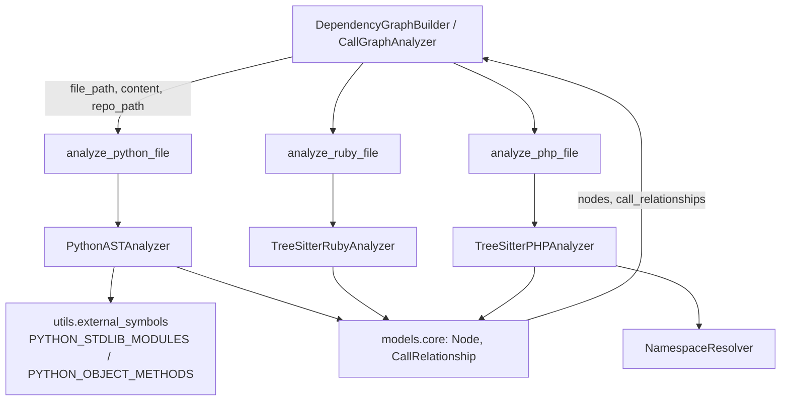
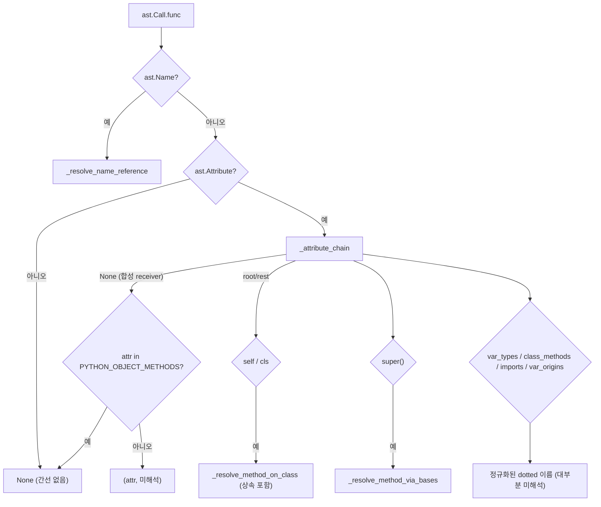
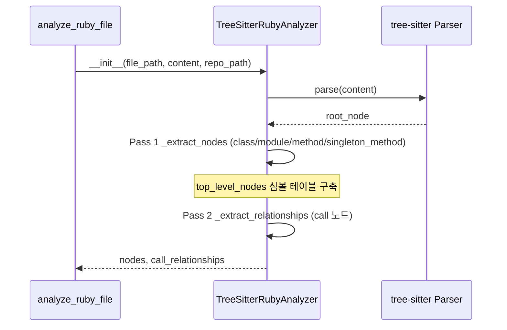
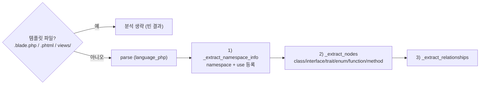

# scripting_language_analyzers 모듈

`scripting_language_analyzers`는 스크립팅 언어인 **Python, Ruby, PHP** 소스 파일을 정적 분석하여 코드 컴포넌트(`Node`)와 컴포넌트 간 의존 관계(`CallRelationship`)를 추출하는 언어별 분석기 모음이다. 세 분석기는 모두 `codewiki/src/be/dependency_analyzer/analyzers/` 아래에 있고, 상위 모듈 [language_analyzers](language_analyzers.md)의 하위 모듈이다. 분석 결과는 [dependency_analysis_engine](dependency_analysis_engine.md)의 `CallGraphAnalyzer`와 `DependencyGraphBuilder`가 취합해 전역 의존성 그래프로 만든다. 이 그래프는 문서 생성 파이프라인([documentation_generation_pipeline](documentation_generation_pipeline.md))의 입력이 된다.

| 파일 | 핵심 컴포넌트 | 파서 | 진입 함수 |
|---|---|---|---|
| `analyzers/python.py` | `PythonASTAnalyzer` | 표준 라이브러리 `ast` | `analyze_python_file` |
| `analyzers/ruby.py` | `TreeSitterRubyAnalyzer` | `tree_sitter_ruby` | `analyze_ruby_file` |
| `analyzers/php.py` | `TreeSitterPHPAnalyzer`, `NamespaceResolver` | `tree_sitter_php` | `analyze_php_file` |

같은 계열의 다른 분석기는 [c_family_analyzers](c_family_analyzers.md), [jvm_language_analyzers](jvm_language_analyzers.md), [web_language_analyzers](web_language_analyzers.md)를 참고한다. 아티팩트 분석은 [artifact_analysis](artifact_analysis.md)에 있다.

---

## 1. 아키텍처 개요

세 분석기는 공통 계약을 따른다.

- **입력**: `file_path`, `content`, 선택적 `repo_path`. Python은 추가로 `project_modules`를 받는다.
- **출력**: `(nodes, call_relationships)`. Python은 서드파티 import 루트 집합 `external_import_roots`를 세 번째로 반환한다.
- **컴포넌트 ID**: `<상대경로>::<논리이름>` 형식이다. 예: `pkg/a.py::Foo.bar`
- **`is_resolved` 플래그**: 같은 파일 안에서 해석되면 `True`이고, 전역 리졸버에게 넘겨야 하면 `False`이다.
- **오류 격리**: 파싱 실패는 로그만 남기고 빈 결과를 반환한다. 파일 하나가 전체 분석을 중단시키지 않는다.

---

## 2. PythonASTAnalyzer (`python.py`)

`ast.NodeVisitor`를 상속한 단일 패스 방문자다. 표준 `ast`를 쓰므로 tree-sitter 의존성이 없다.

### 2.1 상태 구조

| 필드 | 의미 |
|---|---|
| `scope_stack` | `("class"\|"function", name)` 스코프 스택 |
| `component_stack` | 호출자 귀속용 컴포넌트 ID 스택 |
| `top_level_nodes` | 같은 파일의 최상위 함수/클래스 (이름 → `Node`) |
| `class_methods`, `class_bases` | 점 표기 클래스명 (`Outer.Inner`) 별 메서드 집합과 베이스 목록 |
| `module_imports`, `from_imports` | 로컬 별칭 → 정규화된 dotted 대상 |
| `var_types`, `var_origins` | 변수 → 같은 파일 클래스, 변수 → 원천 표현식 (얕은 타입 추적) |
| `local_function_names` | 함수 내부 중첩 함수 이름 (내부 호출은 간선으로 만들지 않음) |
| `external_import_roots` | 프로젝트 외부 import 루트 |

### 2.2 컴포넌트 추출 규칙

- **클래스**: 함수 밖의 클래스만 `component_type="class"` 노드가 된다. 함수 안의 지역 클래스는 호출 탐색만 하고 컴포넌트로는 만들지 않는다. 중첩 클래스는 `Outer.Inner`로 이름을 붙인다.
- **함수**: 최상위 함수는 `function`, 클래스 직속 함수는 `method`가 된다. 함수 안에 중첩된 함수는 컴포넌트가 아니며, 그 안의 호출은 바깥 컴포넌트에 귀속된다.
- **제외**: 이름이 `_test_`로 시작하면 `_should_include_function`이 걸러낸다.
- **모듈 경로**: `_get_module_path`는 `.py`/`.pyx`를 제거하고 구분자를 `.`으로 바꾸며 `__init__`을 접는다. 결과는 `qualified_name`에 쓰인다.
- 상속 관계는 클래스 정의 시점에 `CallRelationship`으로 바로 기록한다.

### 2.3 import 해석과 프로젝트/외부 구분

- `visit_Import`는 `import a.b.c`를 `a`로 바인딩하고, 나머지는 속성 체인으로 복원한다.
- `visit_ImportFrom`은 상대 import(`node.level`)를 현재 모듈 경로 기준의 패키지 접두어로 확장한다. `*` import는 무시한다.
- `_note_import_root`는 stdlib(`PYTHON_STDLIB_MODULES`)을 제외한다. `project_modules`가 주어졌는데 `is_project_import`가 실패하면 외부 루트로 기록한다.
- `is_project_import`는 `_dotted_contains`로 dotted 경계 포함 여부를 검사한다. `src/` 레이아웃처럼 import 루트와 저장소 루트가 다른 경우(`pkg.util` 대 `src.pkg.util`)를 허용하기 위해서다.

### 2.4 호출 분류 (`_classify_call`)

- 해석 우선순위: 지역 중첩 함수(무시) → 같은 파일 최상위 정의 → `from_imports` → `module_imports` → 원문 이름.
- `self.x()`, `cls.x()`, `super().x()`는 둘러싼 클래스의 메서드 테이블과 같은 파일 상속 체인(`_resolve_method_via_bases`, BFS)으로 해석한다. 임포트된 베이스로 이어지면 전역 리졸버가 `qualified_name`과 대조하도록 정규화된 dotted 메서드명을 미해석으로 낸다.
- `_track_assignment`는 `x = Foo()`(같은 파일 클래스) 또는 `x = mod.func()`(import 기원) 형태만 추적한다. 이후 `x.method()`를 해석하는 데 쓴다.
- 호출 하나당 최대 하나의 간선만 낸다. 내장 함수 필터링은 여기서 하지 않고 전역 해석 이후로 미룬다.

### 2.5 실행

`analyze()`는 `SyntaxWarning`(정규식 이스케이프 등)을 억제하고 `ast.parse` 후 `visit`한다. `SyntaxError`는 경고, 그 외 예외는 `exc_info`와 함께 오류로 로깅한다.

---

## 3. TreeSitterRubyAnalyzer (`ruby.py`)

생성자에서 `_analyze()`를 바로 실행하는 2-패스 분석기다. 재귀 깊이는 `MAX_RECURSION_DEPTH = 100`으로 제한한다.

### 3.1 패스 구조

**Pass 1 (`_extract_nodes`)**

- `class`, `module`은 컴포넌트가 된다. `qualified_name`은 스코프를 이어 붙여 만들고, 슈퍼클래스는 `base_classes`에 넣는다.
- `singleton_class`(`class << self`)는 현재 스코프를 유지한다.
- `singleton_method`(`def Foo.bar`)는 소유자를 `Foo`로 잡는다.
- 스코프가 있으면 메서드는 `Owner.method`로 `method` 타입이고, 없으면 `function`이다.
- `initialize`는 심볼 테이블(`top_level_nodes`)에는 등록하지만 `nodes`에는 넣지 않는다. 호출 해석에는 쓰되 문서화 대상은 아니라는 뜻이다.
- docstring은 직전 `comment` 형제 노드에서 가져온다. 클래스 body의 첫 문장은 body의 형제 노드를 본다.

**Pass 2 (`_extract_relationships`)** — 호출 유형별 처리는 다음과 같다.

| 호출 형태 | 처리 |
|---|---|
| `include`/`extend`/`prepend Foo` | mixin 간선 (내장 상수는 제외) |
| `require_relative "x/y"` | basename 기준의 미해석 간선. 일반 `require`는 core 목록과 함께 버림 |
| receiver 없음 / `self` | `RUBY_CORE_METHODS`면 버리고, 아니면 `owner_class.method` → 이름 순으로 같은 파일에서 해석 |
| `Const.new` | 클래스 자체로의 간선 (같은 파일이면 해석됨) |
| `Const.meth` | 같은 파일이면 해석, 아니면 `Const.meth` 미해석 (`RUBY_BUILTIN_CONSTANTS`는 제외) |
| `var.meth` | `_receiver_class`가 둘러싼 메서드에서 `var = Const.new` 대입을 찾아 클래스를 추론 |
| 합성 receiver | core 메서드가 아닐 때만 bare 메서드명으로 미해석 간선 |

- 노이즈 억제용 상수: `RUBY_CORE_METHODS`(Kernel/Enumerable/String/DSL/테스트 DSL)와 `RUBY_BUILTIN_CONSTANTS`(표준 라이브러리 상수).
- `_add_relationship_raw`는 `(caller, callee, call_line)` 중복과 자기 호출(`caller == callee`)을 제거한다.
- 미해석 callee는 논리 이름 그대로 남기고, 전역 리졸버가 이름 인덱스로 매칭한다.

---

## 4. TreeSitterPHPAnalyzer / NamespaceResolver (`php.py`)

### 4.1 NamespaceResolver

PHP의 `namespace`와 `use` 선언으로 클래스명을 FQN으로 변환한다.

- `register_namespace(ns)`: 현재 네임스페이스를 설정한다.
- `register_use(fqn, alias=None)`: 별칭 → FQN 맵(`use_map`)에 등록한다. 별칭이 없으면 마지막 세그먼트를 쓴다.
- `resolve(name)`의 순서:
  1. 선행 `\`가 있으면 완전 정규화된 이름이므로 그대로 쓴다.
  2. `use_map`에 직접 있으면 그 값을 쓴다.
  3. 첫 세그먼트가 별칭이면 치환한다.
  4. 그 외에는 현재 네임스페이스를 앞에 붙인다.

### 4.2 분석 흐름 (3패스)

- **템플릿 건너뛰기**: `TEMPLATE_PATTERNS`(`.blade.php`, `.phtml`, `.twig.php`)와 `TEMPLATE_DIRECTORIES`(`views`, `templates`, `resources/views`) 경로는 분석하지 않는다.
- **노드 타입**: `class`, `abstract class`, `interface`, `trait`, `enum`, `function`, `method`. 메서드 이름은 `Class.method`이다. PHPDoc(`/** */`)은 이전 형제 노드나 위쪽 줄 스캔으로 찾는다. 파라미터는 `타입 $변수` 문자열로 만든다.
- **관계 유형**: 각 항목은 `_extract_relationships`가 기록한다.
  1. `use` 선언 (호출자는 파일 상대경로)
  2. `extends`
  3. `implements`
  4. `new`
  5. 정적 호출 `Foo::bar()`
  6. 생성자 프로퍼티 프로모션 (PHP 8+)
- **해석 정책**: 모든 PHP 간선은 `NamespaceResolver`로 FQN을 만든 뒤 `\`를 `.`으로 바꾸고 `is_resolved=False`로 낸다. 같은 파일 내 해석은 하지 않으므로 전역 리졸버가 매칭해야 한다. 이 점이 Python/Ruby와 다르다.
- **필터**: `_is_primitive`는 `PHP_PRIMITIVES`(스칼라 타입, `Exception`, `DateTime` 등 내장 클래스)를 대소문자 무시로 제외한다.
- 재귀 깊이는 `MAX_RECURSION_DEPTH = 100`으로 제한한다.

---

## 5. 분석기 비교

| 항목 | Python | Ruby | PHP |
|---|---|---|---|
| 파서 | `ast` | tree-sitter | tree-sitter |
| 패스 수 | 1 (방문자) | 2 | 3 |
| 같은 파일 해석 | 있음 (클래스/상속/변수 타입) | 있음 (`top_level_nodes`) | 없음 (전부 FQN 미해석) |
| 외부 심볼 필터 | stdlib 모듈, 객체 메서드 | core 메서드, 내장 상수 | primitive/내장 클래스 |
| 특이 규칙 | `_test_*` 제외, 상대 import | `initialize` 비노출, mixin | 템플릿 스킵, 네임스페이스 |
| 추가 반환값 | `external_import_roots` | 없음 | 없음 |

## 6. 확장 시 주의점

- 새 분석기도 `Node`와 `CallRelationship` 계약(ID 형식 `상대경로::이름`, `is_resolved` 의미)을 지켜야 전역 리졸버와 호환된다.
- 미해석 callee는 전역 리졸버가 이름/`qualified_name` 인덱스로 매칭하므로, 표기(Python은 dotted 모듈 경로, PHP는 `.`으로 바꾼 FQN, Ruby는 논리 이름)를 임의로 바꾸면 매칭이 깨질 수 있다.
- Ruby/PHP 분석기는 `qualified_name` 처리 방식이 다르다. Ruby는 스코프 기반 `qualified_name`을 채우지만, PHP는 채우지 않아 기본값에 의존한다. 코드로 확인한 사실이며, 의도는 확인하지 못했다.
- 검증 수준: 위 내용은 제공된 소스 코드를 읽고 확인한 것이다(코드 확인). 전역 리졸버의 실제 매칭 동작은 이 모듈 밖에 있으므로 이 문서에서는 확인하지 않았다(미확인).
