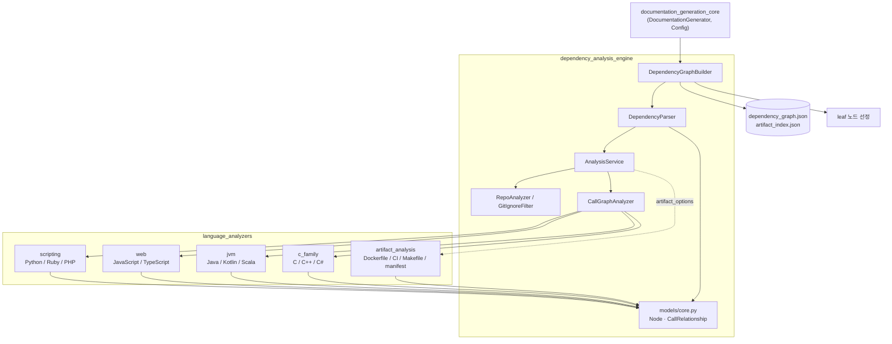
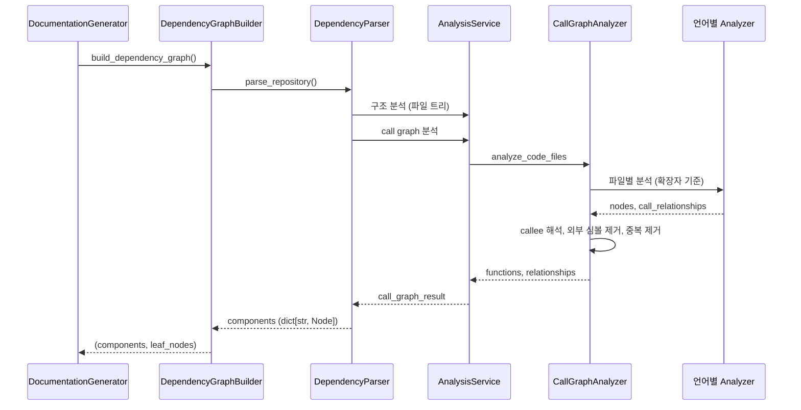

# source_code_analysis_engine 개요

## 1. 목적

`source_code_analysis_engine`(`codewiki/src/be/dependency_analyzer`)은 저장소를 스캔해 **컴포넌트(함수·클래스·메서드·artifact)와 호출 의존성 그래프**를 만드는 모듈이다. 이 그래프는 [documentation_generation_pipeline](documentation_generation_pipeline.md)이 모듈 클러스터링과 문서 생성의 입력으로 쓴다.

책임은 두 하위 모듈로 나뉜다.

| 하위 모듈 | 역할 | 문서 |
|---|---|---|
| `dependency_analysis_engine` | 파일 트리 구성, 언어별 분석기 라우팅, callee 해석, `Node` 그래프 생성, leaf 노드 선정 | [dependency_analysis_engine](dependency_analysis_engine.md) |
| `language_analyzers` | 파일 하나를 읽어 `Node`와 `CallRelationship`으로 바꾸는 언어별 분석기와 artifact 분석기 | [language_analyzers](language_analyzers.md) |

## 2. 아키텍처

### 대표 실행 흐름

## 3. 동작 요약

- **파일 선택**: 우선순위는 사용자 exclude, 기본 ignore(`ARTIFACT_WHITELIST` 예외 있음), `.gitignore`, include 순이다.
- **언어별 분석**: 언어 분석기는 지연 import 되며, 파일 하나가 실패해도 전체 분석은 계속된다. 대부분 2-패스(선언 수집 후 관계 수집)로 동작한다.
- **호출 해석**: 유일 매치만 확정하는 보수적 정책이다. 호출자 언어 파티션을 먼저 시도하고, 실패하면 전역으로 폴백한다. 외부 심볼은 제거한다.
- **artifact 패스**: `artifact_options.enabled`일 때만 실행된다. 언어 분석 뒤에 같은 파일 트리를 다시 훑어 `artifact` 노드를 추가한다.
- **공통 계약**: 컴포넌트 ID는 `<repo 상대경로>::<이름>` 형식이며, 메서드는 `<상대경로>::<Class>.<method>`다.

## 4. 주의점

- `SIGALRM` 기반 타임아웃은 Unix 메인 스레드에서만 동작한다. MCP 서버의 `asyncio.to_thread` 같은 환경에서는 타임아웃 없이 실행된다.
- `DependencyParser`가 `AnalysisService`의 비공개 메서드를 직접 호출한다. 시그니처를 바꿀 때는 함께 수정해야 한다.
- 언어마다 `is_resolved` 정책이 다르다. 미해석 callee의 표기를 바꾸면 전역 리졸버의 매칭이 깨질 수 있다.
- `go`와 `rust`는 일부 언어 필터 목록에는 있지만 `CallGraphAnalyzer`에 분석 분기가 없어 실제로는 분석되지 않는다.

## 5. 핵심 컴포넌트 문서

- [dependency_analysis_engine](dependency_analysis_engine.md) — `DependencyGraphBuilder`, `DependencyParser`, `AnalysisService`, `CallGraphAnalyzer`, `RepoAnalyzer`, 핵심 모델
- [language_analyzers](language_analyzers.md) — 언어 분석기 공통 계약과 하위 모듈
  - [scripting_language_analyzers](scripting_language_analyzers.md) — Python, Ruby, PHP
  - [web_language_analyzers](web_language_analyzers.md) — JavaScript, TypeScript
  - [jvm_language_analyzers](jvm_language_analyzers.md) — Java, Kotlin, Scala
  - [c_family_analyzers](c_family_analyzers.md) — C, C++, C#
  - [artifact_analysis](artifact_analysis.md) — Dockerfile, CI, Makefile, 매니페스트

## 6. 검증 수준

위 내용은 두 하위 모듈 문서를 종합한 것이다. 각 문서는 소스를 읽고 확인한 내용에 기반한다(코드 확인). 이 개요 작성 중에 소스를 직접 다시 열어 보지는 않았다. `cloning`, `security`, `external_symbols`, `topo_sort`, `leaf_selection`의 내부 동작은 미확인이다.