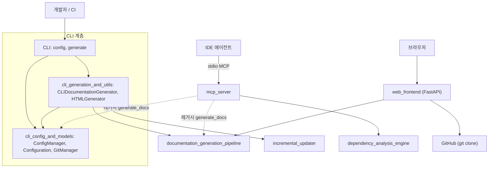
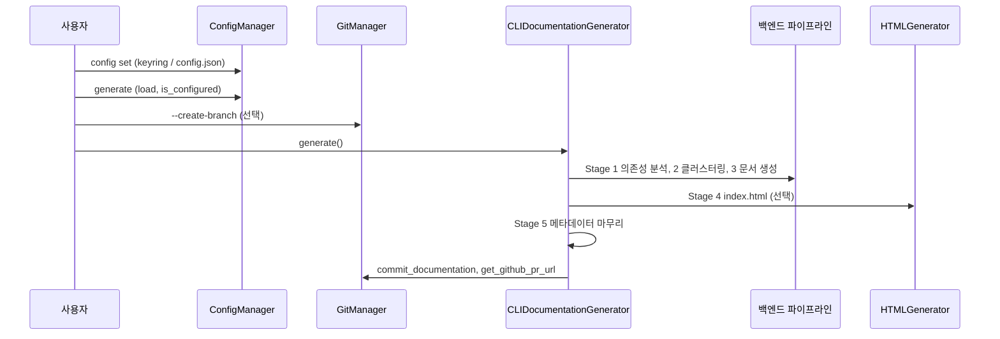
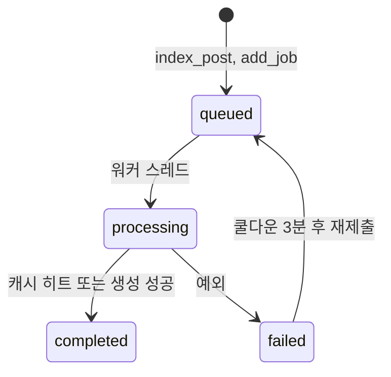

# user_interfaces_and_entry_points 모듈 개요

## 1. 목적

`user_interfaces_and_entry_points`(`codewiki/`)는 사용자가 CodeWiki를 쓰는 **세 가지 진입 경로**를 제공하는 최상위 모듈입니다. 세 경로는 CLI, MCP 서버, 웹 프런트엔드입니다. 이 모듈은 문서 생성 로직을 직접 구현하지 않습니다. 입력 검증, 설정, 작업 상태, 세션·캐시 관리를 맡고, 실제 분석과 문서 작성은 하위 파이프라인에 넘깁니다.

| 진입 경로 | 대상 사용자 | 핵심 동작 | LLM 설정 |
|---|---|---|---|
| CLI (`codewiki/cli`) | 개발자, CI | `codewiki config`, `codewiki generate`로 로컬 저장소 문서화 | 필요 (`~/.codewiki/config.json`) |
| MCP 서버 (`codewiki/mcp`) | Cursor, Claude Desktop 같은 IDE 에이전트 | stdio로 분석, 클러스터링, 문서 작성, 세션 종료를 세분화 도구로 제공 | 세분화 도구는 불필요, 레거시 `generate_docs`만 필요 |
| 웹 프런트엔드 (`codewiki/src/fe`) | 브라우저 사용자 | GitHub URL을 제출하면 clone, 생성, 캐시, HTML 렌더링을 수행 | 백엔드 `Config` 사용 |

## 2. 하위 모듈 구성

| 하위 모듈 | 경로 | 책임 |
|---|---|---|
| [cli_config_and_models](cli_config_and_models.md) | `codewiki/cli` | `ConfigManager`(설정·API 키), `GitManager`, `Configuration`/`AgentInstructions`, `DocumentationJob` 등 작업 모델 |
| [cli_generation_and_utils](cli_generation_and_utils.md) | `codewiki/cli` | `CLIDocumentationGenerator`(5단계 실행 조율), `HTMLGenerator`, 예외 계층과 종료 코드, 로거, 진행률 |
| [mcp_server](mcp_server.md) | `codewiki/mcp` | `SessionState`/`SessionStore`/`SessionWorkspace`, MCP 도구 핸들러 |
| [web_frontend](web_frontend.md) | `codewiki/src/fe` | `WebRoutes`, `BackgroundWorker`, `CacheManager`, `GitHubRepoProcessor` |

## 3. 전체 아키텍처

세 경로는 서로 독립적으로 동작합니다. 공유하는 것은 백엔드 파이프라인과 CLI 설정 계층입니다. MCP의 레거시 도구는 `ConfigManager`를 재사용합니다.

## 4. 경로별 핵심 흐름

### 4.1 CLI: 설정에서 생성까지

- 설정: API 키는 시스템 keyring에 저장하고, 실패하거나 `CODEWIKI_NO_KEYRING`이 설정돼 있으면 `credentials.json`을 씁니다. 나머지 설정은 `config.json`에 저장합니다.
- 오류: `CodeWikiError` 계층이 종료 코드를 정합니다. 설정 2, 저장소 3, API 4, 파일시스템 5, 기본과 불완전 생성은 1입니다.
- 증분 업데이트: `update` 모드에서는 `IncrementalUpdater` 결과에 따라 조기 종료하거나 전체 재생성합니다.

### 4.2 MCP: 세션 기반 도구 호출

`analyze_repo`가 세션을 만들고 결과를 `.codewiki/sessions/{id}/`에 파일로 기록합니다. 에이전트는 반환된 경로를 직접 읽습니다. 이후 `save_module_tree`, `write_doc_file`, `close_session` 순으로 진행합니다.

- `SessionStore`는 스레드 안전하게 동작하며, 최대 10개 세션과 2시간 TTL을 적용합니다.
- `close_session`은 문서가 한 건이라도 작성된 경우에만 `analyzed_commit`을 `metadata.json` 기준선으로 기록합니다.
- `analyze_repo`는 락으로 직렬화하고, 동기 핸들러는 `asyncio.to_thread()`로 실행합니다.

### 4.3 웹: 제출에서 열람까지

`WebRoutes`가 URL을 검증하고 정규화합니다. 그다음 `BackgroundWorker`가 큐에서 작업을 꺼내 `GitHubRepoProcessor`로 clone하고 `DocumentationGenerator`를 실행합니다. 결과는 `CacheManager`가 `cache_index.json`에 기록합니다. `/docs/{job_id}`는 `/static-docs/{job_id}/`로 리다이렉트하고, 여기서 Markdown을 HTML로 변환해 보여 줍니다.

## 5. 설계상 유의점

검증 수준은 각 하위 문서의 코드 확인 결과를 따릅니다.

- **두 종류의 `JobStatus`**: CLI(`cli/models/job.py`)와 웹(`fe/models.py`)에 동명 타입이 있지만 서로 별개입니다. (코드 확인)
- **`artifact_exclude` 누락**: `Configuration.to_backend_config()`는 런타임 지시가 있으면 영속 설정의 `artifact_exclude`를 백엔드로 넘기지 않습니다. (코드 확인)
- **웹 캐시 키에 `commit_id` 없음**: 같은 저장소를 다른 commit으로 요청해도 캐시된 문서가 반환될 수 있습니다. (코드 확인)
- **웹 동시성**: 워커는 단일 스레드이고 `job_status`에 락이 없습니다. `serve_generated_docs`의 `filename` 경로 이탈 검증도 이 코드에는 없습니다. 상위 계층에서 막는지는 미확인입니다.
- **MCP 세션 휘발성**: 세션은 프로세스 메모리에만 있습니다. 비정상 종료 시 디스크에 작업공간이 남을 수 있습니다. (추론)

## 6. 관련 문서

- 하위 모듈: [cli_config_and_models](cli_config_and_models.md), [cli_generation_and_utils](cli_generation_and_utils.md), [mcp_server](mcp_server.md), [web_frontend](web_frontend.md)
- 하위 파이프라인: [documentation_generation_pipeline](documentation_generation_pipeline.md), [incremental_updater](incremental_updater.md)
- 분석 엔진: [dependency_analysis_engine](dependency_analysis_engine.md)
- 패키징과 배포: [build_ci_and_deployment](build_ci_and_deployment.md)