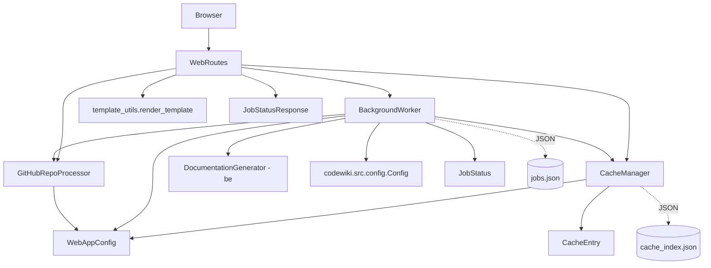
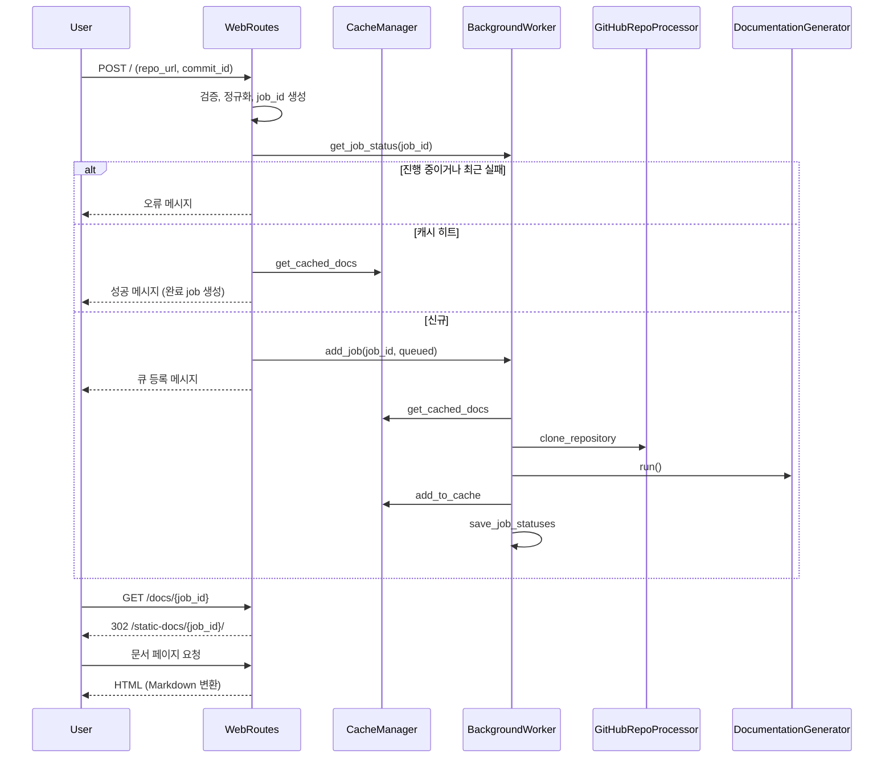
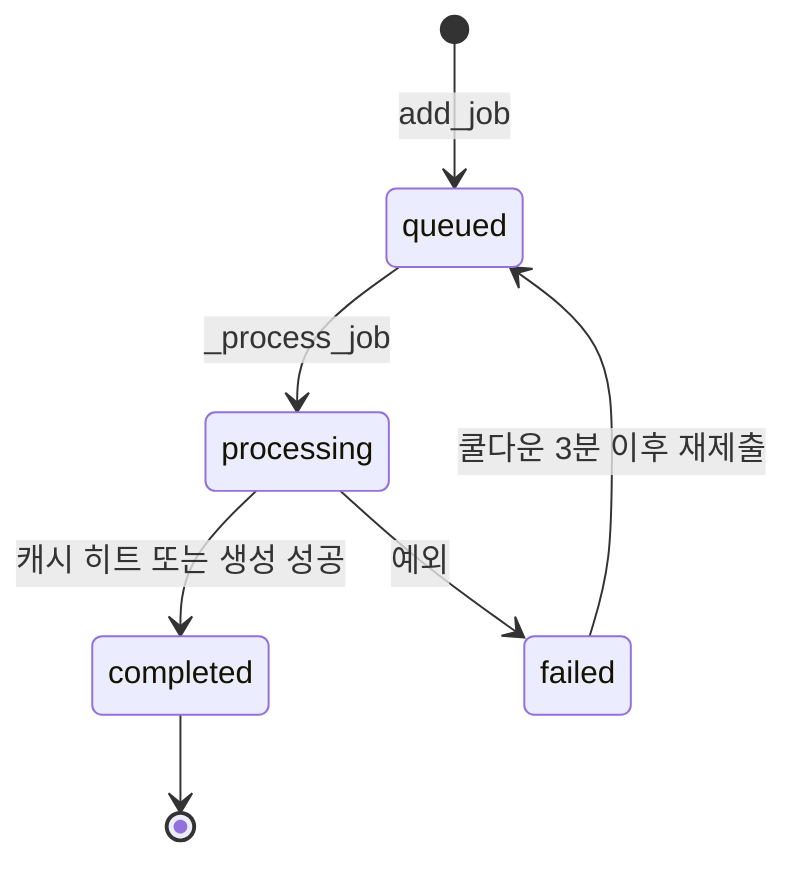

# web_frontend 모듈

`codewiki/src/fe/` 아래의 FastAPI 기반 웹 애플리케이션 계층이다. 사용자가 GitHub 저장소 URL(선택적으로 commit ID)을 제출하면 작업(job)을 큐에 넣는다. 백그라운드 스레드가 저장소를 clone하고 문서를 생성한다. 완료된 결과는 캐시에 저장하고, 웹에서 Markdown을 HTML로 렌더링해 보여 준다.

CLI 진입점은 [cli_config_and_models](cli_config_and_models.md), [cli_generation_and_utils](cli_generation_and_utils.md)를 참고한다. MCP 진입점은 [mcp_server](mcp_server.md)를 참고한다. 실제 문서 생성 로직은 [documentation_generation_core](documentation_generation_core.md)의 `DocumentationGenerator`가 담당하며, 이 모듈은 그 호출자일 뿐이다.

> 주의: `routes.py`가 import하는 `.templates`(`WEB_INTERFACE_TEMPLATE`, `DOCS_VIEW_TEMPLATE`)와 `.visualise_docs`(`markdown_to_html`, `get_file_title`)는 이번 입력 컴포넌트에 포함되지 않았다. 이 파일들의 내용은 이 문서에서 다루지 않는다.

## 컴포넌트 구성

| 파일 | 컴포넌트 | 역할 |
|---|---|---|
| `config.py` | `WebAppConfig` | 디렉터리, 큐 크기, 캐시 만료, 재시도 쿨다운, clone 타임아웃 같은 상수 |
| `models.py` | `RepositorySubmission`, `JobStatusResponse`, `JobStatus`, `CacheEntry` | Pydantic 모델과 dataclass |
| `github_processor.py` | `GitHubRepoProcessor` | URL 검증, 저장소 정보 추출, `git clone` |
| `cache_manager.py` | `CacheManager` | URL 해시 기반 문서 캐시 인덱스(`cache_index.json`) |
| `background_worker.py` | `BackgroundWorker` | 큐, 워커 스레드, 작업 상태 영속화(`jobs.json`) |
| `routes.py` | `WebRoutes` | 페이지와 API 핸들러 |
| `template_utils.py` | `StringTemplateLoader` | 문자열 기반 Jinja2 렌더링 |

## 아키텍처

`WebRoutes`는 생성자로 `BackgroundWorker`와 `CacheManager`를 주입받는다(`routes.py`). 앱 조립(FastAPI 인스턴스와 라우트 등록)은 제공된 코드에 없으므로 미확인이다.

## 핵심 컴포넌트

### WebAppConfig
클래스 속성만 가진 설정 홀더다.
- 경로: `CACHE_DIR=./output/cache`, `TEMP_DIR=./output/temp`, `OUTPUT_DIR=./output`
- `QUEUE_SIZE=100`, `CACHE_EXPIRY_DAYS=365`
- `JOB_CLEANUP_HOURS=24000`, `RETRY_COOLDOWN_MINUTES=3`
- `DEFAULT_HOST=127.0.0.1`, `DEFAULT_PORT=8000`
- `CLONE_TIMEOUT=300`, `CLONE_DEPTH=1`
- `ensure_directories()`는 필요한 디렉터리를 만든다.

### 모델 (`models.py`)
- `JobStatus`(dataclass): `status`는 `queued` / `processing` / `completed` / `failed` 중 하나다. `progress`, `docs_path`, `main_model`, `commit_id` 등을 가진다.
- `JobStatusResponse`(Pydantic): `JobStatus`와 같은 필드를 가진 API 응답 모델이다. `asdict(job)`로 변환한다.
- `CacheEntry`: `repo_url`, `repo_url_hash`, `docs_path`, `created_at`, `last_accessed`
- `RepositorySubmission`: `repo_url: HttpUrl`. 이 모듈의 코드에서는 사용처가 보이지 않는다. 라우트는 `Form` 파라미터를 직접 받는다.

### GitHubRepoProcessor
- `is_valid_github_url`: 호스트가 `github.com` 또는 `www.github.com`이고 경로에 `owner/repo`가 있어야 한다.
- `get_repo_info`: `owner`, `repo`, `full_name`, `clone_url`을 반환한다. `.git` 접미사는 제거한다.
- `clone_repository`: `commit_id`가 없으면 `--depth 1` shallow clone을 한다. 있으면 전체 clone 후 `git checkout <commit_id>`를 실행한다. 타임아웃은 clone이 `CLONE_TIMEOUT`, checkout이 30초다. 실패하면 `False`를 반환한다.

### CacheManager
- 키는 `sha256(repo_url)[:16]`이다.
- 인덱스는 `cache_dir/cache_index.json`에 저장한다.
- `get_cached_docs`는 `created_at` 기준으로 만료를 판정한다. 유효하면 `last_accessed`를 갱신해 반환하고, 만료됐으면 제거한다.
- `add_to_cache`, `remove_from_cache`, `cleanup_expired_cache`를 제공한다.
- 캐시 키에 `commit_id`가 포함되지 않는다(코드 확인). 같은 저장소를 다른 commit으로 요청해도 캐시된 문서가 반환될 수 있다.

### BackgroundWorker
- 상태: `processing_queue`(`Queue`, 최대 `QUEUE_SIZE`), 메모리상의 `job_status` 딕셔너리, `cache/jobs.json` 파일.
- `start()`는 daemon 스레드에서 `_worker_loop`를 실행한다. 큐를 1초 간격으로 폴링한다.
- `load_job_statuses()`는 디스크에서 `completed` 작업만 복원한다. `jobs.json`이 없으면 `_reconstruct_jobs_from_cache()`로 캐시 인덱스에서 작업을 재구성한다.
- `save_job_statuses()`는 작업 상태를 `jobs.json`에 기록한다.
- `_process_job()`의 처리 순서:
  1. 상태를 `processing`으로 바꾸고 `MAIN_MODEL`을 기록한다.
  2. 캐시를 조회한다. 히트하면 바로 `completed`로 마친다.
  3. `GitHubRepoProcessor.clone_repository`로 `TEMP_DIR/<job_id>`에 clone한다.
  4. `Config.from_args(Namespace(repo_path=...))`로 설정을 만들고 `docs_dir`를 `output/docs/<job_id>-docs`로 덮어쓴다.
  5. 새 이벤트 루프에서 `DocumentationGenerator(config, commit_id).run()`을 실행한다.
  6. 결과를 캐시에 등록하고 상태를 저장한다.
  7. 예외가 나면 `failed`와 `error_message`를 기록한다. `finally`에서 임시 clone 디렉터리를 `rm -rf`로 삭제한다.
- 실패한 작업은 `jobs.json`에 저장되지 않는다. `failed` 분기에는 `save_job_statuses()` 호출이 없다(코드 확인).

### WebRoutes
| 핸들러 | 역할 |
|---|---|
| `index_get` | 메인 페이지. 최근 작업 목록을 최대 100개 렌더링 |
| `index_post` | URL과 `commit_id`를 검증하고 중복 작업, 실패 쿨다운, 캐시를 확인한 뒤 큐에 등록 |
| `get_job_status` | `JobStatusResponse`를 반환하는 API. 없으면 404 |
| `view_docs` | 완료된 작업이면 `/static-docs/{job_id}/`로 302 리다이렉트 |
| `serve_generated_docs` | `module_tree.json`, `metadata.json`을 읽고 Markdown을 HTML로 변환해 렌더링 |

보조 메서드:
- `_normalize_github_url`: `https://github.com/{owner}/{repo}` 형태로 정규화한다.
- `_repo_full_name_to_job_id`: `owner/repo`를 `owner--repo`로 바꾼다.
- `_job_id_to_repo_full_name`: 역변환한다.
- `cleanup_old_jobs`: `JOB_CLEANUP_HOURS`보다 오래된 `completed` / `failed` 작업을 메모리에서 제거한다.

`job_id`는 저장소 전체 이름 기반이라 같은 저장소는 항상 같은 `job_id`를 가진다. 이 값이 중복 제출 방지 키가 된다.

### template_utils
- `StringTemplateLoader`: 템플릿 문자열을 그대로 반환하는 Jinja2 `BaseLoader`.
- `render_template(template, context)`: 호출마다 `Environment`를 새로 만든다. `autoescape=select_autoescape(["html","xml"])`가 켜져 있다. 다만 `StringTemplateLoader`가 반환하는 템플릿 이름이 `""`이라 확장자 기반 autoescape가 실제로 적용되는지는 실행으로 확인하지 않았다(미확인).
- `render_navigation`, `render_job_list`: 보조 렌더러. 제공된 `routes.py`에서는 호출되지 않는다.

## 데이터 흐름

### 저장소 제출부터 문서 생성까지

### 작업 상태 전이

## 동작상 유의점 (코드 확인)
- 큐 처리는 단일 워커 스레드라서 작업이 직렬로 실행된다.
- `job_status` 딕셔너리는 워커 스레드와 요청 핸들러가 함께 접근한다. 락이 없다.
- `index_post`가 캐시 히트로 만든 작업은 메모리에만 등록되고 `save_job_statuses()`가 호출되지 않는다.
- `serve_generated_docs`는 작업이 없으면 `job_id`를 저장소 이름으로 되돌려 캐시에서 복구한다. 복구한 작업은 저장한다.
- `_job_id_to_repo_full_name`은 `--`를 모두 `/`로 바꾼다. 이름에 `--`가 있는 저장소는 잘못 복원될 수 있다(추론).
- `serve_generated_docs`의 `filename`은 `docs_path / filename`으로 그대로 결합된다. 경로 이탈 방지 검증은 이 코드에 없다. 상위 라우팅 계층에서 막는지는 미확인이다.
- `WebAppConfig.CACHE_DIR` 등은 상대 경로라 실행 디렉터리에 따라 위치가 달라진다.

## 빌드와 배포 연관
컨테이너와 CI 정의는 [build_ci_and_deployment](build_ci_and_deployment.md)에서 다룬다. 이 모듈에는 별도의 환경 변수 로딩이 없다. `Config.from_args`가 환경 변수를 읽는다는 것은 코드 주석("using env vars")으로만 확인했고, `Config`의 세부 내용은 [documentation_generation_core](documentation_generation_core.md)를 참고한다.
