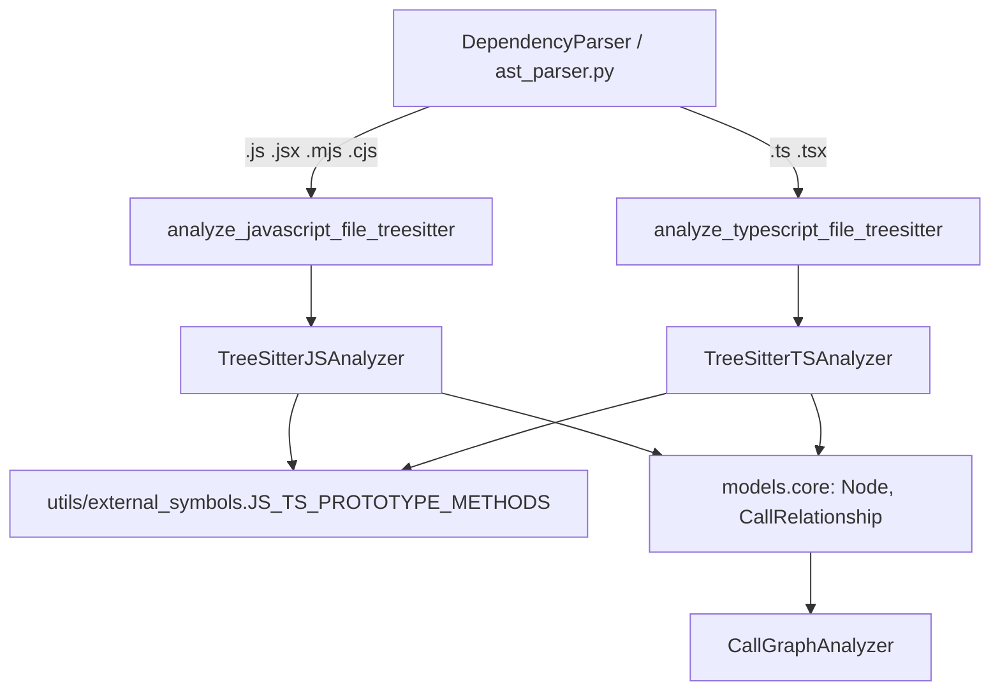
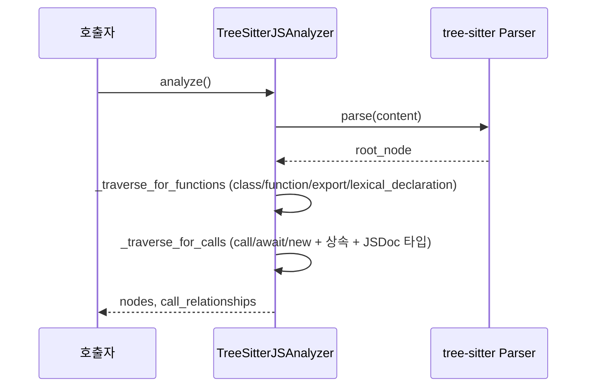
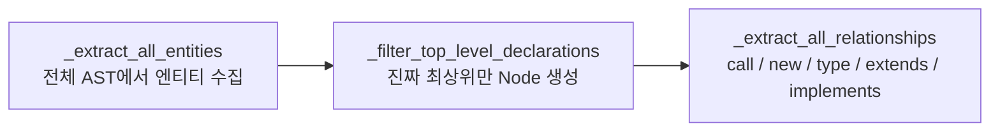

# web_language_analyzers 모듈

## 개요

`web_language_analyzers`는 tree-sitter 기반으로 **JavaScript / TypeScript** 소스 파일에서 컴포넌트(함수·클래스·메서드·인터페이스 등)와 호출/의존 관계를 추출하는 언어 분석기 모듈이다. 결과는 공통 모델 `Node`, `CallRelationship`(`codewiki/src/be/dependency_analyzer/models/core.py`)으로 반환되어 [dependency_analysis_engine](dependency_analysis_engine.md)의 `DependencyParser`, `CallGraphAnalyzer`가 저장소 전체 그래프를 구성할 때 사용한다. 다른 언어 분석기는 [language_analyzers](language_analyzers.md)의 형제 모듈([jvm_language_analyzers](jvm_language_analyzers.md), [c_family_analyzers](c_family_analyzers.md), [scripting_language_analyzers](scripting_language_analyzers.md), [artifact_analysis](artifact_analysis.md))을 참고한다.

| 파일 | 핵심 클래스 | 진입 함수 | tree-sitter 문법 |
|---|---|---|---|
| `analyzers/javascript.py` | `TreeSitterJSAnalyzer` | `analyze_javascript_file_treesitter` | `tree_sitter_javascript.language()` |
| `analyzers/typescript.py` | `TreeSitterTSAnalyzer` | `analyze_typescript_file_treesitter` | `tree_sitter_typescript.language_typescript()` |

## 아키텍처

> 확장자 → 분석기 매핑은 이 모듈 밖(`ast_parser.py`)에 있으며, 위 다이어그램의 분기 조건은 추론이다.

두 분석기는 동일한 계약을 따른다: 생성자 `(file_path, content, repo_path)` → `analyze()` → `nodes`, `call_relationships`. 파서 초기화나 분석 중 예외가 발생하면 로그만 남기고 빈 결과(`[]`, `[]`)를 반환해 전체 분석이 중단되지 않게 한다.

### 공통 규칙

- **컴포넌트 ID**: `<repo 상대경로>::<이름>`, 메서드는 `<상대경로>::<클래스>.<메서드>`.
- **해석 여부(`is_resolved`)**: 같은 파일의 최상위 컴포넌트(`top_level_nodes`)와 매칭되면 `True`이며 callee는 컴포넌트 ID. 매칭 실패 시 파일 접두어 없는 **논리 이름**(예: `Foo.bar`)을 그대로 남겨 전역 resolver가 나중에 해석하도록 한다.
- **호출 대상 해석(receiver-first)**: `this`/`super`는 둘러싼 클래스와 `base_classes`에서, `new X()`로 초기화된 지역 변수는 해당 클래스에서 찾는다. `a.b.c()` 형태의 순수 식별자 체인은 `a.b.c` 문자열로 미해석 상태로 내보낸다.
- **내장 메서드 필터**: 알 수 없는 receiver(호출 결과, 리터럴 등)의 메서드가 `JS_TS_PROTOTYPE_METHODS`(`map`, `push` 등)에 속하면 관계를 생성하지 않아 노이즈를 줄인다.

## TreeSitterJSAnalyzer (`javascript.py`)

처리 흐름: `analyze()` → `_extract_functions()`(노드 수집, `start_line` 정렬) → `_extract_call_relationships()`(관계 수집).

- **추출 대상**: `class_declaration`, `abstract_class_declaration`, `interface_declaration`, `function_declaration`, `generator_function_declaration`, `export_statement`의 함수, `const/let` 화살표 함수·함수 표현식, 클래스의 `method_definition`과 화살표 함수 `field_definition`. 클래스 내부 함수는 최상위 함수로 중복 수집하지 않는다. `constructor`는 `top_level_nodes`에는 등록하지만 `nodes`에는 추가하지 않는다.
- **관계 종류**: 호출(`call_expression`, `await_expression`), 생성(`new_expression`), 상속(`class_heritage`), **JSDoc 타입 의존**(`@param`, `@returns`, `@type`, `@typedef`, `@interface`의 `{Type}`; 제네릭·유니언 분해, `_is_builtin_type_js`로 내장 타입 제외).
- **중복 제거**: `seen_relationships` 키는 `(caller, callee, call_line)`.
- **한계(코드 확인)**: docstring은 항상 비어 있고(`has_docstring=False`), 매개변수는 단순 `identifier`만 수집한다(구조 분해·기본값 매개변수 제외). `export default function (` 익명 함수는 이름을 `default`로 바꾼다. `_should_include_function`의 `excluded_names`는 빈 dict라 사실상 필터가 없다. 클래스 `Node`는 `language` 필드를 지정하지 않는 반면 메서드 `Node`는 `"javascript"`로 지정한다.

## TreeSitterTSAnalyzer (`typescript.py`)

JS 분석기보다 엔티티 모델이 넓고, **2단계** 구조다.

1. **엔티티 수집**: 함수, 화살표 함수, 메서드, 클래스, 인터페이스, `type_alias_declaration`, `enum_declaration`, 변수, `export_statement`, `ambient_declaration` 등을 깊이와 `parent_context`와 함께 `all_entities`에 모은다. 이름이 같으면 뒤의 엔티티가 덮어쓴다.
2. **최상위 필터**: `_is_actually_top_level`이 함수 본문(`statement_block`) 내부 선언을 제외하고 `program`/`export_statement`/`ambient_declaration`/`module` 아래 것만 `Node`로 만든다. `variable` 타입과 `constructor`, `__proto__`, `prototype`은 `_should_include_node`에서 제외한다. 클래스는 추가로 `_extract_constructor_dependencies`로 생성자 매개변수 타입 의존을 기록한다.
3. **관계 추출**: `_traverse_for_relationships`가 현재 최상위 컨텍스트를 추적하며 다음을 기록한다.
   - 호출: `_extract_call_relationship`은 호출당 최대 1개 관계를 만든다. `_member_call_parts`가 receiver를 `this/super/identifier/chain/composite/literal`로 분류하고 `_emit_instance_method_call`, `_emit_receiver_method_call`로 해석한다. 타입은 `new X()` 또는 TS 타입 주석에서 `_infer_identifier_type`/`_find_declared_type`으로 추론한다.
   - `new_expression`, `type_annotation`, `type_arguments`, `extends_clause`, `implements_clause`.
- **중복 제거**: 키는 `(caller_id, callee_id)`이며 `call_line`은 포함하지 않는다. 같은 쌍은 첫 줄 번호만 남는다(JS 분석기와 다른 점).
- **한계(코드 확인)**: 이름이 같은 엔티티(예: 서로 다른 스코프의 변수)는 `all_entities` 딕셔너리에서 충돌한다. 클래스 필드의 화살표 함수는 JS와 달리 별도로 추출하지 않는다. 문법은 `language_typescript()`만 사용하므로 TSX(`language_tsx()`) 파일은 파싱 오류가 있을 수 있다(추론, 미검증).
  또한 `_extract_parameter_dependencies`는 `_add_relationship(caller_name, dependency_name, line, resolved=...)` 시그니처로 호출하는데, 이는 정의와 일치한다.

## JS와 TS 분석기 비교

| 항목 | JS | TS |
|---|---|---|
| 구조 | 단일 순회로 함수 추출 후 호출 순회 | 엔티티 수집 → 필터 → 관계 |
| 추가 엔티티 | 클래스/인터페이스/메서드/함수 | + type alias, enum, ambient 선언 |
| 타입 의존 | JSDoc 주석 파싱 | `type_annotation`, `type_arguments`, 생성자 매개변수 |
| 상속 | `class_heritage` | `extends_clause`, `implements_clause` |
| 중복 키 | `(caller, callee, line)` | `(caller, callee)` |
| `language` 값 | `"javascript"` (메서드만) | `"typescript"` |

## 사용 시 유의점

- 검증 수준: 위 내용은 제공된 소스 코드를 읽어 확인한 것이며 실행 확인은 하지 않았다. 호출 측(`ast_parser.py`) 동작은 미확인이다.
- 두 파일에 `_identifier_chain` 등 동일한 헬퍼가 중복 구현되어 있다. 수정 시 양쪽을 함께 갱신해야 한다.
- 의존성: `tree_sitter`, `tree_sitter_javascript`, `tree_sitter_typescript` 패키지(`pyproject.toml`/`requirements.txt`에서 관리, 미열람).
