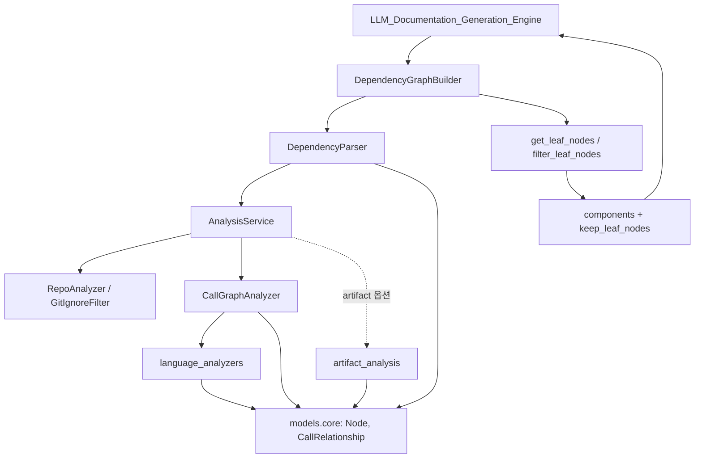
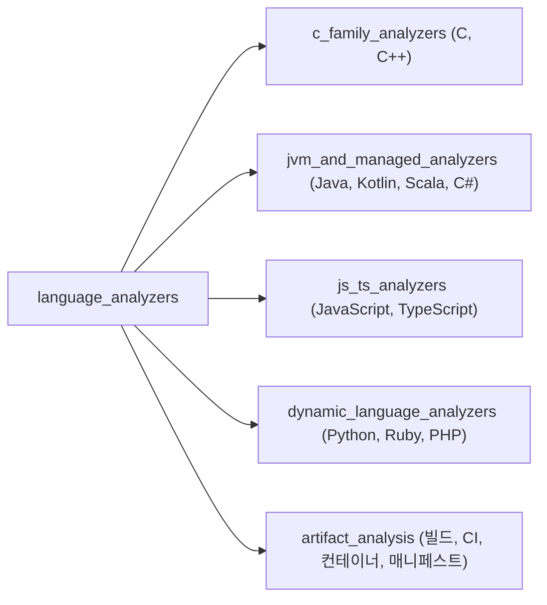
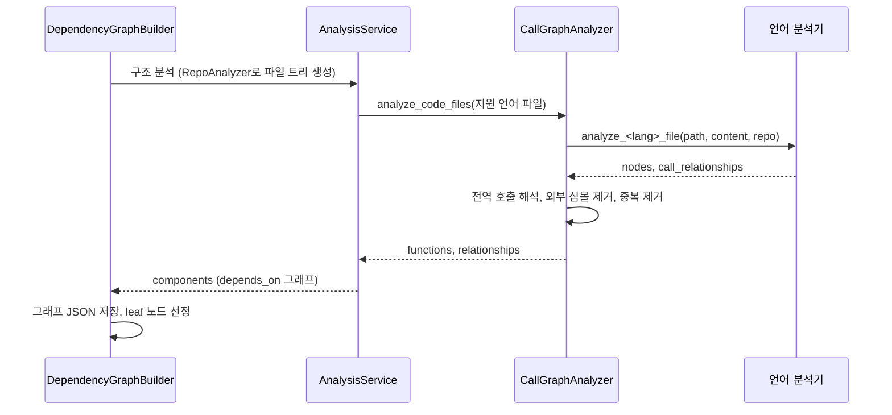

# Code_Analysis_Pipeline 모듈 개요

## 1. 목적

`Code_Analysis_Pipeline`(`codewiki/src/be/dependency_analyzer`)은 CodeWiki의 **정적 분석 계층**이다. 저장소를 받아 문서화 단위(함수, 클래스, 메서드, 빌드·CI 같은 artifact)와 그 사이의 의존 관계를 추출한다. 결과는 `Node` 딕셔너리 형태의 의존성 그래프와 문서화 대상 leaf 노드 목록이다. 이 결과가 [LLM_Documentation_Generation_Engine](LLM_Documentation_Generation_Engine.md)의 입력이 된다.

이 모듈은 두 하위 모듈로 나뉜다.

| 하위 모듈 | 역할 |
|---|---|
| [dependency_analysis_core](dependency_analysis_core.md) | 언어에 독립적인 오케스트레이션이다. 파일 트리 생성, 언어별 분석기 라우팅, 호출 관계 해석, 그래프 저장, leaf 선정을 맡는다. |
| [language_analyzers](language_analyzers.md) | 언어별 파일 분석기 모음이다. 파일 하나를 받아 `(nodes, call_relationships)`를 돌려준다. |

## 2. 아키텍처

`language_analyzers`는 다섯 그룹으로 구성된다.

### 실행 흐름

### 핵심 설계

- **해석은 2단계다.** 언어 분석기는 같은 파일 안의 해석까지만 한다. 파일 간 해석은 `CallGraphAnalyzer`가 하고, 후보가 정확히 하나일 때만 연결한다. 그래서 동명 심볼이 많으면 관계가 누락될 수 있다.
- **파일 단위로 실패를 격리한다.** `CallGraphAnalyzer`는 파일마다 예외를 삼키고, Unix 메인 스레드에서는 30초 타임아웃도 건다.
- **제외 우선순위는 고정이다.** 사용자 exclude, 기본 ignore(단 `ARTIFACT_WHITELIST` 예외), gitignore 순이다.
- **외부 심볼은 노이즈로 취급해 제거한다.** 표준 라이브러리, 매크로, 프로젝트와 무관한 패키지가 대상이다.
- **artifact 분석은 성격이 다르다.** 파서 대신 정규식을 쓰고, 잘못된 매칭보다 누락을 택한다.

## 3. 핵심 컴포넌트 문서

| 문서 | 주요 내용 |
|---|---|
| [dependency_analysis_core](dependency_analysis_core.md) | `AnalysisService`, `RepoAnalyzer`, `CallGraphAnalyzer`, `DependencyParser`, `DependencyGraphBuilder`, 핵심 모델 |
| [language_analyzers](language_analyzers.md) | 언어 분석기 공통 규약과 5개 하위 그룹 |
| [c_family_analyzers](c_family_analyzers.md) | C/C++ 분석, 매크로 제거 후 재파싱 |
| [jvm_and_managed_analyzers](jvm_and_managed_analyzers.md) | Java, Kotlin, Scala, C# 분석 |
| [js_ts_analyzers](js_ts_analyzers.md) | JavaScript/TypeScript 분석 |
| [dynamic_language_analyzers](dynamic_language_analyzers.md) | Python, Ruby, PHP 분석 |
| [artifact_analysis](artifact_analysis.md) | 빌드, CI, 컨테이너, 매니페스트 artifact 노드 |

연관 문서로 [shared_config_utils](shared_config_utils.md)(`Config`, `file_manager`)와 [incremental_updater](incremental_updater.md)(저장된 그래프와 비교)가 있다.

## 4. 검증 수준과 주의점

- 이 개요는 하위 모듈 문서 2개를 읽고 정리했다. 검증 수준은 **문서 기반**이며, 소스를 직접 다시 열어 확인하지는 않았다.
- `_filter_supported_languages`에는 go와 rust가 있다. 하지만 `CallGraphAnalyzer._analyze_code_file`에 분기가 없어 실제로는 분석되지 않는다(하위 문서에서 **코드 확인**으로 기록됨).
- `DependencyParser`가 `AnalysisService`의 private 메서드에 직접 의존한다. 서비스 내부 시그니처를 바꾸면 함께 고쳐야 한다.
- `CallGraphAnalyzer`는 상태를 가지므로 동시 호출에 안전하지 않다.
- 언어 분석기는 정적 휴리스틱이라 타입 추론이 없다. 체인 호출, 리플렉션, 동적 호출은 누락될 수 있다.