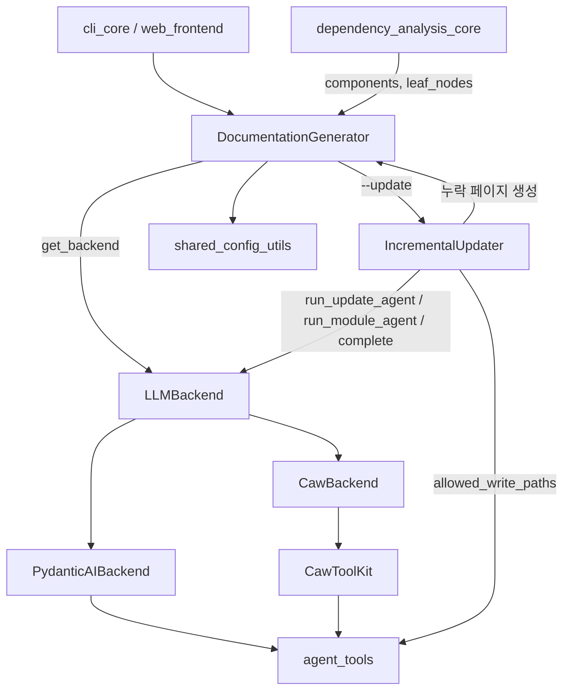
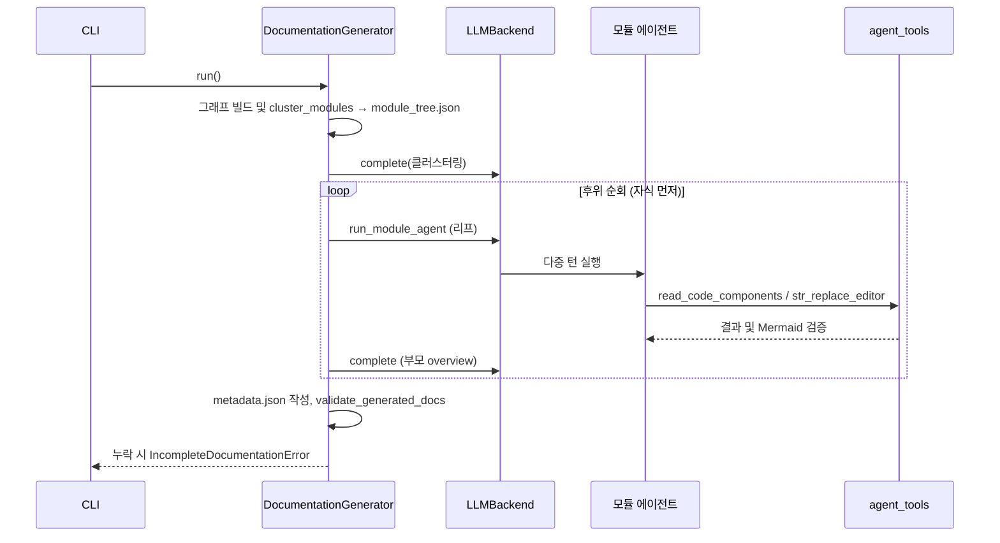

# LLM_Documentation_Generation_Engine 개요

`LLM_Documentation_Generation_Engine`(`codewiki/src/be`)은 CodeWiki의 **문서 생성 백엔드**다. [Code_Analysis_Pipeline](Code_Analysis_Pipeline.md)이 만든 의존성 그래프(`components`, `leaf_nodes`)를 입력으로 받는다. 이 그래프로 모듈 트리를 만들고, LLM 에이전트로 모듈별 마크다운 문서와 저장소 `overview.md`를 생성한다. 이전 빌드의 문서는 코드 변경분만 반영해 갱신한다(증분 업데이트).

핵심 책임은 다음과 같다.
- **오케스트레이션**: 클러스터링 → 리프/부모 문서 → 개요 → 메타데이터 → 완결성 검증. 재개(resume)를 지원하고 이름 충돌을 막는다.
- **LLM 추상화**: API 키 방식(pydantic-ai)과 구독 CLI 방식(`claude`/`codex` + `caw`)을 `LLMBackend` 하나로 통합한다.
- **에이전트 도구**: 소스는 읽기 전용, 문서는 쓰기 가능한 `str_replace_editor`와 Mermaid 검증을 제공한다.
- **증분 갱신**: 그래프 diff → 트리 보수 → 영향받은 리프만 편집 → 필요하면 전체 재빌드로 폴백한다.

## 아키텍처

### 모듈 구성

| 하위 모듈 | 경로 | 역할 | 문서 |
|---|---|---|---|
| `documentation_generation` | `codewiki/src/be/documentation_generator.py` | `DocumentationGenerator`가 전체 흐름을 조율하고, `module_naming`이 이름 정규화·중복 회피를 맡는다. | [documentation_generation](documentation_generation.md) |
| `llm_backends` | `codewiki/src/be` | `LLMBackend` 인터페이스, `PydanticAIBackend`, `CawBackend`, `CawToolKit`, `llm_services` | [llm_backends](llm_backends.md) |
| `agent_tools` | `codewiki/src/be/agent_tools` | `CodeWikiDeps`, `str_replace_editor`/`EditTool`, 쓰기 범위 검사, Mermaid 검증 | [agent_tools](agent_tools.md) |
| `incremental_updater` | `codewiki/src/be/updater` | `IncrementalUpdater`(Step 0~6), `GraphDiff`, `LeafAgentRunner`, `StaleScanner`, `UpdateRecord` | [incremental_updater](incremental_updater.md) |

## 대표 실행 흐름

`--update` 경로에서는 위 전체 생성 대신 `IncrementalUpdater`가 실행된다. 변경이 너무 크면(`r_leaf ≥ tau_full` 또는 `r_tree ≥ tau_tree`) `full_fallback`으로 전체 빌드에 되돌아간다.

## 설계 포인트

- **재개 안전성**: 이미 `.md`가 있는 모듈은 건너뛰고, 기존 `module_tree.json`은 덮어쓰지 않는다. 한 모듈이 실패해도 전체를 중단하지 않으며, 최종 완결성은 `validate_generated_docs`가 보증한다.
- **백엔드 교체 가능**: `get_backend(config)`가 `provider`에 따라 `CawBackend`(`claude-code`, `codex`)와 `PydanticAIBackend`를 선택한다.
- **쓰기 범위 제한**: 소스(`repo`)는 `view`만 허용하고, 증분 갱신에서는 `allowed_write_paths`로 리프 에이전트가 자기 페이지만 수정하게 한다.
- **평면 문서 디렉터리**: 모든 문서가 `{module_name}.md`로 저장되므로 `module_naming`이 이름 충돌을 해소한다(`plan_sub_module_specs`는 이미 문서화된 모듈을 건너뛴다).

## 외부 의존

- 입력 그래프: [dependency_analysis_core](dependency_analysis_core.md)
- 설정과 파일 유틸(`Config`, `file_manager`): [shared_config_utils](shared_config_utils.md)
- 호출 진입점: [cli_core](cli_core.md), [cli_utils](cli_utils.md)

검증 수준: 위 내용은 하위 모듈 문서(소스 코드 기준 **코드 확인**)를 종합한 것이다. 실제 CLI/LLM 실행 동작은 **미확인**이다.