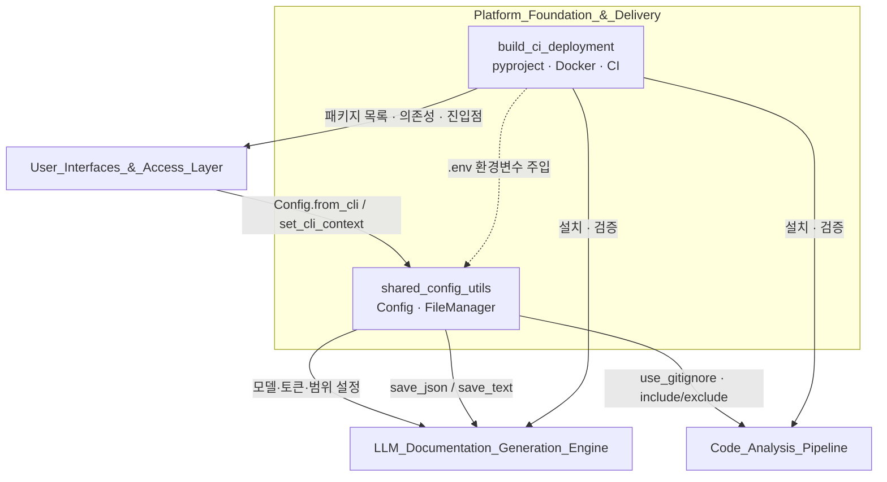
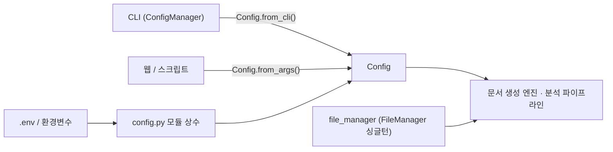
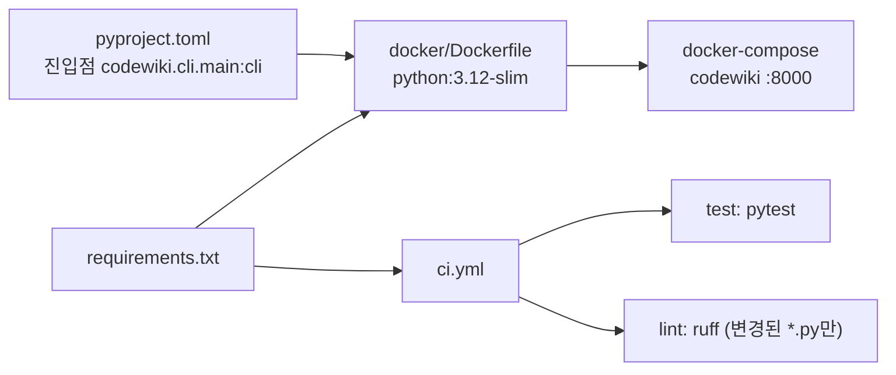

# Platform_Foundation_&_Delivery 모듈 개요

## 1. 목적

`Platform_Foundation_&_Delivery`는 CodeWiki의 나머지 모듈(CLI/웹, 코드 분석, LLM 문서 생성)이 공통으로 기대는 **기반 계층**이다. 하위 모듈은 두 개다.

- **`shared_config_utils`**: 모든 실행 경로가 공유하는 설정 객체 `Config`(`codewiki/src/config.py`)와 파일 I/O 헬퍼 `FileManager`(`codewiki/src/utils.py`)를 제공한다.
- **`build_ci_deployment`**: 패키징(`pyproject.toml`), 의존성 고정(`requirements.txt`), 컨테이너화(`docker/`), CI(`.github/workflows/ci.yml`)를 정의한다. 애플리케이션 로직은 없다.

## 2. 아키텍처

### 2.1 모듈 구조와 상위 모듈과의 관계

### 2.2 설정 생성 경로 (`shared_config_utils`)

- `from_cli`: 중간 산출물은 `<output>/temp`, 최종 문서는 `<output>`에 둔다. 이 구조 덕분에 `--update` 시 저장된 `temp/dependency_graphs/`와 비교할 수 있다.
- `from_args`: 모델, URL, 키를 환경변수 기반 모듈 상수에서 읽는다. 이 상수는 import 시점에 한 번만 평가된다.

### 2.3 빌드·배포 흐름 (`build_ci_deployment`)

## 3. 핵심 포인트

| 항목 | 내용 |
|---|---|
| 설정 컨텍스트 | `set_cli_context()`로 CLI(`~/.codewiki/config.json` + keyring)와 웹(환경변수)을 구분한다. |
| Provider | `openai-compatible`, `atlas-cloud`, `anthropic`, `bedrock`, `azure-openai`를 지원한다. |
| 프롬프트 확장 | `agent_instructions`를 `get_prompt_addition()`으로 LLM 프롬프트 문장에 합친다. |
| 패키지 목록 | `pyproject.toml`의 `packages`를 명시적으로 나열하므로, 새 서브패키지를 추가하면 목록에도 넣어야 배포물에 포함된다. |
| Docker | 패키지를 설치하지 않고 `PYTHONPATH=/app`로 실행한다. `nodejs`/`npm`은 PythonMonkey 때문에 필요하다. |
| CI | pytest와, 변경된 Python 파일에 한정한 ruff 검사를 수행한다. |

## 4. 주의 사항 (코드 확인 기준)

- `pyproject.toml`은 하한(`>=`) 위주이고 `requirements.txt`는 `==` 고정이라 두 파일의 버전이 어긋날 수 있다.
- `requirements.txt`에 `coding-agent-wrapper`가 없어, CI의 `pip install -e . --no-deps`에서는 이 패키지가 빠진다.
- 기본 `LLM_API_KEY="sk-1234"`와 `LLM_BASE_URL="http://0.0.0.0:4000/"`는 로컬 프록시용 자리표시자이므로, 실제 배포에서는 반드시 덮어써야 한다.
- `FileManager.save_*`는 상위 디렉터리를 만들지 않고 원자적 쓰기도 하지 않는다. 호출 전에 `ensure_directory`가 필요하다.

## 5. 하위 모듈 문서

- [shared_config_utils](shared_config_utils.md): `Config` 필드, 팩토리 메서드, `FileManager`, 데이터 흐름.
- [build_ci_deployment](build_ci_deployment.md): 패키징, Dockerfile, docker-compose, GitHub Actions CI.

관련 모듈: [User_Interfaces_&_Access_Layer](User_Interfaces_&_Access_Layer.md), [Code_Analysis_Pipeline](Code_Analysis_Pipeline.md), [LLM_Documentation_Generation_Engine](LLM_Documentation_Generation_Engine.md)

검증 수준: 하위 모듈 문서 두 개를 읽고 정리했다. 원본 소스를 직접 다시 확인하지는 않았다(추론 아님, 문서 기반).